# Cloud Security and DevSecOps Automation


- [Cloud Security and DevSecOps Automation](#cloud-security-and-devsecops-automation)
- [(1) DevOps Security Automation](#1-devops-security-automation)
  - [DevOps, Security, and Cloud Essential Toolchain](#devops-security-and-cloud-essential-toolchain)
  - [DevOps Security and Challenges](#devops-security-and-challenges)
    - [DevOps Success Factors](#devops-success-factors)
    - [DevSecOps Resources](#devsecops-resources)
    - [DevOps Toolchain](#devops-toolchain)
      - [Git Concepts](#git-concepts)
      - [GitFlow: Clone and Edit](#gitflow-clone-and-edit)
      - [GitFlow: Commit and Push](#gitflow-commit-and-push)
      - [GitFlow: Share Change with Another Remote](#gitflow-share-change-with-another-remote)
      - [Continuous Integration (CI)](#continuous-integration-ci)
      - [Continuous Delivery/Deployment (CD)](#continuous-deliverydeployment-cd)
      - [Continuous Deployment (CD)](#continuous-deployment-cd)
      - [CI/CD Systems](#cicd-systems)
        - [GitHub Actions](#github-actions)
        - [GitLab CI/CD](#gitlab-cicd)
      - [OpenID Connect](#openid-connect)
        - [OpenID Connect JSON Web Tokens (JWT)](#openid-connect-json-web-tokens-jwt)
        - [CI/CD Security Risks](#cicd-security-risks)
        - [CI/CD Hardening Guidelines (General)](#cicd-hardening-guidelines-general)
      - [Toolchain Potential Attack Vectors](#toolchain-potential-attack-vectors)
        - [Version Control](#version-control)
        - [Continuous Integration (CI) / Continuous Delivery (CD)](#continuous-integration-ci--continuous-delivery-cd)
        - [Secrets Management](#secrets-management)
  - [Secuing DevOps Workflows](#secuing-devops-workflows)
    - [Pre-Commit Security Controls](#pre-commit-security-controls)
      - [Rapid Risk Assessments (RRA)](#rapid-risk-assessments-rra)
      - [Threat Modeling in DevOps](#threat-modeling-in-devops)
        - [Code Analysis Tools](#code-analysis-tools)
      - [Git Commit/Workflow Hooks](#git-commitworkflow-hooks)
      - [Pre-Commit framework](#pre-commit-framework)
      - [Manual Code Reviews](#manual-code-reviews)
      - [Mandatory Code Reviews: Branch Protections](#mandatory-code-reviews-branch-protections)
      - [Version Control Security: GitHub Branch Protections](#version-control-security-github-branch-protections)
      - [Branch Protections: GitLab Branch Protections](#branch-protections-gitlab-branch-protections)
      - [Detecting High Risk Code Changes: Code Owners](#detecting-high-risk-code-changes-code-owners)
    - [Commit Security Controls (Broad Overview)](#commit-security-controls-broad-overview)
      - [Continuous Integration (CI) Security Testing Limitations](#continuous-integration-ci-security-testing-limitations)
      - [Centralized Security Scanning Factory](#centralized-security-scanning-factory)
      - [Security Factory Integration](#security-factory-integration)
      - [Automated Security Testing Goals](#automated-security-testing-goals)
      - [Automated Security Testing: Minimize False Positives](#automated-security-testing-minimize-false-positives)
      - [Automated Security Testing: Customizing Tools](#automated-security-testing-customizing-tools)
      - [Automated Security Testing: Parsing \& Displaying Results](#automated-security-testing-parsing--displaying-results)
      - [Automated Code Scanning Technology Landscape](#automated-code-scanning-technology-landscape)
      - [Semgrep - Secure Code Analysis](#semgrep---secure-code-analysis)
      - [Semgrep - Scan Command Line Interface](#semgrep---scan-command-line-interface)
    - [Secrets Management](#secrets-management-1)
      - [What Are Secrets?](#what-are-secrets)
      - [How Not to Keep Secrets: In Code](#how-not-to-keep-secrets-in-code)
      - [Be Especially Careful with GitHub](#be-especially-careful-with-github)
      - [Preventing Secrets in Code](#preventing-secrets-in-code)
      - [Using git-secrets](#using-git-secrets)
      - [Secret Keepers](#secret-keepers)
      - [Secret Keepers: Open-Source Solutions](#secret-keepers-open-source-solutions)
      - [Secret Keepers: Commercial](#secret-keepers-commercial)
      - [Azure Key Vault: Storing Secrets](#azure-key-vault-storing-secrets)
      - [AWS Secrets Manager Example](#aws-secrets-manager-example)
      - [HashiCorp Vault](#hashicorp-vault)
      - [Secret Keepers: Vault Secrets Engines](#secret-keepers-vault-secrets-engines)
      - [HashiCorp Vault: Configuration](#hashicorp-vault-configuration)
      - [HashiCorp Vault: CLI Example](#hashicorp-vault-cli-example)
- [(2) Cloud Infrastructure Security](#2-cloud-infrastructure-security)
  - [Software Supply Chain Security](#software-supply-chain-security)
    - [What Is Infrastructure as Code (IaC)?](#what-is-infrastructure-as-code-iac)
    - [Terraform: HashiCorp versus OpenTofu](#terraform-hashicorp-versus-opentofu)
    - [Terraform Benefits](#terraform-benefits)
    - [Terraform Considerations](#terraform-considerations)
    - [Terraform Functions](#terraform-functions)
    - [Terraform Provider Configuration](#terraform-provider-configuration)
    - [Terraform Input Variables](#terraform-input-variables)
    - [Terraform Local Variables](#terraform-local-variables)
    - [Terraform Resources](#terraform-resources)
    - [Terraform Data Source](#terraform-data-source)
    - [Terraform Null Resource Local Provisioner](#terraform-null-resource-local-provisioner)
    - [Terraform Outputs](#terraform-outputs)
    - [Terraform Modules](#terraform-modules)
    - [Terraform Command Line Interface (CLI)](#terraform-command-line-interface-cli)
    - [Terraform CLI | Deployment](#terraform-cli--deployment)
    - [Terraform CLI | State Management (1)](#terraform-cli--state-management-1)
    - [Terraform CLI | State Management (2)](#terraform-cli--state-management-2)
    - [Terraform CLI | Outputs](#terraform-cli--outputs)
  - [Cloud Infrastructure as Code (IaC)](#cloud-infrastructure-as-code-iac)
    - [IaC Pipeline](#iac-pipeline)
    - [Infrastructure as Code (IaC) Security](#infrastructure-as-code-iac-security)
    - [Azure Network Security Groups (NSG)](#azure-network-security-groups-nsg)
    - [AWS EC2 Security Groups](#aws-ec2-security-groups)
    - [Infrastructure as Code (IaC) Security Scanning Tools](#infrastructure-as-code-iac-security-scanning-tools)
    - [Easy\_Infra](#easy_infra)
    - [**IaC Security Scanner - Checkov**](#iac-security-scanner---checkov)
  - [Configuration Management as Code](#configuration-management-as-code)
    - [Configuration Management Tools](#configuration-management-tools)
    - [**Configuration Management Tooling**](#configuration-management-tooling)
    - [Configuration Management as Code Hardening](#configuration-management-as-code-hardening)
      - [Hardening with Puppet](#hardening-with-puppet)
      - [Hardening with Ansible](#hardening-with-ansible)
      - [Hardening with CFEngine](#hardening-with-cfengine)
      - [Hardening with Salt](#hardening-with-salt)
      - [DoD Security Technical Implementation Guide (STIG) templates](#dod-security-technical-implementation-guide-stig-templates)
    - [Configuration Management - Gold Image Pipeline](#configuration-management---gold-image-pipeline)
    - [Configuration Management - Building a Test System](#configuration-management---building-a-test-system)
    - [Provisioning Development and Test VMs with Vagrant](#provisioning-development-and-test-vms-with-vagrant)
    - [Building Gold Images with Packer](#building-gold-images-with-packer)
    - [Cloud Virtual Machine Marketplace](#cloud-virtual-machine-marketplace)
    - [**Ansible**](#ansible)
    - [Automated Testing of Configuration Management Code](#automated-testing-of-configuration-management-code)
  - [Security Lifecycle](#security-lifecycle)
    - [NIST SP 800-190 Application Container Security Guide](#nist-sp-800-190-application-container-security-guide)
    - [Container Security Life Cycle](#container-security-life-cycle)
    - [Dockerfile Commands](#dockerfile-commands)
    - [Static Analysis for Dockefiles](#static-analysis-for-dockefiles)
    - [Trivy Command Line Interface](#trivy-command-line-interface)
    - [Container Image Trusted Suppliers](#container-image-trusted-suppliers)
    - [**Open-Source Container Scanning Tools**](#open-source-container-scanning-tools)
  - [Supply Chain Security](#supply-chain-security)
    - [Supply-chain Levels for Software Artifacts (SLSA)](#supply-chain-levels-for-software-artifacts-slsa)
    - [Introduction to Supply Chain Security - Terminology](#introduction-to-supply-chain-security---terminology)
    - [Software Provenance](#software-provenance)
      - [Attestation](#attestation)
    - [Project Sigstore: Software Supply Chain Security](#project-sigstore-software-supply-chain-security)
    - [Software Bill of Materials (SBOM)](#software-bill-of-materials-sbom)
    - [Graph for Understanding Artifact Composition (GUAC)](#graph-for-understanding-artifact-composition-guac)
    - [Additional Container Security Resources](#additional-container-security-resources)
- [(3) Cloud-Native Security Operations](#3-cloud-native-security-operations)
  - [Kubernetes Architecture, Resources, and Deployments](#kubernetes-architecture-resources-and-deployments)
    - [Kubernetes Introduction](#kubernetes-introduction)
    - [Kubernetes Architecture](#kubernetes-architecture)
    - [Kubernetes Cluster Components](#kubernetes-cluster-components)
    - [Interacting with Kubernetes](#interacting-with-kubernetes)
    - [Kubernetes Resource Manifests](#kubernetes-resource-manifests)
    - [Kubernetes Resource Kinds](#kubernetes-resource-kinds)
  - [Kubernetes Risks and Security Controls](#kubernetes-risks-and-security-controls)
    - [Container Runtimes and Orchestrators](#container-runtimes-and-orchestrators)
    - [Authentication](#authentication)
    - [Kubernetes Control Plane Authentication](#kubernetes-control-plane-authentication)
    - [Kubernetes Role Based Access Control](#kubernetes-role-based-access-control)
    - [Kubernetes Namespaces](#kubernetes-namespaces)
    - [Kubernetes Secrets](#kubernetes-secrets)
    - [Kubernetes Security Guides](#kubernetes-security-guides)
  - [Kubernetes Workload Security](#kubernetes-workload-security)
  - [Kubernetes Runtime Security](#kubernetes-runtime-security)
  - [Cloud Native Security Monitoring](#cloud-native-security-monitoring)
- [(4) Microservice and Serverless Security](#4-microservice-and-serverless-security)
- [(5) Continuous Compliance and Protection](#5-continuous-compliance-and-protection)


# (1) DevOps Security Automation


## DevOps, Security, and Cloud Essential Toolchain

| Role                                  | System(s)                               |
|---------------------------------------|-------------------------------------------|
| Version Control                       | GitLab                                   |
| Continuous Integration and Delivery   | GitLab CI/CD                             |
| Configuration Management              | Ansible, Terraform                       |
| Container Execution                   | Docker, Kubernetes (EKS, AKS)            |
| Secrets Storage                       | Vault, AWS SSM, Azure Key Vault           |
| Cloud Infrastructure                  | AWS, Azure                                |

* [DevOps Is For Horses: Stop Making Excuses For Starting](https://devops.com/devops-is-for-horses-stop-making-excuses-for-starting/)  
* [10 Cool Security Tools Open-Sourced By The Internet's Biggest Innovators](https://www.darkreading.com/application-security/10-cool-security-tools-open-sourced-by-the-internet-s-biggest-innovators)  
* [Barclays banks on agile and DevOps to tackle competitive threats in fintech](https://www.computerweekly.com/news/450299551/Barclays-banks-on-agile-and-DevOps-to-tackle-competitive-threats-in-fintech)  
* [DevOps Enterprise Summit](https://itrevolution.com/events/)  
* [GitHub Cheat Sheet](https://education.github.com/git-cheat-sheet-education.pdf)

## DevOps Security and Challenges

### DevOps Success Factors

* CAMS (or CALMS) is a common lens for understanding DevOps and for driving DevOps change.  
* ESSENTIALLY the idea of **failing fast** and **failing forward**. It’s not a matter of if you fail or will be compromised, it’s a matter of how fast you can remediate and recover\!

* Your organization succeeds when it reaches "CALMS":

  * **Culture:** people come first  
  * **Automation:** rely on tools for efficiency and repeatability  
  * **Lean:** apply Lean engineering practices to continuously learn and improve  
  * **Measurement:** use data to drive decisions and improvements  
  * **Sharing:** share ideas, information, and goals across silos

* [Kanbans and DevOps](https://itrevolution.com/articles/resource-guide-for-the-phoenix-project-kanbans-part-2/)  
* [Amazon Deployment](https://news.ycombinator.com/item?id=2971521)  
* [Velocity Culture](https://www.youtube.com/watch?v=dxk8b9rSKOo)

### DevSecOps Resources

* [The Phoenix Project](https://itrevolution.com/product/the-phoenix-project/)  
* [The Five Dysfunctions of a Team](https://www.tablegroup.com/product/dysfunctions/)  
* [Building DevOps Culture](https://www.oreilly.com/library/view/building-a-devops/9781449368340/)  
* [The Unicorn Project](https://itrevolution.com/product/the-unicorn-project/)

### DevOps Toolchain

#### Git Concepts

**Key actions/commands:**

* **git clone:** download a project repository from a remote location; check out the most recent commit of the default branch; track the remote location as the "origin" remote  
* **git add:** place a snapshot of a file (new or edited) from the working tree into the staging area  
* **git commit:** record all of the staged changes in the repository, including a message for the history/log  
* **git push:** send changes from the local repository to a remote repository  
* **git pull:** integrate changes from a remote repository into the local repository

**Key Terms:**

* **repository:** history and all branches; compressed (local and remote)  
* **branch:** pointer to a snapshot of your changes  
* **working tree:** checked-out branch; files ready to edit  
* **staging area:** file change snapshots, waiting to be committed to Repository  
* [Atlassian Gitflow Workflow](https://www.atlassian.com/git/tutorials/comparing-workflows/gitflow-workflow)  
* [GitHub Flow](https://docs.github.com/en/get-started/using-github/github-flow)

#### GitFlow: Clone and Edit

```bash
git clone [https://example-url.com]
# creates "app" directory, as a working tree for org/app.git
# creates "app/.git" directory to hold a local copy of the repository
# creates "app/.git/index" for the staging area
# checks out the default branch into the "app" directory ("main")
# defines a default remote called "origin"

cd app
git checkout -b feature/docs
# change into the working directory and create a feature branch

nano README # edit the README file
git status # show what files have been changed in the working tree
git diff # show changes made to files in the working tree
```


#### GitFlow: Commit and Push

```bash
git add README
# add the changes to README to the staging area

git commit -m "added author to README"
# commit the changes from the staging area to the local repository

git push origin feature/docs
# send the updates from the local repository to the default remote repository
# only the change to README will be sent to the new feature branch


Total 5 (delta 3), reused 0 (delta 0)
remote: To create a merge request for feature/docs, visit:
remote:   https://gitlab.com/org/app/merge_requests/new?merge_request%5Bsource_branch%5D=feature%2Fdocs
```


#### GitFlow: Share Change with Another Remote

```bash
git remote add qa-bill git@git.me:USER/app.git
# define a new remote to share with Bill from the QA group

git push qa-USER main
# share changes with USER, by pushing the code to his repository for review
```

#### Continuous Integration (CI)

* Fundamental Agile development technical practice focusing on incremental changes to code or configuration in small incremental steps that are checked into the main branch frequently to ensure compatibility.

**Approving and completing a merge request creates a commit on the "main" branch and automatically triggers a pipeline:**

* Ensures changes integrate successfully with the rest of the codebase  
* Executes automated unit tests and other automated checks  
  * <span style="color:red"> Red</span>: no other check-ins are allowed until the build is fixed  
  
  * <span style="color:green"> Green</span>: creates build artifacts for next steps in CD pipeline  
* Provides fast feedback - build and test steps need to run in a few minutes to encourage iterative development (small, frequent changes)

#### Continuous Delivery/Deployment (CD)

**Pipeline model and control framework extending Continuous Integration:**

* It uses the latest good build from CI, packages for deployment, and release.  
* Changes are automatically pushed to test/staging environments to conduct more realistic/comprehensive tests.  
* It can insert manual reviews/testing/approvals between pipeline stages.  
* Log steps and results to provide audit trail from check-in to deploy.  
* Any failures will "stop the line."  
* No additional changes can be accepted until the failure is corrected.  
* This ensures that code is always ready to be deployed.  
* Changes may be batched up before production release.

**NOTE:** the key difference between delivery and deployment is that **delivery requires human interaction** whereas deployment is automated!

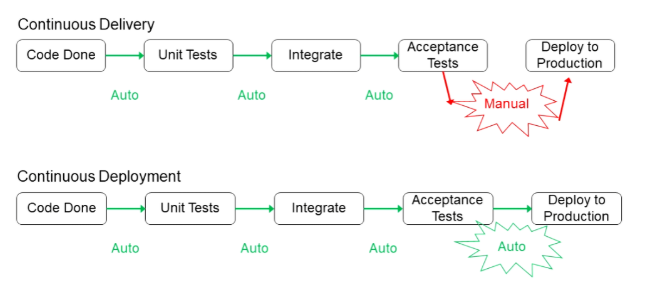


#### Continuous Deployment (CD)

**Continuous Deployment is how organizations like Amazon, Google, and Netflix push out changes *n* times per day/hour/minute:**

* Changes are deployed directly and automatically to production using the CD pipeline once all tests/checks pass.  
* Self-service - Changes are pushed to production by developers.  
* Blue/Green Deployment - Deploy changes and switch between production environments using load balancing  
* Canaries - Incremental deployment that stops and rolls back if errors occur  
* A/B testing - Measuring the effect/acceptance of a change or new feature in production  
* Dark Launching - Protect changes behind "feature switches"

#### CI/CD Systems

* [Azure DevOps](https://azure.microsoft.com/en-us/products/devops/?nav=min)  
* [CircleCI](https://circleci.com/)  
* [Travis CI](https://www.travis-ci.com/)  
* [Jenkins](https://www.jenkins.io/)  
* [CodePipeline](https://aws.amazon.com/codepipeline/)

##### GitHub Actions

* [GitHub Actions](https://github.com/features/actions)


##### GitLab CI/CD

* [GitLab CI/CD](https://docs.gitlab.com/ee/ci/)  
* [GitLab Auto DevOps](https://docs.gitlab.com/ee/topics/autodevops/)
* [GitLab CI/CD Templates](https://gitlab.com/gitlab-org/gitlab/-/tree/master/lib/gitlab/ci/templates) 

**Predefined Environment Variables**

| Function           | Description                                                                                                                                                                                             |
|--------------------|---------------------------------------------------------------------------------------------------------------------------------------------------------------------------------------------------------|
| `CI_BUILDS_DIR`    | Top level directory where builds are executed.                                                                                                                                                            |
| `CI_COMMIT_BRANCH` | The commit branch name. Not available in merge request pipelines or tag pipelines.                                                                                                                         |
| `CI_COMMIT_TAG`    | The commit tag name. Available only in pipelines for tags.                                                                                                                                                 |
| `CI_DEFAULT_BRANCH`| The name of the project's default branch.                                                                                                                                                                 |
| `CI_PIPELINE_ID`   | The instance-level ID of the current pipeline. This ID is unique across all projects on the GitLab instance.                                                                                                |
| `CI_PROJECT_DIR`   | The full path the repository is cloned to, and where the job runs from.                                                                                                                                   |

* [GitLab CI/CI Variables](https://docs.gitlab.com/ee/ci/variables/)
* [Predefined CI/CD Variables](https://docs.gitlab.com/ee/ci/variables/predefined_variables.html)


#### OpenID Connect


**OpenID Connect (OIDC) is concerned with:**

* Authentication and authorization of an end user or machine identity.
* Identity provider issues an identity token with a specific audience for a service provider.
* Identity token claims can be used in authorization decisions by a service provider.
* Identity tokens are signed and valid until they reach an explicit expiration. 


##### OpenID Connect JSON Web Tokens (JWT)


JSON Web Tokens (JWT) are signed by the identity provider (IdP) with claims that identify the issuer, audience, subject, signing key, expiration, and custom data that grants access to a service provider's resources:

* **Header:** Token type (JWT), signing algorithm (HMAC, RSA), and key identifier.
* **Payload:** JSON object that includes the issuer, audience, subject, expiration, and other custom claims.
* **Signature:** Signed header and payload for verifying the token and issuer.


##### CI/CD Security Risks

* [OWASP Top 10 CI/CD Risks](https://owasp.org/www-project-top-10-ci-cd-security-risks/)
* [Attacking and Security CI/CD Pipeline](https://speakerdeck.com/rung/cd-pipeline)


##### CI/CD Hardening Guidelines (General)


* Restrict control flow into production using branch protections and gated approvals.
* Eliminate service account long-lived credentials to help prevent compromise.
* Limit service account permissions.
* Protect the supply chain with allow lists of trusted actions (GH or verified publishers), plugins, and packages.
* Review all changes to workflow files for malicious code execution.
* Patch self-hosted CI/CD runners and software aggressively.
* Include CI/CD audit logs in network and operations monitoring.


**Extra Hardening Resources**
* [Security Hardening for GitHub Actions](https://docs.github.com/en/actions/security-for-github-actions/security-guides/security-hardening-for-github-actions)
* [GitHub Hardening Actions - Best Practices](https://engineering.salesforce.com/github-actions-security-best-practices-b8f9df5c75f5/)


#### Toolchain Potential Attack Vectors

##### Version Control

1. Threat actor compromises a user's version control credentials and creates an attacker controlled SSH key for accessing source code.

2. Threat actor makes an unauthorized commit, triggering a new release to production that contains a backdoor or trojan.

3. Threat actor modifies a high risk code file (e.g. IaC, cryptography library, authentication module, etc.) without approvals from security team. Releasing changes to high risk code without approvals may violate separation of duties and change approval board requirements.

##### Continuous Integration (CI) / Continuous Delivery (CD)

1. Threat actor discovers a GitLab CI runner exposed on the Internet, and exploits a vulnerability.

2. Threat actor compromises a GitLab CI workflow job and injects malicious code into the build artifacts.

3. User disables a pipeline step enforcing security controls, triggering a release to production that does not meet security or compliance requirements.

4. User approves deployment to production without change approvals.

##### Secrets Management

1. User commits a secret (private key, API key) to the source code repository, which is later used by a threat actor to gain unauthorized access to the system.

2. Threat actor compromises a secrets manager credential by creating a malicious job on the CI / CD server. The secrets manager credential is used to gain access to secrets, code signing certificates, deployment keys, etc. intended for other pipeline jobs.


## Secuing DevOps Workflows


**DevOps Workflow Phases**


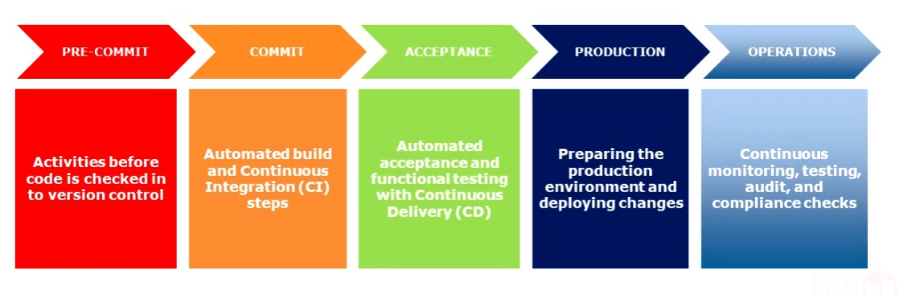


**DevSecOps Critical Security Controls**


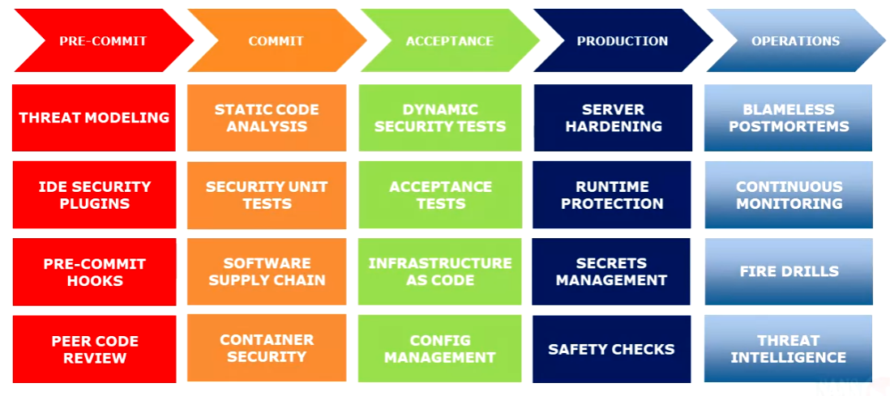


[Artifical Intelligence (AI) in the DevSecOps Workflow](https://drive.google.com/file/d/1DXd1BHp6STMctDVbjnW0jxofWEgau0b-/view)


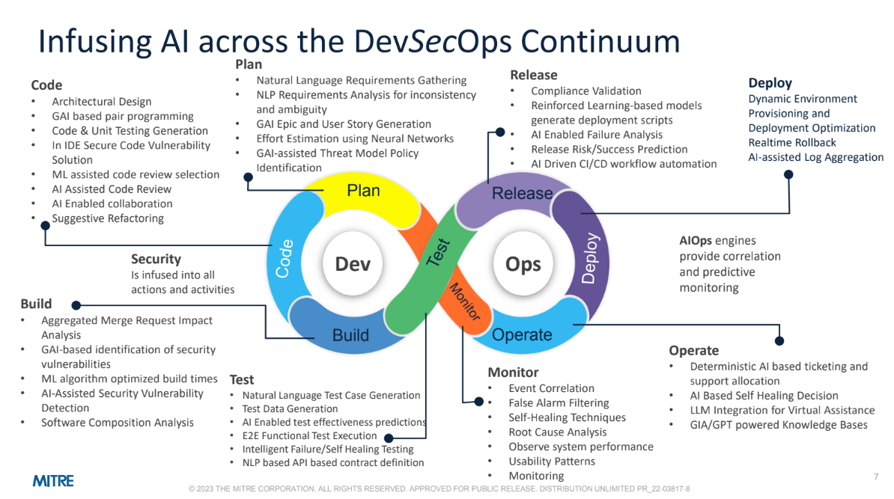


### Pre-Commit Security Controls

**Pre-Commit:** Activities before code is checked into version control.

**Specific Controls:**

* **Threat Modeling:**
    * Description: Incremental design review, rapid risk assessment for new services or major changes.

* **IDE Security Plugins:**
    * Description: Code editor static analysis and linting plugins.

* **Pre-Commit Hooks:**
    * Description: Commit hooks to check for embedded secrets and enforce review workflows.

* **Peer Code Review:**
    * Description: Security code reviews.


#### Rapid Risk Assessments (RRA)

* Process of quickly asssessing the safety and security of legacy or new applications.

* For new systems/services, start with a high-level risk assessment:

  * Classify the data: legal and compliance requirements, sensitivity, etc.

  * Focus on platform, language, and framework risks: is the team using well-understood tools/approach or something new to the organization?

  * Determine a risk rating and next steps: threat modeling, control gate requirements, security training...

  * Continuously reassess as major changes to design or data occur


* [Mozilla RRA](https://infosec.mozilla.org/guidelines/risk/rapid_risk_assessment.html)

* [Slack RRA](https://slack.engineering/moving-fast-and-securing-things/)


#### Threat Modeling in DevOps

* Iterative and lightweight threat modeling based on risk: early in design or when making major changes.
* Examine trust boundaries and assumptions in architecture.
* Ask these questions when you are making changes (based on SAFECode's Tactical Threat Modeling Guide):
    1. Are you changing the attack surface?
    2. Are you changing the technology stack?
    3. Are you changing application security controls?
    4. Are you adding confidential/sensitive data?
    5. Are you modifying high-risk code?


##### Code Analysis Tools


* [Sloc Cloc and Code (scc)](https://github.com/boyter/scc)
  * For counting the lines of code, blank lines, comment lines, and physical lines of source code in many programming languages. Used to begin the code analysis process...

* [Semgrep](https://github.com/returntocorp/semgrep): VSCode plugin
* [Checkov](https://github.com/bridgecrewio/checkov): VSCode plugin
* [cfn_nag](https://github.com/stelligent/cfn_nag): VSCode plugin
* [IntelliJ IDEA built-in code analysis](https://www.jetbrains.com/help/idea/code-inspection.html) (Includes some basic security checks)
* [FindBugs](http://findbugs.sourceforge.net/manual/eclipse.html): Eclipse plugin
* [FindBugs](https://plugins.jetbrains.com/plugin/3847-findbugs-idea): IntelliJ plugin
* [SpotBugs](https://spotbugs.github.io/): Eclipse plugin
* [Find Security Bugs](https://find-sec-bugs.github.io/): (Based on FindBugs/SpotBugs, with additional security checks)
* [Puma Scan](https://pumasecurity.io/): Visual Studio plugin for C# (Open-source and commercial)
    * Presentation: [Secure DevOps: A Puma's Tail](https://www.slideshare.net/pumasecurity/secure-devops-a-pumas-tail)
* [Security Code Scan](https://security-code-scan.github.io/): Visual Studio plugin for C# (Open-source)
* [Microsoft DevSkim](https://github.com/Microsoft/DevSkim)
* [SonarLint](https://www.sonarlint.org/)
* [Trivy](https://marketplace.visualstudio.com/items?itemName=AquaSecurityOfficial.trivy-vulnerability-scanner)
* [SARIF Viewer](https://marketplace.visualstudio.com/items?itemName=MS-SarifVSCode.sarif-viewer)


#### Git Commit/Workflow Hooks

Commit hooks can be used to automatically run scripts checking for embedded secrets, code correctness, etc. at different points in workflows:

* **Local repository:** pre-commit, prepare-commit, commit, post-commit, post-checkout, pre-rebase
* **Remote repository:** pre-receive, update, post-receive
* Implement team-wide workflow policies or check code for problems before CI
* Repo owners can alter/uninstall hooks
* Hooks cannot be enforced in local clones of the repository


#### Pre-Commit framework

Yelp's multi-language pre-commit hook package manager helps install and configure hooks.

* Add a `.pre-commit-config.yaml` in the repository root directory.
* Configure hooks written in multiple languages (Python, Node, Ruby, Shell scripts, Docker, etc.).
* Create a default hook configuration for newly cloned local repositories.
* Re-run and verify hooks in CI/CD pipelines.

**[pre-commit](https://pre-commit.com/#install)**
* A framework for managing and maintaining multi-language pre-commit hooks


#### Manual Code Reviews


Peer code reviews are required to find problems that automated tools do not find:

* **Security team sets policies and trains developers** on how to do security code reviews. Create checklists for the team.
* Look for problems that static analysis tools don't find.
* Developers can easily be taught to find mistakes in using security features/libraries, and security "code smells": backdoors, hardcoded secrets, hand-rolled crypto, suspect code...
* **Identify and tag high-risk code** (security features and libraries, public APIs...) and ensure that changes are reviewed by experts.


#### Mandatory Code Reviews: Branch Protections

**Branch Protections** prevent harmful actions and unauthorized commits against release branches (e.g., develop/main).

* Prevent deleting release branches.
* Prevent pushing commits directly to release branches.
* Require a pull/merge request to be opened for merging changes into the branch.
* Define code review/approval review requirements, which can vary by provider.


#### Version Control Security: GitHub Branch Protections


* **GitHub Branch Protection Rule**
    * Require pull request approvals before merging.
    * Apply restrictions to project administrators.
    * Require signed commits. (optional)
    * Disable force pushes.
    * Disable deletion.


#### Branch Protections: GitLab Branch Protections


* **GitLab Protected Branches**
    * Require merge requests to commit to the branch.
    * It defines the role that can complete a merge request.
    * It prevents all users from pushing to the branch.
    * It enables the CodeOwners approval workflow.


#### Detecting High Risk Code Changes: Code Owners


**Detecting High Risk Code Changes: Code Owners**

Inventory high risk code and identify groups or individuals responsible for approvals:

* Create a CODEOWNERS file in the repository root directory.
* Define directories or individual files in the CODEOWNERS file.
* Require one (or many) approvers during the pull request workflow to review changes to these files.
* This allows the security team to participate in the GitFlow workflow.


**High-risk Code Includes:**


* security controls (authentication, password handling, access control, output encoding libraries, data entitlement checks, user management, crypto methods)
* admin functions
* application code that works with private data
* runtime frameworks
* public network-facing APIs
* legacy code that is known to be tricky to change (high complexity...) or that is known to be buggy
* release/deployment scripts or tooling


### Commit Security Controls (Broad Overview)


**COMMIT:** Security checks in automated build and CI steps

**SOURCE CODE ANALYSIS:** Incremental or high-signal code analysis (SAST) using only rules with high confidence / low false positives.

**SOFTWARE SUPPLY CHAIN:** Software bill of materials, provenance, component and dependency analysis. Signing and storing build artifacts in a secure repository (more on this later).

**CLOUD NATIVE SECURITY:** Configuration file analysis and policy enforcement for Dockerfile, container images, Kubernetes manifests, and Kubernetes policy as code (more on this later).


#### Continuous Integration (CI) Security Testing Limitations

**Challenges for Inline Security Testing/Scanning in Development-Focused Pipelines:**

* **Rapid CI Cycling:** Demands fast, fully automated, reliable, repeatable, unambiguous, and accurate testing.
* **Security Testing Requirements:** Must be fast, incremental, and accurate.
* **Time Constraints:** Development build pipelines typically complete in 5-10 minutes.

**NOTE:**

* Long-running security testing and scanning must be performed outside the CI pipeline (out of band).
* **TIME, SPEED, AND AGILITY** is of the essence here. If a security scan that is being conducted increases the development build pipeline **greater than** 5-10 mins, you're conducting the scan in the wrong area!


#### Centralized Security Scanning Factory

Following DevOps patterns, security teams can build their own security focused pipelines for managing their workflow:

* Security teams receive a request (or automated hook) to start their process
* Engineers conduct penetration tests, code/design reviews, training, deep scanning, tool building/integration, audits

* Leverages workflow automation concepts, patterns, and practices
* Allows security teams to integrate with engineering CI/CD pipelines

* Centralizes security scanning intelligence for analysis in SIEM systems
* Validates findings and creates tickets for actionable findings

* Scales across an enterprise for hundreds (or thousands) of pipelines

* [Bag of Holding](https://github.com/aparsons/bag-of-holding)
  * FOSS App-Sec management tool that you can use to hold an application inventory and classification for secure pipeline development.


#### Security Factory Integration

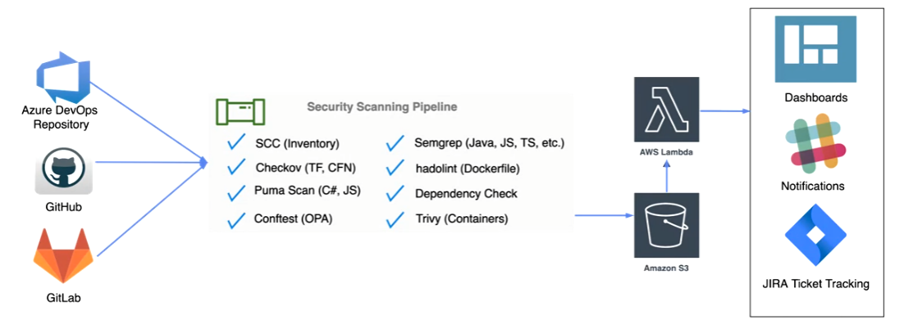


Four Distinct Stages: The pipeline is divided into four stages: **Intake**, **Triage**, **Test**, and **Delivered**.

* **Intake**: Customers request security services (dynamic, static, manual assessments) through an application repository. They select an existing application or provide details for a new one. This is the initial interaction or "first impression."

* **Triage**: Determines the appropriate security services to apply based on the request. Automated scans might trigger specific actions, like a ZAP scan. This is the assessment and planning phase.

* **Test**: The core of the pipeline. Automates security tools, collects results in a central repository, and reviews findings for false positives. This is the execution and analysis phase.

* **Delivered**: Results are distributed to the customer. Pipelines often integrate with defect trackers and generate summary metrics/reports for management. This is the reporting and remediation phase.


#### Automated Security Testing Goals

Provide fast and clear feedback on code commit:

* Run code scans in parallel with unit testing for speed.
* Run high-risk checks early in the pipeline to "fail fast."
* Do incremental scanning, if possible, as deep scanning takes too long for CI/CD, especially on large codebases.
* Set a max time limit with the dev team, alert if the limit is breached and fix it.
* Select tools with output formats that can be parsed and return results directly to developers using their IDE or backlog ticketing system (JIRA, GitHub, GitLab)
* Run full/long running scans are scheduled (nightly) or from the security scanning factory.


**Deep Scanning vs. Incremental Scanning**

* **Full Scans:** Can take hours or days, unsuitable for CI/CD timeframes.
* **Incremental Scans:** Many SAST tools offer incremental scanning of changed code, updating a cached abstract model. Limitations may exist in check types or accuracy.
* **Deeper Scanning:** Should be done periodically, outside the CI/CD pipeline (e.g., overnight, on-demand). Manual review and triage are recommended.
* **Feedback Mechanisms:** Findings can be delivered to engineers via IDEs, backlog tickets, API integration, or vulnerability managers.
    * [Archerysec](https://www.archerysec.com/)
    * [OWASP Defect Dojo](https://www.defectdojo.org/)


#### Automated Security Testing: Minimize False Positives

Developers will tune out results if you don't tune out false positives:

* Carefully review rules and identify which checks provide high-confidence results.
* Configure the pipeline to stop if these checks fail.
* Turn off noisy, low-confidence checks in the pipeline
* Run low confidence checks in the security scanning factory, validate the findings manually, and send true positive findings to the development team's backlog.
* Periodically review and re-tune rules and configurations.

**Pro tip:**

Store tool configurations, disabled rules, and custom rules in version control to keep a history of decisions for compliance and governance.


#### Automated Security Testing: Customizing Tools

Security scanning tools have built-in, default rule sets that run out of the box. However, every product uses different naming conventions, patterns, and frameworks:

* Although very few teams do this, you may need to write your own rules using tool plugins or scripts.
* Custom rules can help to enforce your team's specific guidelines.
* For maximum coverage, you will need to run multiple tools, such as SAST, Software Supply Chain, Infrastructure as Code (IaC), Kubernetes, and DAST
* Different scanning approaches find different problems, so make sure you understand what each tool is good at and what its blind spots are.
* Use a vulnerability manager solution to schedule scans, consolidate results, filter duplicates, perform differential analysis, and identify new risks.

* **Resources:**
  * [Static Analysis (SAST)](https://github.com/analysis-tools-dev/static-analysis)
  * [IaC Security Cheatsheet](https://cheatsheetseries.owasp.org/cheatsheets/Infrastructure_as_Code_Security_Cheat_Sheet.html)


#### Automated Security Testing: Parsing & Displaying Results

Running security tools in CI/CD requires a supported machine-readable output format.

* **xUnit/JUnit**
    * Standard XML schema for reporting pass/fail unit test results
* **Checkstyle**
    * Standard XML schema for reporting static analysis results
* **SARIF (Static Analysis Results Interchange Format)**
    * JSON based schema primarily used for displaying results in GitHub
* **CycloneDX**
    * OWASP schema for software bill of materials and vulnerability exploitability exchange (VEX)
* **SPDX (Software Package Data Exchange)**
    * Open standard for communicating software bill of material provenance, license, and security details
* **JSON**
    * Custom schemas are machine readable, but you have work to do!


#### Automated Code Scanning Technology Landscape

Tool support varies widely, depending on your technology stack:

* **Application source code**: open-source tools are available for common languages and frameworks: JavaScript, Java, Python, C#, C/C++, PHP, Ruby on Rails, Android, Objective C, and Go.

* **Software supply chain**: open-source tools are available for application frameworks (npm, Maven, Nuget, PyPI) and scanning container images (more on this later)

* **Configuration management code**: open-source tools are available for Chef, Puppet, Ansible, but are generally limited to lint checks for good coding/correctness. Custom rules and extensions will be required for security coverage.

* **Infrastructure as Code**: open-source tools are available for Terraform, Docker, Kubernetes, CloudFormation, Bicep, and Helm.

* **Limitations**: New languages, frameworks, and technologies have poor (or no) coverage until open-source projects and vendors build in support.

**Static Analysis Resources**
* [Grype](https://github.com/anchore/grype)
* [Sytf](https://github.com/anchore/syft)
* [Supply Chain Levels for Software Artifacts (SLSA)](https://slsa.dev/)
* [Trivy](https://github.com/aquasecurity/trivy)


#### Semgrep - Secure Code Analysis

Semgrep provides a light-weight, multi-language, extensible static analysis solution. Fast, open-source, static analysis tool that searches code, finds bugs, and enforces secure guardrails and coding standards. Semgrep supports 30+ languages and can run in an IDE, as a pre-commit check, and as part of CI/CD workflows.

* Open-source solution built and maintained by returntocorp (r2c)
* Community driven rules Semgrep Registry contains over 1,000 rules
* Language support includes Go, Java, JavaScript, Python, Ruby, TypeScript, C#, and generic markup (JSON, YAML)
* Cloud offering also supports Secrets and Supply chain scanning
* Supports automation from the CLI, Docker image, and GitHub Actions

**References:**
* [Semgrep GitHub](https://github.com/semgrep/semgrep)
* [Semgrep Website](https://semgrep.dev/explore)


#### Semgrep - Scan Command Line Interface

Semgrep is a command-line driven tool:

* Scan command performs code scanning
* Rulesets include r2c-security-audit, r2c-ci, java, jwt, bandit, eslint-security-plugin-security, findsecbugs

| Option | Usage |
|---|---|
| `-f \| -c <config>` | YAML configuration file, directory of the YAML files, URL of a configuration file |
| `-e <pattern>` | Custom code search pattern |
| `-l <language>` | Parse pattern and all files in a specific language |
| `-o <output>` | Save search results to a file or POST to a URL, default is stdout |


### Secrets Management


#### What Are Secrets?

Every system has secrets that need to be kept safe. Automated Configuration Management and Continuous Integration tools will CD require secrets to make changes:

* OS and application passwords
* SSH keys
* TLS certificates/keys
* GPG keys
* API tokens
* Database credentials
* Sensitive runtime variables...


#### How Not to Keep Secrets: In Code

Many engineers naturally think of keeping secrets in code as they try to automate builds or operations work. Storing secrets in code is a common anti-pattern:

* Secrets become readable by **anyone** with access to the code repo.
* Version history ensures that even if you remove a secret from the code, it can still be found.
* In a distributed VCS like Git, everybody has a copy of the repo (including on their laptops)—you can't track who has it.
* You must redeploy code every time that you rotate a secret.


#### Be Especially Careful with GitHub

* It is too easy for someone to accidentally upload code with secrets to a public GitHub repo—especially if your team is contributing back to open-source projects:
    * Contributing code, such as Slackbot examples containing private Slack API tokens by accident, allows account takeovers.
    * Uber was attacked via a database key placed in a public repo.

* **Find secrets and sensitive data before attackers do!**
    * Regularly scan GitHub to check for sensitive information in public repos.
    * GitGuardian, Gitrob, truffleHog, Git-all-secrets, git-secrets

**References:**
* [GitGuardian](https://www.gitguardian.com/)
* [Gitrob](https://github.com/michenriksen/gitrob)
* [truffleHog](https://github.com/trufflesecurity/trufflehog)
* [Git-all-secrets](https://github.com/anshumanbh/git-all-secrets)


#### Preventing Secrets in Code

* Look for secrets in manual code reviews and scan for secrets in code as part of commit checks:
    * Custom grep searches
    * Find Security Bugs plugin

* Prevent secrets from being committed to code repos using pre-commit hooks or plugins. It's easy to do with Git using:

  * [git-secrets](https://github.com/awslabs/git-secrets) is a tool that allows you to prevent secrets from being committed to Git repositories.

  * [Talisman](https://github.com/thoughtworks/talisman), from ThoughtWorks, is a tool to validate code changes that are to be pushed out of a local Git repository on a developer's workstation. By hooking into the pre-push hook provided by Git, it validates the outgoing changeset for things that look suspicious—such as potential SSH keys, authorization tokens, private keys, etc.

  * [SEDATED](https://github.com/OWASP/SEDATED) prevents sensitive data such as credentials from being pushed to a Git server.

  * [Git Hound](https://github.com/ezekg/git-hound) is a Git plugin that prevents sensitive data from being committed to GitHub. It looks for matches to regular expressions specified in a config file and can stop the commit from proceeding. It can "sniff changes since last commit and pass to git-commit when clean."


#### Using git-secrets

The git-secrets tool from AWS Labs is a command-line tool designed to run as a local git pre-commit hook:

* Run `git secrets <option>` to perform various tasks

| Option | Usage |
|---|---|
| `--install` | Install in the current git repo, setting up the pre-commit hook |
| `--register-aws` | Activate the "aws" secrets patterns |
| `--list` | List the active patterns, excludes |
| `--scan` | Scan the repository for secrets, displaying results to the terminal |
| `--add <pattern>` | Add a custom pattern to search for |


#### Secret Keepers

Secrets Servers or Secret Keepers securely store, manage, and distribute secrets to users, tools, and servers:

* Encrypted storage of credentials, keys, etc.
* Secure vault management (seal, unseal) functions
* Secure sharing of secrets
* API and CLI access for tools like Chef, Docker, and Puppet, and for applications
* Secrets management functions to enroll, revoke, rotate credentials
* Auditing of setup and changes to secrets and use of secrets
* Authentication and access control filtering to the secrets vault


**References:**
* [Turtles All the Way Down](https://www.youtube.com/watch?v=OUSvv2maMYI)
* [Overview of Secret Management Solutions](https://gist.github.com/maxvt/bb49a6c7243163b8120625fc8ae3f3cd)


#### Secret Keepers: Open-Source Solutions


| Tool | Description |
|---|---|
| [Vault](https://www.vaultproject.io/) | From HashiCorp: proven secrets manager, the most widely used of these solutions<br>Integrates with multiple backends (including AWS) and data stores through plugins<br>Key rotation, credential leasing, temporary secrets, encryption as a service |
| [Conjur](https://github.com/cyberark/conjur) | open-source of general-purpose enterprise secrets management and machine identity management system |
| [Keywhiz](https://square.github.io/keywhiz/) | From Square: provides secure access to secrets through REST API or FUSE filesystem |
| [Confidant](https://github.com/lyft/confidant) | From Lyft: for AWS, stores secrets in DynamoDB ([Announcement](https://eng.lyft.com/announcing-confidant-an-open-source-secret-management-service-from-lyft-1e256fe628a3?gi=70936180eedc)) |
| [Knox](https://github.com/pinterest/knox) | From Pinterest: designed to be easy for developers to use |


#### Secret Keepers: Commercial

| Tool | Description |
|---|---|
| [Amazon KMS](https://aws.amazon.com/kms/) | Managed Amazon AWS service to create and manage encryption keys. Uses hardened security appliances (HSAs) to encrypt keys ([Details](https://d0.awsstatic.com/whitepapers/KMS-Cryptographic-Details.pdf)). Integrates with other AWS services and supports auditing through AWS CloudTrail. Includes an SDK for application developers. |
| [Amazon Secrets Manager](https://aws.amazon.com/secrets-manager/) | Provides APIs to store, retrieve, and rotate secrets, with fine-grained IAM policies. Encrypt keys with Amazon KMS. Use AWS CloudTrail for auditing and AWS CloudWatch Events for change notification. |
| [CyberArk Application Access Manager](https://www.cyberark.com/products/secrets-manager-enterprise/) | Enterprise edition of Conjur secrets manager, including AD and LDAP integration, multi-data center deployment, permission management, and HSM integration—part of the CyberArk Privileged Account Security Solution. |
| [Google KMS](https://cloud.google.com/security-key-management) | Highly available key management service for Google Cloud Platform. Integrated with IAM and Cloud Audit Logging. |
| [Google Secret Manager](https://cloud.google.com/blog/products/identity-security/introducing-google-clouds-secret-manager) | Highly scalable GCP service for storing secrets, with first-class versioning. |
| [Microsoft Azure Key Vault](https://azure.microsoft.com/en-ca/services/key-vault/) | Safeguards passwords and keys on Azure using FIPS 140-2 Level 2 HSMs. Access is audited through native Azure logging services. |
| Vault Enterprise | Enterprise editions of HashiCorp open-source secrets Vault |


#### Azure Key Vault: Storing Secrets

**Azure CLI example storing a secret in a vault:**

```bash
az keyvault secret set --vault-name dm-infrastructure-vault --name Database --value "Server=172.17.0.2; database=dm; uid=dmuser;pwd=dev$3c0psForTheWin"
```

**Azure CLI example listing secrets in a vault:**

```bash
az keyvault secret list --vault-name dm-infrastructure-vault
```

**Azure CLI example showing a vault secret:**

```bash
az keyvault secret show --vault-name dm-infrastructure-vault --name Database | jq -r 'value'
```


#### AWS Secrets Manager Example

**AWS CLI example storing a secret in Secrets Manager:**

```bash
aws secretsmanager create-secret --name "dm-database" --secret-string '{"Server":"172.17.0.2", "database":"dm", "uid":"dmuser", "pwd":"dev$3c0psForTheWin"}' --kms-key-id <KMS-KEY-ID>
```

**AWS CLI example listing secrets in a Secrets Manager:**

```bash
aws secretsmanager list-secrets
```

**AWS CLI example to get the secret from Secrets Manager:**

```bash
aws secretsmanager get-secret-value --secret-id dm-database | jq -r '.SecretString'
```


#### HashiCorp Vault

General-purpose secrets manager:

* Provides central, audited access to secrets, including dynamically generated credentials (with automatic, centrally enforced revocation)
* Secure core with extensible plugin architecture: different data storage backends, auditing backends, authentication backends, secrets engines
* Can be run on AWS, Google Cloud Platform, Azure, Kubernetes
* Packaged with Docker
* Enterprise version is FIPS 140-2 compliant and highly available
* As of 1.0, both open-source and enterprise versions include a powerful management UI

**HashiCorp's Production Hardening guidelines for deploying Vault:**

* https://learn.hashicorp.com/tutorials/vault/production-hardening
* Vault can be run on AWS and other cloud platforms. https://aws.amazon.com/quickstart/architecture/vault/
* Vault is packaged in Docker. https://hub.docker.com/_/vault/
* Online learning for Vault: https://learn.hashicorp.com/vault/
* Vault Guides examples, use cases: https://github.com/hashicorp/vault-guides


#### Secret Keepers: Vault Secrets Engines

Vault has different "secrets engines" to support a wide range of use cases and types of secrets, including:

**Secret Keepers: Vault Secrets Engines**

Vault has different "secrets engines" to support a wide range of use cases and types of secrets, including:

* [kv](https://www.vaultproject.io/docs/secrets/kv): simple key value storage (installed by default, v1 and v2)
* [AWS](https://www.vaultproject.io/docs/secrets/aws): dynamically generate AWS credentials
* [Cubbyhole](https://www.vaultproject.io/docs/secrets/cubbyhole): temporary storage of secrets, namespaced to a token
* [Database](https://www.vaultproject.io/docs/secrets/databases): generate dynamic db credentials for SQL/NoSQL platforms
* [PKI](https://www.vaultproject.io/docs/secrets/pki): internal CA, programmatically generate dynamic x.509 certs
* [SSH access manager](https://www.vaultproject.io/docs/secrets/ssh): secure/audited management of SSH access
* [TOTP](https://www.vaultproject.io/docs/secrets/totp): generate time-based one-time passwords (like Google Authenticator)
* [Transit](https://www.vaultproject.io/docs/secrets/transit): data encryption services on demand (data is not stored in Vault)


#### HashiCorp Vault: Configuration

Preparing Vault for use requires some setup work:

* Configure storage backend, TLS certificates, telemetry
* Launch and Initialize Vault: Securely distribute unseal keys
* Unseal the Vault: Requires a quorum of unseal keys
* Enable authentication backend(s): Create users if needed
* Define access control policies
* Generate and distribute initial tokens
* **Revoke root token**: Regenerate via quorum of unseal keys

**Pro tip:**

Follow production hardening guidelines from HashiCorp. Or, use the Vault Cloud service from HashiCorp.


#### HashiCorp Vault: CLI Example

* Log in to the vault
* Put a secret using the KV v2 engine
* Get a secret from the KV v2 engine
* List policies and display the "gitlab-rw" policy
* Store a file in vault using KV v2

```bash
vault login -method=userpass username=student
vault kv put kv/mscott/things bike-1234 lock-36-41-2 cell=1234
vault kv get -field=bike kv/mscott/things
vault policy list
vault policy read gitlab-rw
vault kv put kv/cert/www-dm-paper private_key=@www.dm.paper.key
```


# (2) Cloud Infrastructure Security


## Software Supply Chain Security


### What Is Infrastructure as Code (IaC)?

Defining infrastructure configuration in code:

* Use high-level languages and templates to provision systems, install and configure packages, and manage users, groups, storage, firewalls, etc.
* Take advantage of platform APIs and community/vendor modules.
* Check changes into version control; review and test in advance.
* Deploy through automated build pipeline (Continuous Delivery).

Programmable Infrastructure lets you treat runtimes like **cattle**, not **pets**: standardized within/across environments, easy and cheap to set up, tear down, or change.


### Terraform: HashiCorp versus OpenTofu

Terraform is a vendor-agnostic, source-available (BSL) option for writing Infrastructure as Code for your public cloud, private cloud, or even some on-premise infrastructure and services:

* Alternative to CloudFormation, Azure Resource Manager, and other Cloud provider-specific Infrastructure as Code capabilities.
* Variables, resources, and outputs are used to define infrastructure.
* Enterprise version is available to provide enhanced collaboration and governance capabilities.
* August 2023: HashiCorp moved Terraform from open-source (MPL) to source-available (BSL).
* September 2023: Linux foundation forked and adopted Terraform into OpenTofu.

**References**
* https://www.terraform.io
* https://www.hashicorp.com/blog/hashicorp-adopts-business-source-license
* https://www.linuxfoundation.org/press/announcing-opentofu


### Terraform Benefits

* It leverages the same architecture and markup language (HCL) for managing infrastructure across multiple Cloud providers and technologies.

* It includes providers for services built on top of or hosted by the Cloud providers:
    * AWS/Azure/GCP
    * Kubernetes
    * MySQL
    * Azure Active Directory
    * GitHub/GitLab
    * Slack

* HCL is a more powerful language supporting conditional expressions, for each loops, reusable modules, and dynamic configuration blocks.

* It's a powerful library of built-in functions for string comparison, file system operations, encoding, regular expressions, cryptography, and more.


### Terraform Considerations

* **State management issues**
    * Resource configuration is stored in a JSON formatted state file (.tfstate)
    * Local storage by default, configuration and additional resources are required for remote storage (S3, Azure Storage, GCS)
    * Lose the state file and you lose track of all your resources
* **Terraform provider (e.g., AWS, Azure RM, GCP) issues**
    * Popular providers have thousands of open GitHub issues
    * Deployments will break due to cloud provider API changes
    * Providers must be upgraded to gain access to new services/features
    * Custom resources (null resources) are often used to make up for gaps in the provider and handle race conditions
* **No rollback support during deployment errors**


### Terraform Functions


| Function | Description | Example |
|---|---|---|
| `${}` | String interpolation | `value = "dm-infra-${var.env}"` |
| `join` | Joins a list of values into a string | `join(", ", ["a", "b", "c"])` |
| `contains` | Search a list for an occurrence | `contains(list, "a")` |
| `base64encode` | Base64 encodes a value | `base64encode("SEC540")` |
| `file` | Reads the contents of a file | `file("/home/student/.ssh/id_rsa.pub")` |
| `base64sha256` | SHA2 hashes & base64 encodes a value | `base64sha256("SEC540")` |
| `cidrhost` | Calculates a full host IP address | `cidrhost("10.12.112.0/20", 16)` |
| `templatefile` | Reads a template file replacing variable placeholders | `templatefile("./script.tftpl", {port = 8080})` |


**References**

* [Configuration Language](https://www.terraform.io/docs/language/index.html)
* [Terraform Standard Module Structure](https://www.terraform.io/language/modules/develop/structure)


### Terraform Provider Configuration

Terraform Azure Resource Manager backend & provider configuration:

```terraform
terraform {
  backend "azurerm" {
    resource_group_name  = "DM-Infrastructure-TFState"
    container_name = "dm-terraform-state"
    key                  = "terraform.tfstate"
  }
  required_providers {
    azurerm = {
      source  = "hashicorp/azurerm"
      version = "3.78.0"
    }
  }
}

provider "azurerm" { }
```


### Terraform Input Variables

Terraform input variable strings, maps, and lists:

```terraform
variable "resource_group_name" {
  type = string
  description = "Resource group name for the SANS Credit Union AKS cluster"
}

variable "subnets" {
  type = map(string)
  default = {
    development = "10.1.1.0/24"
    production  = "10.1.2.0/24"
  }
}

variable "regions" {
  type = list(string)
  default = ["centralus", "eastus"]
}
```


### Terraform Local Variables

Local variables are scoped to a module and available globally to other resources inside the module:

```terraform
locals {
  dns_servers           = []
  address_space         = "10.0.0.0/16"
  gateway_subnet_prefix = "10.0.1.0/24"
  gateway_subnet_name   = "ApplicationGatewaySubnet"
  public_subnet_prefix  = "10.0.2.0/24"
  public_subnet_name    = "PublicSubnet"
  private_subnet_prefix = "10.0.3.0/24"
  private_subnet_name   = "PrivateSubnet"
  route_tables_ids      = {}
}
```


### Terraform Resources

Terraform resource configuration creating a Resource Group and VNet:

```terraform
resource "azurerm_resource_group" "vnet" {
  name     = var.resource_group_name
  location = var.location
}

resource "azurerm_virtual_network" "vnet" {
  name                = "${azurerm_resource_group.vnet.name}-VirtualNetwork"
  resource_group_name = azurerm_resource_group.vnet.name
  location            = azurerm_resource_group.vnet.location
  address_space       = [local.address_space]
  dns_servers         = local.dns_servers
}
```


### Terraform Data Source

Terraform data sources read data from pre-existing provider resources:

```terraform
data "azurerm_client_config" "current" {}

data "azurerm_subscription" "current" {}

locals {
  subscription_id = data.azurerm_client_config.current.subscription_id
  subscription_name = data.azurerm_subscription.current.display_name
}
```


### Terraform Null Resource Local Provisioner

**NOTE:** Technical debt resource, avoid using these whenever possible!

Null resource configuration using the `local-exec` provisioner to run a custom script:

```terraform
resource "null_resource" "save_bastion_ssh_private_key" {
  provisioner "local-exec" {
    command = <<EOT
      az keyvault secret set \
      --vault-name ${azurerm_key_vault.vault.name} \
      --name ${local.bastion_ssh_key_vault_tag} \
      --file ${local.private_ssh_key_file}
    EOT
  }

  triggers = {
    runEveryTime = timestamp()
  }
}
```


### Terraform Outputs

Declaring outputs for the application URL and unique resource identifiers

```terraform
output "application_url" {
  description = "Generated application URL."
  value       = "https://${azurerm_public_ip.app_gateway.fqdn}"
}

output "random_unique_string" {
  description = "Random unique string for this deployment"
  value       = random_string.unique_qualifier.result
}
```


### Terraform Modules

* Terraform's registry contains open-source, reusable modules
* Configuring a module using the Azure Network source

```terraform
module "network" {
  source              = "Azure/network/azurerm"
  version             = "3.5.0"
  resource_group_name = azurerm_resource_group.vnet.name
  address_spaces      = ["10.0.0.0/16", "10.2.0.0/16"]
  subnet_prefixes     = ["10.0.1.0/24", "10.0.2.0/24", "10.0.3.0/24"]
  subnet_names        = ["public", "private", "bastion"]
  subnet_service_endpoints = {
    "public": ["Microsoft.Storage", "Microsoft.KeyVault"],
    "private" : ["Microsoft.Sql"],
    "bastion": [],
  }
}
```


### Terraform Command Line Interface (CLI)

Terraform uses a command-line interface to interact with resources based on the configuration code:

* Standard CLI Steps:
  * **`init`** > **`validate`** > **`plan`** > **`apply`**

| Command | Description |
|---|---|
| `init` | Prepares working directory containing configuration files, which includes backend initialization, child module installation, and plugin initialization |
| `validate` | Validate the configuration file syntax in a directory |
| `plan` | Used to create an execution plan, implies refresh unless specifically disabled |
| `apply` | Applies changes to reach desired state based on configuration defined in current directory |
| `destroy` | Destroy Terraform-managed infrastructure, preview available with "terraform plan -destroy" |
| `import` | Import an existing resource (requires at least a shell of a resource in configuration) |
| `state` | Advanced state management (list, show, move, remove) |
| `output` | Show output values from your root module |

**Common Terraform Commands**

Common commands:

* **apply**: Builds or changes infrastructure.
* **console**: Interactive console for Terraform interpolations.
* **destroy**: Destroy Terraform-managed infrastructure.
* **fmt**: Rewrites config files to canonical format.
* **get**: Download and install modules for the configuration.
* **graph**: Create a visual graph of Terraform resources.
* **import**: Import existing infrastructure into Terraform.
* **init**: Initialize a new or existing Terraform configuration.
* **output**: Read an output from a state file.
* **plan**: Generate and show an execution plan.
* **providers**: Prints a tree of the providers used in the configuration.
* **push**: Upload this Terraform module to Terraform Enterprise.
* **refresh**: Update local state file against real resources.
* **show**: Inspect Terraform state or plan.
* **taint**: Manually mark a resource for recreation.
* **untaint**: Manually unmark a resource as tainted.
* **validate**: Validate the configuration files in a directory.
* **validate**: Validates the Terraform files.
* **version**: Prints the Terraform version.
* **workspace**: Workspace management.

All other commands:

* **debug**: Debug output management (experimental).
* **force-unlock**: Manually unlock the terraform state.
* **state**: Advanced state management.

Reference:

* https://www.terraform.io/docs/cli/commands/index.html


### Terraform CLI | Deployment

Initializing, planning, and applying Terraform configuration:

```bash
$ cd ~/code/dm-infrastructure-az

# setting TF environment variables
$ export TF_VAR_resource_group_name="DM-Infrastructure"

# init with tf backend
$ terraform init --backend-config="storage_account_name=dm-tf-state"

# plan resource configuration
$ terraform plan -var-file="vars.tfvars" -out dm.plan

# apply changes
$ terraform apply -auto-approve dm.plan
```


### Terraform CLI | State Management (1)

Listing Terraform resources and details using the `state` command:

```bash
$ terraform state list

azurerm_resource_group.vnet
azurerm_virtual_network.vnet
```

Showing the details for a Terraform resource using the `state` command:

```bash
$ terraform state show azurerm_resource_group.vnet
```

```
resource "azurerm_resource_group" "vnet" {
  id = "/subscriptions/.../resourceGroups/DM-Infrastructure-Vnet"
  ...
}
```


### Terraform CLI | State Management (2)

Importing and removing resources from the Terraform state file:

```bash
$ terraform import azurerm_resource_group.vnet "/subscriptions/.../resourceGroups/DM-Infrastructure-Vnet"

azurerm_resource_group.vnet: Importing from ID "/subscriptions/.../resourceGroups/DM-Infrastructure-Vnet"...
azurerm_resource_group.vnet: Refreshing state...
[id=/subscriptions/.../resourceGroups/DM-Infrastructure-Vnet]
Import successful!
```

```bash
$ terraform state rm azurerm_resource_group.vnet

Removed azurerm_resource_group.vnet
Successfully removed 1 resource instance(s)
```


### Terraform CLI | Outputs

Reading and parsing Terraform output data:

```bash
$ terraform output --json
```

```json
{
  "application_url": {
    "sensitive": false,
    "type": "string",
    "value": "[https://dm-kuwmqzpu.centralus.cloudapp.azure.com](https://dm-kuwmqzpu.centralus.cloudapp.azure.com)"
  },
  "random_unique_string": {
    "sensitive": false,
    "type": "string",
    "value": "kuwmqzpu"
  }
}
```


## Cloud Infrastructure as Code (IaC) 


### IaC Pipeline 


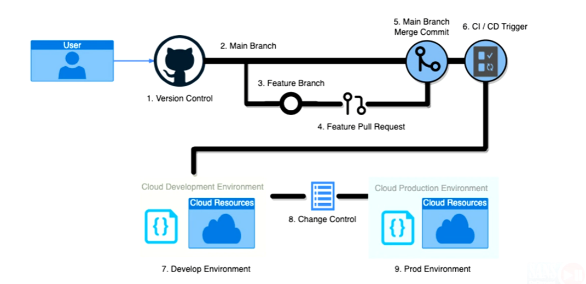

* Code that is push here is highly critical, any  code that is not properly vetted can be potentially malicious and can be pushed into the CI/CD pipeline can cause massive damage...


### Infrastructure as Code (IaC) Security

Infrastructure as Code (IaC) deployments introduce new security concerns:

* Templates provide a blueprint of the entire cloud environment.
* Secrets are everywhere.
    * Service account keys, SSH keys, API keys, Terraform state file
* Least privilege is hard.
    * Service accounts deploying templates require elevated permissions
* There are more supply chain attacks.
    * Many Terraform modules are published by external contributors
* Code analysis (SAST) requires a different toolchain.


### Azure Network Security Groups (NSG)

Network security groups contain a collection of stateful inbound and outbound rules for a subnet or network interface:

* Rule priority determines ordering from low to high
* Inbound or outbound traffic direction
* Rule processing stops after the first matching allow or deny rule
* Filter by an individual port (443) or range (1024-65535)
* Source and destination can be set to an IP address, CIDR block, service tag, or application security group


**References**
1. [Network security groups](https://docs.microsoft.com/en-us/azure/virtual-network/network-security-groups-overview)

2. [Azure Firewall vs. Network Security Group (NSG)](https://darawtechie.com/2019/09/05/azure-firewall-vs-network-security-group-nsg/)

3. [Azure Firewall threat intelligence-based filtering](https://docs.microsoft.com/en-us/azure/firewall/threat-intel)

4. [What is Azure Web Application Firewall?](https://docs.microsoft.com/en-us/azure/web-application-firewall/overview)


### AWS EC2 Security Groups

Security groups control the ingress and egress traffic flow to an EC2 instance's network interfaces (e.g., eth0):

* The default ingress rules allow no traffic
* The default egress rules allow all traffic
* Permissive rule configurations have no deny action.
* Stateful rules allow responses to ingress traffic automatically.
* All rules are evaluated, and the most permissive rule is used before making a decision.


**Reference**
* [VPC Security Groups](https://docs.aws.amazon.com/vpc/latest/userguide/vpc-security-groups.html)


### Infrastructure as Code (IaC) Security Scanning Tools

Open-source Infrastructure as Code (IaC) scanning tools:

* [Terrascan](https://github.com/accurics/terrascan)
* [Terrascan Policies](https://runterrascan.io/docs/policies/policies)
* [Semgrep](https://semgrep.dev)
* [Semgrep for Cloud Security](https://www.marcolancini.it/2020/blog-semgrep-for-cloud-security/)
* [Semgrep Rules](https://docs.google.com/presentation/d/1j9uqQsMlePEuSzOD6E4Th2IYY4Hi7dl5XYbHdSDMkrc/edit#slide=id.g787344da8e_0_1736)
* [KICS](https://github.com/Checkmarx/kics)
* [Easy Infra](https://github.com/seisollc/easy_infra)
* [Checkov](https://www.checkov.io)
* [cfn-nag](https://github.com/stelligent/cfn_nag)


### Easy_Infra

Specialized IaC containers for use in CI/CD:

* Centralized logging to support oversight and security observability dashboards.
* Transparent security; no runtime changes required, just use the images to perform IaC operations.
* Modes of operation:
    * Disable Security
    * Learning Mode
    * Enforcement Mode


### **IaC Security Scanner - Checkov**

Bridgecrew's (Prisma Cloud) Checkov IaC security scanner is a Python command-line package:

* Supports Terraform HCL, CloudFormation, ARM, Kubernetes, Dockerfile, and Serverless framework templates
* Thousands of security policies across AWS, Azure, and GCP

| Option | Usage |
|---|---|
| `--directory` | Directory containing the templates to be scanned |
| `--framework` | cloudformation, terraform, terraform_plan, kubernetes, serverless, arm, all filter to run only on a specific infrastructure code frameworks |
| `--output` | Report output format<br>\[{cli,cyclonedx,json,junitxml,github_failed_only,sarif}] |


## Configuration Management as Code


### Configuration Management Tools

* Essentially tools that can be used to take a base image/iso, automate the configuration management and customization of that image/iso and snapshot that customized image.

References

* [Ansible](https://www.ansible.com)
* [Chef](https://www.chef.io)
* [Puppet](https://puppet.com)
* [SaltStack](https://saltproject.io/)
* [CFEngine](https://cfengine.com)


### **Configuration Management Tooling**

| Declarative | Procedural |
| ---|---|
| **"What"** | **"How"** |
| Defines the desired end state | Detailed steps and logic required to reach end state |
|Less flexible | Easier for programmers to use and understand |
|Easy to verify | End state not captured - need to trace through steps<br>Testing tools like Serverspec and InSpec are important |
| [SaltStack](https://saltproject.io/)<br>[CFEngine](https://cfengine.com)<br>[Puppet](https://puppet.com) | [Ansible](https://www.ansible.com)<br>[Chef](https://www.chef.io)


### Configuration Management as Code Hardening

Follow basic good practices in setting up configurations and take advantage of hardening templates/recipes and examples.

* [dev-sec.io](https://dev-sec.io) open-source hardening framework
* CIS benchmarks
* DoD STIG templates in Puppet
* [SIMP Project](https://www.simp-project.com/) from NSA

**NOTE:** Carefully review open-source templates/modules before use, open-source templates can and will be used as a vector for supply chain attacks!

#### Hardening with Puppet

* [How Puppet helps security and auditing](https://puppet.com/blog/how-puppet-helps-security-and-audit)
* [NSA SIMP hardening system in Puppet](https://simp-project.com/)
* [PuppetForge modules tagged security](https://forge.puppet.com/tags/security)
* [PuppetForge modules matching "harden"](https://forge.puppet.com/modules?utf-8=%E2%9C%93&sort=rank&q=harden&endorsements=)
* [PuppetForge modules for CIS benchmarks](https://forge.puppet.com/tags/cis)
* [Learning Puppet Security](https://www.oreilly.com/library/view/learning-puppet-security/9781784397753/ch06s03.html)
* [CIS Benchmark Remediation Kits](https://www.cisecurity.org/cis-benchmarks/) (for CIS members only) include Puppet modules for RHEL and Centos
* [USGCB—US Government Configuration Baseline](https://csrc.nist.gov/Projects/United-States-Government-Configuration-Baseline/USGCB-Content/RedHat-Content): NIST standard definition for RHEL Linux desktop configuration, defined in Puppet modules

#### Hardening with Ansible

* [Officially vetted Ansible roles for hardening against CIS and STIGS](https://github.com/ansible/ansible-lockdown)
* [Ansible role to deploy and audit systems to DISA STIG](https://www.redhat.com/en/blog/disa-releases-first-ansible-stig)
* [Comprehensive hardening role for Linux hosts from OpenStack](https://docs.openstack.org/ansible-hardening/latest/)
* [Introduction to hardening with Ansible](https://dzone.com/articles/system-hardening-with-ansible)
* [Guidelines for Linux hardening with Ansible (from 2014)](https://www.linuxjournal.com/content/security-hardening-ansible)
* [Ansible playbook for applying CIS benchmarks on RHEL/Centos 6](https://github.com/major/cis-rhel-ansible)


#### Hardening with CFEngine

* [Achieving STIG compliance with CFEngine 3](https://docs.cfengine.com/docs/archive/stig.html)
* [How to harden RHEL/Centos using CFEngine (2014)](https://blog.it-security.ca/2014/04/using-cfengine-for-linux-systems.html)
* [Security practices with CFEngine](https://www.slideshare.net/MichaelClelland/security-practices-with-cfengine-config-management-camp-2016)

#### Hardening with Salt

* [Basic hardening with Salt](https://blog.codybunch.com/2015/01/09/Basic-Server-Hardening-with-Salt/)
* [Adobe on using SaltStack for compliance and infrastructure hardening](https://www.youtube.com/watch?v=GdwPjHxPVCE)
* [os-hardening-formula](https://github.com/saltstack-formulas/os-hardening-formula)
* [saltstack-cis-module](https://github.com/cedwards/saltstack-cis-module)


#### DoD Security Technical Implementation Guide (STIG) templates
  * [Publicly accessible STIG configuration templates for Ansible, Chef, and Microsoft PowerShell DSC](https://public.cyber.mil/stigs/supplemental-automation-content/)
  * [SteelCloud commercial solution to scan and apply STIG policies](https://www.steelcloud.com/)

### Configuration Management - Gold Image Pipeline

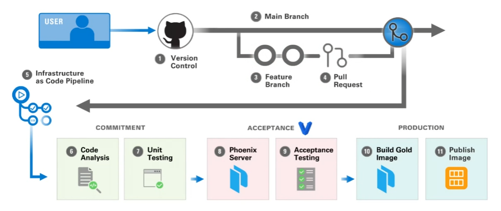


### Configuration Management - Building a Test System

**Phoenix Test Servers**

* Stand-up and provision test system or test instance in the cloud.
* Ensures that test environment is always in a known and traceable state
* Easier to reproduce/debug problems.
* Continuously exercises and tests your capability to build runtime infrastructure.
* After testing, tear down and clean up the test runtime (containers make this easy). This reduces your overall attack surface. 


### Provisioning Development and Test VMs with Vagrant

Vagrant use cases include the following:

* Rapid and simple configuration and provisioning of VMs for development/testing
* Use cases:
    * Create developer environments aligned with production
    * Spin up temporary disposable VM sandbox for testing config changes
    * More useful for a small number of VMs
* Integrates with configuration management software


References
* Read: "[Stronger DevOps Culture with Puppet and Vagrant](https://puppet.com/blog/stronger-devops-culture-puppet-and-vagrant)" by Mitchell Hashimoto (principal author of Vagrant)
* [DevOps Technologies: Vagrant" SEI Series on DevOps](https://insights.sei.cmu.edu/devops/2014/12/devops-technologies-vagrant.html)


### Building Gold Images with Packer

[Packer](https://www.packer.io) is an open-source tool for creating machine images on different platforms with a common configuration:

* Source images from Amazon EC2, Azure Virtual Machines, Google Compute Engine, Docker, VMWare, Virtual Box
* Apply Ansible, Puppet, or Chef configurations
* Publish a custom virtual machine image to the target platform
* Command-line driven and built for CI/CD

Reference
* [Buidling Immutable Infrastructure with Packer](https://www.packer.io/guides/packer-on-cicd)


### Cloud Virtual Machine Marketplace

Cloud provider marketplaces contain virtual machine images for customers to use:

* Supports standard operating system images
    * RHEL, Ubuntu, Windows
* Vendors publish images on the marketplace (some cost $$)
    * CIS Benchmark, firewalls, HIDS, antivirus, VPN, etc.
* Customers can create private images stored in their account
* Customers can share images on the cloud marketplace
    * Remember the supply chain security problem?

References

* [AWS Marketplace](https://aws.amazon.com/marketplace)
* [AWS Marketplace Sellers](https://docs.aws.amazon.com/marketplace/latest/userguide/user-guide-for-sellers.html)
* [Azure Marketplace Compute Images](https://azuremarketplace.microsoft.com/en-us/marketplace/apps/category/compute?page=1)
* [Azure Publishing a Custom Virtual Machine](https://docs.microsoft.com/en-us/azure/marketplace/azure-vm-use-approved-base)


### **Ansible**

* Ansible is an easy-to-set-up/easy-to-use configuration management and orchestration tool.

    * It executes arbitrary commands over SSH/WinRM across a network.
    * It does not need agents installed on each machine, but it does need Python
    * It does not need a primary server and can be run from any admin system.
    * Its configuration can be scripted in "playbooks" and "roles" using YAML.
    * You can download pre-packaged roles from Ansible Galaxy hub.
    * Enterprise support is available from Red Hat.

References

* [Best practices guide](https://docs.ansible.com/ansible/latest/user_guide/playbooks_best_practices.html)
* [Ansible Best Practices Essentials](https://www.ansible.com/blog/ansible-best-practices-essentials)
* [Commands can be tested in "Dry Run" or "Check Mode"](https://docs.ansible.com/ansible/latest/user_guide/playbooks_checkmode.html) — which will trace execution but not run the commands.
* ["Ansible: Up & Running"](https://www.oreilly.com/library/view/ansible-up-and/9781491979792/), Lorin Hochstein
* ["Ansible for DevOps"](https://leanpub.com/ansible-for-devops), Jeff Geerling
* [Comprehensive list of Ansible resources](https://github.com/jdauphant/awesome-ansible)


### Automated Testing of Configuration Management Code

Automated testing tools for Ansible:

1. Run `ansible-lint` before committing code to source repository.
2. Run `ansible-test` for unit and integration tests suites.
3. Run Checkmarx's KICS scanner to check for dangerous Ansible code.
4. Run InSpec stories against test VM to validate final configuration.


References

* [Ansible Lint](https://ansible-lint.readthedocs.io/en/latest/)
* [Testing Ansible](https://docs.ansible.com/ansible/latest/dev_guide/testing.html)
* [KICS Ansible Queries](https://docs.kics.io/latest/queries/ansible-queries/)
* [InSpec Ansible Collection Hardening](https://github.com/dev-sec/ansible-collection-hardening)


## Security Lifecycle


### NIST SP 800-190 Application Container Security Guide

Containers will force you to use different security tools and practices:

* Adopt new technologies for writing secure Dockerfiles and scanning images.
* Understand how to sign and store images securely in a registry.
* Leverage container-optimized host operating systems (e.g., Google COS) to reduce attack surface.
* Obtain container-specific runtime security appliances that manage dynamic and ephemeral containerized environments. Perimeter-based runtime defenses like IDS/IPS/WAF do not have visibility inside container networks.

**Reference**
* [Application Container Security Guide](https://nvlpubs.nist.gov/nistpubs/SpecialPublications/NIST.SP.800-190.pdf)


### Container Security Life Cycle 


* Developers are responsible for making early decisions on containerized configuration.
* Security and compliance must **shift left** and ensure consistent policies are implemented along **each step** of the **container lifecycle**.


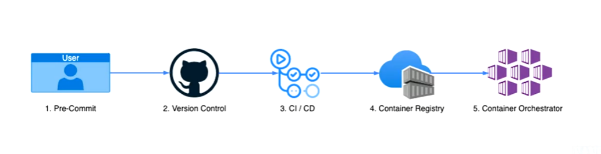


### Dockerfile Commands

Creating container images in Dockerfile requires an understanding of the following commands:

| Command | Description |
|---|---|
| `FROM` | Pulls down a pre-built image from a container registry |
| `ENV` | Sets an environment variable for the container |
| `ARG` | Defines a variable that users can pass at build-time |
| `RUN` | Configuration step to run a shell command, install package, etc. |
| `COPY` | Copies new files, directories into the image |
| `CMD` | Set default command when the image is executed |
| `USER` | Sets the user (UID) and optionally the user group (GID) |
| `ENTRYPOINT` | Specifies the command executed when the container is started |


### Static Analysis for Dockefiles


Open-source linters to check syntax and best practices:

* **Trivy**: Infrastructure as Code (IaC) scanner with configuration file rules for Kubernetes manifests and Dockerfiles
* **dockerfilelint**: Analyzes Dockerfiles and looks for common mistakes; enforces best practices
* **dockerfile-lint**: Checks syntax and runs semantic checks for best practices; customizable rules defined in YAML
* **KICS**: Rego rules for analyzing Dockerfiles for security best practices

**References**

* [Dockerfile Best Practices](https://docs.docker.com/develop/develop-images/dockerfile_best-practices/)
* [Trivy](https://github.com/aquasecurity/trivy)
* [dockerfilelint](https://github.com/replicatedhq/dockerfilelint)
* [dockerfile_lint](https://github.com/projectatomic/dockerfile_lint)
* [KICS Dockerfile Queries](https://docs.kics.io/1.3.1/queries/dockerfile-queries/)


### Trivy Command Line Interface

Aqua Security's *Trivy* command line interface supports:

| Command | Description |
|---|---|
| `image` | Scans a container image for vulnerabilities |
| `repository` | Scans a remote container repository for vulnerabilities |
| `config` | Scans configuration files (Docker, Kubernetes, Terraform) |
| `filesystem` | Scans the file system for language specific dependencies and config files |
| `rootfs` | Scans the root file system |
| `client` | Runs Trivy client against a backend server |
| `server` | Starts Trivy in server mode |


### Container Image Trusted Suppliers

**References**

* [Docker Hub Official Images & Verified Publishers](https://docs.docker.com/docker-hub/publish/certify-images/)
* [Docker Hub Publishing](https://docs.docker.com/docker-hub/publish/)
* [Iron Bank Container Repository](https://repo1.dso.mil/dsop/dccscr)
* [Microsoft Container Registry](https://github.com/microsoft/containerregistry)
* [AWS ECR Public Gallery](https://gallery.ecr.aws/)
* [Google Distroless](https://github.com/GoogleContainerTools/distroless)
* [Chainguard Images](https://www.chainguard.dev/chainguard-images)


### **Open-Source Container Scanning Tools**

| Tool | Description |
|---|---|
| Anchore | Extensible scanning and policy enforcement engine. Scans for CVEs in images and against compliance and security policies |
| CoreOS Clair | Scanning engine used in Quay.io public registry, can be used to scan Docker/rkt images and compare findings against a whitelist |
| Docker Bench/Actuary | Scan container against CIS Benchmark. Actuary runs against a Swarm |
| Grype | A multi-language vulnerability scanner for container images and filesystems |
| OpenSCAP plugin | Scan images or running containers—CVE check and run SCAP compliance checks inside container |
| Trivy | Simple, command line-driven scanner to check images for vulnerabilities, designed for CI/CD |


**References**

* [Anchore](https://anchore.com/)
* [CoreOS Clair](https://github.com/quay/clair)
* [Grype](https://github.com/anchore/grype)
* [Docker Bench](https://github.com/docker/docker-bench-security)
* [OpenSCAP plugin for scanning Docker and CoreOS rkt containers](https://github.com/OpenSCAP/container-compliance)
* [Trivy](https://github.com/aquasecurity/trivy)


## Supply Chain Security


### Supply-chain Levels for Software Artifacts (SLSA)

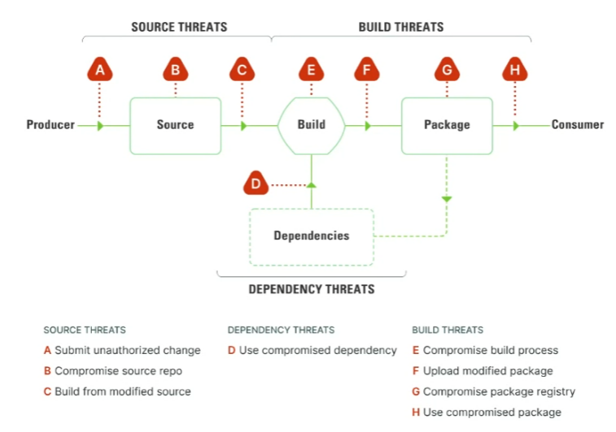


* Overview of vectors of attack/exposed attack surface area that arises within the software supply chain (**Source Threats**, **Build Threats**, **Dependency Threats**)


### Introduction to Supply Chain Security - Terminology


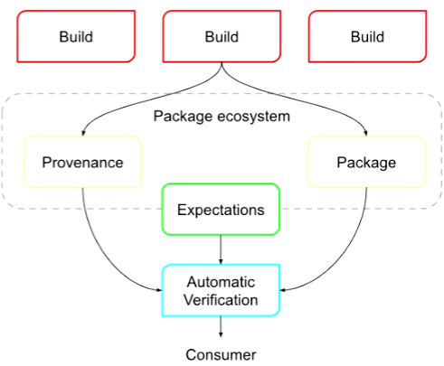

* **Artifact:** An immutable blob of data, such as a file or Container Image.

* **Attestation:** An authenticated statement (metadata) about a software artifact or collection of software artifacts.

* **Provenance:** An attestation (metadata) describing how the outputs were produced, including identification of the platform and external parameters.

* **Build:** Process that converts input sources and dependencies into output artifacts, executed within a single build environment on a platform.

* **Dependencies:** Artifacts fetched during the build process, such as configuration files, source artifacts, or build tools.

* **Producer:** A party who creates software and provides it to others. Producers are often also consumers.

* **Verifier:** A party who inspects an artifact's attestations to determine the artifact's authenticity, and may also determine whether the artifact meets an organization's policy requirements.

* **Consumer:** A party who uses software provided by a producer. The consumer may verify provenance for software they consume or delegate that responsibility to a separate verifier.

**Reference**
* [SLSA Terminology](https://slsa.dev/spec/v1.0/terminology)


### Software Provenance


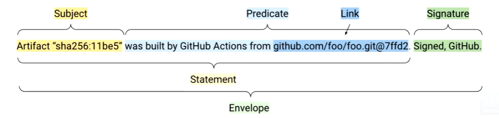


* **Subject:** Identifies what the predicate applies to (e.g., container image, binary).
* **Predicate:** Metadata about the subject, optionally linking to other artifacts (e.g., build dependency).
* **Statement:** The Subject and Predicate combined.
* **Provenance Envelope:** A signed Statement, facilitates cryptographically verifiable traceability of project dependencies and build processes.
* **Bundle:** A collection of related Provenance Envelopes.

* Enables detection of attacks such as:
    * Package repository compromise
    * Upload of modified packages
    * Compromised dependencies
    * Builds from modified source code


#### Attestation

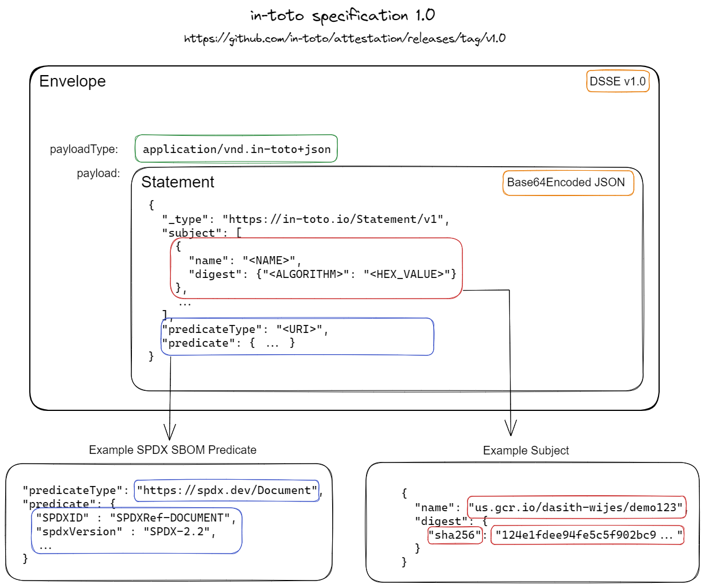


### Project Sigstore: Software Supply Chain Security

Sigstore is an Open-Source Security Foundation (OSSF) project dedicated to securing the supply chain:

* **cosign:** container signing, verification, and storage in an OCI compliant container registry
* **fulcio:** free root Certificate Authority (CA) for code signing certificates. Issues short lived (20 min) certificates based on an OIDC email address
* **rekor:** provides an immutable ledger of signature transparency logs
* **gitsign:** implements git commit and tag signing using OpenID Connect (OIDC)

**ESSENTIALLY:** it makes code signing very easy and enables pipelines to be secured and validated.


**References:**
* [Open Container Initiative Image Spec](https://github.com/opencontainers/image-spec)
* [Sigstore Website](https://www.sigstore.dev/)
* [Sigstore: A Solution to Software Supply Chain Security Article](https://itnext.io/sigstore-a-solution-to-software-supply-chain-security-35bc96bddad5)
* [Sigstore GitHub Repository](https://github.com/sigstore)
* [Docker Official Images Signing with OpenPubkey Blog Post](https://www.docker.com/blog/signing-docker-official-images-using-openpubkey/)
* [OpenPubkey and Sigstore Blog Post](https://blog.sigstore.dev/openpubkey-and-sigstore/)
* [OpenPubkey FAQ](https://github.com/openpubkey/openpubkey#openpubkey-faq)
* [Notary Project Notation GitHub Repository](https://github.com/notaryproject/notation)


### Software Bill of Materials (SBOM)

* Software Bill of Materials (SBOMs) are **a formal, machine-readable inventory of software components and dependencies, information about those components, and their hierarchical relationships**.
  * OWASP CycloneDX and ISO SPDX are the two most popular formats, and are both available in JSON, YAML, and XML.
* SBOMs **enable transparency and awareness**, decreasing the time to detect where certain versions of known vulnerable software are in use, improving the awareness of what licenses the software we use have, and improving third-party assurance through evidence-based, automated information sharing with interested parties.


### Graph for Understanding Artifact Composition (GUAC)

* A graph-based system that organizes software supply chain security artifacts.
* Supports audit, policy, and risk management use cases in parallel with developer and security operations activities.

**There are 6 core components to GUAC:**

* **GraphQL Server:** Provides a GraphQL-based API for client requests to the graph.
* **Collectors:** Reads or watches locations for new documents and collects them when found.
* **Ingestors:** Takes documents, such as SBOMs, and parses them into the GUAC graph.
* **Assemblers:** Takes GUAC objects and puts them in a datastore, queryable by the GraphQL server.
* **Certifiers:** Are not part of the ingestion pipeline, and watch the server for new nodes in the server and add additional information attached to those nodes.
* **CollectSub:** Takes identifiers of interest and creates a subscription for collectors to follow.

**References:**

* [GUAC Homepage](https://guac.sh/)
* [GUAC Ontology Definition](https://docs.guac.sh/guac-ontology-definition/)


### Additional Container Security Resources


  * [Container Security: Fundamental Technology Concepts that Protect Containerized Applications, by Liz Rice](https://www.google.com/url?sa=E&source=gmail&q=https://www.oreilly.com/library/view/container-security/9781492056690/)
  * [Container Security Checklist](https://github.com/krol3/container-security-checklist)
  * [CIS Benchmark Guide for Docker](https://www.cisecurity.org/benchmark/docker/)
  * [Docker Bench for Security](https://github.com/docker/docker-bench-security)


# (3) Cloud-Native Security Operations


## Kubernetes Architecture, Resources, and Deployments


### Kubernetes Introduction

Designed to **scale up to large environments** (thousands of nodes)  > **scale down to small environments** (IoT/Edge devices)

* **K3s** - built for IoT and Edge Computing (e.g., Raspberry Pi or small home lab node)
* **Microk8s/Minikube** - lightweight Kubernetes, simple to run locally (e.g., laptop or PC)


**References:**
* [K3s](https://k3s.io/)
* [microk8s](https://microk8s.io)
* [minikube](https://minikube.sigs.k8s.io/)
* [CNCF Landscape](https://www.google.com/search?q=https://landscape.cncf.io/card-mode%3Fcategory%3Dcertified-kubernetes-distribution,certified-kubernetes-hosted%26grouping-category)
* [Kubernetes Documentation](https://kubernetes.io/docs/concepts/extend-kubernetes/)
* [Raspberry Pi Kubernetes Cluster](https://mattadam.com/2023/01/10/raspberry-pi-kubernetes-cluster/)
* [GOTO 2016 - Cluster Management at Google with Borg](https://www.google.com/search?q=https://www.youtube.com/watch%3Fv%3DlOW4928vNlo)


### Kubernetes Architecture


Strong logical separation between control plane and worker nodes

* Managed offerings provide limited access to control plane settings

**Cluster Components**

* **Control Plane (BRAIN/ENGINE)**
  - Kube API Server: Rest API used to communicate with Control Plane.

  - Cluster Datastore (**etcd**): persistent name and resource definitions are stored here (e.g., name of the name space)

  - Kube Scheduler: used to create and schedule tasks that need to be completed.

  - Kube Controller Manager/Cloud Controller Manager (optional): additional components of the Control Plane. 

* **Worker Node(s)**

Processes/threads that can be used to complete tasks in parallel.

  - Kube Proxy: communicates with Control Plane.
  - Kubelet: communicates with Control Plane.
  - Container Runtime Interface (CRI)
  - Container Storage Interface (CSI)
  - Container Networking Interface (CNI)


### Kubernetes Cluster Components


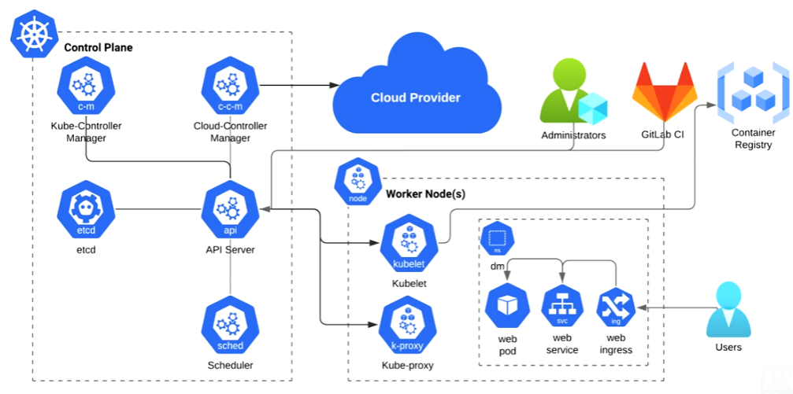


| Control Plane Component | Description |
|---|---|
| **kube-apiserver** | The gateway to the Kubernetes cluster, handling and validating RESTful requests and updating the state of the cluster. Kubernetes administrators and CI/CD pipelines often managed Kubernetes resources through the API server using **`kubectl`**. |
| **etcd** | Stores the configuration data for the cluster, which provides a key-value store distributing data across the distributed cluster. |
| **kube-scheduler** | Assigns work, in the form of pods, to nodes based on resource availability and other constraints. |
| **kube-controller-manager** | Runs various controller processes, such as the node controller, job controller, and service account controller. The Node controller is responsible for monitoring the health of the nodes and autoscaling nodes. The Job controller creates pods for completing one-off tasks. The ServiceAccount controller is responsible for creating default Service Accounts for new namespaces. |
| **cloud-controller-manager** | Manages cloud-specific functionalities like node, route, and service controllers which interact with cloud provider APIs (AWS, Azure, GCP). |
| **worker-node** | Each cluster has at least one worker node responsible for executing workload pods |


| Worker Node Component | Description |
|---|---|
| **kubelet** | An agent that runs on each node in the cluster. It ensures that containers run as expected and reports back to the control plane, maintaining a desired state for the pods. |
| **kube-proxy** | Manages network rules on nodes, allowing communication to pods from inside or outside of the cluster. |
| **namespace** | Divides cluster resources and creates isolation between objects (pods, services, service accounts, etc.) Namespaces are used for scenarios where multiple teams or products share a Kubernetes cluster. By default, a Kubernetes cluster comes with default, kube-system, and kube-public namespaces, but administrators can create additional namespaces as needed. |
| **ingress** | Manages external access to the services within a cluster, typically for HTTP and HTTPS traffic. Traffic can be load balanced or act as an edge route to different services within the cluster. |
| **service** | Defines a set of Pods and enables network access to a set of Pods. Pods can be running on the same node or on different nodes, and the Service provides a single point of entry for accessing the Pods. Services use selectors to automatically detect and group Pods based on labels. |
| **pod** | The smallest deployable unit of computing that can be created and managed in Kubernetes. A Pod is a group of one or more containers, with shared storage and network resources, and a specification for how to run the container(s). Pod specifications include the container image to pull from a container registry (ACR, ECR, Dockerhub). Deploying a Pod will send the request to the Control Plane's API server, which will route the request to a Node's kubelet service. The Node's kubelet will then pull the container from the container registry and start the Pod. |


**References**
* [Kubernetes Components](https://kubernetes.io/docs/concepts/overview/components/)
* [Kubernetes Services, Load Balancing, and Networking](https://www.google.com/url?sa=E&source=gmail&q=https://kubernetes.io/docs/concepts/services-networking/)


### Interacting with Kubernetes

* All interactions with Kubernetes are through its API.
* The `kubectl` command line tool provides a way to access the API.
* Plugins are supported.
* Multiple authentication contexts are available.

**Command form is structured**

```
kubectl [command] [TYPE] [NAME] [flags]
kubectl apply -f dm-web-pod.yaml
kubectl get pods --namespace dm -o wide
kubectl get deployment dm-web -n dm -o yaml
kubectl logs [pod_name] -n [namespace] -f
kubectl delete pod dm-web -n dm
```

**Common commands**

* `get` - list resource(s)
* `describe` - show detailed state of a resource
* `apply` - apply a configuration, from file or standard input stream
* `delete` - delete a resource
* `logs` - read logs from a container in a pod
* `port-forward` - connect a local port to a pod in the cluster


### Kubernetes Resource Manifests


Every resource object is defined by a manifest, typically written in YAML, which contains 4 required fields:

* **apiVersion** - The group and version of the Kubernetes API (or custom resource provider's API) used to create the object. The "core" API group can be omitted from the specification, as shown in the example.
* **kind** - The specific type of object within the selected API to create
* **metadata** - Information to distinguish this object from others of the same kind and apiVersion. Common fields are "name", "namespace", and "labels"
* **spec** - Detailed specification of the object's desired state. The fields and structure within the spec are unique to each kind + apiVersion pair.


### Kubernetes Resource Kinds

**Key resource types** 
* **Namespace:** group of other kinds of cluster resources 
* **Pod:** one or more containers which perform some work 
* **Volume:** an abstraction of storage accessible to a pod or container 
* **Configuration Map/Secret:** key-value storage for application data, secrets 
* **Service Account:** An identity used by pods and other resources to authorize actions in the cluster 
* **Replica Set/Deployment/Stateful Set/Daemon Set:** a collection of identical pods, duplicated for resilience or locality 
* **Service:** exposes an application to the cluster over the network 
* **Ingress:** exposes a service outside the cluster


## Kubernetes Risks and Security Controls


### Container Runtimes and Orchestrators

Production container runtime options vary for on-premises and by cloud provider:

| Cloud Provider | Container Service | Kubernetes Service |
|---|---|---|
| AWS | ECS/Fargate | Elastic Kubernetes Service (EKS) |
| Azure | Container Service | Kubernetes Service (AKS) |
| Google Cloud | Run | Kubernetes Engine (GKE) |
| Red Hat | OpenShift | Kubernetes |
| Other | Docker | Podman |

**References**

* [Amazon Elastic Container Service (ECS)](https://docs.aws.amazon.com/ecs/index.html)
* [Amazon Elastic Kubernetes Service (EKS)](https://www.google.com/url?sa=E&source=gmail&q=https://docs.aws.amazon.com/eks/latest/userguide/getting-started.html)
* [Azure Container Service Options](https://azure.microsoft.com/en-us/product-categories/containers/)
* [Google Cloud Run](https://cloud.google.com/run/docs)
* [Google Kubernetes Engine (GKE)](https://cloud.google.com/kubernetes-engine/docs)
* [Red Hat OpenShift](https://cloud.redhat.com/learn/what-is-openshift)
* [Kubernetes](https://kubernetes.io/docs/setup/production-environment/)
* [Docker Runtime](https://www.docker.com/products/container-runtime/)
* [Podman](https://podman.io/)


### Authentication

* Kubernetes has no internal user database
* Authentication system passes user info

**Recommended**

* OIDC (users) — well integrated with cloud service providers
* TokenRequest API (services)
* X.509 Certificate (internal components)

**Discouraged**

* Service Account Token, Static Token, Webhook, Proxy, X.509 Certificate (users)

**Current user info:** 
* `kubectl auth whoami`

**Credentials stored in:**

* `~/.kube/config` file or accessed via helper


### Kubernetes Control Plane Authentication

| Cloud Provider | Authentication Method | Description |
|---|---|---|
| AWS | `aws eks update-kubeconfig` | Populates the kubectl config file. |
| AWS | `aws eks get-token` | Runs to get a short-lived token on access. |
| Azure | `az aks get-credentials` | Populates the kubectl config file. |
| Azure | Long-lived certificate | Stored in a file. |


### Kubernetes Role Based Access Control

* Role Based Access Control (RBAC)
  * Permissions are additive - no deny rule; access is denied by default
  * Defined in Kubernetes Objects - Role, ClusterRole, RoleBinding, ClusterRoleBinding
  * Role and ClusterRole define permissions via apiGroups, resources, verbs
  * Bindings grant permissions of a Role to a Subject (user, group, service account, etc)
  * Cluster-scoped roles can bind to namespace resources for reuse
  * Current access permissions: `kubectl auth can-i --list`


### Kubernetes Namespaces

* Provide isolation for groups of resources
  * Resource names are unique within a namespace
* Create a boundary for permissions via RBAC, quotas
* Four initial namespaces:
  * kube-system, kube-node-lease, kube-public, default
* Avoid using the default namespace
* Service DNS names include namespace as a segment
  * E.g., `<service>.<namespace>.svc.cluster.local`
  * Avoid creating namespaces that match public top level domains
* Some resources are not in any namespace
  * E.g., nodes, cluster roles, storage volumes, custom resource definitions


### Kubernetes Secrets

* Designed for passing confidential information to pods
* Stored **unencrypted** in API Server's data store (etcd), by default
    * Managed offerings enable use of provider key management services
    * Encryption at rest can be enabled for self-managed environment
* Multiple types with validation constraints
    * The **Opaque** type supports arbitrary data
* Delivered to pods by filesystem mount, or via environment variable
    * Only the Service Account's secret is automatically mounted
* Only sent to a node when required by a pod running on that node

**"Warning: Any containers that run with `privileged: true` on a node can access all Secrets used on that node."**


### Kubernetes Security Guides

* **Kubernetes Security Checklist:**
  * Covers securing cluster's authentication, authorization, network policy, pod security, audit logging, secrets, and admission controls
* **Kubernetes Hardening Guide:**
  * NSA, CISA guidance for administrators of National Security Systems and critical infrastructure
* **Kubernetes Security - Operating Kubernetes Clusters and Applications Safely (eBook):**
  * Core security principals, securing clusters, authentication, authorization, image scanning, admission controllers, secrets management

**References**

* [Kubernetes Security Checklist](https://kubernetes.io/docs/concepts/security/security-checklist/)
* [Kubernetes Hardening Guide](https://www.google.com/url?sa=E&source=gmail&q=https://www.nsa.gov/Press-Room/News-Highlights/Article/Article/2716980/nsa-cisa-release-kubernetes-hardening-guidance/)
* [Kubernetes Security](https://info.aquasec.com/kubernetes-security)
* [Kubernetes Security - Operating Kubernetes Clusters and Applications Safely](https://www.oreilly.com/library/view/kubernetes-security/9781492039075/)

## Kubernetes Workload Security

## Kubernetes Runtime Security

## Cloud Native Security Monitoring


# (4) Microservice and Serverless Security


# (5) Continuous Compliance and Protection
