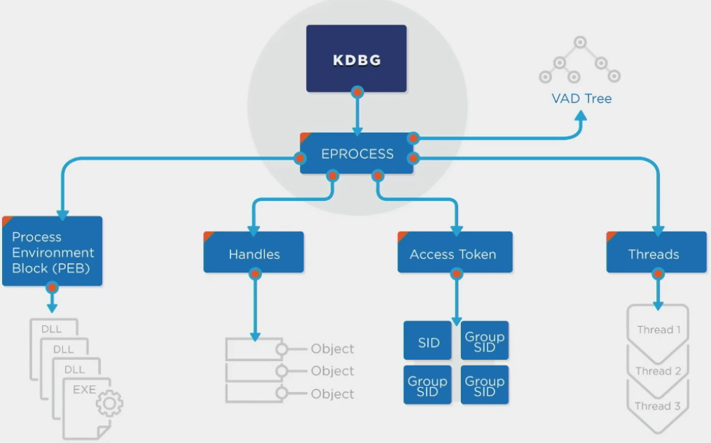

# Memory Forensics Quick Start

**Capabilities**
- Archival of commandline data per process
- Recording of host-based netowrk activity, including local DNS cache, sockets, ARP, etc
- Tracking of new process handles and execution tracing
- Analyzing suspicious thread creation and memory allocation
- Identification of common DLL injection and hooking (rootkit) tehcniques


## Acquiring Memory

### Live System
- [WinPMEM](https://github.com/Velocidex/c-aff4)
- DumpIt
- F-Response and SANS SIFT
- [Belkasoft Live RAM Capturer](https://belkasoft.com/ram-capturer)
- [MagnetForensics Ram Capture](https://www.magnetforensics.com/resources/magnet-ram-capture/)


### Dead System

**Hibernation File**
- Contains a compressed RAM Image
- When PC goes into power save or hibernation mode from sleep mode
- ```%SystemDrive%\hiberfil.sys```


**Page and Swap Files**
- ```%SystemDrive%\pagefile.sys```  
- Parts of memory that were paged out to disk
- ```%SystemDrive%\swapfile.sys``` (Win8+\2012+)
- The working set of memory for suspended Modern apps that have been swapped to disk


**Memory Dump**
- ```%WINDIR%\MEMORY.DMP```
- Crash dump

### Hiberfil.sys
**Tools can decompress to raw**
- Volatility *imagecopy*
- Comae *hibr2bin.exe*
- Arsenal *Hibernation Recon*

**Tools that can analyze natively**
- BulkExtractor
- Magnet AXIOM
- Volatility
- Passware

### Virtual Machine Machines

**VMware**
- .vmem = raw memory 
- .vmss and .vmsn = memory image
- Suspend or Snapshot VM


**Microsoft Hyper-V**
- .bin = memory image
- .vsv = save state


**Parallels**
- .mem = raw memory image


**VirtualBox**
- .sav = partial memory image


## Memory Forensic Process
1. Collect Data for Analysis
    - Capture Raw Memory
    - Hibernation File
2. Put the Collected Into Context
    - Establish Context
        - Understand the disk, partitions, file system format
    - Find Key Memory Offsets
3. Analyze Results to Understand Meaning and Identify Important Elemets
    - Analyze Data for Significant Elements
    - Recover Evidence


## Memory Analysis
1. Identify Context
    - Find the Kernel Processor Control Region (KPCR), Kernel Debugger Data Block (KDGB), and/or Directory Table Base (DTB)
2. Parse Memory Structures
    - Executive Process (EPROCESS) blocks
        - All running proccess
    - Process Environment (PEB) blocks
        - Full commandlines (including arguements)
        - DLLs loaded
    - Virtual Address Descriptors (VAD) Tree
        - List of memory sections belonging to the process
        - Identify everthing that belongs to the process
        - (i.e. Dump entire powershell process to identify scripts)
    - Kernel Modules/Drivers
3. Scan for Outliers
    - Unlinked processes, DLLs, sockets, and threads (run code)
    - Unmapped memory pages with executive privilges
    - Hook detection
    - Known heuristics and signatures
4. Analysis: Search for Anomalies





## Volatility
- [Volatility](https://code.google.com/archive/p/volatility/)
- [Command Wiki](https://code.google.com/archive/p/volatility/wikis/CommandReference23.wiki)


**Basic Command Structure**

```vol.py -f [image] --profile=[profile] [plugin]```


**Using Volatility**

```vol.py -f memory.img --profile=Win10x64_19041 pslist```

- Set an environment variable to replace -f image
    - ```export VOLATILITY_LOCATION=file://<file path>```  

- Remove environment variables
    - ```unset VOLATILITY_LOCATION```  

- Volatility plug in location (SIFT)
    - ```/usr/local/src/Volatility/volatility/plugins/```  

- Get help (-h or --info)
    - ```vol.py malfind -h```
    - ```--info``` to see profiles and registered objects
    - [Command Info](https://github.com/volatilityfoundation/volatility/wiki/Command-Reference) 


**Volatility Profiles**
- Requires the system type for a memory image be specified using the --profile=[profile]
- Set environment variable
    - ```export VOLATILITY_PROFILE=Win10x64_16299```


### Image Identification
- Windows Specification Example
    - Edition: Windows 10 Pro
    - Version: 1709
    - OS Build: 16299.371
Document Version and Build During Collection
- The ```kdbgscan``` plugin can identify the build string
    - Provides Profile Suggestion, Build String, and KdCopyDataBlock
- [Volatility Profiles](https://github.com/volatilityfoundation/volatility/wiki/2.6-Win-Profiles)
- ```vol.py --info | grep Win10```
- Provide the KdCopyDataBlock to speed up runtimes
    - ```-g or --kdbg=```
    - ```vol.py -g 0xf801252197a4 --profile=Win10x64_16299 -f memory.img pslist```


**Hibernation File Conversion**
- ```imagecopy```
- Covert crash dumps and hibernation files to raw memory
- Output filename (-o)
- Provide correct image OS via (--profile=)
- Also works for VMware Snapshot and VirtualBox memory
- ```vol.py -f /memory/hiberfil.sys imagecopy -O hiberfil.raw --profile=WinXPSP2x86```


## Steps to Finding Evil 
1. Identify Rogue Processes
2. Analyze process DLLs and handles
3. Review network artifacts
4. Look for evidence of code injection
5. Check for signs of rootkit
6. Dump suspicious processes and drivers


## Identify Rogue Processes - Step 1
- Processes have a forward link (flink) and a back link (blink)
- EPROCESS block holds a majority of the metadata for a process
    - Name of process executable (image name)
    - Process Identifier (PID)
    - Parent PID
    - Location in memory (offset)
    - Creation Time
    - Termination (exit) time
    - Threads assigned to the process
    - Handles to other operating system artifacts
    - Link to the Virtual Address Descriptor tree
    - Link to the Process Environment Block


### Procces Analysis
- Image Name
    - Legitamate Process?
    - Spelled correctly?
    - Matches system context?
- Full Path
    - Appropriate path for system executable?
    - Running from a user or temp directory?
- Parent Process
    - Is the parent process what you would expect?
- Command Line
    - Executable matches image name?
    - Do arguments make sense?
- Start Time
    - Was the process started at boot (with other system processes)?
    - Process started near time of known attack
- Security IDs
    - Do the security identifiers make sense?
    - Why would a system process use a user account SID?


**Volatility Plugins**
- pslist - print all running processes within the EPROCESS doubly linked list
- psscan - scan physical memory for eprocess pool allocations
- pstree - print process list as a tree showing parent relationships (using EPROCESS linked list)
- malprocfind - automatically idetify suspicious system processes
- processbl - compare processes and loaded DLLs with a baseline image


### Pslist
- Print all running processes by following the EPROCESS linked list
- Show information for specific PIDs (-p)
- Provides the binary name (Name). parent process (PPID), and time started (Time)
- Thread (Thds) and Handle (Hnds) counts can reviewed for anomalies
- Rootkits can unlink malicous processes from the linked list, rendering them invisible to this tool
- Suspicious process (single or two lettered .exe's, mispelled system processes, system processes with incorrect PPID or didn't start at boot time)
- [Hunt Evil Poster](https://github.com/w00d33/w00d33.github.io/blob/main/_files/SANS_Hunt_Evil_Poster.pdf) 
- [EchoTrail](https://www.echotrail.io/)


### Psscan
- Scan physical memory for EPROCESS pool allocations
- By scanning all of memory for process blocks, and not simply following the EPROCESS linked list, hidden processes may be identified
- psscan will also identify processes no loner running
- Lists:
  - Physical Offset of EPROCESS block
  - PID
  - PPID
  - Page directory base offset (PDB)
  - Process start time
  - Process exit time


### Pstree

- Print process list as a tree
- Show verbose information, including image path and commandline used for each procecss (-v)
- Very useful for visually identifying malicious processes spawned by the wrong parent process (i.e Explorer.exe as the parent of svchost.exe)
- ```pstree``` relies upon the EPROCESS linked list and hence will not show unlinked processes
- Lists:
  - Virtual offset of EPROCESS block
  - PID
  - PPID
  - Number of threads
  - Number of handles
  - Process start time
- Can output a Graphiz DOT graph
  - ```vol.py -f memory.img --profile=Win10x64_16299 pstree --output=dot --output-file=pstree.dot```  
- Convert dot file to image (SIFT)
  - ```dot -Tpng pstree.dot -o pstree.png```
- Parent Process of Interest
  - WMI Remoting - WmiPrvSE.exe/scrcons.exe (parent process of ActiveScriptEventConsumers)
  - PowerShell Remoting - Wsmprovhost.exe

### Automating Analysis with Baseline
- Compare memory objects founf in suspect image to those present in a baseline (known good) image
- Provide baseline image (-B)
- Only display items not found in baseline image (-U)
- Only display items present in the baseline (-K)
- Verbose mode (-v)
- Baseline consits of three plugins: processbl, servicebl, and driverbl
- Important information can be gleaned from items present and not present in baseline (e.g an identically named driver with a different file path in the baseline image would only be displayed using the -K option no options at all)
- [baseline.py](https://github.com/csababarta/volatility_plugins/blob/master/baseline.py)
- ```vol.py -f darkcomet.img --profile=Win7SP1x86 -B ./baseline-memory/Win7SP1x86-baseline.img processbl -U 2>error.log```
- [ANALYZING DARKCOMET IN MEMORY](http://www.tekdefense.com/news/2013/12/23/analyzing-darkcomet-in-memory.html)

  

### Rogue Processes Review
- All identified processes should be sanity checked for:
  - Correct/image executable name
  - Correct file location (path)
  - Correct parent process
  - Correct command line and parameters used
  - Start time information

- Volatility provides multiple ways to review processes:
  - pslist: gives a high-level view of what is in the EPROCESS linked list
  - psscan: gives a low-level view, searching for unlinked process blocks
  - pstree: visually shows parent-processes for anomalies
  - malprocfind: scans system for processes for anomalies
  - processbl: allows comparisons with a known good baseline


## Memory Forensics - Master Process

**Compare to baseline image**
- ```vol.py -f base-rd01-memory.img --profile=Win10x64_16299 -B ./baseline/Win10x64.img processbl -U 2>>error.log```
- Shows processes not in baseline

**yarascan**  
- ```vol.py -f base-rd01-memory.img --profile=Win10x64_162699 yarascan -y signature-base.yar > yarascan.txt```  
- Note interesting processes their start/exit times, PPID, and PID (included possible LOLBins)

**psscan**  
- ```vol.py -f base-rd01-memory.img --profile=Win10x64_16299 psscan > psscan.txt```  

**pstree**  
- ```vol.py -f base-rd01-memory.img --profile=Win10x64_16299 pstree > pstree.txt```  

**pstree -> dot file**  
- ```vol.py -f base-rd01-memory.img --profile=Win10x64_16299 pstree --output=dot --output-file=pstree.dot```  

**pstree.dot -> png file**  
- ```dot -Tpng pstree.dot -o pstree.png```  
- Note any suspicious parent to child process relationships
- Use [EchoTrail](https://www.echotrail.io/) to better understand processes

**Note times of suspicious processes - pslist**
- ```vol.py -f base-rd01-memory.img --profile=Win10x64_16299 pslist | grep -i rundll32 > pslist_rundll32.txt```  
- Document days and time ranges of suspicious files

**List dlls for Suspicious Executables**
- ```vol.py -f base-rd01-memory.img --profile=Win10x64_16299 dlllist -p 5948 > pid5948_dlllist.txt```  

**Identify SID and Account Name Used to Start Process**
- ```vol.py -f base-rd01-memory.img --profile=Win10x64_16299 getsids -p 8260 > pid8260_getsids.txt```  

**Identify Other Processes Tied to SID**
- ```vol.py -f base-rd01-memory.img --profile=Win10x64_16299 getsids | grep -i spsql >  spsql_getsids.txt```  

**Identify Files and Registries Process Interacted With**
- ```vol.py -f base-rd01-memory.img --profile=Win10x64_16299 handles -s -t File,Key -p 5948 > pid5948_handles_File_Key.txt```  

**Enumerate Network Connections**
- ```vol.py -f base-rd01-memory.img --profile=Win10x64_16299 netscan | egrep -i 'CLOSE|ESTABLISHED|Offset' > netscan.txt```  

**Correlate Process Data to Available Logs**
- ```grep -i WMIPrvSE psscan.txt > WMIPrvSE_psscan.txt```
- Return to your event logs and identify which WMIPrvSE process matches the time recorded for the malicious WMI event consumer in the logs


## Analyze Process Objects - Step 2
- DLLs: Dynamic Linked Libraries (shared code)
- Handles: Pointer to a resource
  - Files: Open files for I/O devices
  - Directories: List of names used for access to kernel objects
  - Registry: Access to a key within with Windows Registry
  - Mutexes/Semaphores: Control/limit access to an object
  - Events: Notifications that help threads communicate and organize
- Threads: Smallest unit of execution; the workhorse of a process
- Memory Sections: Shared memory areas used by process
- Sockets: Network port and connection information with a process


### Object Analysis Plugins
- dlllist - Print list of loaded DLLs for each process
- cmdline - Display commandline args for each process
- getsids - Print the ownership SIDs for each process
- handles - Print list of open handles for each process
- mutantscan - Scan memory of mutant objects (KMUTANT)


### dlllist
- Display the loaded DLLs and the commandline used to start each process
  - Base offset
  - DLL size
  - Load count
  - Load time (newer versions of Volatility only)
  - DLL file path
 
**Important Parameters**
- `--pid`: show infomration for specific process IDs
- `--dump`: extract DLLs from the memory image

- The command line displayed for the process provides full path information, including arguments provided
- LoadTime can help detect anomalies like DLL injection
- A complete list of DLLs can be too much data to review; consider limiting output to specific PIDs with the -p option
- The base offset provided can be used with the ```dlldump``` plugin to extract a specific DLL for analysis


### getsids
- Display Security Identifiers (SIDs) for each process
- Show information for specific process IDs (-p)
- Token information for a suspected process can be useful to determine how it was spawned and with that permissions
- Identifying a system process (e.g scvhost.exe) with a user SID is an important clue that something awry
- [Well Known SIDs](https://docs.microsoft.com/en-US/windows/security/identity-protection/access-control/security-identifiers)
- First line - Account SID
- Everything after - Group SID


### handles
- Also can be known as a pointer
- Print list of handles opened by the process
- Operate only on these process IDs (-p PID)
- Surpress unnamed handles (-s)
- Show only handles of a certain type (-t type)
- Each process can have hundreds or even thousands of handles; reviewing them can be like searching for a needle in a haystack
- Limit your search by looking at specific types (-t) of handles; FIle and Registry handles are excellent for quick wins
  - Process 
  - Thread
  - Key (great place to look)
  - Files (great place to look)
  - Mutant
  - Semaphore
  - Token
  - WmiGuid
  - Port
  - Directory
  - WindowsStation
  - IOCompletion
  - Timer
- ```filescan``` and ```mutantscan``` search for makers indicating FILE_OBJECTS and KMUTANT objects and return their respective results

**Named Pipes (File Handles)**
- [Named Pipes](https://docs.microsoft.com/en-us/windows/win32/ipc/named-pipes)
- Designed to use SMB
- Allow multiple processes or computers to communicate with each other
- Used by psexec, cobalt strike, covenant, trickbot
- Examples (Cobalt Strike)
  - ```MSSE-####-server```
  - ```msagent_##```
  - ```status_##```
  - ```postex_ssh_####```
  - ```\\.\pipe\######```
  - postex_###

  **Mutants/Mutex**
  - Allows flow control
  - Often used by malware to mark territory
  - Identified by reverse engineers to make IOCs (unique)
  - Limits the access to a resource
  - Malware will "mark" a compromised system so it doesnt get reinfected
  - Process object


### Analyzing Process Objects Review
- Objects that make up a process will provide a clue
  - DLLs
  - Account SID
  - Handles
- Narrow focus to suspect processes or those known to be often subverted (e.g svchost.exe, services.exe, lsass.exe)
- Check process commandline, DLL files paths, and SID, and use hadnles when necessary to provide additional confirmation


## Network Artifacts - Step 3
- Suspicious ports
  - Communication via abnormal ports?
  - Indications of listening ports/backdoors?
- Suspicious Connections
  - External Connections
  - Connections to known bad IPs
  - TCP/UDP connections
  - Creation times
- Suspicious Processes
  - Why does this process have network capability (open sockets)?

**Examples**
- Any process communicating over port 80, 443, or 8080 that is not browser
- Any browser not communicating over port 80, 443, or 8080
- Connections to unexplained internal or external IP addresses
- Web requests directly to an IP address rather than a domain name
- RDP connections (port 3389), particularly if originating from odd or external IP addresses
- DNS requests for unusual domain names
- Workstation to workstaion connections

### Plugins
- XP/2003
  - connections: Print list of active, open TCP connections
  - connscan: Scan memory for TCP connections, including those closed or unlinked
  - sockets: Print list of active, available sockets (any protocol)
  - sockscan: Scan memory for sockets, including, those closed on unlinked
- Vista+
  - netscan: All of the above--scan for both connections and sockets


### netstat
- Identify network sockets and tcp structures resident in memory
- Both active (established) and terminated (closed) TCP connections may be returned
- Pay close attention to the process attached to the connection
- Does a socket or network connection for that process make?
- Creation times available for both sockets and TCP connections
- Lists:
  - Memory offset
  - Protocol
  - Local IP address
  - Remote IP address
  - State (TCP Only)
  - Process ID (PID)
  - Owner Process Name
  - Creation Time
- PowerShell uses port 5985 & 5986
- WMI uses port 135

**UPDATE WITH MY PERSONAL NOTES HERE**
- Utilize [FOR508.3](https://docs.google.com/document/d/1Qaad7OH6f4nMZLjrn4O44pJYngiNaezEe4FD3E3my8Y/edit?tab=t.0)
- TOOL: MemProcFS
- Method of Analysis: MemProcFS Playbook


## Evidence of Code Injection - Step 4
- Camoflauge: Use legitamite process to run
- Access to Memory and Permissions of Target
- Process Migration: Change the process its running under
- Evade A/V and Application Control
- Assist with Complex Attacks (Rootkits)
- Required administrator or debug privileges on the system
  - SeDebugPrivilege


### Code Injection
- Common with modern malware
- Built in Windows Feature
  - VirtualAllocEx()
  - CreateRemoteThread()
  - SetWindowsHookEx()
    - Hook a process's filter functions
- Reflective injection loads code without registering with host process
  - Malware creates its own loader, bypassing common API functions
  - Results in code runnind that is not registered with any host process
- Use of PowerShell-based injection is growing in popularity

### Process Hollowing
- Malware starts a suspended (not running) instance of legitimate process
- Original process code deallocated and replaced
- Can retain DLLs, handles, data, etc from original process
- Process image EXE not backed with file on disk
- [Process Hollowing Analysis](https://www.trustwave.com/en-us/resources/blogs/spiderlabs-blog/analyzing-malware-hollow-processes/)
- Volatility modules
  - hollowfind
  - threadmap

### Simple DLL Injection Explained
1. Attacker Process Attaches to Victim Process
  - `OpenProcess()`

2. Attacker Process Allocates an Amount of Memory in Victim Process + Writes the Full Path of the Malicous DLL in Allocated Space 
  - `VirtualAllocEx()`: **Memory Allocation**
  - `WriteProcessMemory()`: **Writes Full Path**

3. Attacker Process Starts a New Thread in Victim Process
  - `CreateRemoteThread()`

4. Malicous DLL is Retrieved from Disk, Loaded, and Executed
  - `LoadLibraryA()`

- Note: There is no legitimate Windows Function to load code from anywhere but disk
- Modern systems isolate system processes from user processes
- Modern malware (Mimikatz and Meterpreter) evade by using API functions:
  - `NtCreateThreadEx`
  - `RtlCreateUserThread`


### Code Injection Plugins
- ldrmodules: Detecting unlinked DLLs and non-memory-mapped files
- malfind: Find hidden and injected code and dump affected memory sections
- hollowfind: Identify evidence of known process hollowing techniques
- threadmap: Analyze threads to identify process hollowing countermeasures
- [DETECTING DECEPTIVE PROCESS HOLLOWING](https://cysinfo.com/detecting-deceptive-hollowing-techniques/)
- [threadmap](https://github.com/kslgroup/threadmap/blob/master/threadmap%20documentation.pdf)


### ldrmodules
- DLLs are tracked in three different linked lists in the PEB for each process
- Stealthy malware can unlink loaded DLLs from these lists
- This plugin queries each list and displays the results for comparison
- Show information for specific process IDs (-p)
- Verbose: Show full paths from each of the three PEB DLL lists (-v)

**Notes**
- Normal DLLs will be in all three lists with a "True" in each column
- Legitimate entries might be missing in some of the lists
  - The process executable will no be present in the "InInit" list
  - Unloaded DLLs not yet removed from process memory
- IF an entry has no "MappedPath" information, it is indicative of a DLL not loaded using the Windows API (usually as sign of injection)

**Fields**
- Process ID
- Process Name
- Base Offset (location in memory pages)
- PEB InLoadOrderModule List ("InLoad") - Order Loaded
- PEB InInitializationOrderModule List ("InInit") - Order Initialized 
- PEB InMemoryOrderModule List ("InMem") - Order in Memory
- VAD Tree Mapped Path

**Data Sources**
- Unlinking from on or more of these lists is simple means for malware to hide injected DLLs
- Dlllist will not show unlinked DLLS
- True within a column means the DLL was present in the list
- Determine DLLs that are unlinked or suspiciously loaded
- Exe's will be missing from the InInit list
- Most DLLS are loaded from:
  - ```\Windows\System32```
  - ```\Program Files```
  - ```\Windows\WinSxS```
- .mui and .fon have same header has executable (false positve)
- Legitimate dlls can be unloaded by process (unlinked) and still show up because its being used by another process
- Volatility will show empty path when it finds an executables not mapped to disk (red flag)
- True - False - True & No mapped path usually mean process hollowing
- False - False - False & No mapped path usually sign of code injection


### Reflective Injection
- Evades using Windows Standard API
- Explicity calls LoadLibrary
- Use a custom reflective loader instead of Windows Loader
- Code is not registered in any way with the hose system, making it very difficult to detect
- Used by metasploit, Cobalt Strike, PowerSploit, Empire, and DoublePulsar
- Memory analysis is well suited for detection

**Detection**
1. Memory section marked as Page_Execute_ReadWrite
  - Identify every memory location assigned to process
  - Check permissions
2. Memory section not back with file on disk
3. Memory section contains code (PE file or shellcode)

- ```malfind``` plug in performs first two steps
- Analyst must confirm if section contains code


### malfind
- Scans process memory sections looking indications of hidden code injection
- Identified sections are extracted for further analysis
- Directory to save extracted files (--dump-dir=directory)
- Show information for specific process IDs (-p PID)
- Provide physical offset of a single process to scan (-o offset)
- Fields:
  - Name (Process Name)
  - PID (Process ID)
  - Start (Starting Offset)
  - End (Ending Offset)
  - Tag (Pool tag indicating type of memory section)
  - Hits (Number of hits from YARA signatures)
  - Protect (Memory section permissions)
    - PAGE_EXECUTE_READWRITE indicator of injection

**Notes**
- Although malfind has an impressive hit rate, false positives occur
  - Disassembled code provided can be helpful as a sanity check
- You might see multiple injected sections within the same process
- Dumped sections can reverse engineered or scanned with A/V
- Look for the 'MZ' header to confirm executable (4d 5a 90 00 or 'MZ')
- grep malfind for executables (```| grep -B4 MZ | grep Process```)
- Handling Non-MZ headers (Well known assembly code prologue present in injected memory section)
  - ```
  PUSH EBP
  MOV EBP, ESP
  ADD ESP, 0xfffffa30
  MOV ESI, [EBP+0x8]
  LEA EAX, [ESI+0x3fb]
  PUSH EAX
  PUSH 0x0
  PUSH 0x0
  CALL DWORD [ESI+0x85]
  MOV [ESI+0x8c5], EAX
```
- False Positive (Contains all or mostly 0's)
  - ```
  ADD [EAX], AL
  ADD [EAX], AL
  ADD [EAX], AL
  ADD [EAX], AL
  ADD [EAX], AL
  ADD [EAX], AL
  ADD [EAX], AL
  ADD [EAX], AL
  ADD [EAX], AL
  ADD [EAX], AL
```

### malfind Countermeasures
- malfind only shows a "preview" of the first 64 bytes
  - Overwrite first four bytes (MZ magic value)
  - Clear entire PE header (or first 4096)
  - Jump or redirect to code placed later in page
- ```--dump-dir``` option outputs entire contents
  1. Strings, scan with YARA signatures, AV scan
  2. Have a reverse engineer validate the code

**UPDATE WITH MY PERSONAL NOTES HERE**
- Process Memory Explained Section
  - Private Memory, Shareable Memory, Image Mapped Memory
- MemProcFS
- Uncover Kernel and Userland Process Inconsistencies
- windows.ldrmodules
- More MemProcFS: `FindEvil` Detections

## Hooking and Rootkit Detection - Step 5

### Rootkit Hooking
- System Service Descriptor Table (SSDT)
  - Kernel Instruction Hooking
  - Every SSDT entry will point to a instructions in either the system kernel (ntoskrnl.exe) or the GUI driver (win32k.sys)
- Interrupt Descriptor Table (IDT)
  - IDT maintains a table of addresses to functions handling interrupts and exceptions
  - Kernel Hooks; not very common on modern systems
- Import Address Table (IAT) and Inline API
  - User-mode DLL function hooking
  - Volatility ```apihooks``` module is best for identifying
- I/O Request Packets (IRP)
  - Driver hooking
  - How OS processes interact with hardware drivers


### Plugins
- ssdt: Display SSDT entries
- psxview: Find hidden processes via cross-view techniques
- modscan: Find modules via pool tag scanning
- apihooks: Find DLL function (inline and trampoline) hooks
- driverirp: Identify I/O Packets (IRP) hooks
- idt: Display Interrupt Descriptor Table Hooks


### ssdt
- Display hooked functions within the System Service Descriptor table (Windows Kernel Hooking)
- The plugin displays every SSDT table entry
- Eliminate legitimate entries pointing within ntoskrnl.exe and win32k.sys
  - ```| egrep -v '(ntoskrnl\.exe | win32k\.sys)'``` or ```| egrep -v '(ntoskrnl|win32k)'```
- Also attempts to discover new tables added by malware


### Direct Kernel Object Manipulation
- DKOM is an advanced process hiding technique
  - Unlink an EPROCESS from the doubly linked list
- Tools like ```tasklist.exe``` and ```pslist.exe``` on a live system are defeated by DKOM
- Use ```psscan```

### psxview
- Performs a cross-view analysis using seven different process listing plugins to visually identify hidden processes
- Limit false positives by using "known good rules" -R
- It's important to know the idiosyncrasies of each source:
  - An entry not found by ```pslist``` could be exited or hidden
  - Processes run early in boot cycle like smss.exe and csrss.exe will not show in ```csrss``` column
  - Processes run before smss.exe will not show in ```session``` and ```deskthrd``` columns
  - Terminated processes might show only in ```psscan``` column
  - If using "-R", well-known anomalies will be marked "Okay"

### modscan and modules
- modules lists modules while modscan scans for them (similar to pslist and psscan)
- Walked link list to identify kernel drivers loaded (modules)
- Scan memory image to find loaded, unloaded, and unlinked kernel modules (modscan plugin)
- Provides a list of loaded drivers, their size and location
- Drivers are a common means for malware to take control; loading a driver gives complete access to kernel objects
- Identifying a bad driver amoung hundreds of others can be hard; other information like hooks and a baseline might help
- Two main way to install rootkit: exploit (rare) or driver (common)

**Notes**
- Automating analysis (baseline plugin)
  - ```vol.py driverbl -f TDSS.img -B baseline.img -U```


### apihooks - Inline DLL Hooking
- Detect inline and Import Address Table function hooks used by rootkits to modify and control information returned
- Operate only on these PIDs (-p PID)
- Skip kernel mode checks (-R)
- Scan only critical processes and dlls (-Q)

**Notes**
- A large number of legitimate hooks can exist; weeding them out take practice and an eye for looking for anomalies
- This plugin can take a long time to run due to the sheer number of locations it must query--be patient
- Now supports x86 and x64 memory images

### Trampoline Hooking
- Indicators
  - ```Hooking module: <unkown>``` (not mapped to disk)
  - Disassembly contains ```JMP <Hook Address>```


## Dump Suspicious Processes and Drivers - Step 6

**UPDATE WITH MY PERSONAL NOTES HERE**
- MemprocFS Notes and commands for extracting files...

### Plugins
- dlldump: Dump DLLs from a process
- moddump: Dump a kernel driver to an executable file sample
- procdump: Dump a process to an execuable file sample
- memdump: Dump all addressable memory for a process into one file
- cmdscan: Scan for COMMAND_HISTORY buffers
- consoles: Scan for CONSOLE_INFORMATION output
- dumpfiles: Extract files by name or physical offset
- filescan: Scan memory for FILE_OBJECTs
- shimcachemem: Extract Application Compatibility Cache artifacts from memory

### dlldump
- Extract DLL files belonging to a specific process or group of processes
- Directory to save extracted files (--dump-dir=directory)
- Dump only from these PIDs (-p PID)
- Dump DLL located at a specifc base offset (-b offset)
- Dump DLLs matching a REGEX name pattern (-r regex)

**Notes**
- Use -p and the -b or -r options to limit the number of DLLs extracted
- Many processes point to the same DLLs, so you might encounter multiple copies of the same DLL extracted


### moddump
- Used to extract kernel drivers from a memory image
- Directory to save extracted files (--dump-dir=directory)
- Dump drivers matching a REGEX name pattern (-r regex)
- Dump driver using offset (-b module base address)
- Use -r or -b options to limit the number of drivers extracted (all kernel drivers dumped by default)
- Find the driver offset using modules or modscan
- ```vol.py -f memory.img moddump -b 0xf7c24000 --dump-dir=./output```


### procdump
- Dump a process to an executable memory sample
- Directory to save extracted files (--dump-dir=directory)
- Dump only these processes (-p PID)
- Specify process by specific offset (-o offset)
- Use regular expression to specify process (-n regex)

**Notes**
- When dumping all processes, the EPROCESS doubly linked list is used (will not dump terminated or unlinked processes)
  - Use the offset (-o option) to dump unlinked processes
- Not all processes will be "paged in" to memory -> an error is provided if the process is not memory resident


### memdump
- Dump every memory section owned by a process into a single file
- Direcotry to save extracted files (--dump-dir=directory)
- Operate only on these PIDs (-p PID)
- Use regular expression to specify process (-n regex)

**Note**
- Use the -p option to limit the number of processes extracted
- The resulting dump file will be much larger than just the process; it contains every memory section owned by the process
- String analysis of the dump can idenitify data items like domain names, IP addresses, and passwords
- vaddump is similar but dumps every section to a separate file


### strings
- Valuable information
  - IP addresses/domain names
  - Malware filenames
  - Internet markers (e.g http://, https://, ftp://)
  - Usernames/email addresses
- Output
  - Byte offset and string
  - Byte offset used to calculate cluster location

**Notes**
- Use -t d option in order to get the exact byte offset
- Strings of interests and their offset can be used to correlate and determine context
- Run once for unicode strings (-e l) and once for ASCII
  - Files can be combined into single file (example conhost)

```bash
vol.py -f memory.img memdump -n conhost --dump-dir=.
```  

```bash
strings -a -t d file > strings.asc
strings -a -t d -e l file >> strings.uni
```  
or

```bash
strings -a -t d file > strings.txt
strings -a -t d -e l file >> strings.txt
sort strings.txt > sorted_strings.txt  
```  
- Alternative for Windows: bstrings.exe


### grep
- -i ignore case
- -A Num print Num lines AFTER pattern match
- -B Num pring Num lines BEFORE pattern match
- -f filename: file with lost of words (Dirty Word List)

```bash
grep -i "command prompt" conhost.uni
```  

### cmdscan and consoles
- Scan csrss.exe (XP) and conhost.exe (Win7) for Command_History and Console_Information residue
- Gathering command history and console output can give insight into user/attacker activities
- ```cmdscan``` provides information from the command history buffer
- ```consoles``` prints commands (inputs) + screen buffer (outputs)
- Plugins can identify info from active and closed sessions


### Windows 10 Memory Compression
- Win 10 has also implemented compression for the pagefile as well as in frequently used areas of RAM
- ```win10memcompression.py```
  - Addition to the volatility project
  - Facilitates decompression as compressed pages of memory are detected
  - Can take advantage of Volatility plugins


### dumpfiles
- Dump File_Objects from memory
- Directory to save extracted files (-D or --dump-dir=)
- Extract using physical offset of File_Object (-Q)
- Extract using regular expression (-r) (add -i for case sensitive)
- Use original filename in output
- Use -n to use original name in output

**Notes**
- Extract documents, logs, executables, and even removable media files
- The ```filescan``` plugin is particulary complementary with ```dumpfiles```  
- No guarantees. References to files may be identified via ```handles``` , ```vadinfo```, and ```filescan```, but files may not be cached

```bash
vol.py -f memory.img dumpfiles -n -i -r \\.exe --dump-dir=./output
```


### filescan
- Scan for File_Objects in memory

**Notes**
- Returns the physical offset where a File_Object exists
- Identifies files in memory even if there are no handles (closed files)
- Finds NTFS special files (such as $MFT) that are not present in the VAD tree or process handles lists
- ```filescan``` is particularly complementary with ```dumpfiles```  

```bash
vol.py -f memory.img filescan
voly.py -f memory.img dumpfiles -n -Q 0x09135278 --dump-dir=.
```


### Registry Artifacts - shimcachemem
- Parses the Application Compatibility ShimCache from kernel memory
- --output=csv
- --output-file=filename
- -c, --clean_file_paths: replace path prefixes with C:

**Notes**
- Shimcache is only written to the registry upon a reboot or shutdown
- One of the only tools available to extract cached ShimCache entires directly from kernel memory without requiring a system shutdown
- Contents will often include data not yet written to the registry


### Extracted File Analysis
- AV scannning
- Malware Sandbox
- Dynamic Analysis
- Static malware debugging and disassembly


### Live Analysis
- [Get-InjectedThread](https://gist.github.com/jaredcatkinson/23905d34537ce4b5b1818c3e6405c1d2)
- [Kansa Get-InjectedThreads.ps1](https://github.com/davehull/Kansa/blob/master/Modules/Process/Get-InjectedThreads.ps1)
- [hollows_hunter](https://github.com/hasherezade/hollows_hunter/wiki)
- [GRR Rapid Response](https://grr-doc.readthedocs.io/en/v3.4.2.4/release-notes.html)
- [Velociraptor](https://github.com/Velocidex/velociraptor)
- [Veloxity Volcano](https://www.volexity.com/products-overview/volcano/)


---


## Windows Forensics

* [SANS Windows Forensic Analysis Poster](./files/Windows_Forensics_Poster.pdf)


## Registy Overview

**System  Registry Hives**

- %WinDIr%\System32\Config
    - SAM
        - Info about user accounts
        - Password last changed
        - Last logon
        - In user accounts
    - Security
        - Access Control list
        - Stored passwords
    - System
        - Configuration data (hardware)
    - Software
        - Configuration data (software/os)
    - Default
        - Not much of use

**User Registry Hives**

- %UserProfile%
    - NTUSER.DAT
    - Most recently used files
    - Last files searched for
    - Last typed URLs
    - Last commands executed
    - Opened Files
    - Last Saved Files

- %UserProfile%\AppData\Local\Microsoft\Windows\
    - USRCLASS.DAT
    - Program Execution
    - Opened and closed folders
    - Aids User Account Control (UAC)
    - HKCU\Software\Classes

- %WinDir%\appcompat\Programs
    - AMCACHE.hve
    - Excecution data


## Users and Groups

- SAM\Domains\Account\Users\
- Username
- Relative Identifier
- User Login Information
    - Last Login
    - Last Failed Login
    - Logon Count
    - Password Policy
    - Account Creation Time
- Group Information
    - Administrators
    - Users
    - Remote Desktop Users


## System Configuration

**Identify Current Control Set**
- SYSTEM\Select
- Systems Configuration Settings
- Identify what ControlSet is in use
        
**Identify Microsoft OS Version**
- MS Windows Version
    - ProductName
    - ReleaseID (YYMM)
- Service Pack Level
- Install Date of the last version/major update
    - InstallDate
- SOFTWARE\Microsoft\Windows NT\CurrentVersion
        
**Computer Name**
- SYSTEM\CurrentControlSet\Control\ComputerName\ComputerName
- Name linked to log files, network connections
- Verify the PC that is being examined
    
**Time Zone of the Machine**
- System\CurrentControlSet\Control\TimeZoneInformation
- Correlation Activity
- Log Files\TimeStamps

**Network Interfaces**
- SYSTEM\CurrentControlSet\Services\Tcpip\Parameters\Interfaces
- Static or DHCP
- Ties machines to network activity
- Interface GUID for additional profiling
    
**Historical Networks**
- SOFTWARE\Microsoft\Windows NT\CurrentVersion\NetworkList\Signatures\Managed
- SOFTWARE\Microsoft\Windows NT\CurrentVersion\NetworkList\Signatures\Unmanaged
- SOFTWARE\Microsoft\Windows NT\CurrentVersion\NetworkList\Nla\Cache
- Identify Networks Computer has been connected to
- Could be wired or wireless
- Domain/intranet Name
- Identify SSID
- Identify Gateway MAC Address
- First and Last Time network connection was made
- Networks that have been connected to via VPN
- MAC address of SSID for Gateway can be physically triangulated
- Write Down ProfileGUID

**Network Types**
- SOFTWARE\Microsoft\WZCSVC\Parameters\Interfaces\{GUID} (XP)
- SOFTWARE\Microsoft\Windows NT\CurrentVersion\NetworkList\Profiles (Win7-10)
- ID the type of network that the computer connected to
- ID wireless SSIDs that the computer previously connected to
    - ProfileName
- Time is recorded in LOCAL TIME, NOT UTC
- First and Last Connection Time
    - DateCreated
    - DateLastConnected
- Determine Type using Nametype
    - 6 (0x06) = Wired
    - 23 (0x17) = VPN
    - 71 (0x47) = Wireless
    - 243 (0xF3) = Mobile Broadband
- Network Category
    - Category
    - (Public) 0 - Sharing Disabled
    - (Private) 1 - Home, Sharing Enabled
    - (Domain) 2 - Work, Sharing Enabled
- Geolocate
    - Wigle.net
    
**System AutoStart Programs**
- Programs exhibiting persistence
    - User login
    - Boot time
- NTUSER.DAT\Software\Microsoft\Windows\CurrentVersion\Run
- NTUSER.DAT\Software\Microsoft\Windows\CurrentVersion\RunOnce
- Software\Microsoft\Windows\CurrentVersion\RunOnce
- Software\Microsoft\Windows\CurrentVersion\policies\Explorer\Run
- Software\Microsoft\Windows\CurrentVersion\Run
- (Services) SYSTEM\CurrentControlSet\Services
- IF start set to 0x02, then service application will start at boot (0x00 for drivers)
- Determine programs that start automatically
- Useful for finding malware on a machine that installs on boot such as a rootkit
- Look at when the time key was last updated; generally last boot time of the system
    
**Last Shutdown Time**
- Discover when the system was last shutdown
- How many successful times the system was shutdown
- SYSTEM\CurrentControlSet\Control\Windows (Shutdown Time)
- SYSTEM\CurrentControlSet\Control\Watchdog\Display (Shutdown Count) - XP only
- Detect certain types of activity
- Determine if the user properly shuts down their machine


# Memory Forensics Quick Start II

## Method of Attack

* **Acquire**  
  * Capture Raw Memory, Page File, or Hibernation File  
* **Context**  
  * Establish Context  
  * Find Key Memory Offsets  
* **Analyze**  
  * Analyze Data for Significant Elements  
  * Recover Evidence

### 6-Step Memory Analysis Process (Easy → Complex)

**NOTE:** these steps do not have to be run in order, depending on the initial IOC an analyst has the ability to mix and match this Memory Analysis Method of Attack. HUNTING PROCESS TO VALIDATE WHETHER OR NOT THERE IS MALICIOUS RUNNING ANYWHERE ON THE MACHINE!

**NOTE II:** sometimes the process names that are identified get cut off and end in a “**.**” This is due to only **14 characters** being allocated for process names with tools like Volatility.

#### 1) Identify Rogue Processes

* Easy win, initial filter  
* Identifying the name, path, parent, command line, and start time.

#### 2) Analyze Process Objects

* Easy win, initial filter  
* Identifying loaded DLLs, handels, and SIDs.

#### 3) Review Network Artifacts

* Easy win, initial filter  
* Identifying suspicious ports, connections, and processes.

#### 4) Look for Evidence of Code Injection

* Complex, bordering theoretical…  
* Progression from the initial filter > secondary layer of analysis looking inside of each process. **THINK**: double-layered filter.   
* Identifying injected memory sections and process hollowing. Unusual DLLs > Unusual Executable Memory > Kernel and Userland Process Inconsistencies.

#### 5) Audit Drivers and Rootkit Detection

* Complex, bordering theoretical…  
* Auditing and verifying installed drivers and identifying potential evidence of rootkit hooks, **IF** there is reason to suspect this exploitation.

#### 6) Dump Suspicious Processes and Drivers

* Identification of strings, antivirus scans, and extracting artifacts for potential reverse engineering.

---

### 1) Identify Rogue Processes

* What Is the process that I’m looking at? Does this make sense in relation to what else is around it? Here, we are looking for the low-hanging fruit before we dive deeper into memory analysis.

* **Executive Process (EPROCESS)**  
  * Holds a majority of metadata from a process and provides the following:  
    * Name of process executable (image file name)  
    * Process Identifier (PID)  
    * Parent Process Identifier (PPID)  
    * Location in memory (Offset)  
    * Creation time  
    * Termination (exit) time  
    * Threads assigned to the process  
    * Handles other operating system artifacts  
    * Link to the Virtual Address Descriptor tree  
    * Link to the Process Environment Block

#### NOTE: Rogue Process Identification

**Image Name Analysis**

* Is the process legitimate?  
* Is the image name spelled correctly?  
* Does the image name match the system context?  
  * Ensure that the purpose of the machine is captured (e.g., DC, Server, Workstation, etc.)

**Full Path Analysis**

* Is the full path appropriate for the system executable?  
* Is the process running from a user or temporary directory?

**Parent Process Analysis**

* Is the parent process expected?  
* Are there any orphan processes?

**Command Line Analysis**

* Does the executable match the image name?  
* Do the command line arguments make sense?

**Start Time Analysis**

* Was the process started at boot time with other system processes?  
* Were processes started near the time of a known attack?

**Security ID Analysis**

* Do the security identifiers make sense?  
* Why would a system process use a user account SID?

```bash
vol.py -f [MEMORY.img] -r pretty windows.[PLUGIN].[PLUGIN] > FILE.txt
```

* --pid: show information for a specific process  
  * -r pretty: render output in sized columns

#### 1.1) `windows.pslist.PsList`

* `windows.pslist`: Print all running processes within the EPROCESS doubly linked list, run **immediately** when you extract the Windows memory image to validate that the memory is intact!


```bash
vol.py -f [MEMORY.img] -r pretty windows.pslist.pslist > FILE.txt
```


* MemoryBaseliner: compare processes and loaded DLLs with a baseline image

#### 1.2) `windows.psscan.PsScan`

* `windows.psscan`: Scan physical memory for EPROCESS pool allocations. The difference between PsList is that this module scans and identifies potentially hidden or expired signatures. **ESSENTIALLY**: can be used to resurrect processes.

```bash
vol.py -f [MEMORY.img] -r pretty windows.pscan.PsScan
```


#### 1.3) `windows.pstree.PsTree`

* **`windows.pstree`**: Print process list as a tree showing parent relationships (using EPROCESS doubly linked list) and displays processes in a process tree (THINK: `tree` option within Sysinternals)

```bash
vol.py -f [MEMORY.img] -r pretty windows.pstree.PsTree
```


**Orphaned Processes**

* **`*`**: indicates the presence of an orphaned process and is an indicator for further analysis!

## TOOL: MemoryBaseliner

* [MemoryBaseliner](https://github.com/csababarta/memory-baseliner): standalone tool built using Volatility 3 to compare memory objects found in suspect image to a golden (known good) image. **ESSENTIALLY**: allows the analyst to greatly reduce the time spent determining differences between memory images taken at different times between two time periods (e.g., 100+ to 15+ processes)

* [Blog Explanation](https://www.sans.org/blog/power-up-memory-forensics-with-memory-baseliner/)


### 2. [Analyze Process Objects](https://github.com/chumphrey-cmd/DFIR-Working-Memory?tab=readme-ov-file#analyze-process-objects---step-2)

* Once you’ve identified a rogue, suspicious, or out of the ordinary process, it’s time to conduct further analysis on that process using the **most useful** Volatility modules used to further confirm or deny malicious processes: `windows.dlllist`, `windows.cmdline`, `windows.getsids`, `windows.handles`

#### 2.1) windows.dlllist

* Display and dump DLLs from each process.

```bash  
vol.py -f [*SAMPLE.img*] windows.pslist.PsList  
```

```bash  
vol.py -f [*SAMPLE.img*] -r pretty windows.dlllist.DllList --pid # > dlllist.txt  
```

**Important Parameters:**

* `--pid`: show information for specific process IDs  
* `--dump`: extract DLLs from the memory image

#### 2.2) windows.cmdline

* Used to display the process command line from the Process Environment Block (PEB) (only allow 14 bytes per image name, to get the full name, you must look within the PEB).

```bash  
vol.py -f [*SAMPLE.img*] windows.pslist.PsList  
```

```bash  
vol.py -f [*SAMPLE.img*] windows.cmdline.CmdLine --pid # > cmdline.txt  
```  
**Important Parameters:**

* `--pid:` show information for specific process IDs  
* `--r csv`: used to export output into csv file format and parse with Timeline Explorer

#### 2.3) windows.getsids

* Overall, used to provide the Security Identifiers (SIDs) and group affiliation for that process. The plugin attempts to query in-memory registry hives to match SIDs to their account names. If this correlation fails, the analyst can perform their lookups using **`SAM`** or **`SOFTWARE`** registry hives.

```bash  
vol.py -f [*SAMPLE.img*] windows.pslist.PsList  
```

```bash  
vol.py -f [*SAMPLE.img*] windows.getsids.GetSIDs --pid # (from PsList) > getsids.txt  
```

**NOTE:** well-known SIDs can be found [here](https://learn.microsoft.com/en-us/windows-server/identity/ad-ds/manage/understand-security-identifiers#well-known-sids), a system process (e.g., lsass.exe or svchost.exe) with a user SID (e.g., S-1-5-21-*) is an **analyst clue**. Those processes should be ran from `BUILT-IN` accounts not `USER` accounts

###### Security Identifies (SID) Explained


* **S:** Indicates that the string that follows is a SID.

* **1:** Revision Level for the type of SID (we are still in the first revision).

* **5:** Identifier Authority is the most typical issuing authority - in rare cases, you might see others like World Authority (1) and Creator Authority (3).

* **21-1004336348-1176238915-682003330**: A unique identifier for a specific domain that the account belongs to. Each domain in an enterprise will be assigned a unique identifier. Each domain account will contain this domain identifier as part of its SID.

* **1004**: The relative identifier (RID) for the account within that domain. Every account will have a unique RID within the domain.

#### 2.4) windows.handles

* Outputs a list of all handles associated with each process, SO it is to be used after you’ve identified a process that is potentially malicious to validate your suspicions!  
  * The most useful handles are: `File` and `Registry` handles.

**NOTE:** 9 times out of 10 you will not find anything, the goal here isn’t to spend much time looking through the list, it serves as just a quick reference point to visit during your investigation.

**Important Parameters:**

* `--pid:` show information for specific process IDs  
* `--r csv`: used to export output into CSV file format and parse with Timeline Explorer

```bash  
vol.py -f [SAMPLE.img] windows.pslist.PsList  
```

```bash  
vol.py -f [SAMPLE.img] -r csv windows.handles.Handles --pid # (from PsList) > handles.txt  
```

```bash  
egrep -i ‘File|Key’ handles.txt  
```

![][image9]

###### [*Named Pipes*](https://learn.microsoft.com/en-us/windows/win32/ipc/named-pipes)

* ESSENTIALLY used to provide communication between processes on the same computer or between processes on different computers effectively making attacker actions much more stealthy.

* Identifying Named Pipes with Volatility

```bash  
grep -i pipe handles.txt  
```

* Common Cobalt Strike Named Pipes  
  * `MSSE-####-server`  
  * `msagent_####`  
  * `status_####`  
  * `postex_ssh_#####`  
  * `.pipe#######` (7-10 random characters)  
  * `postex_####`

###### *Mutants/Mutexes*

* Are process objects that control or limit access to a resource (e.g., a mutant used by an object to enforce that only one process at a time can access it or **race conditions**). 

* In malware, mutants are used to “mark” a compromised system to prevent reinfection and to increase efficiency (e.g., WannaCry worm)

**NOTE I:** Use of threat intelligence reports should also be used to inform the analyst of potential malware families and frameworks a mutant/mutex may belong to.

**NOTE II:** commonly used **AFTER** the malware has been found and identified and can be used by analyst or automated vulnerability scanners to identify the scope or the malware based on the unique mutant (mtx) present

```bash  
vol.py -f [*SAMPLE.img*] windows.pslist.PsList  
```

```bash  
vol.py -f [*SAMPLE.img*] windows.handles.Handles  --pid # (from PsList) | egrep "PID Mutant"  
```

### 3. [Review Network Artifacts](https://github.com/chumphrey-cmd/DFIR-Working-Memory/blob/main/README.md#network-artifacts---step-3)

* Used to further analyze broader network connections for suspicious activities to identify potential the scope of the compromise or identify C2 activity which further increases the certainty of a compromised system to warrant an even deeper memory investigation.

* Analyst Key Points:   
  * Suspicious Ports  
  * Suspicious Connections  
  * Suspicious Processes  
  * Known bad IP addresses  
  * Interesting creation times of network objects

**NOTE:** network artifacts are ESSENTIAL, at some point even the most advanced malware needs to communicate back to its C2. Those external network connections are captured and stored within memory and can be found!

#### 3.1) windows.netstat

* Reports network information using standard network object **linked lists**

#### 3.2) windows.netscan

* **Scanning-based** plugin for both connections and sockets within memory

```bash  
vol.py -f [*SAMPLE.img*] -r pretty windows.netscan.NetScan > netscan.txt  
```  
![][image10]

* **ESTABLISHED**: connections of interest that were still active at the time of the memory capture.  
* **CLOSED**: historical connections that were at one time established, but are now carved out from the memory image.  
* **SYN_SENT**: connection was attempted, but is not yet completed. A good way to detect malware that is not “proxy aware”

**Important Parameters:**

* `--include-corrupt`: used to perform a “deeper scan” with an increased % of false-positives

Outputs the Following Columns:

* Memory location (Offset)  
* Protocol (Proto)  
* Local IP Address and Port (LocalAddr and LocalPort)  
* Foreign IP Address and Port (ForeignAddr and Foreign Port)  
* Process Identifier (PID)  
* Process Name (Owner)  
* Creation Time (Created)

## [TOOL: MemProcFS](https://github.com/ufrisk/MemProcFS)

* MemProcFS is an easy and convenient way of viewing physical memory as files in a virtual file system. **ESSENTIALLY**, allowing you to mount a memory image in a virtual file system like a disk image and view it in real time (**THINK**: point and click memory forensics all from one command!)

**NOTE:** analysis methodology for this tool is the same process/modules used with launching Volatility, now you just have a File Explorer!

![][image11]

#### METHOD OF ANALYSIS: MemProcFS Playbook

##### 0. Initial Setup

```bash

MemProcFs.exe -device [MEMORY_FILE.img] -forensic 1

```

* Run MemProcFS `findevil` on a good baseline image so that you can identify what “normal” looks like!

General Options

* `-v`: Enable verbose auditing in console  
* `-pagefile0`: Specify pagefile.sys file (optional)  
* `-pagefile1`: Specify swapfile.sys file (optional)  
* `-mount`: Drive letter or path for analysis output (default: M:)

Forensic Mode

* `-forensic [0-4]`: Start forensic scan of memory upon startup  
  * 0: Not enabled (default)  
  * 1: In-memory SQLite database  
  * 2: Temporary SQLite database deleted on exit  
  * 3: Temporary SQLite database remaining on exit  
  * 4: Static named SQLite database (vmm.sqlite3)

* Monitor `progress_percent.txt` for completion  
* Prepare Timeline Explorer for analysis

##### 1. Process Information

* `/forensic/csv/processes.csv` - Complete process listing, Parent-child relationships, Process paths and command lines

* `/forensic/csv/handles.csv` - File handles, Registry handles, Named pipes  
* Filter for **Mup (Multiple UNC [Universal Naming Convention] Provider)** used to handle the remote file system requests. Useful for identification of SMB protocol usage like mapped shares.

##### 2. Network Activity

* `/forensic/csv/net.csv` - Active connections, Listening ports, Remote addresses  
  * Filter “State” for: **CLOSED**, **ESTABLISHED**, **SYN_SENT** connections

**NOTE:** Typically, ephemeral ports (1024-65535) are used by the source host to initiate a connection, while well-known ports (0-1023) are used by the destination host to listen for incoming connections. However, this is not a strict rule and can vary depending on network configuration and application behavior.

##### 3. System State Analysis

**Purpose:** the **deep-dive** section, used when there’s a confirmed suspicion of attacker activity on the machine. Used to:

* Used to validate findings from process and network analysis  
* Uncover hidden malware and persistence mechanisms  
* Detect rootkits and other sophisticated threats  
* Find additional artifacts that malware "must run" to operate. 

* `/forensic/csv/registry.csv` - Autorun entries, system configuration, user activity, persistence mechanisms  
* `/forensic/csv/services.csv` - Service configurations, states, service DLLs, start types, dependencies  
* `/forensic/csv/modules.csv` - Loaded DLLs, file paths, digital signatures, module load information  
* `/forensic/csv/drivers.csv` - Kernel drivers, system modules, driver load status, driver configuration  
* `/forensic/csv/tasks.csv` - Scheduled Tasks, task triggers, task actions, task history  
* `/forensic/csv/devices.csv` - Device information, status, configurations, device relationships

##### 4. Timeline Analysis

* `/forensic/csv/timeline.csv` - Provides comprehensive super timeline, Shows process creation, network, and file activity, Can be quickly filtered in Timeline Explorer 

### 4. Identifying Code Injection

* Further detailed analysis after confirming malicious/suspicious network activity. Here we are looking for increased proof that there is code located somewhere within memory in attempts to quarantine the system, determine DHA TTPs, or reverse engineer the specific code used in efforts to identify it on other potentially afflicted systems.

   
Why Code Injection?

* Camouflage: Use legitimate process to run  
* Access to Memory and Permissions of Target  
* Process Migration: Change the process its running under  
* Evade A/V and Application Control  
* Assist with Complex Attacks (Rootkit staging)

### 4.1) Find DLLs Using Windows loader (API) – **Concrete**

1. Identification of things that were loaded that shouldn’t have been…  
   2. Audit loaded DLLs  
   3. Includes DLL persistence hijacks and side-loading

### 4.2) Identify Unusual Executable Memory Locations – **Concrete**

4. Identification of the tell-tale signs/artifacts that code injection leaves behind (it is **very easy** to code inject, but **very difficult** to make it look legit!)  
   5. Discover code not loaded via legitimate API calls  
   6. Search memory for executable pages containing code

### 4.3) Uncover Kernel and Userland Process Inconsistencies – **Abstract/Theoretical**

7. Attackers are now increasing their effort and reducing their artifact footprint to make injected processes look legit (**patching in memory**)  
   8. Permission changes, file mapping issues, pointer modifications  
   9. Compare hard to change (kernel) with easy to change (userland)

**TOOLS: Volatility Modules**

* `ldrmodules`: Detects unlinked DLLs and non-memory-mapped files  
* `malfind`: Finds hidden and injected code and dumps affected memory sections  
* `[hollowfind](https://cysinfo.com/detecting-deceptive-hollowing-techniques/)`: Identifies a wide range of process hollowing artifacts  
* `[ptemalfind](https://insinuator.net/2021/12/release-of-pte-analysis-plugins-for-volatility-3/)`: Upgraded version of malfind using page tables to detect injection

**MemProCFS – MOST USEFUL**

* `findevil`: Plugin used to identify a suite of process inconsistencies

[Gargoyle](https://github.com/JLospinoso/gargoyle)

**Live Analysis**

* `[Moneta](https://github.com/forrest-orr/moneta)`: Usermode memory scanner for process injection anomalies  
* `[Hollows Hunter](https://github.com/hasherezade/hollows_hunter)`: Usermode scanner using pe-sieve implant detection

#### 4.1) Find DLLs Using Windows loader (API)

##### 4.1.1) Simple DLL Injection Explained

![][image12]

![][image13]

**1. Process Attachment:**

* Attacker uses **OpenProcess()** to gain access to the Victim Process.

**2. Memory Allocation and DLL Path Injection:**

* Attacker Process uses **VirtualAllocEx()** to allocate a memory region within the Victim Process's address space.  
* Attacker uses **WriteProcessMemory()** to write the full path of the malicious DLL into this allocated memory region.

**3. Thread Creation:**

* Attacker uses **CreateRemoteThread()** to start a new thread within the Victim Process's which points to the attacker EXE or DLL.

**4. DLL Loading and Execution:**

* The newly created thread in the Victim Process executes the code that loads the malicious DLL/EXE from disk using **LoadLibraryA()** when the process executes (e.g., user opens file explorer, restarts a browser, opens an application, etc.).

**NOTE:** In order to use Windows API function (e.g., LoadLibraryA(), the DLL must reside on disk allowing it to identify it using modules within Volatility!

##### 4.1.2) windows.ldrmodules

* ESSENTIALLY, an enhanced `windows.dlllist` module.

* Used to detect code injected using Windows API libraries is often present in PEB and VAD lists  
  * If process image states “**True**”  within the `InLoad`, `InMem`, and `InInit` lists which indicates that the process was loaded legitimately via the Windows API (LoadLibrary)

* `windows.ldrmodules**`** plugin blends information from both 

```bash  
vol.py -f [*SAMPLE.img*] windows.pslist.PsList  
```

```bash  
vol.py -f [*SAMPLE.img*] windows.ldrmodules.LdrModules --pid # > ldrmodules.txt  
```

##### 4.1.3) [Reflective Code Injection Explained](http://for508.com/qnl7j)

* [Reflective DLL Injection](https://github.com/stephenfewer/ReflectiveDLLInjection)  
* [Improved Reflective DLL Injection](https://github.com/dismantl/ImprovedReflectiveDLLInjection)  
* ESSENTIALLY, allowing code to be executed without it being loaded into memory or disk…

#### 4.2) Identify Unusual Executable Memory Locations

Core Steps:

1. Check memory section with unusual permissions “Page_Execute_ReadWrite” (**bad permissions**)

2. Check if memory section is mapped to a file on disk (a memory section should not be marked executable if there is no file there) (**not mapped to disk**)

3. Check if there are actual code present in the memory location identified by:  
   1. Portable Executable (PE)  
   2. MZ header  
   3. Hex string of “4d 5a 90 00”

##### 4.2.1) windows.malfind.Malfind

* Scans process memory locations looking for indications of code. Identified sections can be extracted for further analysis.

**Important Parameters:**

* `--pid:` show information for specific process IDs  
* `--dump`: used to save extracted files  
* `--dump-dir=[DIRECTORY]`: used for dumping memory sections in this version.

```bash  
vol.py -f [*SAMPLE.img*] -o ./[OUTPUT_DIR] windows.malfind.Malfind --dump  
```  
```bash  
vol.py -f [*SAMPLE.img*] windows.malfind | grep -B1 MZ  
```

##### 4.2.2) x86 Function Prologue

![][image14]

* Used when you are unable to determine if the process has a Portable Executable (PE)  
  * Unable to locate “MZ”  
  * Unable to identify hex string of “4d 5a 90 00”

* [Assembly Basics](https://docs.google.com/document/d/1QWi6yYUoZGuPSU-pT_jbMmgSevR8Jc7trmiqT8nfK0c/edit?tab=t.0#heading=h.4vvr2xolxa0l)

***KEY INDICATOR***

* **push ebp**; **mov ebp, esp**

* **push ebp:** Pushes the base pointer (EBP) onto the stack. This is used to store the address of the previous stack frame.

* **mov ebp, esp:** Moves the stack pointer (ESP) into the base pointer. This sets up the new stack frame for the current function.

* **sub esp, 0x1a8:** Subtracts 0x1A8 (decimal 424) from the stack pointer. This allocates space on the stack for local variables and other temporary data used by the function  
  * **Key stage to make space within the process** `VirtualAllocEx()`

* **push ebx, push esi, push edi:** Pushes the values of registers EBX, ESI, and EDI onto the stack. This saves their original values before the function modifies them.

* **jmp 0x000010:** Jumps to the address 0x000010. This is likely the beginning of the actual function code.

* **jmp 0x000015:** This is a jump instruction, but its purpose is unclear without more context. It might be a conditional jump or a way to skip certain instructions.

* **call 0x00000e:** Calls a function at the address 0x00000e. This function is likely a subroutine that performs specific tasks within the larger function.

##### 4.2.3) x64 Function Prologue

![][image15]

***KEY INDICATOR***

* [@UVWATAUAVAWH](https://www.hexacorn.com/blog/2013/05/16/uvwatauavawh-meet-the-pushy-string/)

* **push rbp:** Pushes the base pointer (RBP) onto the stack. This is used to store the address of the previous stack frame.

* **push rbx, push rsi, push rdi, push r12, push r13, push r14, push r15:** Pushes the values of registers RBX, RSI, RDI, R12, R13, R14, and R15 onto the stack. This saves their original values before the function modifies them.  
* **lea rbp, [rsp - 0x28]:** Loads the effective address of the stack pointer minus 0x28 into the base pointer. This sets up the new base pointer for the function's stack frame.

* **sub rsp, 0x128:** Subtracts 0x128 (decimal 296) from the stack pointer. This allocates space on the stack for local variables and other temporary data used by the function.

##### 4.2.4) Process Memory Explained

* Explains the structure of how memory is organized for an individual process…

![][image16]

###### *Private Memory*

* Sole domain of the process, not shared with other processes.  
* Allocated using VirtualAlloc API.  
* Includes application data, the process heap, and the process stack.  
* Most memory pages have READWRITE permissions.  
* There **SHOULD NOT** be any executables located in this section!

###### *Shareable Memory*

* Also known as "mapped" memory.  
* Used for mapping files (like .dat, .mui) for use by the process.  
* Can be shared with other processes, but not required.  
* Most permissions are READONLY.

###### *Image Mapped Memory*

* Technically part of shareable memory but tagged differently.  
* Used for mapping executables (EXEs), DLLs, and drivers.  
* Most permissions are EXECUTE_WRITECOPY or EXECUTE_READ.  
* EXECUTE_READWRITE is rarely used and considered a security risk.

**NOTE:** EXEs, DLLs, drivers should **ONLY** be located within the “Image Mapped” section of Process Memory. Executables outside of “Image Mapped” = **RED FLAG**

* [Surveying the user space through user allocations](https://www.sciencedirect.com/science/article/pii/S1742287612000308)  
* [Masking Malicious Memory Artifacts](https://www.forrest-orr.net/post/masking-malicious-memory-artifacts-part-ii-insights-from-moneta)  
* [Process Doppelganging](https://hshrzd.wordpress.com/2017/12/18/process-doppelganging-a-new-way-to-impersonate-a-process/)

##### MemProcFS: [FindEvil Detections](https://github.com/ufrisk/MemProcFS/wiki/FS_FindEvil)

`M:forensicfindevilfindevil.txt`

###### *Process Irregularities*

* **PROC_NOLINK:** Process is not part of the normal EPROCESS doubly-linked list, indicating potential removal or manipulation.  
* **PROC_PARENT:** Process has an unexpected parent process, suggesting possible injection or tampering.  
* **PROC_USER:** Process token indicates an unexpected user account context, potentially a sign of privilege escalation or unauthorized access.

###### *Unusual Memory Pages*

* **PE_INJECT:** DLL or EXE files found in memory that are not mapped to the "image" section, suggesting potential code injection or malicious activity.  
* **NOIMAGE_RWX/RX:** Executable memory pages that are not mapped to the "image" section, indicating possible code injection or memory corruption.  
* **PRIVATE_RWX/RX:** Executable memory pages found in private process memory (data, stacks, heaps), which is unusual and may indicate malicious activity.

###### *Flags of Interest*

Various flags that describe the type of memory page the results came from, used to give you an idea of whether a given page was currently in memory or part of the page file.

* **A = Active Page:** This page is currently in use by a process.  
* **T = Transient Page:** This page is not currently in use but is still stored in memory. It may be reused later.  
* **Z = Zero Page:** This page is filled with zeros and is used to quickly allocate new memory pages.  
* **C = Compressed Page:** This page has been compressed to save memory. It may or may not be backed by memory or paged out to the page file.  
* **Pf = Pagefile:** This is a file on disk that is used to store pages that have been removed from physical memory.

#### 4.3) Uncover Kernel and Userland Process Inconsistencies

**![][image17]**

* Deeper investigation (**used to identify the most advanced techniques**) into process internals by identifying and tracking memory objects and identifying inconsistencies of those specific memory structures:   
  * **Process Environment Blocks (PEB)**  
  * **Virtual Address Descriptors (VAD)**  
  * **Page Table Entry (PTE)**

##### 4.3.1) windows.ldrmodules (Process Environment Block)

* Plugin used to identify process inconsistencies by displaying **3 doubly linked lists** in the PEB for each process which can be cross-referenced.   
  * “True” = DLL was present  
  * “False” = DLL was not present, **may warrant further investigation**

![][image18]

* Normal entry present within the `winint.exe` process and mapped from `WindowsSystem32ntmarta.dll`.

**Information Provided**

* Process ID (PID)  
* Process Name (Process)  
* Base Address within Process from VAD tree (Base)  
* **PEB InLoadOrderModule List (InLoad)**  
* **PEB InitializationOrderModule List (InInit)**  
* **PEB InMemoryOrderModule List (InMem)**  
* Mapped path on disk from VAD tree (MappedPath)

```bash  
vol.py -f [*SAMPLE.img*] windows.pslist.PsList  
```  
```bash  
vol.py -f [*SAMPLE.img*] windows.ldrmodules.LdrModules --pid # > ldrmodules.txt  
![][image19]  
**NOTE:** `InInit` **ONLY** tracks DLLs, SO the output of `windows.ldrmodules` may read “True”, “False”, “True”. 

**PEB Code Injection Detection**

***KEY INDICATOR: PEB***  
![][image20]

* No/Blank Mapped Path Information  
* InLoad, InInit, InMem = “False”  
  * **NOTE:** The InInit column will **ALWAYS** be “False” for process executables, however, no MappedPath is a strong indicator of code injection ([Process Hollowing](https://cysinfo.com/detecting-deceptive-hollowing-techniques/))

##### 4.3.2) MemProcFS: FindEvil Detections

* Most useful identifiers associated with the `findevil` module with MemProcFs. Used to detect memory-manipulated memory structures such as **Process Irregularities (Anomalies)**, **unusual memory Pages (Memory Anomalies)**, **Kernel/PEB Inconsistencies (PED Anomalies)**

**PEB (Process Environment Block) Anomalies**

* `PEB_MASQ`: Image binary path mismatch between the PEB and VAD. This suggests potential PEB modification.  
* `PE_NOLINK`: DLL present in the VAD but not linked in PEB lists. This can lead to high false positives (similar to seeing the “False”, “False”, “False” of the `windows.ldrmodules` plugin in Volatility!)  
* `PE_PATCHED`: DLL modified after load time. This can also lead to high false positives, especially in 32-bit and JIT code.

**Process Anomalies**

* `PROC_NOLINK`: Process is not part of the normal EPROCESS doubly-linked list. This could indicate process removal or manipulation.  
* `PROC_PARENT`: The process involves an unexpected parent process. This might suggest process injection or tampering.  
* `PROC_USER`: Process token indicates an unexpected user account context. This could be a sign of privilege escalation or unauthorized access.

**Memory Anomalies**

* `PE_INJECT`: DLL or EXE files found in non-image memory pages. This suggests potential code injection or malicious activity.  
* `NOIMAGE_RWX/RX`: Executable memory pages that are not mapped to a DLL/EXE location. This could indicate code injection or memory corruption.  
* `PRIVATE_RWX/RX`: Executable memory pages found in private process memory (data, stacks, heaps). This is unusual and may indicate malicious activity.

[MemProcFS FindEvil + YARA](https://github.com/elastic/protections-artifacts)

* Embedding of YARA Rules and Signatures that will be used to hunt within the memory images. Provides a list of hits and alerts based on what is generated from YARA-signature detection to identify even the most sophisticated malware!

```WindowCommandPrompt  
MemProcFS.exe -forensic 1 [*MEMORY.img*] -license-accept-elastic-license-2.0  
```

* Used to accept the default built-in signatures

```WindowCommandPrompt  
MemProcFS.exe -forensic 1 [*MEMORY.img*]  -forensics-yara-rules [*FILE*]  
```

* Used to accept your own imported and custom signatures…

##### 4.3.3) MemProcFS Documentation and Cross-Referencing

* Document and record the suspicious process details, network activity, virtual addresses, VAD paths. **ESSENTIALLY** everything you can about the suspicious process so that it can be cross-referenced in the file path below:  
  * `M:name[PROCESS.exe]filesmodules`  
  * `M:vmemd`

### 5. Audit Drivers and Rootkit Detection

* Even deeper forensic investigation techniques to be used for advanced DHAs, **IF** there is cause to believe the presence of a rootkit either through potential DHA attribution, threat intelligence, potential trade-craft, etc. Overall, not very common…  
   

[Inside Windows, Rootkits Explained](https://www.scribd.com/document/74418240/Chris-Ries-Inside-Windows-Rootkits)

![][image21]

**Rootkit Types (Simple → Complex)**

* Userland  
  * Techniques: Patching, Import Address Table (IAT) hooking, Inline hooking  
  * Countermeasures: Endpoint Security solutions, regular patching, and behavioral analysis.

* Kernel  
  * Techniques: Interrupt Descriptor Table (IDT) hooking, System Service Descriptor Table (SSDT) hooking, Device Object Control (DKOM), and Interrupt Request Packet (IRP) hooking.  
  * Countermeasures: Driver signing, kernel debugging, and advanced memory forensics.

* Hypervisor Bootkits  
  * Techniques: Modifying the boot sector, Master Boot Record (MBR) or GUID Partition Table (GPT), and Volume Boot Record (VBR).  
  * Countermeasures: Secure Boot solutions, UEFI firmware updates, and hardware-based security features.

* Firmware & Hardware  
  * Techniques: Modifying firmware (BIOS/UEFI), microcontroller firmware, or hard drive firmware.  
  * Countermeasures: Hardware-based root-of-trust, secure boot, and firmware updates.

#### 5.1) Volatility Rootkit Detections

![][image22]

##### 5.1.1) ssdt/windows.ssdt

* Display the hooked function within the System Service Descriptor Tables (SSDT) entires.   
* Output the following information:   
  * Tables Entry  
  * Function Offset  
  * Function  
  * Function Owner

```bash  
vol2.py -f *[MEMORY_IMAGE.vmem]* --profile=WinXPSP2x86 ssdt | egrep -v ‘(ntoskrnl.exe | win32k.sys)’  
```

* Identify anything that are **NOT** entries pointing to the `ntoskrnl.exe` and `win32k.sys` allowing you to only output the potential malicious!

##### 5.1.2) Rootkit Detection: Direct Kernel Object Manipulation (DKOM)

* A technique that allows malware to change kernel objects directly within memory.   
* Unlinking an EPROCESS from a doubly linked list.  
  * [DirtyMoe (Modularized Malware)](https://decoded.avast.io/martinchlumecky/dirtymoe-1/)  
  * [APT Container Attacks](https://www.aquasec.com/blog/advanced-persistent-threat-techniques-container-attacks/)

##### 5.1.3) DKOM Detection: psxview

**Important Parameters**

* -R: recommended option used to identify common false positives in the output using a built-in collection of known good rules.

* Process Cross View `psxview` plugin is a compound plugin that helps the analyst visually identify anomalies between plugins, which include:  
  * **pslist**: Read the EPROCESS doubly linked list.  
  * **psscan**: Scan for EPROCESS structures throughout memory.  
  * **thrdproc**: Review all threads found in the memory image and collect processes using the thread parent process identifier.  
  * **pspcid**: The PspCid table is yet another kernel object that keeps track of process and thread PIDs.  
  * **csrss**: The csrss.exe process keeps a handle on each process started after it (so there will be no entries for smss.exe, the System process, and csrss.exe).  
  * **session**: List of processes belonging to each logon session.  
  * **deskthrd**: Identify processes via threads attached to each Windows desktop.

* **THINK:** cross-referencing between “**high**” and “**low**” levels of analysis for example:   
  * Identify 20 processes at the “**high**” level and 21 at the “**low**” level. The additional process may be a rootkit that needs to be further investigated!

**Missing Process:**

* 1 process missing when attempting to identify via `pslist`

```bash  
vol2.py -f [*MEMORY*.img] --profile=Win7SP1x86 pslist  
```  
![][image23]

**Identified Process:**  
```bash  
vol2.py -f [*MEMORY*.img] --profile=Win7SP1x86 psxview -R  
```  
![][image24]

**NOTE:** here we’ve identified the missing svhost.exe process because we were able to identify its presence using lower-level indicators from `psxview`:  `psscan`, `thrdproc`, `pspcid`, `csrss`

**NOTE II:** the signature of a DKOM attack is the output of `psxview` being “**False**” for `pslist` and “**True**” for `psscan`, `thrdproc`, `pspcid`, `csrss`. All but one plugin activating from `scvhost.exe` is **highly** suspicious!

**NOTE III:** `csrss.exe` outputs the results from a exited process. `psscan` extracted the information deep from memory so it is a **False Positive**. The `-R` option created triggers `csrss` to output: “**Okay**”

##### 5.1.4) apihooks

* Used to detect and Import Address Table (IAT) function hooks used by rootkits to modify and control information returned. Generates a large number of false positives, it is best to use -p PID# to narrow down your search…  
  * [Rootkit Investigation Procedures](https://www.sans.org/media/score/checklists/rootkits-investigation-procedures.pdf)

* False Positive DLLs  
  * setuppapi.dll  
  * ws2_32.dll  
  * mswsock.dll  
  * iphlpapi.dll  
  * sfc_os.dll  
  * ntdll.dll  
  * adsldpc.dll  
  * kernel32.dll  
  * advapi32.dll  
  * user32.dll  
  * secur32.dll  
  * gdi32.dll

**Important Parameters**

* `-p` PID#: Operate only on specified process IDs.  
* `-R`: Skip kernel mode checks.  
* `-O`: Scan only critical processes and DLLs.

```bash  
vol2.py -f [*MEMORY*.img] --profile=Win7SP1x86 apihooks  
```

![][image25]  
**Analytic Process:**

* Scanning for `Hooking module: <unknown>`  
* Scanning for `Function`

**NOTE:** the **`**apihook` module is only able to scan 2 jumps at the most to verify memory locations, more sophisticated malware can integrate 3 jumps to further evade this detection.

##### 5.1.5) modules/modscan & /windows.modules/modscan

* Used to identify the residue and artifacts left behind from exploited vulnerable drivers:  
  * `modules`: provides a list of kernel drivers loaded  
  * `modscan`: memory images with loaded, unloaded, and unlinked kernel modules  
  * `devicetree`: same as `modscan` but outputs into a tree format

**Bring Your Own Vulnerable Driver (BYOVD)** 

* The most effective way to kickstart a Rootkit compromise. 

BYOVD Explained:  
![][image26]

`modscan` Example  
```bash  
vol2.py -f [*MEMORY*].img --profile=WinXPSP3x86 modscan  
```

###### *Data Reduction for Drivers: Memory Baseliner*

```bash  
python baseline.py -i [*BAD_MEMORY*.img] -b [*GOOD_MEMORY*].img --showknown --tiphash -o out.txt  
```  
![][image27]

* `??`: is seen now and again and is a valid way to reference a path, used to disable max path length limitations.

###### *Driver References*

* [Windows Driver’s Baseline Reference](https://github.com/AndrewRathbun/VanillaWindowsReference)  
* [Living off the Land (LOL) Drivers](https://www.loldrivers.io/)  
* [Recommended Driver Block Rules](https://learn.microsoft.com/en-us/windows/security/application-security/application-control/app-control-for-business/design/microsoft-recommended-driver-block-rules)

### 6. Dump Suspicious Processes and Drivers

* Dumping can be used at any time during the 6-step memory forensic investigation process. If the analyst would like to extract specific files from a live or offline memory image. The techniques explained below can be used for that purpose.

#### 6.1) Memory Resident Object Types

* Process Memory Sections  
* Image Mapped (DLL/EXE/SYS)  
* Cached File Objects  
* Specialty Objects (MFT, Hives)

#### 6.2) Extracting Memory Objects in MemProcFS

**![][image28]**  
**Process Memory:**

* Per-VAD/PTE: `M:<process>vmemd`  
* Private Memory: `M:<process>heaps`  
* Unified Process Memory: `M:<process>minidumpminidump.dmp`

**Image Mapped:**

* EXEs and DLLs:  
  * `M:<process>modules<module name>pefile.dll`  
  * `M:<process>files(modules | vads)`

* Drivers: `M:nameSystem-4modules<driver name>pefile.dll`

**Cached Files:** `M:forensicfiles`

**Specialty:**

* MFT: `M:forensicntfs`  
* Registry: `M:registry`  
* Services and Tasks: `M:sysservices, M:systasks`

#### 6.3) Extracting Memory Objects in Volatility

![][image29]  
| Volatility 2 | Volatility 3 | Description |  
|---|---|---|  
| dlldump | windows.dlllist | Dump DLLs from a process |  
| moddump | windows.modules | Extract kernel drivers |  
| procdump | windows.pslist | Dump a process in executable format |  
| memdump | windows.memmap | Dump all addressable process memory |  
| filescan | windows.filescan | Scan memory for FILE_OBJECTS |  
| dumpfiles | windows.dumpfiles | Extract cached files via FILE_OBJECTS |  
| mftparser | windows.mftscan | Extract and parse NTFS Master File Table |  
| shimcachemem | N/A | Extract Application Compatibility Cache |  
| cmdscan | N/A | Scan for COMMAND_HISTORY buffers |  
| svcscan | windows.svcscan | Carve service info from in-memory registry |

##### 6.3.0) Basic Syntax for File Extraction

```bash  
vol.py -f *[MEMORY.img]* -o output-folder windows.*[PLUGIN]* --dump  
```  
```bash  
vol2.py -f *[MEMORY.img]* profile=<profile> *PLUGIN* --dump-dir=output-folder  
```

##### 6.3.1) Executable Extraction 

```bash  
vol.py -f [*MEMORY*.img] -o output-folder windows.pslist --dump  
```  
```bash  
vol2.py -f [*MEMORY*.img] profile=<profile> procdump --dump-dir=output-folder  
```  
**NOTE: `**windows.psscan --dump` (Vol3) or `procdump` (Vol2) should be used when attempting to dump terminated or unlinked processes no longer present in the EPROCESS list.

##### 6.3.2) DLL Extraction

```bash  
vol.py -f [*MEMORY*.img] -o output-folder windows.dlllist --pid # --dump  
```  
```bash  
vol2.py -f [*MEMORY*.img] profile=<profile> dlldump --dump-dir=output-folder -p #  
``` 

##### 6.3.3) Driver Extraction

```bash  
vol.py -f [*MEMORY*.img] -o output-folder windows.modules --pid # --dump  
```  
```bash  
vol2.py -f [*MEMORY*.img] profile=<profile> moddump--dump-dir=output-folder -p #  
```

**NOTE:** `windows.modscan --dump` (Vol3) or `moddump (Vol2) should only be used if you are looking for deeper recovery to include unlinked or unloaded drivers not in the current drivers list. 

##### 6.3.4) Dumping All Process Memory

```bash  
vol.py -f [*MEMORY.img*] -o output-folder windows.memmap --pid # --dump  
```

* `windows.memmap`: comprehensive way to collect on all process memory locations. Once extracted, you can then search across that file as needed.

###### *6.3.4.1) Searching Process Memory*

String transformation > Grep search of transformed strings document.

**Step 1: Creating Strings File**

```bash  
strings -a -t d file > strings.txt  
```

```bash  
strings -a -t d -e 1 file >> strings.txt  
```

```bash  
sort strings.txt > sorted_strings.txt  
```

* `-t d`: Print decimal offset  
* `-e 1`: Extract Unicode  
* `<num>`: Only strings >= num

**Step 2: Search Created Strings File**  
```bash  
grep -i [*KEY_TERM*] sorted_strings.txt  
```

* -i: Ignore case  
* -B <num>: Show num lines before  
* -f <filename>: List of strings

```bash  
bstrings -f file -m 8  
```

* Find all strings of length 8 or greater

```bash  
bstrings -f file --ls [*KEY_TERM*]  
```

* Find all instances of [*KEY_TERM*] string)

```bash  
bstrings -f file --lr ipv4  
```

* Use a regex to find IPv4 addresses

**bstrings**  
`--lr`: Search for regex  
`--ls`: Search for string  
`--fs <filename>`: List of strings  
`bstrings -p`: List patterns to search

#### 6.4) Dumping Page Files

* Page Files function as virtual memory when RAM becomes full, storing:  
  * Less frequently used data chunks from RAM  
  * Page-size blocks of memory up to 4KB in size  
  * Up to 16 possible paging files, though typically only one is used  
  * Located at C:pagefile.sys as a hidden system file

**MemprocFS**

```bash  
MemProcFS.exe -device *[MEMORY.img]* -pagefile0 pagefile.sys  
```

**Volatility 3**  
```bash  
vol.py -f *[MEMORY.img]* --single-swap-locations=pagefile.sys  
```

#### 6.5) Dumping Cached Files

##### MemProcFS Extraction

![][image30]

Extracting your cached file:

* `M:name*PROCESS-PID#*files`  
* Copy and paste File_Object into your working folder for offline analysis…

**MemprocFS Cached File Locations:**

* `fileshandles`: Extract files using process handles to File_Objects  
* `filesmodules`: Extract .EXE, .DLL, and .SYS files using PEB  
* `filesvads`: Extract files from VAD tree pointers to `File_Objects`

* **handles**: Provides access to cached files discovered using process handles pointing to File_Objects  
* **modules**: Recovers .exe, .dll, and .sys files via the Process Environment Block (PEB) and PE headers  
* **vads**: Attempts file reconstruction using VAD tree information

**NOTE:** MemProcFS also reconstructs the file system from cached file objects via `M:forensicfilesROOT` providing access to the things like `WinodwsPrefetch` files or anything else that you may want to analyze on a live system to identify DHA manipulation.

#### 6.6) Speciality Objects

##### 6.6.1) MemProcFS File System Info

* `forensicntfs`: used to navigate the complete contents in File Explorer  
* `forensiccsv`: keeps timeline in CSV format of the same files within `forensictimeline`.  
* `forensictimeline`: keeps a variety of timelines in text format

##### 6.6.2) MemProcFS Registry

![][image31]

* `M:registry`: provides access to memory resident registry data allowing analysts to interact with registry keys and values via Windows File Explorer

* `M:registryhive_files`: location of exported registry hives, **BUT** the folder will often be in a partial or corrupted state…

##### 6.6.3) MemProcFS Services and Tasks

![][image32]

* `M:forensiccsvservices.csv`: used to extract the view services from the live memory image. 

* `M:forensiccsvtasks.csv`: used to extract and view scheduled tasks from the live memory image

**NOTE:** Pay close attention to the “User” column, most services and tasks should be running using built-in system accounts **ONLY**! If there’s a deviation, that may warrant further investigation.

## Memory Forensics at Scale

* [Get-InjectedThread](https://gist.github.com/jaredcatkinson/23905d34537ce4b5b1818c3e6405c1d2)  
* [Kansa Get-InjectedThread.ps1](https://github.com/davehull/Kansa/blob/master/Modules/Process/Get-InjectedThreads.ps1)  
* [MemProcFS Remoting](https://github.com/ufrisk/MemProcFS/wiki/_Remoting)  
* [Velociraptor](https://github.com/Velocidex/velociraptor)  
* [Volexity Volcano](https://www.volexity.com/products-overview/volcano/)

## Scaling Analysis Using IOCs

* [Fast Malware Triage with Openioc_Scan Volatility Plugin](https://takahiroharuyama.github.io/blog/2014/08/15/fast-malware-triage-using-openioc-scan-volatility-plugin/)  
* [Python IOC Editor](https://github.com/YahooArchive/PyIOCe)  
* [OpenIOC Parameters](https://takahiroharuyama.github.io/blog/2014/10/24/openioc-parameters-used-by-openioc-scan/)  
* [Page_brute GitHub](https://github.com/matonis/page_brute)