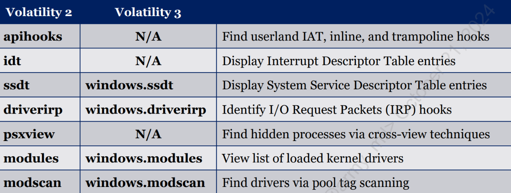

# Memory Forensics Quick Start

- [Memory Forensics Quick Start](#memory-forensics-quick-start)
  - [Volatility Basics](#volatility-basics)
    - [Basic Command Structure](#basic-command-structure)
    - [Using Volatility](#using-volatility)
    - [Volatility Profiles](#volatility-profiles)
    - [Image Identification](#image-identification)
    - [Hibernation File Conversion](#hibernation-file-conversion)
    - [Automating Analysis with Baseline](#automating-analysis-with-baseline)
  - [Memory Forensics: Enumerated](#memory-forensics-enumerated)
    - [Acquiring Memory](#acquiring-memory)
      - [Live System](#live-system)
        - [WinPmem](#winpmem)
          - [**Acquire Memory in Raw Format (Recommended for Volatility)**](#acquire-memory-in-raw-format-recommended-for-volatility)
          - [**Save Output to Specific Path**](#save-output-to-specific-path)
          - [**Acquire Memory in AFF4 Format**](#acquire-memory-in-aff4-format)
          - [**Acquire Memory in ELF Format**](#acquire-memory-in-elf-format)
          - [**Enable Verbose Output**](#enable-verbose-output)
          - [**Specify Number of Threads**](#specify-number-of-threads)
          - [**Select Acquisition Method (Advanced)**](#select-acquisition-method-advanced)
          - [**Extract Raw Memory from AFF4 Image**](#extract-raw-memory-from-aff4-image)
          - [**Display Help/Usage Information**](#display-helpusage-information)
          - [**Driver Management (Advanced)**](#driver-management-advanced)
      - [Dead System](#dead-system)
        - [Hibernation File](#hibernation-file)
        - [Page and Swap Files](#page-and-swap-files)
        - [Memory Dump](#memory-dump)
        - [Hiberfil.sys](#hiberfilsys)
        - [Tools that can analyze natively](#tools-that-can-analyze-natively)
        - [Virtual Machine Machines](#virtual-machine-machines)
          - [VMware](#vmware)
          - [Microsoft Hyper-V](#microsoft-hyper-v)
          - [Parallels](#parallels)
          - [VirtualBox](#virtualbox)
    - [6-Step Memory Analysis Process (Easy → Complex)](#6-step-memory-analysis-process-easy--complex)
      - [1) Identify Rogue Processes](#1-identify-rogue-processes)
      - [2) Analyze Process Objects](#2-analyze-process-objects)
      - [3) Review Network Artifacts](#3-review-network-artifacts)
      - [4) Look for Evidence of Code Injection](#4-look-for-evidence-of-code-injection)
      - [5) Audit Drivers and Rootkit Detection](#5-audit-drivers-and-rootkit-detection)
      - [6) Dump Suspicious Processes and Drivers](#6-dump-suspicious-processes-and-drivers)
    - [1. Identify Rogue Processes](#1-identify-rogue-processes-1)
      - [Rogue Process Identification High Level Overview](#rogue-process-identification-high-level-overview)
      - [1.1) `windows.pslist.PsList`](#11-windowspslistpslist)
      - [1.2) `windows.psscan.PsScan`](#12-windowspsscanpsscan)
      - [1.3) `windows.pstree.PsTree`](#13-windowspstreepstree)
      - [TOOL: MemoryBaseliner](#tool-memorybaseliner)
    - [2. Analyze Process Objects](#2-analyze-process-objects-1)
      - [2.1) windows.dlllist](#21-windowsdlllist)
      - [2.2) windows.cmdline](#22-windowscmdline)
      - [2.3) windows.getsids](#23-windowsgetsids)
          - [Security Identifies (SID) Explained](#security-identifies-sid-explained)
      - [2.4) windows.handles](#24-windowshandles)
          - [*Named Pipes*](#named-pipes)
          - [*Mutants/Mutexes*](#mutantsmutexes)
    - [3. Review Network Artifacts](#3-review-network-artifacts-1)
      - [3.1) windows.netstat](#31-windowsnetstat)
      - [3.2) windows.netscan](#32-windowsnetscan)
    - [4. Identifying Code Injection](#4-identifying-code-injection)
      - [General Overview](#general-overview)
      - [4.1) Find DLLs Using Windows loader (API)](#41-find-dlls-using-windows-loader-api)
        - [4.1.1) windows.ldrmodules](#411-windowsldrmodules)
      - [4.2) Identify Unusual Executable Memory Locations](#42-identify-unusual-executable-memory-locations)
        - [4.2.1) windows.malfind.Malfind](#421-windowsmalfindmalfind)
        - [4.2.2) x86 Function Prologue](#422-x86-function-prologue)
        - [4.2.3) x64 Function Prologue](#423-x64-function-prologue)
        - [4.2.4) Process Memory Explained](#424-process-memory-explained)
          - [*Process Irregularities*](#process-irregularities)
          - [*Unusual Memory Pages*](#unusual-memory-pages)
          - [*Flags of Interest*](#flags-of-interest)
      - [4.3) Uncover Kernel and Userland Process Inconsistencies](#43-uncover-kernel-and-userland-process-inconsistencies)
        - [4.3.1) windows.ldrmodules (Process Environment Block)](#431-windowsldrmodules-process-environment-block)
        - [4.3.2) MemProcFS: FindEvil Detections](#432-memprocfs-findevil-detections)
        - [4.3.3) MemProcFS Documentation and Cross-Referencing](#433-memprocfs-documentation-and-cross-referencing)
    - [5. Audit Drivers and Rootkit Detection](#5-audit-drivers-and-rootkit-detection-1)
      - [5.1) Volatility Rootkit Detections](#51-volatility-rootkit-detections)
        - [5.1.1) ssdt/windows.ssdt](#511-ssdtwindowsssdt)
        - [5.1.2) Rootkit Detection: Direct Kernel Object Manipulation (DKOM)](#512-rootkit-detection-direct-kernel-object-manipulation-dkom)
        - [5.1.3) DKOM Detection: psxview](#513-dkom-detection-psxview)
        - [5.1.4) apihooks](#514-apihooks)
        - [5.1.5) modules/modscan \& windows.modules/modscan](#515-modulesmodscan--windowsmodulesmodscan)
          - [*Data Reduction for Drivers: Memory Baseliner*](#data-reduction-for-drivers-memory-baseliner)
          - [*Driver References*](#driver-references)
    - [6. Dump Suspicious Processes and Drivers](#6-dump-suspicious-processes-and-drivers-1)
      - [6.1) Memory Resident Object Types](#61-memory-resident-object-types)
      - [6.2) Extracting Memory Objects in MemProcFS](#62-extracting-memory-objects-in-memprocfs)
      - [6.3) Extracting Memory Objects in Volatility](#63-extracting-memory-objects-in-volatility)
        - [6.3.0) Basic Syntax for File Extraction](#630-basic-syntax-for-file-extraction)
        - [6.3.1) Executable Extraction](#631-executable-extraction)
        - [6.3.2) DLL Extraction](#632-dll-extraction)
        - [6.3.3) Driver Extraction](#633-driver-extraction)
        - [6.3.4) Dumping All Process Memory](#634-dumping-all-process-memory)
          - [*6.3.4.1) Searching Process Memory*](#6341-searching-process-memory)
      - [6.4) Dumping Page Files](#64-dumping-page-files)
      - [6.5) Dumping Cached Files](#65-dumping-cached-files)
        - [MemProcFS Extraction](#memprocfs-extraction)
      - [6.6) Speciality Objects](#66-speciality-objects)
        - [6.6.1) MemProcFS File System Info](#661-memprocfs-file-system-info)
        - [6.6.2) MemProcFS Registry](#662-memprocfs-registry)
        - [6.6.3) MemProcFS Services and Tasks](#663-memprocfs-services-and-tasks)
  - [Memory Forensics: Synthesized](#memory-forensics-synthesized)
    - [Compare to baseline image](#compare-to-baseline-image)
    - [yarascan](#yarascan)
    - [psscan](#psscan)
    - [pstree](#pstree)
    - [pstree \> dot file](#pstree--dot-file)
    - [pstree.dot \> png file](#pstreedot--png-file)
    - [Note times of suspicious processes - pslist](#note-times-of-suspicious-processes---pslist)
    - [List dlls for Suspicious Executables](#list-dlls-for-suspicious-executables)
    - [Identify SID and Account Name Used to Start Process](#identify-sid-and-account-name-used-to-start-process)
    - [Identify Other Processes Tied to SID](#identify-other-processes-tied-to-sid)
    - [Identify Files and Registries Process Interacted With](#identify-files-and-registries-process-interacted-with)
    - [Enumerate Network Connections](#enumerate-network-connections)
    - [Correlate Process Data to Available Logs](#correlate-process-data-to-available-logs)
  - [MemProcFS Playbook](#memprocfs-playbook)
    - [0. Initial Setup](#0-initial-setup)
    - [1. Process Information](#1-process-information)
    - [2. Network Activity](#2-network-activity)
    - [3. System State Analysis](#3-system-state-analysis)
    - [4. Timeline Analysis](#4-timeline-analysis)
    - [5. FindEvil Detections](#5-findevil-detections)
      - [PEB (Process Environment Block) Anomalies](#peb-process-environment-block-anomalies)
      - [Process Anomalies](#process-anomalies)
      - [Memory Anomalies](#memory-anomalies)
  - [Triage Timeline Creation](#triage-timeline-creation)
    - [1. Creating Bodyfile](#1-creating-bodyfile)
    - [2. Enrich Bodyfile with mactime and convert into .csv](#2-enrich-bodyfile-with-mactime-and-convert-into-csv)
    - [3. Tune out unnecessary noise](#3-tune-out-unnecessary-noise)
    - [Super Timeline Creation - Partial Disk Analysis](#super-timeline-creation---partial-disk-analysis)
      - [1. List Timezones](#1-list-timezones)
      - [2. Timeline Windows artifacts](#2-timeline-windows-artifacts)
      - [3. Add Master File Table](#3-add-master-file-table)
      - [4. Convert Super Timeline to CSV and Filter](#4-convert-super-timeline-to-csv-and-filter)
    - [Super Timeline Creation - Full Disk Analysis](#super-timeline-creation---full-disk-analysis)
      - [1. List Timezones](#1-list-timezones-1)
      - [2. Parse Full Triage Image](#2-parse-full-triage-image)
      - [3. Add full MFT Metadata (Bodyfile for Timeline)](#3-add-full-mft-metadata-bodyfile-for-timeline)
      - [4. Convert Super Timeline to CSV and Filter](#4-convert-super-timeline-to-csv-and-filter-1)


## Volatility Basics

- [Volatility](https://code.google.com/archive/p/volatility/)
- [Command Wiki](https://code.google.com/archive/p/volatility/wikis/CommandReference23.wiki)
- [Command Info](https://github.com/volatilityfoundation/volatility/wiki/Command-Reference)

### Basic Command Structure

```bash
vol.py -f [image] --profile=[profile] [plugin]
```

```bash
vol.py -f [MEMORY.img] -r pretty windows.[PLUGIN].[PLUGIN] > FILE.txt
```

### Using Volatility

```bash
vol.py -f memory.img --profile=Win10x64_19041 pslist
```

```bash
export VOLATILITY_LOCATION=file://<file path>
```

- Set an environment variable to replace -f image
  
```bash
unset VOLATILITY_LOCATION
```

- Remove environment variables

```bash
/usr/local/src/Volatility/volatility/plugins/
```

- Volatility plug in location (SIFT)

- Get help (-h or --info)

```bash
vol.py malfind -h
```

- `--info` to see profiles and registered objects

### Volatility Profiles

- Requires the system type for a memory image be specified using the **`--profile=[profile]`**

- Set environment variable

``` bash
export VOLATILITY_PROFILE=Win10x64_16299
```

### Image Identification

- The ```kdbgscan``` plugin can identify the build string
  - Provides Profile Suggestion, Build String, and KdCopyDataBlock
- [Volatility Profiles](https://github.com/volatilityfoundation/volatility/wiki/2.6-Win-Profiles)

```bash
vol.py --info | grep Win10
```

- Provide the KdCopyDataBlock to speed up runtimes
  - `-g or --kdbg=`

```bash
vol.py -g 0xf801252197a4 --profile=Win10x64_16299 -f memory.img pslist
```

### Hibernation File Conversion

- ```imagecopy```
- Covert crash dumps and hibernation files to raw memory
- Output filename (-o)
- Provide correct image OS via (--profile=)
- Also works for VMware Snapshot and VirtualBox memory

```bash
vol.py -f /memory/hiberfil.sys imagecopy -O hiberfil.raw --profile=WinXPSP2x86
```

### Automating Analysis with Baseline

```bash
vol.py -f darkcomet.img --profile=Win7SP1x86 -B ./baseline-memory/Win7SP1x86-baseline.img processbl -U 2>error.log
```

- [baseline.py](https://github.com/csababarta/volatility_plugins/blob/master/baseline.py)

- Compare memory objects found in suspect image to those present in a baseline (known good) image
- Provide baseline image (-B)
- Only display items not found in baseline image (-U)
- Only display items present in the baseline (-K)
- Verbose mode (-v)
- Baseline consits of three plugins: processbl, servicebl, and driverbl
- Important information can be gleaned from items present and not present in baseline (e.g an identically named driver with a different file path in the baseline image would only be displayed using the -K option no options at all)

- [ANALYZING DARKCOMET IN MEMORY](http://www.tekdefense.com/news/2013/12/23/analyzing-darkcomet-in-memory.html)

---

## Memory Forensics: Enumerated

- **Acquire**  
  - Capture Raw Memory, Page File, or Hibernation File  
- **Context**  
  - Establish Context  
  - Find Key Memory Offsets  
- **Analyze**  
  - Analyze Data for Significant Elements  
  - Recover Evidence

### Acquiring Memory

#### Live System

- [WinPmem](https://github.com/Velocidex/WinPmem)
- DumpIt
- [F-Response](https://www.f-response.com/) 
- [SANS SIFT](https://www.sans.org/tools/sift-workstation/) + [SIFT Cheat Sheet](https://www.sans.org/posters/sift-cheat-sheet/)
- [Belkasoft Live RAM Capturer](https://belkasoft.com/ram-capturer)
- [MagnetForensics Ram Capture](https://www.magnetforensics.com/resources/magnet-ram-capture/)

##### WinPmem

**Prerequisites**

- Run all commands as **Administrator**
- Use the correct executable for your system (e.g., `winpmem.exe`, `winpmem_mini_x64.exe`).

###### **Acquire Memory in Raw Format (Recommended for Volatility)**

```shell
winpmem.exe --format raw -o memory_dump.raw
```

- Saves the memory image in raw format (`.raw`). This is often preferred for direct compatibility with analysis tools like Volatility.
- *Note: Some `winpmem` versions (like `winpmem_mini_x64.exe`) may output raw format by default, simply requiring `winpmem_mini_x64.exe memory_dump.raw`.*

###### **Save Output to Specific Path**

```shell
winpmem.exe -o D:\Evidence\hostname_memory.raw
```

or

```shell
winpmem.exe -o \\\\server\share\case123\hostname_memory.raw
```

- Saves the memory dump (using the default or specified format) to the given local path (`D:\Evidence\`) or network path (`\\\\server\share\case123\`).
- Ensure the destination directory exists and you have write permissions. Replace `hostname` with the actual computer name or other identifier as needed.

###### **Acquire Memory in AFF4 Format**

```shell
winpmem.exe -o memory_dump.aff4
```

- Acquires a live memory image in AFF4 format. AFF4 containers can embed useful metadata alongside the memory image but may require extraction (`--export` command below) before analysis with some tools.

###### **Acquire Memory in ELF Format**

```shell
winpmem.exe --format elf -o memory_dump.elf
```

- Produces an ELF core dump format, sometimes used for specific advanced analysis or debugging workflows.

###### **Enable Verbose Output**

```shell
winpmem.exe -o memory_dump.raw -v
```

- The `-v` flag enables verbose output, showing more detail during the acquisition process (helpful for monitoring or troubleshooting). `-d` or `-dd` may also work depending on the version.

###### **Specify Number of Threads**

```shell
winpmem.exe -o memory_dump.raw --threads 4
```

- Uses multiple CPU threads (4 in this example) for potentially faster acquisition, especially on multi-core systems. The benefit might be more noticeable if compression were used (less impact on raw output). Adjust the number based on system resources.

###### **Select Acquisition Method (Advanced)**

- **Method 0 (MmMapIoSpace):**

  ```shell
  winpmem.exe -o memory_dump.raw --method 0
  ```

- **Method 1 (\Device\PhysicalMemory):**

  ```shell
  winpmem.exe -o memory_dump.raw --method 1
  ```

- **Method 2 (PTE Remapping - Default for 64-bit):**

  ```shell
  winpmem.exe -o memory_dump.raw --method 2
  ```

- **Usage:** Only change the method if the default acquisition fails or encounters issues. The default method (usually PTE Remapping on modern systems) is generally the most reliable.

###### **Extract Raw Memory from AFF4 Image**

```shell
winpmem.exe --export "PhysicalMemory" --output memory_dump.raw memory_dump.aff4
```

- Extracts the raw memory stream (typically named "PhysicalMemory" within the container) from an existing `memory_dump.aff4` file and saves it as `memory_dump.raw`. Necessary if you have an AFF4 file but need a raw image for other tools.

###### **Display Help/Usage Information**

```shell
winpmem.exe -h
```

- Lists all available command-line options and usage instructions for your specific `winpmem` version.

###### **Driver Management (Advanced)**

- **Load driver manually:**

  ```shell
  winpmem.exe -l
  ```

- **Unload driver manually:**

  ```shell
  winpmem.exe -u
  ```

- **Usage:** Typically not needed as `winpmem` loads/unloads the driver automatically during acquisition. Manual loading might be used for specific live analysis scenarios where the driver needs to persist temporarily.

#### Dead System

##### Hibernation File

- Contains a compressed RAM Image
- When PC goes into power save or hibernation mode from sleep mode
- ```%SystemDrive%\hiberfil.sys```

##### Page and Swap Files

- ```%SystemDrive%\pagefile.sys```  
- Parts of memory that were paged out to disk
- ```%SystemDrive%\swapfile.sys``` (Win8+\2012+)
- The working set of memory for suspended Modern apps that have been swapped to disk

##### Memory Dump

- ```%WINDIR%\MEMORY.DMP```
- Crash dump

##### Hiberfil.sys

- Volatility *imagecopy*
- Comae *hibr2bin.exe*
- Arsenal *Hibernation Recon*

##### Tools that can analyze natively

- BulkExtractor
- Magnet AXIOM
- Volatility
- Passware

##### Virtual Machine Machines

###### VMware

- .vmem = raw memory
- .vmss and .vmsn = memory image
- Suspend or Snapshot VM

###### Microsoft Hyper-V

- .bin = memory image
- .vsv = save state

###### Parallels

- .mem = raw memory image

###### VirtualBox

- .sav = partial memory image

### 6-Step Memory Analysis Process (Easy → Complex)

**NOTE:** these steps do not have to be run in order, depending on the initial IOC an analyst has the ability to mix and match this Memory Analysis Method of Attack. HUNTING PROCESS TO VALIDATE WHETHER OR NOT THERE IS MALICIOUS RUNNING ANYWHERE ON THE MACHINE!

**NOTE II:** sometimes the process names that are identified get cut off and end in a “**.**” This is due to only **14 characters** being allocated for process names with tools like Volatility.

#### 1) Identify Rogue Processes

- Easy win, initial filter  
- Identifying the name, path, parent, command line, and start time.

#### 2) Analyze Process Objects

- Easy win, initial filter  
- Identifying loaded DLLs, handels, and SIDs.

#### 3) Review Network Artifacts

- Easy win, initial filter  
- Identifying suspicious ports, connections, and processes.

#### 4) Look for Evidence of Code Injection

- Complex, bordering theoretical…  
- Progression from the initial filter > secondary layer of analysis looking inside of each process. **THINK**: double-layered filter.
- Identifying injected memory sections and process hollowing. Unusual DLLs > Unusual Executable Memory > Kernel and Userland Process Inconsistencies.

#### 5) Audit Drivers and Rootkit Detection

- Complex, bordering theoretical…  
- Auditing and verifying installed drivers and identifying potential evidence of rootkit hooks, **IF** there is reason to suspect this exploitation.

#### 6) Dump Suspicious Processes and Drivers

- Identification of strings, antivirus scans, and extracting artifacts for potential reverse engineering.

---

### 1. Identify Rogue Processes

- What Is the process that I’m looking at? Does this make sense in relation to what else is around it? Here, we are looking for the low-hanging fruit before we dive deeper into memory analysis.

- **Executive Process (EPROCESS)**  
  - Holds a majority of metadata from a process and provides the following:  
    - Name of process executable (image file name)  
    - Process Identifier (PID)  
    - Parent Process Identifier (PPID)  
    - Location in memory (Offset)  
    - Creation time  
    - Termination (exit) time  
    - Threads assigned to the process  
    - Handles other operating system artifacts  
    - Link to the Virtual Address Descriptor tree  
    - Link to the Process Environment Block

#### Rogue Process Identification High Level Overview

**Image Name Analysis**

- Is the process legitimate?  
- Is the image name spelled correctly?  
- Does the image name match the system context?  
  - Ensure that the purpose of the machine is captured (e.g., DC, Server, Workstation, etc.)

**Full Path Analysis**

- Is the full path appropriate for the system executable?  
- Is the process running from a user or temporary directory?

**Parent Process Analysis**

- Is the parent process expected?  
- Are there any orphan processes?

**Command Line Analysis**

- Does the executable match the image name?  
- Do the command line arguments make sense?

**Start Time Analysis**

- Was the process started at boot time with other system processes?  
- Were processes started near the time of a known attack?

**Security ID Analysis**

- Do the security identifiers make sense?  
- Why would a system process use a user account SID?

#### 1.1) `windows.pslist.PsList`

- `windows.pslist`: Print all running processes within the EPROCESS doubly linked list, run **immediately** when you extract the Windows memory image to validate that the memory is intact!

```bash
vol.py -f [MEMORY.img] -r pretty windows.pslist.pslist > FILE.txt
```


#### 1.2) `windows.psscan.PsScan`

- `windows.psscan`: Scan physical memory for EPROCESS pool allocations. The difference between PsList is that this module scans and identifies potentially hidden or expired signatures. **ESSENTIALLY**: can be used to resurrect processes.

```bash
vol.py -f [MEMORY.img] -r pretty windows.pscan.PsScan
```


#### 1.3) `windows.pstree.PsTree`

- **`windows.pstree`**: Print process list as a tree showing parent relationships (using EPROCESS doubly linked list) and displays processes in a process tree (THINK: `tree` option within Sysinternals)

```bash
vol.py -f [MEMORY.img] -r pretty windows.pstree.PsTree
```


**Orphaned Processes**

- **`*`**: indicates the presence of an orphaned process and is an indicator for further analysis!

#### TOOL: MemoryBaseliner

- [MemoryBaseliner](https://github.com/csababarta/memory-baseliner): standalone tool built using Volatility 3 to compare memory objects found in suspect image to a golden (known good) image. **ESSENTIALLY**: allows the analyst to greatly reduce the time spent determining differences between memory images taken at different times between two time periods (e.g., 100+ to 15+ processes)

- [Blog Explanation](https://www.sans.org/blog/power-up-memory-forensics-with-memory-baseliner/)

### 2. Analyze Process Objects

- Once you’ve identified a rogue, suspicious, or out of the ordinary process, it’s time to conduct further analysis on that process using the **most useful** Volatility modules used to further confirm or deny malicious processes: `windows.dlllist`, `windows.cmdline`, `windows.getsids`, `windows.handles`

#### 2.1) windows.dlllist

- Display and dump DLLs from each process.

```bash  
vol.py -f [SAMPLE.img] windows.pslist.PsList  
```

```bash  
vol.py -f [SAMPLE.img] -r pretty windows.dlllist.DllList --pid > dlllist.txt  
```

**Important Parameters:**

- `--pid`: show information for specific process IDs  
- `--dump`: extract DLLs from the memory image

#### 2.2) windows.cmdline

- Used to display the process command line from the Process Environment Block (PEB) (only allow 14 bytes per image name, to get the full name, you must look within the PEB).

```bash  
vol.py -f [SAMPLE.img] windows.pslist.PsList  
```

```bash  
vol.py -f [SAMPLE.img] windows.cmdline.CmdLine --pid > cmdline.txt  
```  

**Important Parameters:**

- `--pid:` show information for specific process IDs  
- `--r csv`: used to export output into csv file format and parse with Timeline Explorer

#### 2.3) windows.getsids

- Overall, used to provide the Security Identifiers (SIDs) and group affiliation for that process. The plugin attempts to query in-memory registry hives to match SIDs to their account names. If this correlation fails, the analyst can perform their lookups using **`SAM`** or **`SOFTWARE`** registry hives.

```bash  
vol.py -f [SAMPLE.img] windows.pslist.PsList  
```

```bash  
vol.py -f [SAMPLE.img] windows.getsids.GetSIDs --pid # (from PsList) > getsids.txt  
```

**NOTE:** well-known SIDs can be found [here](https://learn.microsoft.com/en-us/windows-server/identity/ad-ds/manage/understand-security-identifiers#well-known-sids), a system process (e.g., lsass.exe or svchost.exe) with a user SID (e.g., S-1-5-21-*) is an **analyst clue**. Those processes should be ran from `BUILT-IN` accounts not `USER` accounts

###### Security Identifies (SID) Explained


- **S:** Indicates that the string that follows is a SID.

- **1:** Revision Level for the type of SID (we are still in the first revision).

- **5:** Identifier Authority is the most typical issuing authority - in rare cases, you might see others like World Authority (1) and Creator Authority (3).

- **21-1004336348-1176238915-682003330**: A unique identifier for a specific domain that the account belongs to. Each domain in an enterprise will be assigned a unique identifier. Each domain account will contain this domain identifier as part of its SID.

- **1004**: The relative identifier (RID) for the account within that domain. Every account will have a unique RID within the domain.

#### 2.4) windows.handles

- Outputs a list of all handles associated with each process, SO it is to be used after you’ve identified a process that is potentially malicious to validate your suspicions!  
  - The most useful handles are: `File` and `Registry` handles.

**NOTE:** 9 times out of 10 you will not find anything, the goal here isn’t to spend much time looking through the list, it serves as just a quick reference point to visit during your investigation.

**Important Parameters:**

- `--pid:` show information for specific process IDs  
- `--r csv`: used to export output into CSV file format and parse with Timeline Explorer

```bash  
vol.py -f [SAMPLE.img] windows.pslist.PsList  
```

```bash  
vol.py -f [SAMPLE.img] -r csv windows.handles.Handles --pid > handles.txt  
```

```bash  
egrep -i ‘File|Key’ handles.txt  
```


###### [*Named Pipes*](https://learn.microsoft.com/en-us/windows/win32/ipc/named-pipes)

- **ESSENTIALLY** used to provide communication between processes on the same computer or between processes on different computers effectively making attacker actions much more stealthy.

- Identifying Named Pipes with Volatility

```bash  
grep -i pipe handles.txt  
```

- Common Cobalt Strike Named Pipes  
  - `MSSE-####-server`  
  - `msagent_####`  
  - `status_####`  
  - `postex_ssh_#####`  
  - `.pipe#######` (7-10 random characters)  
  - `postex_####`

###### *Mutants/Mutexes*

- Are process objects that control or limit access to a resource (e.g., a mutant used by an object to enforce that only one process at a time can access it or **race conditions**).

- In malware, mutants are used to “mark” a compromised system to prevent reinfection and to increase efficiency (e.g., WannaCry worm)

**NOTE I:** Use of threat intelligence reports should also be used to inform the analyst of potential malware families and frameworks a mutant/mutex may belong to.

**NOTE II:** commonly used **AFTER** the malware has been found and identified and can be used by analyst or automated vulnerability scanners to identify the scope or the malware based on the unique mutant (mtx) present

```bash  
vol.py -f [SAMPLE.img] windows.pslist.PsList  
```

```bash  
vol.py -f [SAMPLE.img] windows.handles.Handles  --pid | egrep "PID Mutant"  
```

### 3. Review Network Artifacts

- Used to further analyze broader network connections for suspicious activities to identify potential the scope of the compromise or identify C2 activity which further increases the certainty of a compromised system to warrant an even deeper memory investigation.

- Analyst Key Points:
  - Suspicious Ports  
  - Suspicious Connections  
  - Suspicious Processes  
  - Known bad IP addresses  
  - Interesting creation times of network objects

**NOTE:** network artifacts are ESSENTIAL, at some point even the most advanced malware needs to communicate back to its C2. Those external network connections are captured and stored within memory and can be found!

#### 3.1) windows.netstat

```bash  
vol.py -f [SAMPLE.img] -r pretty windows.netstat.NetStat > netstat.txt  
```

- Reports network information using standard network object **linked lists**

#### 3.2) windows.netscan

- **Scanning-based** plugin for both connections and sockets within memory

```bash  
vol.py -f [SAMPLE.img] -r pretty windows.netscan.NetScan > netscan.txt  
```  


- **ESTABLISHED**: connections of interest that were still active at the time of the memory capture.  
- **CLOSED**: historical connections that were at one time established, but are now carved out from the memory image.  
- **SYN_SENT**: connection was attempted, but is not yet completed. A good way to detect malware that is not “proxy aware”

**Important Parameters:**

- `--include-corrupt`: used to perform a “deeper scan” with an increased % of false-positives

Outputs the Following Columns:

- Memory location (Offset)  
- Protocol (Proto)  
- Local IP Address and Port (LocalAddr and LocalPort)  
- Foreign IP Address and Port (ForeignAddr and Foreign Port)  
- Process Identifier (PID)  
- Process Name (Owner)  
- Creation Time (Created)

### 4. Identifying Code Injection

- Further detailed analysis after confirming malicious/suspicious network activity.
- Here we are looking for increased proof that there is code located somewhere within memory in attempts to quarantine the system, determine DHA TTPs, or reverse engineer the specific code used in efforts to identify it on other potentially afflicted systems.

#### General Overview

**4.1) Find DLLs Using Windows loader (API) – Concrete**

1. Identification of things that were loaded that shouldn’t have been…  
2. Audit loaded DLLs  
3. Includes DLL persistence hijacks and side-loading

**4.2) Identify Unusual Executable Memory Locations – Concrete**

1. Identification of the tell-tale signs/artifacts that code injection leaves behind (it is **very easy** to code inject, but **very difficult** to make it look legit!)  
2. Discover code not loaded via legitimate API calls  
3. Search memory for executable pages containing code

**4.3) Uncover Kernel and Userland Process Inconsistencies – Abstract/Theoretical**

1. Attackers are now increasing their effort and reducing their artifact footprint to make injected processes look legit (**patching in memory**)  
2. Permission changes, file mapping issues, pointer modifications  
3. Compare hard to change (kernel) with easy to change (userland)

**TOOLS: Volatility Modules**

- `ldrmodules`: Detects unlinked DLLs and non-memory-mapped files  
- `malfind`: Finds hidden and injected code and dumps affected memory sections  
- [hollowfind](https://cysinfo.com/detecting-deceptive-hollowing-techniques/): Identifies a wide range of process hollowing artifacts  
- [ptemalfind](https://insinuator.net/2021/12/release-of-pte-analysis-plugins-for-volatility-3/): Upgraded version of malfind using page tables to detect injection

**MemProCFS – MOST USEFUL**

- `findevil`: Plugin used to identify a suite of process inconsistencies

**Live Analysis**

- [Moneta](https://github.com/forrest-orr/moneta): Usermode memory scanner for process injection anomalies  
- [Hollows Hunter](https://github.com/hasherezade/hollows_hunter): Usermode scanner using pe-sieve implant detection
- [Gargoyle](https://github.com/JLospinoso/gargoyle)

#### 4.1) Find DLLs Using Windows loader (API)

##### 4.1.1) windows.ldrmodules

- **ESSENTIALLY**, an enhanced `windows.dlllist` module.

- Used to detect code injected using Windows API libraries is often present in PEB and VAD lists  
  - If process image states “**True**”  within the `InLoad`, `InMem`, and `InInit` lists which indicates that the process was loaded legitimately via the Windows API (LoadLibrary)

- `windows.ldrmodules` plugin blends information from both

```bash  
vol.py -f [SAMPLE.img] windows.pslist.PsList  
```

```bash  
vol.py -f [SAMPLE.img] windows.ldrmodules.LdrModules --pid# > ldrmodules.txt  
```

#### 4.2) Identify Unusual Executable Memory Locations

Core Steps:

1. Check memory section with unusual permissions “Page_Execute_ReadWrite” (**bad permissions**)

2. Check if memory section is mapped to a file on disk (a memory section should not be marked executable if there is no file there) (**not mapped to disk**)

3. Check if there are actual code present in the memory location identified by:  
   1. Portable Executable (PE)  
   2. MZ header  
   3. Hex string of “4d 5a 90 00”

##### 4.2.1) windows.malfind.Malfind

- Scans process memory locations looking for indications of code. Identified sections can be extracted for further analysis.

**Important Parameters:**

- `--pid:` show information for specific process IDs  
- `--dump`: used to save extracted files  
- `--dump-dir=[DIRECTORY]`: used for dumping memory sections in this version.

```bash  
vol.py -f [SAMPLE.img] -o ./[OUTPUT_DIR] windows.malfind.Malfind --dump  
```  

```bash  
vol.py -f [SAMPLE.img] windows.malfind | grep -B1 MZ  
```

##### 4.2.2) x86 Function Prologue


- Used when you are unable to determine if the process has a Portable Executable (PE)  
  - Unable to locate “MZ”  
  - Unable to identify hex string of “4d 5a 90 00”

- [Assembly Basics](https://docs.google.com/document/d/1QWi6yYUoZGuPSU-pT_jbMmgSevR8Jc7trmiqT8nfK0c/edit?tab=t.0#heading=h.4vvr2xolxa0l)

***KEY INDICATOR***

- **push ebp**; **mov ebp, esp**

- **push ebp:** Pushes the base pointer (EBP) onto the stack. This is used to store the address of the previous stack frame.

- **mov ebp, esp:** Moves the stack pointer (ESP) into the base pointer. This sets up the new stack frame for the current function.

- **sub esp, 0x1a8:** Subtracts 0x1A8 (decimal 424) from the stack pointer. This allocates space on the stack for local variables and other temporary data used by the function  
  - **Key stage to make space within the process** `VirtualAllocEx()`

- **push ebx, push esi, push edi:** Pushes the values of registers EBX, ESI, and EDI onto the stack. This saves their original values before the function modifies them.

- **jmp 0x000010:** Jumps to the address 0x000010. This is likely the beginning of the actual function code.

- **jmp 0x000015:** This is a jump instruction, but its purpose is unclear without more context. It might be a conditional jump or a way to skip certain instructions.

- **call 0x00000e:** Calls a function at the address 0x00000e. This function is likely a subroutine that performs specific tasks within the larger function.

##### 4.2.3) x64 Function Prologue


***KEY INDICATOR***

- [@UVWATAUAVAWH](https://www.hexacorn.com/blog/2013/05/16/uvwatauavawh-meet-the-pushy-string/)

- **push rbp:** Pushes the base pointer (RBP) onto the stack. This is used to store the address of the previous stack frame.

- **push rbx, push rsi, push rdi, push r12, push r13, push r14, push r15:** Pushes the values of registers RBX, RSI, RDI, R12, R13, R14, and R15 onto the stack. This saves their original values before the function modifies them.  
- **lea rbp, [rsp - 0x28]:** Loads the effective address of the stack pointer minus 0x28 into the base pointer. This sets up the new base pointer for the function's stack frame.

- **sub rsp, 0x128:** Subtracts 0x128 (decimal 296) from the stack pointer. This allocates space on the stack for local variables and other temporary data used by the function.

##### 4.2.4) Process Memory Explained

###### *Process Irregularities*

- **PROC_NOLINK:** Process is not part of the normal EPROCESS doubly-linked list, indicating potential removal or manipulation.  
- **PROC_PARENT:** Process has an unexpected parent process, suggesting possible injection or tampering.  
- **PROC_USER:** Process token indicates an unexpected user account context, potentially a sign of privilege escalation or unauthorized access.

###### *Unusual Memory Pages*

- **PE_INJECT:** DLL or EXE files found in memory that are not mapped to the "image" section, suggesting potential code injection or malicious activity.  
- **NOIMAGE_RWX/RX:** Executable memory pages that are not mapped to the "image" section, indicating possible code injection or memory corruption.  
- **PRIVATE_RWX/RX:** Executable memory pages found in private process memory (data, stacks, heaps), which is unusual and may indicate malicious activity.

###### *Flags of Interest*

Various flags that describe the type of memory page the results came from, used to give you an idea of whether a given page was currently in memory or part of the page file.

- **A = Active Page:** This page is currently in use by a process.  
- **T = Transient Page:** This page is not currently in use but is still stored in memory. It may be reused later.  
- **Z = Zero Page:** This page is filled with zeros and is used to quickly allocate new memory pages.  
- **C = Compressed Page:** This page has been compressed to save memory. It may or may not be backed by memory or paged out to the page file.  
- **Pf = Pagefile:** This is a file on disk that is used to store pages that have been removed from physical memory.

#### 4.3) Uncover Kernel and Userland Process Inconsistencies

- Deeper investigation (**used to identify the most advanced techniques**) into process internals by identifying and tracking memory objects and identifying inconsistencies of those specific memory structures:
  - **Process Environment Blocks (PEB)**  
  - **Virtual Address Descriptors (VAD)**  
  - **Page Table Entry (PTE)**

##### 4.3.1) windows.ldrmodules (Process Environment Block)

- Plugin used to identify process inconsistencies by displaying **3 doubly linked lists** in the PEB for each process which can be cross-referenced.
  - “True” = DLL was present  
  - “False” = DLL was not present, **may warrant further investigation**


- Normal entry present within the `winint.exe` process and mapped from `WindowsSystem32ntmarta.dll`.

```bash  
vol.py -f [SAMPLE.img] windows.pslist.PsList  
```  

```bash  
vol.py -f [SAMPLE.img] windows.ldrmodules.LdrModules --pid > ldrmodules.txt  
```

**NOTE:** `InInit` **ONLY** tracks DLLs, SO the output of `windows.ldrmodules` may read “True”, “False”, “True”.

***KEY INDICATORS***  


- No/Blank Mapped Path Information  
- InLoad, InInit, InMem = “False”  
  - **NOTE:** The InInit column will **ALWAYS** be “False” for process executables, however, no MappedPath is a strong indicator of code injection or Process Hollowing!!

##### 4.3.2) MemProcFS: FindEvil Detections

- Most useful identifiers associated with the `findevil` module with MemProcFs. Used to detect memory-manipulated memory structures such as **Process Irregularities (Anomalies)**, **unusual memory Pages (Memory Anomalies)**, **Kernel/PEB Inconsistencies (PED Anomalies)**

**PEB (Process Environment Block) Anomalies**

- `PEB_MASQ`: Image binary path mismatch between the PEB and VAD. This suggests potential PEB modification.  
- `PE_NOLINK`: DLL present in the VAD but not linked in PEB lists. This can lead to high false positives (similar to seeing the “False”, “False”, “False” of the `windows.ldrmodules` plugin in Volatility!)  
- `PE_PATCHED`: DLL modified after load time. This can also lead to high false positives, especially in 32-bit and JIT code.

**Process Anomalies**

- `PROC_NOLINK`: Process is not part of the normal EPROCESS doubly-linked list. This could indicate process removal or manipulation.  
- `PROC_PARENT`: The process involves an unexpected parent process. This might suggest process injection or tampering.  
- `PROC_USER`: Process token indicates an unexpected user account context. This could be a sign of privilege escalation or unauthorized access.

**Memory Anomalies**

- `PE_INJECT`: DLL or EXE files found in non-image memory pages. This suggests potential code injection or malicious activity.  
- `NOIMAGE_RWX/RX`: Executable memory pages that are not mapped to a DLL/EXE location. This could indicate code injection or memory corruption.  
- `PRIVATE_RWX/RX`: Executable memory pages found in private process memory (data, stacks, heaps). This is unusual and may indicate malicious activity.

[MemProcFS FindEvil + YARA](https://github.com/elastic/protections-artifacts)

- Embedding of YARA Rules and Signatures that will be used to hunt within the memory images. Provides a list of hits and alerts based on what is generated from YARA-signature detection to identify even the most sophisticated malware!

```WindowCommandPrompt  
MemProcFS.exe -forensic 1 [MEMORY.img] -license-accept-elastic-license-2.0  
```

- Used to accept the default built-in signatures

```WindowCommandPrompt  
MemProcFS.exe -forensic 1 [MEMORY.img]  -forensics-yara-rules [FILE]  
```

- Used to accept your own imported and custom signatures…

##### 4.3.3) MemProcFS Documentation and Cross-Referencing

- Document and record the suspicious process details, network activity, virtual addresses, VAD paths. **ESSENTIALLY** everything you can about the suspicious process so that it can be cross-referenced in the file path below:  
  - `M:name[PROCESS.exe]filesmodules`  
  - `M:vmemd`

### 5. Audit Drivers and Rootkit Detection

#### 5.1) Volatility Rootkit Detections



##### 5.1.1) ssdt/windows.ssdt

- Display the hooked function within the System Service Descriptor Tables (SSDT) entires.
- Output the following information:
  - Tables Entry  
  - Function Offset  
  - Function  
  - Function Owner

```bash  
vol2.py -f [MEMORY_IMAGE.vmem] --profile=WinXPSP2x86 ssdt | egrep -v ‘(ntoskrnl.exe | win32k.sys)’  
```

- Identify anything that are **NOT** entries pointing to the `ntoskrnl.exe` and `win32k.sys` allowing you to only output the potential malicious!

##### 5.1.2) Rootkit Detection: Direct Kernel Object Manipulation (DKOM)

- A technique that allows malware to change kernel objects directly within memory.
- Unlinking an EPROCESS from a doubly linked list.  
  - [DirtyMoe (Modularized Malware)](https://decoded.avast.io/martinchlumecky/dirtymoe-1/)  
  - [APT Container Attacks](https://www.aquasec.com/blog/advanced-persistent-threat-techniques-container-attacks/)

##### 5.1.3) DKOM Detection: psxview

**Important Parameters**

- -R: recommended option used to identify common false positives in the output using a built-in collection of known good rules.

- Process Cross View `psxview` plugin is a compound plugin that helps the analyst visually identify anomalies between plugins, which include:  
  - **pslist**: Read the EPROCESS doubly linked list.  
  - **psscan**: Scan for EPROCESS structures throughout memory.  
  - **thrdproc**: Review all threads found in the memory image and collect processes using the thread parent process identifier.  
  - **pspcid**: The PspCid table is yet another kernel object that keeps track of process and thread PIDs.  
  - **csrss**: The csrss.exe process keeps a handle on each process started after it (so there will be no entries for smss.exe, the System process, and csrss.exe).  
  - **session**: List of processes belonging to each logon session.  
  - **deskthrd**: Identify processes via threads attached to each Windows desktop.

- **THINK:** cross-referencing between “**high**” and “**low**” levels of analysis for example:
  - Identify 20 processes at the “**high**” level and 21 at the “**low**” level. The additional process may be a rootkit that needs to be further investigated!

**Missing Process:**

- 1 process missing when attempting to identify via `pslist`

```bash  
vol2.py -f [MEMORY.img] --profile=Win7SP1x86 pslist  
```  


**Identified Process:**  

```bash  
vol2.py -f [MEMORY.img] --profile=Win7SP1x86 psxview -R  
```  


**NOTE:** here we’ve identified the missing svhost.exe process because we were able to identify its presence using lower-level indicators from `psxview`:  `psscan`, `thrdproc`, `pspcid`, `csrss`

**NOTE II:** the signature of a DKOM attack is the output of `psxview` being “**False**” for `pslist` and “**True**” for `psscan`, `thrdproc`, `pspcid`, `csrss`. All but one plugin activating from `scvhost.exe` is **highly** suspicious!

**NOTE III:** `csrss.exe` outputs the results from a exited process. `psscan` extracted the information deep from memory so it is a **False Positive**. The `-R` option created triggers `csrss` to output: “**Okay**”

##### 5.1.4) apihooks

- Used to detect and Import Address Table (IAT) function hooks used by rootkits to modify and control information returned. Generates a large number of false positives, it is best to use -p PID# to narrow down your search…  
  - [Rootkit Investigation Procedures](https://www.sans.org/media/score/checklists/rootkits-investigation-procedures.pdf)

- False Positive DLLs  
  - setuppapi.dll  
  - ws2_32.dll  
  - mswsock.dll  
  - iphlpapi.dll  
  - sfc_os.dll  
  - ntdll.dll  
  - adsldpc.dll  
  - kernel32.dll  
  - advapi32.dll  
  - user32.dll  
  - secur32.dll  
  - gdi32.dll

**Important Parameters**

- `-p` PID#: Operate only on specified process IDs.  
- `-R`: Skip kernel mode checks.  
- `-O`: Scan only critical processes and DLLs.

```bash  
vol2.py -f [MEMORY.img] --profile=Win7SP1x86 apihooks  
```


**Analytic Process:**

- Scanning for `Hooking module: <unknown>`  
- Scanning for `Function`

**NOTE:** the **`apihook`** module is only able to scan 2 jumps at the most to verify memory locations, more sophisticated malware can integrate 3 jumps to further evade this detection.

##### 5.1.5) modules/modscan & windows.modules/modscan

- Used to identify the residue and artifacts left behind from exploited vulnerable drivers:  
  - `modules`: provides a list of kernel drivers loaded  
  - `modscan`: memory images with loaded, unloaded, and unlinked kernel modules  
  - `devicetree`: same as `modscan` but outputs into a tree format

**Bring Your Own Vulnerable Driver (BYOVD)**

- The most effective way to kickstart a Rootkit compromise.

```bash  
vol2.py -f [MEMORY].img --profile=WinXPSP3x86 modscan  
```

###### *Data Reduction for Drivers: Memory Baseliner*

```bash  
python baseline.py -i [BAD_MEMORY.img] -b [GOOD_MEMORY.img] --showknown --imphash -o out.txt  
```  


- `??`: is seen now and again and is a valid way to reference a path, used to disable max path length limitations.

###### *Driver References*

- [Windows Driver’s Baseline Reference](https://github.com/AndrewRathbun/VanillaWindowsReference)  
- [Living off the Land (LOL) Drivers](https://www.loldrivers.io/)  
- [Recommended Driver Block Rules](https://learn.microsoft.com/en-us/windows/security/application-security/application-control/app-control-for-business/design/microsoft-recommended-driver-block-rules)

### 6. Dump Suspicious Processes and Drivers

- Dumping can be used at any time during the 6-step memory forensic investigation process. If the analyst would like to extract specific files from a live or offline memory image. The techniques explained below can be used for that purpose.

#### 6.1) Memory Resident Object Types

- Process Memory Sections  
- Image Mapped (DLL/EXE/SYS)  
- Cached File Objects  
- Specialty Objects (MFT, Hives)

#### 6.2) Extracting Memory Objects in MemProcFS

**Process Memory:**

- Per-VAD/PTE: `M:<process>vmemd`  
- Private Memory: `M:<process>heaps`  
- Unified Process Memory: `M:<process>minidumpminidump.dmp`

**Image Mapped:**

- EXEs and DLLs:  
  - `M:<process>modules<module name>pefile.dll`  
  - `M:<process>files(modules | vads)`

- Drivers: `M:nameSystem-4modules<driver name>pefile.dll`

**Cached Files:** `M:forensicfiles`

**Specialty:**

- MFT: `M:forensicntfs`  
- Registry: `M:registry`  
- Services and Tasks: `M:sysservices, M:systasks`

#### 6.3) Extracting Memory Objects in Volatility

| Volatility 2 | Volatility 3 | Description |  
|---|---|---|  
| dlldump | windows.dlllist | Dump DLLs from a process |  
| moddump | windows.modules | Extract kernel drivers |  
| procdump | windows.pslist | Dump a process in executable format |  
| memdump | windows.memmap | Dump all addressable process memory |  
| filescan | windows.filescan | Scan memory for FILE_OBJECTS |  
| dumpfiles | windows.dumpfiles | Extract cached files via FILE_OBJECTS |  
| mftparser | windows.mftscan | Extract and parse NTFS Master File Table |  
| shimcachemem | N/A | Extract Application Compatibility Cache |  
| cmdscan | N/A | Scan for COMMAND_HISTORY buffers |  
| svcscan | windows.svcscan | Carve service info from in-memory registry |

##### 6.3.0) Basic Syntax for File Extraction

```bash  
vol.py -f [MEMORY.img] -o output-folder windows.*[PLUGIN]* --dump  
```  

```bash  
vol2.py -f [MEMORY.img] profile=<profile> *PLUGIN* --dump-dir=output-folder  
```

##### 6.3.1) Executable Extraction

```bash  
vol.py -f [MEMORY.img] -o output-folder windows.pslist --dump  
```  

```bash  
vol2.py -f [MEMORY.img] profile=<profile> procdump --dump-dir=output-folder  
```  

**NOTE:** `windows.psscan --dump` (Vol3) or `procdump` (Vol2) should be used when attempting to dump terminated or unlinked processes no longer present in the EPROCESS list.

##### 6.3.2) DLL Extraction

```bash  
vol.py -f [MEMORY.img] -o output-folder windows.dlllist --pid # --dump  
```  

```bash  
vol2.py -f [MEMORY.img] profile=<profile> dlldump --dump-dir=output-folder -p #  
```

##### 6.3.3) Driver Extraction

```bash  
vol.py -f [MEMORY.img] -o output-folder windows.modules --pid # --dump  
```  

```bash  
vol2.py -f [MEMORY.img] profile=<profile> moddump--dump-dir=output-folder -p #  
```

**NOTE:** `windows.modscan --dump` (Vol3) or `moddump (Vol2) should only be used if you are looking for deeper recovery to include unlinked or unloaded drivers not in the current drivers list.

##### 6.3.4) Dumping All Process Memory

```bash  
vol.py -f [MEMORY.img] -o output-folder windows.memmap --pid # --dump  
```

- `windows.memmap`: comprehensive way to collect on all process memory locations. Once extracted, you can then search across that file as needed.

###### *6.3.4.1) Searching Process Memory*

String transformation > Grep search of transformed strings document.

**Step 1: Creating Strings File**

```bash  
strings -a -t d file > strings.txt  
```

```bash  
strings -a -t d -e 1 file >> strings.txt  
```

```bash  
sort strings.txt > sorted_strings.txt  
```

- `-t d`: Print decimal offset  
- `-e 1`: Extract Unicode  
- `<num>`: Only strings >= num

**Step 2: Search Created Strings File**  

```bash  
grep -i [KEY_TERM] sorted_strings.txt  
```

- -i: Ignore case  
- -B <num>: Show num lines before  
- -f <filename>: List of strings

```bash  
bstrings -f file -m 8  
```

- Find all strings of length 8 or greater

```bash  
bstrings -f file --ls [*KEY_TERM*]  
```

- Find all instances of [*KEY_TERM*] string)

```bash  
bstrings -f file --lr ipv4  
```

- Use a regex to find IPv4 addresses

**bstrings**  
`--lr`: Search for regex  
`--ls`: Search for string  
`--fs <filename>`: List of strings  
`bstrings -p`: List patterns to search

#### 6.4) Dumping Page Files

- Page Files function as virtual memory when RAM becomes full, storing:  
  - Less frequently used data chunks from RAM  
  - Page-size blocks of memory up to 4KB in size  
  - Up to 16 possible paging files, though typically only one is used  
  - Located at C:pagefile.sys as a hidden system file

**MemprocFS**

```bash  
MemProcFS.exe -device [MEMORY.img] -pagefile0 pagefile.sys  
```

**Volatility 3**  

```bash  
vol.py -f [MEMORY.img] --single-swap-locations=pagefile.sys  
```

#### 6.5) Dumping Cached Files

##### MemProcFS Extraction

Extracting your cached file:

- `M:/name/PROCESS-PID#/files`  
- Copy and paste File_Object into your working folder for offline analysis…

**MemprocFS Cached File Locations:**

- `fileshandles`: Extract files using process handles to File_Objects  
- `filesmodules`: Extract .EXE, .DLL, and .SYS files using PEB  
- `filesvads`: Extract files from VAD tree pointers to `File_Objects`

- **handles**: Provides access to cached files discovered using process handles pointing to File_Objects  
- **modules**: Recovers .exe, .dll, and .sys files via the Process Environment Block (PEB) and PE headers  
- **vads**: Attempts file reconstruction using VAD tree information

**NOTE:** MemProcFS also reconstructs the file system from cached file objects via `M:forensicfilesROOT` providing access to the things like `WinodwsPrefetch` files or anything else that you may want to analyze on a live system to identify DHA manipulation.

#### 6.6) Speciality Objects

##### 6.6.1) MemProcFS File System Info

- `forensicntfs`: used to navigate the complete contents in File Explorer  
- `forensiccsv`: keeps timeline in CSV format of the same files within `forensictimeline`.  
- `forensictimeline`: keeps a variety of timelines in text format

##### 6.6.2) MemProcFS Registry

- `M:\registry`: provides access to memory resident registry data allowing analysts to interact with registry keys and values via Windows File Explorer

- `M:\registryhive_files`: location of exported registry hives, **BUT** the folder will often be in a partial or corrupted state…

##### 6.6.3) MemProcFS Services and Tasks

- `M:\forensic\csv\services.csv`: used to extract the view services from the live memory image.

- `M:forensic\csv\tasks.csv`: used to extract and view scheduled tasks from the live memory image

**NOTE:** Pay close attention to the “User” column, most services and tasks should be running using built-in system accounts **ONLY**! If there’s a deviation, that may warrant further investigation.

## Memory Forensics: Synthesized

### Compare to baseline image

```bash
vol.py -f base-rd01-memory.img --profile=Win10x64_16299 -B ./baseline/Win10x64.img processbl -U 2>>error.log
```

- Shows processes not in baseline

### yarascan

```bash
vol.py -f base-rd01-memory.img --profile=Win10x64_162699 yarascan -y signature-base.yar > yarascan.txt
```

- Note interesting processes their start/exit times, PPID, and PID (included possible LOLBins)

### psscan

```bash
vol.py -f base-rd01-memory.img --profile=Win10x64_16299 psscan > psscan.txt
```

### pstree

```bash
vol.py -f base-rd01-memory.img --profile=Win10x64_16299 pstree > pstree.txt
```

### pstree > dot file

```bash
vol.py -f base-rd01-memory.img --profile=Win10x64_16299 pstree --output=dot --output-file=pstree.dot
```

### pstree.dot > png file

```bash
dot -Tpng pstree.dot -o pstree.png
```

- Note any suspicious parent to child process relationships
- Use [EchoTrail](https://www.echotrail.io/) to better understand processes

### Note times of suspicious processes - pslist

```bash
vol.py -f base-rd01-memory.img --profile=Win10x64_16299 pslist | grep -i rundll32 > pslist_rundll32.txt
```

- Document days and time ranges of suspicious files

### List dlls for Suspicious Executables

```bash
vol.py -f base-rd01-memory.img --profile=Win10x64_16299 dlllist -p 5948 > pid5948_dlllist.txt
```

### Identify SID and Account Name Used to Start Process

```bash
vol.py -f base-rd01-memory.img --profile=Win10x64_16299 getsids -p 8260 > pid8260_getsids.txt
```

### Identify Other Processes Tied to SID

```bash
vol.py -f base-rd01-memory.img --profile=Win10x64_16299 getsids | grep -i spsql > spsql_getsids.txt
```

### Identify Files and Registries Process Interacted With

```bash
vol.py -f base-rd01-memory.img --profile=Win10x64_16299 handles -s -t File,Key -p 5948 > pid5948_handles_File_Key.txt
```

### Enumerate Network Connections

```bash
vol.py -f base-rd01-memory.img --profile=Win10x64_16299 netscan | egrep -i 'CLOSE|ESTABLISHED|Offset' > netscan.txt
```

### Correlate Process Data to Available Logs

```bash
grep -i WMIPrvSE psscan.txt > WMIPrvSE_psscan.txt
```

- Return to your event logs and identify which WMIPrvSE process matches the time recorded for the malicious WMI event consumer in the logs

## MemProcFS Playbook

[TOOL: MemProcFS](https://github.com/ufrisk/MemProcFS)

**NOTE:** analysis methodology for this tool is the same process/modules used with launching Volatility, now you just have a File Explorer!


### 0. Initial Setup

```bash
MemProcFs.exe -device [MEMORY_FILE.img] -forensic 1
```

- Run MemProcFS `findevil` on a good baseline image so that you can identify what “normal” looks like!

General Options

- `-v`: Enable verbose auditing in console  
- `-pagefile0`: Specify pagefile.sys file (optional)  
- `-pagefile1`: Specify swapfile.sys file (optional)  
- `-mount`: Drive letter or path for analysis output (default: M:)

Forensic Mode

- `-forensic [0-4]`: Start forensic scan of memory upon startup  
  - 0: Not enabled (default)  
  - 1: In-memory SQLite database  
  - 2: Temporary SQLite database deleted on exit  
  - 3: Temporary SQLite database remaining on exit  
  - 4: Static named SQLite database (vmm.sqlite3)

- Monitor `progress_percent.txt` for completion  
- Prepare Timeline Explorer for analysis

### 1. Process Information

- `/forensic/csv/processes.csv` - Complete process listing, Parent-child relationships, Process paths and command lines

- `/forensic/csv/handles.csv` - File handles, Registry handles, Named pipes  
- Filter for **Mup (Multiple UNC [Universal Naming Convention] Provider)** used to handle the remote file system requests. Useful for identification of SMB protocol usage like mapped shares.

### 2. Network Activity

- `/forensic/csv/net.csv` - Active connections, Listening ports, Remote addresses  
  - Filter “State” for: **CLOSED**, **ESTABLISHED**, **SYN_SENT** connections

**NOTE:** Typically, ephemeral ports (1024-65535) are used by the source host to initiate a connection, while well-known ports (0-1023) are used by the destination host to listen for incoming connections. However, this is not a strict rule and can vary depending on network configuration and application behavior.

### 3. System State Analysis

**Purpose:** the **deep-dive** section, used when there’s a confirmed suspicion of attacker activity on the machine.

- `/forensic/csv/registry.csv` - Autorun entries, system configuration, user activity, persistence mechanisms  
- `/forensic/csv/services.csv` - Service configurations, states, service DLLs, start types, dependencies  
- `/forensic/csv/modules.csv` - Loaded DLLs, file paths, digital signatures, module load information  
- `/forensic/csv/drivers.csv` - Kernel drivers, system modules, driver load status, driver configuration  
- `/forensic/csv/tasks.csv` - Scheduled Tasks, task triggers, task actions, task history  
- `/forensic/csv/devices.csv` - Device information, status, configurations, device relationships

### 4. Timeline Analysis

- `/forensic/csv/timeline.csv` - Provides comprehensive super timeline, Shows process creation, network, and file activity, Can be quickly filtered in Timeline Explorer

### 5. FindEvil Detections

- Most useful identifiers associated with the `findevil` module with MemProcFs. Used to detect memory-manipulated memory structures such as **Process Irregularities (Anomalies)**, **unusual memory Pages (Memory Anomalies)**, **Kernel/PEB Inconsistencies (PED Anomalies)**

#### PEB (Process Environment Block) Anomalies

- `PEB_MASQ`: Image binary path mismatch between the PEB and VAD. This suggests potential PEB modification.  
- `PE_NOLINK`: DLL present in the VAD but not linked in PEB lists. This can lead to high false positives (similar to seeing the “False”, “False”, “False” of the `windows.ldrmodules` plugin in Volatility!)  
- `PE_PATCHED`: DLL modified after load time. This can also lead to high false positives, especially in 32-bit and JIT code.

#### Process Anomalies

- `PROC_NOLINK`: Process is not part of the normal EPROCESS doubly-linked list. This could indicate process removal or manipulation.  
- `PROC_PARENT`: The process involves an unexpected parent process. This might suggest process injection or tampering.  
- `PROC_USER`: Process token indicates an unexpected user account context. This could be a sign of privilege escalation or unauthorized access.

#### Memory Anomalies

- `PE_INJECT`: DLL or EXE files found in non-image memory pages. This suggests potential code injection or malicious activity.  
- `NOIMAGE_RWX/RX`: Executable memory pages that are not mapped to a DLL/EXE location. This could indicate code injection or memory corruption.  
- `PRIVATE_RWX/RX`: Executable memory pages found in private process memory (data, stacks, heaps). This is unusual and may indicate malicious activity.

[MemProcFS FindEvil + YARA](https://github.com/elastic/protections-artifacts)

- Embedding of YARA Rules and Signatures that will be used to hunt within the memory images. Provides a list of hits and alerts based on what is generated from YARA-signature detection to identify even the most sophisticated malware!

```WindowCommandPrompt  
MemProcFS.exe -forensic 1 [MEMORY.img] -license-accept-elastic-license-2.0  
```

- Used to accept the default built-in signatures

```WindowCommandPrompt  
MemProcFS.exe -forensic 1 [MEMORY.img]  -forensics-yara-rules [FILE]  
```

- Used to accept your own imported and custom signatures…

## Triage Timeline Creation

**KAPE Artifact Extraction:** Place all collected artifacts into local directory (e.g., "G:\timeline")

### 1. Creating Bodyfile

```bash
MFTECmd.exe -f "E:\C\$MFT --body "G:\timeline" --bodyf [FILE_NAME].body --blf --bdl C:
```

- -f "filename" (\$MFT, \$J, \$BOOT, \$SDS)
- --csv "dir" (directory to save csv, tab separated)
- --csvf name (Dir to save csv)
- --body "dir" (Dir to save CSV)
- --bodyf "name" (File name to save CSV)
- --bdl "name" Drive letter (C, D, etc.) to use with body file
- --blf (When true, use LF vs CRLF for newlines. Default is false)

### 2. Enrich Bodyfile with mactime and convert into .csv

```bash
mactime -z [TIMEZONE] -y -d -b /path/to/[BODY_FILE].body  > timeline.csv
```

**NOTE:** Used to capture entire timeline, no dates  ranges specified.

```bash
mactime -z [TIMEZONE] -y -d -b /path/to/[BODY_FILE].body [yyyy-mm-dd..yyyy-mm-dd]  > timeline.csv
```

**NOTE:** Used to capture specified time range.

- `-b`: Bodyfile location (data file)
- `-y`: Dates are displayed in ISO 8601 format
- `-z`: Specify the time zone (UTC is preferred)
- `-d`: Comma-delimited format

**Optional Date Range:**

- Format: `yyyy-mm-dd..yyyy-mm-dd`
- Example: `2020-01-01..2020-06-01`

### 3. Tune out unnecessary noise

```bash
grep -v -i -f timeline_noise.txt timeline.csv > timeline-final.csv
```  

---

### Super Timeline Creation - Partial Disk Analysis

#### 1. List Timezones

```bash
log2timeline.py -z list
```

#### 2. Timeline Windows artifacts

```bash
log2timeline.py --timezone 'EST5EDT' --parsers 'winevtx, winiis' --storage-file out.plaso [/cases/artifact_directory]
```

#### 3. Add Master File Table

```bash
log2timeline.py --parsers 'mactime' --storage-file out.plaso [/cases/timeline_mftecmd.body]
```  

#### 4. Convert Super Timeline to CSV and Filter

```bash
psort.py --output-time-zone 'UTC' -o l2tcsv -w supertimeline.csv out.plaso "date > datetime('2023-01-01T00:00:00') AND date < datetime('2023-01-27T00:00:00')"
```

```bash
grep -a -v -i -f timeline_noise.txt supertimeline.csv > supertimeline_final.csv
```  

---

### Super Timeline Creation - Full Disk Analysis

#### 1. List Timezones

```bash
log2timeline.py -z list
```

#### 2. Parse Full Triage Image

```bash
log2timeline.py --timezone 'EST5EDT' -f filter_windows.yaml --parsers 'win7,!filestat' --storage-file out.plaso [/cases/cdrive/YOUR_DISK.E01]
```

#### 3. Add full MFT Metadata (Bodyfile for Timeline)

```bash
log2timeline.py --parsers 'mactime' --storage-file out.plaso [/cases/mftecmd.body]
```

Adding the mactime parser based on your the file system data from `mftecmd.body`  

#### 4. Convert Super Timeline to CSV and Filter

```bash
psort.py --output-time-zone 'UTC' -o l2tcsv -w supertimeline.csv out.plaso "date > datetime('2023-01-01T00:00:00') AND date < datetime('2023-01-27T00:00:00')"
```

```bash
grep -a -v -i -f timeline_noise.txt supertimeline.csv > supertimeline_final.csv
```  
