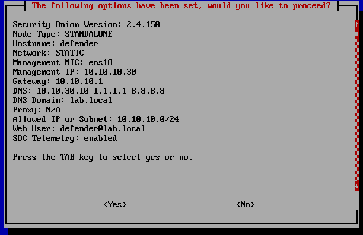

# Proxmox Setup and Configuration

## Useful Commands

Ping Sweep Command Linux:

```bash
for i in {1..254} ;do (ping -c 1 192.168.1.$i | grep "bytes from" &) ;done
```

Ping Sweep Windows:

```PowerShell
for /L %i in (1,1,255) do @ping -n 1 -w 200 192.168.1.%i > nul && echo 192.168.1.%i is up.
```

## Troubleshooting Steps for Proxmox Network Configuration

### Network/Hardware Settings

Router: 192.168.1.1
Hostname: pve-node#.lab.home
Laptop: 192.168.1.200
Dell OptiPlex 1: 192.168.1.201
Dell OptiPlex 2: 192.168.1.202

### 1. Verify Network Interfaces

- Check the status of network interfaces:

  ```bash
  ip link show
  ```

- Identify your Ethernet interface (likely named `enx5c...`).

### 2. Check Bridge Configuration

- Check the status of the bridge interface:

  ```bash
  brctl show vmbr0
  ```

- Confirm that no physical interfaces were attached initially.

### 3. Add Physical Interface to Bridge

- Add the Ethernet interface to the bridge:

  ```bash
  sudo brctl addif vmbr0 enx5c...
  ```

- Verify the change:

  ```bash
  brctl show vmbr0
  ```

### 4. Bring Up Interfaces

- Bring up the Ethernet interface:

  ```bash
  sudo ip link set enx5c... up
  ```

- Bring up the bridge interface:

  ```bash
  sudo ip link set vmbr0 up
  ```

### 5. Verify IP Configuration

- Check the IP configuration of the bridge:

  ```bash
  ip addr show vmbr0
  ```

- If necessary, assign a static IP address:

  ```bash
  sudo ip addr add 192.168.1.100/24 dev vmbr0
  ```

### 6. Set Default Gateway

- Ensure there's a default route to your gateway:

  ```bash
  sudo ip route add default via 192.168.1.1
  ```

### 7. Update Network Configuration File

- Edit the `/etc/network/interfaces` file:

  ```bash
  sudo nano /etc/network/interfaces
  ```

- Ensure the configuration for `vmbr0` looks like this:

  ```plaintext
  auto vmbr0
  iface vmbr0 inet static
      address 192.168.1.100/24
      gateway 192.168.1.1
      bridge_ports enx5c...
      bridge_stp off
      bridge_fd 0
  ```

### 8. Remove Unwanted Bridge Ports

- If `wlo1` (WiFi interface) was attached to the bridge, remove it:

  ```bash
  sudo brctl delif vmbr0 wlo1
  ```

### 9. Restart Networking

- Restart the networking service to apply changes:

  ```bash
  sudo systemctl status systemd-networkd.service
  ```

### 10. Verify Connectivity

- Check if you can ping your gateway:

  ```bash
  ping -c 4 192.168.1.1
  ```

### 11. Access Proxmox Web Interface

- Open a web browser and navigate to:
  - https://[your_proxmox_ip]:8006


# Network Setup and Organization

## Phase 1: Lab Design & Architecture

| Device              | ISO                                               | Purpose                                       | VLAN             | VLAN ID | CPU Cores | RAM (GB) | Storage (GB) | Notes                                                                                                                                                 |
| :------------------ | :------------------------------------------------ | :-------------------------------------------- | :--------------- | :------ | :-------- | :------- | :----------- | :---------------------------------------------------------------------------------------------------------------------------------------------------- |
| **pfSense VM** | pfSense CE (Latest Stable ISO)                    | Firewall, Router, DHCP, DNS for Lab VLANs     | Multiple         | (N/A)   | 2         | 2-4      | 20           | Core network control. Manages inter-VLAN routing & lab internet access via NAT. Assign vNICs to Proxmox bridges/VLANs. Mgmt IFace likely untagged/VLAN 10. |
| **Security Onion VM** | Security Onion 2.4 (Latest ISO)                 | SIEM, NIDS, HIDS, Log Aggregation             | Management       | 10      | 6-8       | 16-32    | 300+         | Central monitoring stack. Resource intensive (adjust as needed). Install as "Standalone". Needs fast storage. Resides on secure Management VLAN.        |
| **Windows Server DC** | Windows Server 2022 Standard Eval (180-day ISO) | Active Directory Domain Controller            | Servers          | 30      | 2-4       | 4-6      | 80           | Primary target for AD security monitoring. Requires Eval ISO. Needs AD DS role configuration post-install.                                              |
| **Windows Client 1**| Windows 10/11 Enterprise Eval (90-day ISO)      | User Workstation Target 1                     | User Endpoints   | 20      | 2-4       | 4-8      | 80           | Simulates Win endpoint. Target for Sysmon, agent (Wazuh/Beat). Requires Eval ISO. Will be domain-joined.                                              |
| **Windows Client 2**| Windows 10/11 Enterprise Eval (90-day ISO)      | User Workstation Target 2                     | User Endpoints   | 20      | 2-4       | 4-8      | 80           | Second user endpoint for diverse testing/simulation. Eval ISO. Will be domain-joined.                                                               |
| **Linux Server 1** | Ubuntu Server  LTS or Debian 12 (ISO)      | Linux Target Server (Web, DB, etc.)           | Servers          | 30      | 2         | 4        | 50           | Target for Linux host monitoring (Auditd, Osquery) & server attacks. Can host vulnerable apps later.                                                |
| **Attacker VM** | Kali Linux or Parrot Security OS (Latest ISO)     | Offensive Operations / Testing Detections     | Attacker         | 99      | 2-4       | 4-8      | 60           | Used to simulate attacks against lab targets. Kept isolated on its own VLAN.                                                                        |
| **Proxmox Node(s)** | N/A (Hypervisor Host)                             | Virtualization Platform                       | Host Management  | 10   | (Host)    | (Host)   | (Host)       | Underlying hypervisor.       |

**VLAN Quick Ref:**
* **VLAN 10 (Management):** `10.10.10.0/24`
* **VLAN 20 (User Endpoints):** `10.10.20.0/24`
* **VLAN 30 (Servers):** `10.10.30.0/24`
* **VLAN 99 (Attacker):** `10.10.99.0/24`

## Phase 2: Core Infrastructure Setup - pfSense Router & Network Foundation

### 1. Configure Proxmox VE Networking for VLANs

* **Objective:** Enable the primary network bridge on all Proxmox nodes to handle VLAN tagged traffic.
* **Action:**
    * Navigate to `Datacenter` > `[Node Name]` > `System` > `Network` for **each node** in the cluster (Node 1, Node 2, Node 3).
    * Select the primary bridge connected to the physical network (typically `vmbr0`).
    * Click `Edit`.
    * Check the box **`VLAN aware`**.
    * Click `OK` and apply changes if prompted.
* **Result:** `vmbr0` on all cluster nodes is now capable of handling traffic for multiple VLANs based on tags assigned to VM network interfaces.

### 2. Obtain pfSense Installation Media

* **Objective:** Download the pfSense Community Edition (CE) ISO installer.
* **Action:**
    * Visit the [official pfSense download page](https://www.pfsense.org/download/).
    * Select Architecture: `AMD64 (64-bit)`, Installer: `ISO`.
    * Download the `.iso.gz` file (e.g., `pfSense-CE-X.Y.Z-RELEASE-amd64.iso.gz`).
    * Extract the `.iso` file from the downloaded `.gz` archive (e.g., using 7-Zip). Resolve any file permission errors during extraction by saving the `.iso` to a user-writable location like `Downloads` or `Desktop`.

### 3. Upload pfSense ISO to Proxmox

* **Objective:** Make the pfSense installer ISO available within Proxmox.
* **Action:**
    * In the Proxmox UI, navigate to a storage location enabled for ISO images (e.g., `Datacenter` > `[Node Name]` > `local` > `ISO Images`).
    * Click `Upload`.
    * Select the extracted pfSense `.iso` file.
    * Click `Upload` and wait for completion.

### 4. Create the pfSense Virtual Machine Shell

* **Objective:** Create the VM entry in Proxmox with the correct hardware specifications *before* installation.
* **Action:**
    * Click **`Create VM`**.
    * **General Tab:**
        * Assign a `Name` (e.g., `pfSense-Router`).
        * Accept the default suggested `VM ID` (e.g., `100`).
    * **OS Tab:**
        * Select the uploaded pfSense `.iso` file.
        * Guest OS `Type`: `Other`.
    * **System Tab:**
        * `SCSI Controller`: `VirtIO SCSI single`.
        * Enable `Qemu Agent`.
    * **Disks Tab:**
        * `Bus/Device`: `SCSI`, Unit Number `0`.
        * `Storage`: Select your NVMe storage.
        * `Disk size (GiB)`: `20`.
    * **CPU Tab:**
        * `Sockets`: `1`.
        * `Cores`: `2`.
        * `Type`: `host` (recommended).
    * **Memory Tab:**
        * `Memory (MiB)`: `4096` (4 GiB).
        * Uncheck `Ballooning Device` (recommended for pfSense).
    * **Network Tab (WAN Interface Only):**
        * `Bridge`: `vmbr0`.
        * `VLAN Tag`: **LEAVE BLANK**.
        * `Model`: `VirtIO (paravirtualized)`.
        * `Firewall`: Unchecked.
    * **Confirm Tab:** Review and click `Finish`.

### 5. Add Second Network Interface (LAN - VLAN 10)

* **Objective:** Add the necessary LAN interface to the VM *after* creation but *before* first boot.
* **Action (Workflow Modification):**
    * Select the newly created `pfSense-Router` VM (ensure it's powered off).
    * Go to the `Hardware` tab.
    * Click `Add` > `Network Device`.
    * Configure the second interface (`net1`):
        * `Bridge`: `vmbr0`.
        * `VLAN Tag`: `10`.
        * `Model`: `VirtIO (paravirtualized)`.
        * `Firewall`: Unchecked.
    * Click `Add`.
* **Result:** The VM now has `net0` (WAN) and `net1` (LAN/VLAN 10) network interfaces configured.

### 6. Install pfSense Operating System

* **Objective:** Install pfSense onto the VM's virtual disk.
* **Action:**
    * Start the `pfSense-Router` VM.
    * Immediately open the `Console`.
    * Follow the pfSense installer prompts: Accept notices, choose `Install`, select keymap, use `Auto (UFS)` partitioning.
    * Select `No` for manual configuration during installation.
    * Choose `Reboot` when installation completes.
    * **Crucial:** Before the VM fully boots up after rebooting, go to the VM's `Hardware` tab > `CD/DVD Drive` > `Edit` > select **`Do not use any media`**. This prevents booting from the ISO again.

### 7. Initial pfSense Configuration (Console)

* **Objective:** Assign network interfaces and configure the LAN IP address for web GUI access.
* **Action (After rebooting into installed pfSense):**
    * Follow console prompts for **interface assignment** (Option `1`):
        * Assign the Proxmox NIC corresponding to `net0` (untagged on vmbr0) to the **`WAN`** role.
        * Assign the Proxmox NIC corresponding to `net1` (VLAN 10 on vmbr0) to the **`LAN`** role.
    * Use console menu option `2` (**Set interface(s) IP address**):
        * Select the `LAN` interface.
        * Set IPv4 address: `10.10.10.1`
        * Set subnet bit count: `24`
        * Gateway: Press Enter (none for LAN).
        * IPv6: `n` (for now).
        * Enable DHCP server on LAN: `y`.
        * Set DHCP start range: `10.10.10.100` (example).
        * Set DHCP end range: `10.10.10.200` (example).
        * Revert to HTTP: `n` (keep HTTPS).

### 8. Access pfSense Web GUI, Complete Wizard, & Configure Lab VLANs

* **Objective:** Use a temporary VM to access the pfSense web interface, complete the initial setup wizard, and then configure the necessary interfaces, DHCP services, and firewall rules for all internal lab VLANs (10, 20, 30, 99).

* **Action:**

    * **8.1. Obtain Linux Desktop ISO:**
        * Download an ISO for a lightweight Linux distribution (e.g., Lubuntu, Xubuntu, Linux Mint XFCE).
        * Links: Lubuntu ([https://lubuntu.me/downloads/](https://lubuntu.me/downloads/)), Xubuntu ([https://xubuntu.org/download/](https://xubuntu.org/download/)), Linux Mint ([https://linuxmint.com/download.php](https://linuxmint.com/download.php)).

    * **8.2. Upload ISO to Proxmox:**
        * Upload the downloaded Linux Desktop ISO file to Proxmox ISO storage.

    * **8.3. Create Temporary Test VM:**
        * In Proxmox, click **`Create VM`**.
        * **General:** Name (e.g., `Temp-WebUI-Access`), VM ID.
        * **OS:** Select Linux ISO, Type `Linux`.
        * **System:** Defaults okay, Enable `Qemu Agent`, Controller `VirtIO SCSI single`.
        * **Disks:** SCSI 0, Storage, Size `15-20` GB.
        * **CPU:** Cores `1-2`.
        * **Memory:** `1024-2048` MiB.
        * **Network:** Bridge `vmbr0`, **VLAN Tag `10`**, Model `VirtIO`.
        * **Confirm:** Review and `Finish`.

    * **8.4. Boot Test VM & Verify Network:**
        * Start the `Temp-WebUI-Access` VM.
        * Open `Console`.
        * Boot the "Live" or "Try" environment from the ISO.
        * Verify it receives a `10.10.10.X` IP address via DHCP from pfSense (use `ip addr show` in terminal if needed).

    * **8.5. Access pfSense Web GUI:**
        * Open the web browser **inside the Test VM**.
        * Navigate to **`https://10.10.10.1`**.
        * Accept the certificate warning.

    * **8.6. Log In:**
        * Username: `admin`
        * Password: `pfsense`

    * **8.7. Complete Initial Setup Wizard:**
        * Follow the wizard steps.
        * Set `Hostname` (e.g., `pfsense`), `Domain` (e.g., `lab.local`).
        * Configure `DNS Servers` (e.g., `0.us.pool.ntp.org`, `1.us.pool.ntp.org`).
        * Set `Timezone` (`Pacific/Honolulu` or equivalent).
        * Verify WAN (DHCP) and LAN (`10.10.10.1/24`) settings.
        * **CRITICAL:** Set a new, strong **`Admin Password`**.
        * Click `Reload` to finish the wizard. You should land on the pfSense Dashboard.

    * **8.8. Add Virtual Network Interfaces to pfSense VM (in Proxmox):**
        * **8.8.1. Shutdown pfSense:** Gracefully shut down the `pfSense-Router` VM from the pfSense GUI (`Diagnostics` > `Halt System`). Wait for it to stop in Proxmox.
        * **8.8.2. Add NICs:** In Proxmox UI, select `pfSense-Router` VM > `Hardware`.
        * **8.8.3.** Click `Add` > `Network Device` three times, configuring each as follows:
            * **`net2`**: Bridge `vmbr0`, **VLAN Tag `20`**, Model `VirtIO`.
            * **`net3`**: Bridge `vmbr0`, **VLAN Tag `30`**, Model `VirtIO`.
            * **`net4`**: Bridge `vmbr0`, **VLAN Tag `99`**, Model `VirtIO`.
        * **8.8.4. Start pfSense:** Start the `pfSense-Router` VM again.

    * **8.9. Assign New Interfaces (in pfSense Web GUI):**
        * **8.9.1. Login:** Log back into the pfSense Web GUI at `https://10.10.10.1` (using your new admin password).
        * **8.9.2. Navigate:** Go to `Interfaces` > `Assignments`.
        * **8.9.3. Add Interfaces:** Under "Available network ports", locate `vtnet2`, `vtnet3`, `vtnet4`.
            * Click `+ Add` next to `vtnet2` (becomes `OPT1`).
            * Click `+ Add` next to `vtnet3` (becomes `OPT2`).
            * Click `+ Add` next to `vtnet4` (becomes `OPT3`).
        * **8.9.4. Save:** Click `Save`.

    * **8.10. Configure Interface IP Addresses & Settings:**
        * **8.10.1. Configure OPT1 (UsersVLAN):**
            * Navigate to `Interfaces` > `[OPT1]`.
            * Check **`Enable interface`**.
            * `Description`: `UsersVLAN`.
            * `IPv4 Configuration Type`: `Static IPv4`.
            * `IPv4 Address`: `10.10.20.1`, select `/24`.
            * Click `Save`.
        * **8.10.2. Configure OPT2 (ServersVLAN):**
            * Navigate to `Interfaces` > `[OPT2]`.
            * Check **`Enable interface`**.
            * `Description`: `ServersVLAN`.
            * `IPv4 Configuration Type`: `Static IPv4`.
            * `IPv4 Address`: `10.10.30.1`, select `/24`.
            * Click `Save`.
        * **8.10.3. Configure OPT3 (AttackerVLAN):**
            * Navigate to `Interfaces` > `[OPT3]`.
            * Check **`Enable interface`**.
            * `Description`: `AttackerVLAN`.
            * `IPv4 Configuration Type`: `Static IPv4`.
            * `IPv4 Address`: `10.10.99.1`, select `/24`.
            * Click `Save`.
        * **8.10.4. Apply Changes:** Click the **`Apply Changes`** button at the top of the page.

    * **8.11. Configure DHCP Servers for New VLANs:**
        * **8.11.1. Navigate:** Go to `Services` > `DHCP Server`.
        * **8.11.2. Configure DHCP for UsersVLAN:**
            * Select the **`UsersVLAN`** tab.
            * Check **`Enable DHCP server...`**.
            * `Range`: From `10.10.20.100` To `10.10.20.200`.
            * `DNS Servers`: `10.10.30.10` (Primary), `1.1.1.1` (Secondary - optional).
            * Click `Save`.
        * **8.11.3. Configure DHCP for ServersVLAN:**
            * Select the **`ServersVLAN`** tab.
            * Check **`Enable DHCP server...`**.
            * `Range`: From `10.10.30.100` To `10.10.30.200`.
            * `DNS Servers`: `10.10.30.10` (Primary), `1.1.1.1` (Secondary - optional).
            * Click `Save`.
        * **8.11.4. Configure DHCP for AttackerVLAN:**
            * Select the **`AttackerVLAN`** tab.
            * Check **`Enable DHCP server...`**.
            * `Range`: From `10.10.99.100` To `10.10.99.200`.
            * `DNS Servers`: `10.10.10.1` or `1.1.1.1`.
            * Click `Save`.

    * **8.12. Add Firewall Rules for Lab Traffic (with MGMT Isolation):**
        * **8.12.1. Navigate:** Go to `Firewall` > `Rules`.

        * **8.12.2. Check/Add LAN Outbound Rule:**
            * Select the **`LAN`** tab.
            * **Verify** a default rule exists allowing traffic *from* `Source: LAN net` to `Destination: any`. (pfSense often adds a "Default allow LAN to any rule").
            * If no such rule exists, click `+ Add` (down arrow is fine here) and create it:
                * `Action`: `Pass`, `Interface`: `LAN`, `Address Family`: `IPv4`, `Protocol`: `Any`, `Source`: `LAN net`, `Destination`: `any`, `Description`: `Allow LAN Outbound (Default)`. Click `Save`.
            * *(This ensures your management segment can reach other networks).*

        * **8.12.3. Add Rules for UsersVLAN:**
            * Select the **`UsersVLAN`** tab.
            * **Add BLOCK Rule (TOP):** Click `+ Add` (using the **UP arrow** to add to the **TOP**).
                * `Action`: **`Block`**
                * `Interface`: `UsersVLAN`
                * `Address Family`: `IPv4`
                * `Protocol`: `Any`
                * `Source`: `UsersVLAN net`
                * `Destination`: `LAN net`
                * `Description`: `Block access to MGMT net`
            * Click `Save`.
            * **Add PASS Rule (Below Block):** Click `+ Add` (using the **DOWN arrow** to add below the block rule).
                * `Action`: `Pass`
                * `Interface`: `UsersVLAN`
                * `Address Family`: `IPv4`
                * `Protocol`: `Any`
                * `Source`: **`UsersVLAN net`** *(Use the subnet, not the address)*
                * `Destination`: `any`
                * `Description`: `Allow Users VLAN Outbound`
            * Click `Save`. *(Ensure Block rule is listed above the Pass rule).*

        * **8.12.4. Add Rules for ServersVLAN:**
            * Select the **`ServersVLAN`** tab.
            * **Add BLOCK Rule (TOP):** Click `+ Add` (UP arrow).
                * `Action`: **`Block`**
                * `Interface`: `ServersVLAN`
                * `Address Family`: `IPv4`
                * `Protocol`: `Any`
                * `Source`: `ServersVLAN net`
                * `Destination`: `LAN net`
                * `Description`: `Block access to MGMT net`
            * Click `Save`.
            * **Add PASS Rule (Below Block):** Click `+ Add` (DOWN arrow).
                * `Action`: `Pass`
                * `Interface`: `ServersVLAN`
                * `Address Family`: `IPv4`
                * `Protocol`: `Any`
                * `Source`: **`ServersVLAN net`**
                * `Destination`: `any`
                * `Description`: `Allow Servers VLAN Outbound`
            * Click `Save`. *(Ensure Block rule is listed above the Pass rule).*

        * **8.12.5. Add Rules for AttackerVLAN:**
            * Select the **`AttackerVLAN`** tab.
            * **Add BLOCK Rule (TOP):** Click `+ Add` (UP arrow).
                * `Action`: **`Block`**
                * `Interface`: `AttackerVLAN`
                * `Address Family`: `IPv4`
                * `Protocol`: `Any`
                * `Source`: `AttackerVLAN net`
                * `Destination`: `LAN net`
                * `Description`: `Block access to MGMT net`
            * Click `Save`.
            * **Add PASS Rule (Below Block):** Click `+ Add` (DOWN arrow).
                * `Action`: `Pass`
                * `Interface`: `AttackerVLAN`
                * `Address Family`: `IPv4`
                * `Protocol`: `Any`
                * `Source`: **`AttackerVLAN net`**
                * `Destination`: `any`
                * `Description`: `Allow Attacker VLAN Outbound`
            * Click `Save`. *(Ensure Block rule is listed above the Pass rule).*

        * **8.12.6. Apply Changes:** After adding/modifying rules on all relevant tabs, click the **`Apply Changes`** button that appears at the top of the page.


## Phase 3: VM Selection & Initial Build

### 3.1. Build the Windows Server Domain Controller (`LAB-DC01`)

* **Objective:** Install and configure the base Windows Server 2022 operating system, preparing it for promotion to a Domain Controller. This VM will reside on VLAN 30 (ServersVLAN).


* **3.1.1. Obtain Windows Server 2022 Evaluation ISO:**
  * Download the **Windows Server 2022 Standard (or Datacenter) Evaluation ISO** (180-day trial) from the Microsoft Evaluation Center.
  * **Link:** [https://www.microsoft.com/en-us/evalcenter/evaluate-windows-server-2022](https://www.microsoft.com/en-us/evalcenter/evaluate-windows-server-2022)
  * Select the **ISO download** option.
  * Upload the downloaded `.iso` file to your Proxmox ISO storage (`Datacenter` > `[Node Name]` > `[Storage Name]` > `ISO Images` > `Upload`).

* **3.1.2. Obtain VirtIO Drivers ISO:**
  * **Check Proxmox Storage:** First, check your Proxmox ISO storage (`Datacenter` > `[Node Name]` > `[Storage Name]` > `ISO Images`) for an existing file named `virtio-win-*.iso`.
  * **Download if Missing:** As confirmed it wasn't present, download the drivers from the official Fedora Project repository:
      * **Link:** [https://fedorapeople.org/groups/virt/virtio-win/direct-downloads/archive-virtio/](https://fedorapeople.org/groups/virt/virtio-win/direct-downloads/archive-virtio/)
      * Navigate into the directory for the **latest stable** version (e.g., highest version number not marked as "latest").
      * Download the file ending in **`.iso`**.
  * **Upload to Proxmox:** Upload the downloaded `virtio-win-*.iso` file to your Proxmox ISO storage.

* **3.1.3. Create DC Virtual Machine in Proxmox:**
  * Click **`Create VM`**.
  * **General Tab:**
      * `Name`: `WinDC` (or `LAB-DC01`)
      * `VM ID`: Accept default suggested ID.
  * **OS Tab:**
      * Select the uploaded **Windows Server 2022 ISO**. *(This will be mounted on the first CD/DVD drive, e.g., `ide0` or `ide2`)*.
      * `Type`: `Microsoft Windows`
      * `Version`: `11/2022`
  * **System Tab:**
      * `Graphic card`: Default
      * `SCSI Controller`: `VirtIO SCSI single`
      * **Check** `Qemu Agent`
  * **Disks Tab:**
      * `Bus/Device`: `SCSI`, Unit `0`
      * `Storage`: Select NVMe storage.
      * `Disk size (GiB)`: `80`
      * `Cache`: Default (`No cache`)
      * **Check** `Discard`
      * **Check** `IO thread`
  * **CPU Tab:**
      * `Sockets`: `1`
      * `Cores`: `2`
  * **Memory Tab:**
      * `Memory (MiB)`: `4096`
      * **Uncheck** `Ballooning Device`
  * **Network Tab:**
      * `Bridge`: `vmbr0`
      * `VLAN Tag`: **`30`** *(Connects to ServersVLAN)*
      * `Model`: `VirtIO (paravirtualized)`
      * `Firewall`: Unchecked
  * **Confirm Tab:** Review and click `Finish`.
  * **Add VirtIO CD Drive:** After VM creation (or during, if possible), ensure the VM has a **second CD/DVD drive**. Go to VM > `Hardware` > `Add` > `CD/DVD Drive`. Mount the **`virtio-win-*.iso`** file on this second drive (e.g., `ide1` or `sata0`).

* **3.1.4. Install Windows Server 2022 OS (Loading Drivers):**
  * Start the `WinDC` VM and open the `Console`.
  * Boot from the Windows Server installation ISO.
  * Follow Windows Setup: Language, Time, Keyboard > `Install now` > Click `I don't have a product key` > Select OS Version `(Desktop Experience)` > Accept terms > Choose **`Custom: Install Microsoft Server Operating System only (advanced)`**.
  * **Load Storage Driver:** At the "Where do you want to install Windows?" screen (which shows no drives):
      * Click **`Load driver`**.
      * Click `Browse`.
      * Navigate to the CD drive containing the **VirtIO drivers ISO**.
      * Browse to the **`vioscsi\2k22\amd64`** folder (or `viostor` equivalent if using that driver path).
      * Click `OK`.
      * Select the "Red Hat VirtIO SCSI pass-through controller" driver. Click `Next`.
  * **Select Disk:** The 80GB virtual disk (`Drive 0 Unallocated Space`) should now appear. Select it.
  * Click `Next` to begin the installation. Wait for completion and automatic reboots.

* **3.1.5. Initial Windows Login:**
  * After installation, set the password for the built-in `Administrator` account.
  * Log in as `Administrator`.

* **3.1.6. Perform Essential Post-Installation Tasks:**
  * **Install Remaining VirtIO Drivers & Agent:**
      * Ensure the **`virtio-win-*.iso`** is still mounted in the second CD/DVD drive (check VM > `Hardware` > `CD/DVD Drive`).
      * Inside the Windows VM: Open File Explorer, browse the VirtIO CD drive. Run **`virtio-win-gt-x64.msi`** (or `virtio-win-guest-tools.exe`). Accept defaults to install all remaining drivers and guest services (Network adapter, Ballooning, QEMU Guest Agent).
      * **Reboot** the VM when installation is complete.
  * **Verify Network (DHCP):**
      * After reboot, log in. Open Command Prompt (`cmd`). Run `ipconfig /all`.
      * Verify IPv4 Address is `10.10.30.x`, Gateway is `10.10.30.1`, DNS is `10.10.30.10`.
  * **Set Static IP Address (Initial):**
      * Open `Control Panel` > `Network and Sharing Center` > `Change adapter settings`.
      * Right-click Ethernet adapter > `Properties` > `Internet Protocol Version 4 (TCP/IPv4)` > `Properties`.
      * Select `Use the following IP address`:
          * IP address: **`10.10.30.10`**
          * Subnet mask: **`255.255.255.0`**
          * Default gateway: **`10.10.30.1`**
          * Preferred DNS server: **`10.10.10.1`** *(Temporary - pointing to pfSense for updates)*
          * Alternate DNS server: `1.1.1.1` *(Optional)*
      * Click `OK` > `Close`.
  * **Rename Computer:**
      * Open `Server Manager` > `Local Server` > Click Computer name > `Change...`.
      * New name: `LAB-DC01`. Click `OK` > `OK` > `Close`. **Reboot Now**.
  * **Windows Updates:**
      * After reboot, log in. Verify internet access (e.g., `ping 8.8.8.8`, `nslookup www.google.com`).
      * Go to `Settings` > `Update & Security` > `Windows Update`. **Check for and install all available updates.** This may require multiple reboots. Continue until it reports "You're up to date".
  * **Time Sync Check:** Verify system time is accurate.
  * **Set Final DNS Configuration:**
      * **AFTER** all updates are complete, go back to the IPv4 Properties for the Ethernet adapter.
      * Change the **`Preferred DNS server`** back to **`127.0.0.1`**.
      * Leave `Alternate DNS server` as `10.10.10.1` or clear it.
      * Click `OK` > `Close`.

* **3.1.7. Install AD DS Role & Promote to Domain Controller:**
  * **Objective:** Install Active Directory Domain Services and configure the server as the first Domain Controller in a new forest (`lab.local`).
  * **3.1.7.1. Add AD DS Role:**
      * Open **Server Manager**.
      * `Manage` > `Add Roles and Features`.
      * `Next` (Before You Begin).
      * Select `Role-based or feature-based installation`. `Next`.
      * Select local server (`LAB-DC01`). `Next`.
      * Check box for **`Active Directory Domain Services`**.
      * Click **`Add Features`** on the pop-up window.
      * Click `Next` through Server Roles.
      * Click `Next` through Features.
      * Click `Next` through AD DS information page.
      * Click **`Install`** on Confirmation page (optionally check restart).
      * Wait for installation, then click `Close`.
  * **3.1.7.2. Promote Server to Domain Controller:**
      * In Server Manager, click the notification flag (yellow triangle) > Click **`Promote this server to a domain controller`**.
      * **Deployment Configuration:** Select **`Add a new forest`**. `Root domain name`: **`lab.local`**. Click `Next`.
      * **Domain Controller Options:**
          * Leave Forest/Domain functional levels at default (`Windows Server 2016`).
          * Ensure **`Domain Name System (DNS) server`** is **checked**.
          * Ensure **`Global Catalog (GC)`** is **checked**.
          * Enter and confirm a strong **`DSRM password`**. **Document this password.** Click `Next`.
      * **DNS Options:** Ignore the delegation warning. Click `Next`.
      * **Additional Options:** Verify `NetBIOS name` is `LAB`. Click `Next`.
      * **Paths:** Accept default database/log/SYSVOL paths. Click `Next`.
      * **Review Options:** Review selections. Click `Next`.
      * **Prerequisites Check:** Wait for checks. Ignore warnings (unless critical errors appear). Click **`Install`**.
  * **3.1.7.3. Automatic Reboot:** The server will install AD DS and **reboot automatically**.

  * **3.1.7.4. Post-Promotion Verification:**
      * Log in after reboot (use `LAB\Administrator` or `administrator@lab.local` with the original Administrator password).
      * Check Server Manager shows AD DS and DNS roles are present and services appear to be running (green status).
      * Open `Active Directory Users and Computers` (from `Tools` menu in Server Manager or run `dsa.msc`). Verify your domain (e.g., `lab.local`) is listed and you can expand it to see default containers like `Domain Controllers` (which should list `LAB-DC01`).
      * Open `DNS` console (from `Tools` menu or run `dnsmgmt.msc`):
          * Expand your server name (`LAB-DC01`).
          * Expand `Forward Lookup Zones`. Verify that a zone for **`lab.local`** and a sub-zone **`_msdcs.lab.local`** exist.
          * Expand these zones and check for the presence of various records, especially SRV records (e.g., `_ldap`, `_kerberos` under `_tcp` in both `_msdcs.lab.local` and `lab.local`). These indicate service registration.
          * **Ensure pfSense Firewall Allows DC DNS Forwarding Queries:**
              * Log into the pfSense Web GUI (`https://10.10.10.1`).
              * Navigate to `Firewall` > `Rules` > `SERVERS_VLAN` tab.
              * Ensure rules are in the following order (top to bottom), adding/editing as necessary:
                  1.  **`Pass`** `IPv4 UDP` from Source `10.10.30.10` (DC IP) to Destination `10.10.10.1` (pfSense LAN_MGMT IP) Destination Port `DNS (53)`. Description: `Allow DC DNS UDP queries to pfSense LAN_MGMT`.
                  2.  **`Pass`** `IPv4 TCP` from Source `10.10.30.10` (DC IP) to Destination `10.10.10.1` (pfSense LAN_MGMT IP) Destination Port `DNS (53)`. Description: `Allow DC DNS TCP to pfSense LAN_MGMT`.
                  3.  **`Block`** `IPv4 *` from Source `SERVERS_VLAN net` to Destination `LAN_MGMT net`. Description: `Block access to MGMT subnet`.
                  4.  **`Pass`** `IPv4 *` from Source `SERVERS_VLAN net` to Destination `any`. Description: `Allow SERVERS_VLAN Outbound`.
              * Click `Save` if changes are made, and then **`Apply Changes`**.
          * **Configure and Verify Forwarders on DC:** Right-click the server name (`LAB-DC01`) in DNS Manager > `Properties` > `Forwarders` tab.
              * Click `Edit...`.
              * Add the IP address of your pfSense LAN/Management interface: **`10.10.10.1`**. It should now validate (or at least function for lookups).
              * Add public DNS servers for redundancy: **`1.1.1.1`** (Cloudflare) and **`8.8.8.8`** (Google) on separate lines.
              * Click `OK`, then `Apply`.
      * Open Command Prompt (`cmd`) or PowerShell **as Administrator**:
          * Run `ipconfig /all`. Verify:
              * `Host Name` is `LAB-DC01`.
              * `Primary Dns Suffix` is `lab.local`.
              * `DNS Servers` list should show `127.0.0.1` (and/or `::1`, its own static IP `10.10.30.10`).
          * Run `nltest /dsgetdc:lab.local`. This should return the name `LAB-DC01.lab.local` and its IP address, confirming the DC is discoverable.
          * Run `nslookup lab.local`. This should resolve to `10.10.30.10` (queried against the local DNS server).
          * Run `nslookup www.google.com` (or another external site). This should now resolve successfully using the configured forwarders.
          * Run `dcdiag /v`. This performs a comprehensive health check. Review the output carefully. It's common to see some initial warnings related to DNS delegation or SysVol replication on a brand new, single DC, but most tests should show as "passed". Address any "failed" tests.

### 3.2. Build the First Windows Client VM (`WinClient01`)

* **Objective:** Install and configure a Windows client operating system, join it to the `lab.local` domain, and prepare it for endpoint monitoring. This VM will reside on VLAN 20 (UsersVLAN).

* **3.2.1. Obtain Windows Client ISO:**
    * Download either **Windows 10 Enterprise Evaluation** or **Windows 11 Enterprise Evaluation** ISO (typically 90-day trials). Windows 10 is often still very relevant for corporate environments, but Windows 11 is the latest. Your choice depends on what environment you want to simulate most closely. For general detection engineering, either is fine. Let's assume Windows 10 for these instructions, but Windows 11 is very similar.
    * **Microsoft Evaluation Center:** Search for "Windows 10 Enterprise Evaluation" or "Windows 11 Enterprise Evaluation" on the [Microsoft Evaluation Center](https://www.microsoft.com/en-us/evalcenter/).
    * Select the ISO download option (registration may be required).
    * Upload the downloaded `.iso` file to your Proxmox ISO storage.

* **3.2.2. Create Client Virtual Machine in Proxmox:**
    * Click **`Create VM`**.
    * **General Tab:**
        * `Name`: `WinClient01` (or `LAB-WCLIENT01`)
        * `VM ID`: Accept default suggested ID.
    * **OS Tab:**
        * Select the uploaded Windows 10/11 Enterprise ISO.
        * `Type`: `Microsoft Windows`
        * `Version`: Select appropriate (e.g., `10/2019/2022` or `11/2022`).
    * **System Tab:**
        * `Graphic card`: Default
        * `SCSI Controller`: `VirtIO SCSI single`
        * **Check** `Qemu Agent`
    * **Disks Tab:**
        * `Bus/Device`: `SCSI`, Unit `0`
        * `Storage`: Select NVMe storage.
        * `Disk size (GiB)`: `80` (as per our table, or 60GB is also fine for a client).
        * `Cache`: Default (`No cache`)
        * **Check** `Discard`
        * **Check** `IO thread`
    * **CPU Tab:**
        * `Sockets`: `1`
        * `Cores`: `2`
    * **Memory Tab:**
        * `Memory (MiB)`: `4096` (4 GiB, can reduce to 2048 MiB after setup if needed, but 4GiB is smoother).
        * **Uncheck** `Ballooning Device`
    * **Network Tab:**
        * `Bridge`: `vmbr0`
        * `VLAN Tag`: **`20`** *(Connects to UsersVLAN)*
        * `Model`: `VirtIO (paravirtualized)`
        * `Firewall`: Unchecked
    * **Confirm Tab:** Review and click `Finish`.
    * **Add VirtIO CD Drive:** After VM creation, ensure the VM's CD/DVD drive (`Hardware` > `CD/DVD Drive`) has the **`virtio-win-*.iso`** file mounted (you can add a second CD/DVD drive for this if you prefer to keep the Windows ISO also attached initially, or swap it after Windows install starts).
      * **NOTE:** ensure that your Windows ISO is in placed first in the boot order

* **3.2.3. Install Windows Client OS (Loading Drivers if Necessary):**
    * Start the `WinClient01` VM and open the `Console`.
    * Boot from the Windows installation ISO.
    * Follow Windows Setup: Language, Time, Keyboard > `Install now`.
    * Product Key: If asked, there's usually an option like "I don't have a product key" for evaluations.
    * Operating System: Select **`Windows 10 Enterprise`** (or `Windows 11 Enterprise`).
    * Accept license terms.
    * Installation Type: **`Custom: Install Windows only (advanced)`**.
    * **Load Storage Driver (If Needed):** If at the "Where do you want to install Windows?" screen no drives are visible (same issue as with the DC):
        * Ensure the `virtio-win-*.iso` is mounted in a CD/DVD drive.
        * Click **`Load driver`**.
        * Click `Browse`.
        * Select the Red Hat VirtIO pass-through controller for Windows 10/11: **`E:\amd64\w[10/11]\vioscsi.inf`**. 
        * Click `Next`.
    * **Select Disk:** The virtual disk (`Drive 0 Unallocated Space`) should appear. Select it.
    * Click `Next` to begin installation. Wait for completion and reboots.

* **3.2.4. Windows Out-of-Box Experience (OOBE) & Network Bypass:**
    * After the Windows installation files are copied and the VM reboots, you will be guided through the Out-of-Box Experience (OOBE).
    * **Region and Keyboard:** Select your preferred Region and Keyboard layout. You can skip adding a second keyboard layout if prompted.
    * **Network Connection Screen ("Let's connect you to a network"):**
        * At this screen, you will likely see **no networks available**. This is expected because the VirtIO network driver for your VM's network card is not yet installed.
        * To proceed without a network connection at this stage, press **`Shift + F10`** simultaneously (on some laptops, you might need `Shift + Fn + F10`). This will open a Command Prompt window.
        * In the Command Prompt window, type the following command **exactly** as shown and press Enter:
            ```cmd
            OOBE\BYPASSNRO
            ```
        * The virtual machine will automatically reboot after this command is executed.
    * **After Reboot - OOBE Resumes:**
        * The OOBE process will start again. You'll need to re-select your Region and Keyboard layout.
        * When you reach the "Let's connect you to a network" screen *this time*, you should see a new option like **"I don't have internet"**. Select this option.
        * On the following screen, choose **"Continue with limited setup"**.
    * **Account Setup (Creating a Local Account):**
        * You will now be prompted to create a user for the PC. This will be a **local user account** for now.
        * `Who's going to use this PC?`: Enter a username (e.g., `labadmin`). Click `Next`.
        * Create a memorable password for this `labadmin` local user. Click `Next`. Confirm the password.
        * You will likely be prompted to set up security questions for password recovery. Complete this step.
        * Adjust privacy settings on the subsequent screens as you prefer (you can usually accept defaults or turn features off). Click `Accept` to proceed.
    * Windows will then finalize the setup and take you to the desktop, logged in as the local user you just created (e.g., `labadmin`).

* **3.2.5. Perform Essential Post-Installation Tasks:**
    * Log in as the local user you just created (e.g., `labadmin`).
    * **Install VirtIO Drivers:**
        * Mount the **`virtio-win-*.iso`** in the VM's CD/DVD drive via Proxmox UI (if not still mounted).
        * Inside Windows: Open File Explorer, browse the VirtIO CD. Run **`virtio-win-gt-x64.msi`** (or `virtio-win-guest-tools.exe`). Accept defaults to install all drivers (Network, Storage, Balloon, QEMU Guest Agent, etc.).
        * **Reboot** the VM when installation is complete.
    * **Verify Network & Correct DNS Server (if needed):**
        * After reboot (post VirtIO driver install), log in. Open Command Prompt (`cmd`). Run `ipconfig /all`.
        * **Check IP Configuration:** Verify the `IPv4 Address` is in the `10.10.20.x` range (e.g., `10.10.20.100`) and the `Default Gateway` is `10.10.20.1`.
        * **Check DNS Server:** The `DNS Servers` listed *should* be `10.10.30.10` (your Domain Controller's IP), as this was configured in pfSense's DHCP settings for the UsersVLAN.
            * **If DNS Server is incorrect** (e.g., it shows `10.10.20.1` or something else):
                * **Verify/Correct pfSense DHCP Settings for UsersVLAN:**
                    * Log in to your pfSense Web GUI (`https://10.10.10.1`).
                    * Go to `Services` > `DHCP Server`.
                    * Click on the **`UsersVLAN`** tab.
                    * Scroll down to the **`Servers`** section.
                    * Ensure the **`DNS Servers`** field has `10.10.30.10` as the first (primary) entry. You can add a secondary public DNS like `1.1.1.1` if desired.
                    * If you made any changes, click **`Save`** at the bottom of the pfSense page.
                * **Renew DHCP Lease on `WinClient01`:**
                    * On `WinClient01`, open Command Prompt **as Administrator**.
                    * Type the following commands, pressing Enter after each:
                    ```cmd
                    ipconfig /release
                    ipconfig /renew
                    ```
                    * After the `renew` command completes, run `ipconfig /all` again.
                    * The `DNS Servers` should now correctly show `10.10.30.10`.
    * **Rename Computer:**
        * Go to `Settings` > `System` > `About`.
        * Click `Rename this PC`.
        * New name: `WinClient01`. Click `Next`. Reboot when prompted.
    * **Windows Updates:**
        * After reboot, log in as `labadmin`.
        * Go to `Settings` > `Update & Security` (or just `Windows Update` in Win11).
        * Check for and install all available updates. This may require multiple reboots. Continue until it reports "You're up to date."
    * **Time Sync Check:** Verify the system time is accurate (it should eventually sync with the DC after joining the domain).
    * **Join to Domain:**
        * Go to `Settings` > `System` > `About`.
        * Click `Rename this PC (advanced)` or `Domain or workgroup` (the exact wording might vary slightly, look for advanced system properties or computer name/domain change options).
        * In the System Properties window, on the `Computer Name` tab, click `Change...`.
        * Under "Member of", select `Domain:`. Enter **`lab.local`**. Click `OK`.
        * When prompted for credentials, enter the domain administrator credentials:
            * Username: `LAB\Administrator` (or `administrator@lab.local`)
            * Password: The password you set for the `LAB-DC01` Administrator account.
        * Click `OK`. You should see a "Welcome to the lab.local domain." message.
        * Click `OK` to acknowledge, then `Close`, and **Reboot Now**.
    * **Verify Domain Join:**
        * After reboot, at the login screen, you should be able to switch users and log in with a domain account (e.g., `LAB\Administrator`) or your local `labadmin` account.
        * Log in (e.g., as `WINCLIENT01\labadmin` or `LAB\Administrator`).
        * Go to `Settings` > `System` > `About`. Verify the `Full device name` is now `WinClient01.lab.local`.

### 3.3. Build the Second Windows Client VM (`WinClient02`)

* **Objective:** Install and configure a second Windows client operating system, join it to the `lab.local` domain, and prepare it as another endpoint for monitoring and interaction. This VM will also reside on VLAN 20 (UsersVLAN).

    * **3.3.1. ISO Preparation:**
        * Use the same **Windows Client ISO** (e.g., your Windows 11 ISO capable of installing "Pro" edition, or a Windows 10/11 Enterprise Evaluation ISO) and the **`virtio-win-*.iso`** as detailed in Step 3.2.1 and Step 3.2.2. Ensure these are available in your Proxmox ISO storage.

    * **3.3.2. Create `WinClient02` Virtual Machine in Proxmox:**
        * Follow the same Proxmox VM creation steps as outlined previously in **Step 3.2.2 (Create `WinClient01` Virtual Machine in Proxmox)**, with the following specific change:
            * **General Tab:**
                * `Name`: **`WinClient02`** (or `LAB-WCLIENT02`)
        * Ensure all other settings (OS selection, System settings like Qemu Agent and VirtIO SCSI controller, Disk size like 80GB with Discard and IO thread, CPU cores, Memory, Network settings including **VLAN Tag `20`** and VirtIO model, and having the VirtIO CD Drive added) mirror those used for `WinClient01`.*

    * **3.3.3. Install Windows Client OS (Loading Drivers if Necessary):**
        * Follow the same Windows OS installation steps as outlined in **Step 3.2.3**, including loading the VirtIO SCSI driver during setup if the disk is not initially visible.

    * **3.3.4. Windows Out-of-Box Experience (OOBE) & Network Bypass:**
        * Follow the same OOBE and network bypass steps (using `Shift + F10` > `OOBE\BYPASSNRO` command) as outlined in **Step 3.2.4**.
        * Create a local user account (e.g., `labadmin`) with a password and complete the OOBE.

    * **3.3.5. Perform Essential Post-Installation Tasks for `WinClient02`:**
        * Follow the same essential post-installation tasks as outlined in **Step 3.2.5**, with the primary modification being the computer name:
            * **Install VirtIO Drivers:** Mount the `virtio-win-*.iso` and run `virtio-win-gt-x64.msi`. Reboot.
            * **Verify Network & Correct DNS Server:** After reboot, verify network settings via `ipconfig /all`. Ensure it receives an IP in the `10.10.20.x` range, Gateway `10.10.20.1`, and **DNS Server `10.10.30.10`** (your DC). Perform `ipconfig /release` & `ipconfig /renew` if DNS is incorrect (after verifying pfSense DHCP settings for UsersVLAN are still correct).
            * **Rename Computer:**
                * `Settings` > `System` > `About` > `Rename this PC`.
                * New name: **`LAB-WCLIENT02`**. Reboot when prompted.
            * **Windows Updates:**
                * After reboot, log in. Install all available Windows Updates. This may require multiple reboots.
            * **Time Sync Check:** Verify system time is accurate.
            * **Join to Domain:**
                * Join the computer to the **`lab.local`** domain using domain administrator credentials (`LAB\Administrator`). Reboot.
            * **Verify Domain Join:**
                * After reboot, log in (as local or domain admin).
                * Check `Settings` > `System` > `About`. Verify `Full device name` is now `LAB-WCLIENT02.lab.local`.

### 3.4. Build the Linux Server VM (`LAB-LSRV01`)

* **Objective:** Install and configure a base Linux server operating system (Ubuntu Server  LTS), connect it to the ServersVLAN, and prepare it for future roles.

    * **3.4.1. Obtain Ubuntu Server  LTS ISO:**
      * Download the latest [Ubuntu Server LTS ISO](https://ubuntu.com/download/server) image.
      * Ensure you download the standard server ISO for your architecture (likely amd64).
      * Upload the downloaded `.iso` file to your Proxmox ISO storage.        

    * **3.4.2. Create `LinuxSrv1` Virtual Machine in Proxmox:**
      * Click **`Create VM`**.
      * **General Tab:**
          * `Name`: `LinuxSrv1` (or `LAB-LSRV01`)
          * `VM ID`: Accept default suggested ID.
      * **OS Tab:**
          * Select the uploaded Ubuntu Server  LTS ISO.
          * `Type`: `Linux`
          * `Version`: (Select a recent Linux kernel version, e.g., `5.x` or `6.x` series).
      * **System Tab:**
          * `Graphic card`: Default
          * `SCSI Controller`: `VirtIO SCSI single`
          * **Check** `Qemu Agent`
      * **Disks Tab:**
          * `Bus/Device`: `SCSI`, Unit `0`
          * `Storage`: Select NVMe storage.
          * `Disk size (GiB)`: `50` (as per our table).
          * `Cache`: Default (`No cache`)
          * **Check** `Discard`
          * **Check** `IO thread`
      * **CPU Tab:**
          * `Sockets`: `1`
          * `Cores`: `2`
      * **Memory Tab:**
          * `Memory (MiB)`: `2048` (2 GiB - can be increased to 4096 MiB later if needed for more services).
          * `Ballooning Device`: Can leave checked for Linux, or uncheck for fixed allocation.
      * **Network Tab:**
          * `Bridge`: `vmbr0`
          * `VLAN Tag`: **`30`** *(Connects to ServersVLAN)*
          * `Model`: `VirtIO (paravirtualized)`
          * `Firewall`: Unchecked
      * **Confirm Tab:** Review and click `Finish`.

    * **3.4.3. Install Ubuntu Server LTS OS:**
      * Start the `LinuxSrv1` VM and open the `Console`.
      * Boot from the Ubuntu Server installation ISO.
      * **Language:** Select your language.
      * **Keyboard Layout:** Confirm or change your keyboard layout.
      * **Installation Type:** Choose "Ubuntu Server" (not "Ubuntu Server (minimized)").
      * **Network Configuration:**
          * The installer should attempt DHCP on its network interface (e.g., `ens18`).
          * Verify it gets an IP address in the `10.10.30.x` range from your pfSense DHCP server.
          * If it does, select `Done`. (Static IP can be configured later via Netplan or DHCP reservation).
      * **Proxy address:** Leave blank unless you require a proxy. Select `Done`.
      * **Ubuntu Archive Mirror:** Use the default mirror address. Select `Done`.
      * **Storage Configuration:**
          * Select "Use an entire disk".
          * Ensure the 50GB VirtIO disk is selected.
          * Select "Set up this disk as an LVM group" (optional, but default and fine).
          * Confirm the destructive action on the "Confirm destructive action" screen by selecting `Continue`.
      * **Profile Setup:**
          * `Your name:` (e.g., `Lab Administrator`)
          * `Your server's name:` `lab-lsrv01` (this will be the hostname)
          * `Pick a username:` `labadmin` (or your preferred Linux admin username)
          * `Choose a password:` (Enter a strong password)
          * `Confirm your password:`
      * **SSH Setup:**
          * **Highly Recommended:** Check the box for **`Install OpenSSH server`**. This allows you to connect via SSH later.
          * You can skip importing SSH identities for now. Select `Done`.
      * **Featured Server Snaps:** You can skip installing any of these for now by pressing Tab to highlight `Done` and pressing Enter.
      * **Installation:** The system will install. Wait for it to complete.
      * **Reboot:** When you see "Installation complete!", navigate to **`Reboot Now`** and press Enter.
      * **Detach ISO:** Quickly go to the Proxmox UI for `LinuxSrv1` > `Hardware` > `CD/DVD Drive`. Click `Edit` and select **`Do not use any media`**. Click `OK`. (This is to prevent booting from the ISO again).

    * **3.4.4. Perform Essential Post-Installation Tasks:**
      * Log in to the server via the Proxmox console or SSH (e.g., `ssh labadmin@IP_ADDRESS_OF_LINUXSRV1`) using the credentials you created during installation.
      * **Verify Network Configuration and Correct DNS:**
          * **Initial IP Check:**
              * Run `ip a` (or `ip addr show`). Confirm your primary network interface (e.g., `ens18`) has an IP address in the `10.10.30.x` range obtained via DHCP.
              * Check the default gateway: `ip route show | grep default` (should be `10.10.30.1`).
          * **Check DNS Resolver Status & Upstream Servers:**
              * Run `resolvectl status`.
              * Examine the output for your main network interface (e.g., `Link 2 (ens18)`). The `DNS Servers` list should ideally show `10.10.30.10` (your DC) as the primary or first server listed. `DNS Domain` should show `lab.local`.
          * **If `DNS Servers` list is incorrect (does not list or prioritize `10.10.30.10` as learned from DHCP):**
              * **Step A: Verify/Correct pfSense DHCP Settings for ServersVLAN (VLAN 30):**
                  * Log in to your pfSense Web GUI (`https://10.10.10.1`).
                  * Go to `Services` > `DHCP Server` > `ServersVLAN` tab.
                  * Scroll down to the `Servers` section. Ensure the **`DNS Servers`** field has `10.10.30.10` as the first entry. You can add `1.1.1.1` and `8.8.8.8` as subsequent entries for fallback if desired.
                  * Click `Save` at the bottom of the pfSense page if you made any changes, and then click `Apply Changes`.
              * **Step B: Renew DHCP Lease on `LinuxSrv1`:**
                  * `sudo reboot` the Linux Server. (`dhclient` typically isn't installed by default)
              * **Step C: Re-check DNS Resolver Status on `LinuxSrv1`:**
                  * Run `resolvectl status` again. The `DNS Servers` list should now correctly reflect `10.10.30.10` as the primary.
          * **Configure Netplan for Explicit DNS (Recommended for AD Integration & Consistency):**
              * Even if DHCP is now providing the correct DNS, explicitly setting it in Netplan on the client ensures its preference.
              * Find your Netplan configuration file (usually in `/etc/netplan/`, e.g., `00-installer-config.yaml`).
              * Edit the file: `sudo nano /etc/netplan/YOUR_CONFIG_FILE.yaml`.
              * Modify it to look similar to this, ensuring `dhcp4: true` is kept if you still want the IP and gateway from DHCP, but override/specify DNS:
                ```yaml
                network:
                  ethernets:
                    ens18: # Replace ens18 with your actual interface name
                      dhcp4: true
                      nameservers:
                        search: [lab.local]
                        addresses: [10.10.30.10, 1.1.1.1, 8.8.8.8] # DC first, then public backups
                  version: 2
                ```
              * Apply the Netplan configuration:
                ```bash
                sudo netplan apply
                ```
          * **Final DNS Verification on `LinuxSrv1`:**
              * Run `resolvectl status` one more time to see the applied settings.
              * Test name resolution for both internal and external names:
                ```bash
                nslookup lab-dc01.lab.local
                nslookup [www.google.com](https://www.google.com)
                ping -c 3 lab-dc01.lab.local
                ping -c 3 google.com
                ```
              * All these tests should now succeed.
      * **Update System:**
          ```bash
          sudo apt update
          sudo apt upgrade -y
          sudo apt autoremove -y # Optional: removes unused packages
          ```
      * **Install QEMU Guest Agent (if not already installed by default with Ubuntu Server):**
          ```bash
          sudo apt install qemu-guest-agent -y
          sudo systemctl start qemu-guest-agent
          sudo systemctl enable qemu-guest-agent
          ```
      * **Configure Fixed IP via DHCP Reservation in pfSense (Recommended if not using static Netplan IP):**
          * *(This step is an alternative to setting a fully static IP in Netplan. If you set nameservers in Netplan but keep `dhcp4: true` for IP, this is good).*
          * Find the MAC address of `LinuxSrv1`'s network interface (`ip a show ens18`).
          * In pfSense Web GUI > `Services` > `DHCP Server` > `ServersVLAN` tab.
          * Scroll to "DHCP Static Mappings". Click `+ Add`.
          * Enter MAC address, desired `IP Address` (e.g., `10.10.30.20` - outside dynamic range), `Hostname` (`lab-lsrv01`), `Description`.
          * Click `Save`, then `Apply Changes` in pfSense.
          * On `LinuxSrv1`, renew DHCP lease or reboot to pick up the reserved IP.
      * **Verify Hostname:** Ensure it's `lab-lsrv01` (check with `hostnamectl`).
      * **Time Sync Check:** Verify system time is accurate (`timedatectl`).


### 3.5. Build the Attacker VM (`Kali01`)

* **Objective:** Install and configure a penetration testing distribution (Kali Linux) to serve as the source for simulated attacks and testing detections. This VM will reside on VLAN 99 (AttackerVLAN).

    * **3.5.1. Obtain Kali Linux ISO:**
        * Download the latest **Kali Linux Installer** image (usually 64-bit).
        * **Official Link:** Go to [Kali Website](https://www.kali.org/get-kali/#kali-platforms) and choose the "Installer Images" option.
        * Upload the downloaded `.iso` file to your Proxmox ISO storage.

    * **3.5.2. Create `AttackerVM` Virtual Machine in Proxmox:**
        * Click **`Create VM`**.
        * **General Tab:**
            * `Name`: `AttackerVM` (or `LAB-KALI01`)
            * `VM ID`: Accept default suggested ID.
        * **OS Tab:**
            * Select the uploaded Kali Linux ISO.
            * `Type`: `Linux`
            * `Version`: (Select a recent Linux kernel version, e.g., `5.x` or `6.x` series).
        * **System Tab:**
            * `Graphic card`: Default. (Consider `VirtIO-GPU` if desired later).
            * `SCSI Controller`: `VirtIO SCSI single`.
            * **Check** `Qemu Agent`.
        * **Disks Tab:**
            * `Bus/Device`: `SCSI`, Unit `0`.
            * `Storage`: Select NVMe storage.
            * `Disk size (GiB)`: `60`.
            * `Cache`: Default (`No cache`).
            * **Check** `Discard`.
            * **Check** `IO thread`.
        * **CPU Tab:**
            * `Sockets`: `1`.
            * `Cores`: `2` (or `4`).
        * **Memory Tab:**
            * `Memory (MiB)`: `4096`.
            * `Ballooning Device`: Can leave checked.
        * **Network Tab:**
            * `Bridge`: `vmbr0`.
            * `VLAN Tag`: **`99`**.
            * `Model`: `VirtIO (paravirtualized)`.
            * `Firewall`: Unchecked.
        * **Confirm Tab:** Review and click `Finish`.

    * **3.5.3. Install Kali Linux OS:**
        * Start the `AttackerVM` VM and open the `Console`.
        * Boot from the Kali Linux installation ISO.
        * Select **"Graphical install"**.
        * **Language, Location, Keyboard Layout:** Select preferences.
        * **Network Configuration:** `Hostname`: e.g., `kali`; `Domain name`: leave blank or `lab.local`.
        * **User Accounts:** Set up a full name, username (e.g., `kaliuser`), and strong password.
        * **Partition Disks:** "Guided - use entire disk", select the VirtIO disk, "All files in one partition", "Finish partitioning and write changes", Confirm "Yes".
        * **Software Selection:** Default selections are usually fine. `Continue`.
        * **Install GRUB Bootloader:** `Yes`, select virtual disk (e.g., `/dev/sda`).
        * **Installation Complete:** `Continue` to reboot.
        * **Detach ISO:** In Proxmox UI for `AttackerVM` > `Hardware` > `CD/DVD Drive` > `Edit` > select **`Do not use any media`**. Click `OK`.

    * **3.5.4. Perform Essential Post-Installation Tasks:**
        * Log in to Kali Linux using the username and password created.
        * **Verify Network and pfSense DHCP Configuration:**
            * Open a terminal.
            * Check IP: Run `ip a`. Verify an IP address in the `10.10.99.x` range (from DHCP on VLAN 99) and that the `Default Gateway` is `10.10.99.1`.
            * Check current DNS: Run `cat /etc/resolv.conf`. This file (or `resolvectl status` for `systemd-resolved` systems) will show the DNS servers provided by DHCP.
            * **Ensure pfSense DHCP for AttackerVLAN (VLAN 99) is providing correct DNS:**
                * Log in to your pfSense Web GUI (`https://10.10.10.1`).
                * Navigate to `Services` > `DHCP Server` > `AttackerVLAN` tab.
                * Confirm **`Enable DHCP server on AttackerVLAN interface`** is **checked**.
                * Confirm the **`Range`** is correct (e.g., `10.10.99.100` to `10.10.99.200`).
                * For **`DNS Servers`**: It is recommended to use public DNS servers for the Attacker VM. Ensure they are set, for example:
                    * Primary: `1.1.1.1`
                    * Secondary: `8.8.8.8`
                * If you made changes, click `Save` at the bottom of the pfSense page, then `Apply Changes`.
                * **On the `AttackerVM`**, if pfSense DHCP settings were changed, renew the lease to get the new settings:
                    ```bash
                    sudo dhclient -r # Release current lease (may need interface name, e.g., eth0)
                    sudo dhclient    # Get new lease (may need interface name)
                    # Or simply reboot the AttackerVM: sudo reboot
                    ```
                * Re-check `cat /etc/resolv.conf` or `resolvectl status` on Kali to confirm it now has the correct public DNS servers.
            * Test internet connectivity: `ping -c 3 google.com`.
        * **Update System & Tools (Kali often has many updates post-install):**
            ```bash
            sudo apt update
            sudo apt full-upgrade -y
            sudo apt autoremove -y
            ```
        * **Install QEMU Guest Agent (if not default or if IP doesn't show in Proxmox summary):**
            ```bash
            sudo apt install qemu-guest-agent -y
            sudo systemctl start qemu-guest-agent
            sudo systemctl enable qemu-guest-agent
            ```
        * **(Optional) Configure Fixed IP via DHCP Reservation in pfSense:**
            * Find MAC address of `AttackerVM` (`ip a`).
            * In pfSense > `Services` > `DHCP Server` > `AttackerVLAN` tab, add a static mapping (e.g., to `10.10.99.20`).
            * Renew lease on Kali or reboot.
        * **Timezone (Optional but recommended for consistency):**
            * Check current timezone: `timedatectl`.
            * To set to UTC: `sudo timedatectl set-timezone Etc/UTC`.

### 3.6. Build the Security Onion VM (`SecurityOnion`)

* **Objective:** Install and configure Security Onion 2.4 to act as the lab's Security Information and Event Management (SIEM), Network Intrusion Detection System (NIDS), and central log collector. This VM will reside on VLAN 10 (ManagementVLAN).

    * **3.6.1. Obtain Security Onion 2.4 ISO:**
        * Download the latest **[Security Onion 2.4.x Installation ISO](https://github.com/Security-Onion-Solutions/securityonion/releases)** and upload the downloaded `.iso` file to your Proxmox ISO storage.

    * **3.6.2. Create `SecurityOnion` Virtual Machine in Proxmox:**
        * **Important Note on Network Interfaces (NICs):** The Security Onion `STANDALONE` installation requires a minimum of two NICs: one for management access and one for network traffic sniffing (NIDS). We will create both now.
        * Click **`Create VM`**.
        * **General Tab:**
            * `Name`: `SecurityOnion` (or `LAB-SO01`)
            * `VM ID`: Accept default suggested ID.
        * **OS Tab:**
            * Select the uploaded Security Onion 2.4 ISO.
            * `Type`: `Linux`
            * `Version`: (Select a recent Linux kernel, e.g., `5.x` or `6.x` series).
        * **System Tab:**
            * `Graphic card`: Default.
            * `SCSI Controller`: **`VirtIO SCSI single`**.
            * **Check** `Qemu Agent`.
        * **Disks Tab:**
            * `Bus/Device`: **`SCSI`**, Unit `0`.
            * `Storage`: Select NVMe storage.
            * `Disk size (GiB)`: **`300`** (Minimum. `500` GiB or more is better for longer log retention).
            * `Cache`: **`Default (No cache)`**.
            * **Check** `Discard`.
            * **Check** `IO thread`.
        * **CPU Tab:**
            * `Sockets`: `1`.
            * `Cores`: **`4`** (Minimum. `6` or `8` is recommended if resources permit).
        * **Memory Tab:**
            * `Memory (MiB)`: **`16384`** (16 GiB - Minimum. **`24576`** (24GiB) or **`32768`** (32GiB) is strongly recommended).
            * `Ballooning Device`: Uncheck for stable memory allocation.
        * **Network Tab:**
            * **Device 1 (`net0` - Management Interface):**
                * `Bridge`: `vmbr0`.
                * `VLAN Tag`: **`10`**.
                * `Model`: `VirtIO (paravirtualized)`.
                * `Firewall`: Unchecked.
            * **Add Second Network Device:** Click the `Add` button below the first network device.
            * **Device 2 (`net1` - Monitor/Sniffing Interface):**
                * `Bridge`: `vmbr0`.
                * `VLAN Tag`: **LEAVE BLANK**.
                * `Model`: `VirtIO (paravirtualized)`.
                * `Firewall`: Unchecked.
        * **Confirm Tab:** Review and click `Finish`.

    * **3.6.3. Install Security Onion Base OS:**
        * Start the `SecurityOnion` VM and open the `Console`.
        * Boot from the Security Onion installation ISO and select the **"Install..."** option.
        * Follow the text-based installer prompts to create an OS administrator user and password.
        * Verify the network configuration uses DHCP and gets an IP in the `10.10.10.x` range.
        * Allow the installer to partition the disk and install the base OS.
        * When complete, select "Reboot".
        * **Detach ISO:** Quickly go to the Proxmox UI for `SecurityOnion` > `Hardware` > `CD/DVD Drive`. Click `Edit` and select **`Do not use any media`**.

    * **3.6.4. Run `so-setup iso` (Security Onion Setup Script):**
        * After the VM reboots, log in as the OS administrator user you created.
        * The **`so-setup`** script should launch automatically. If not, navigate to **`SecurityOnion/iso/`** and run **`./so-setup iso`**

        * **TROUBLESHOOTING NOTE: "IP being routed by Linux..." Error:**
            * During setup, you may encounter an error stating: `The IP being routed by Linux is not the IP address assigned to the management interface`.
            * **Cause:** This happens because your second NIC (the monitor interface, e.g., `ens19`) has automatically received an IP address from your home network's DHCP server, creating a conflicting default route. The monitor NIC should not have an IP address.
            * **Solution:**
                1. Press `<Ok>` to exit the `so-setup` script.
                2. Use the NetworkManager Text UI (`nmtui`) to disable IP configuration on the monitor NIC. Start it with:
                    ```bash
                    sudo nmtui
                    ```
                3. Select **`Edit a connection`** and press Enter.
                4. Select the connection profile for your monitor interface (e.g., `ens19` or a generic name like `Wired connection 1`). Press Enter on `<Edit...>`.
                5. **(Recommended) Rename Profile:** Change `Profile name` to something descriptive like `Monitor-Interface-(ens19)`.
                6. **Disable IP:**
                    * Change `IPv4 CONFIGURATION` from `<Automatic>` to **`<Disabled>`**.
                    * Change `IPv6 CONFIGURATION` from `<Automatic>` to **`<Disabled>`**.
                7. Navigate to `<OK>` and press Enter to save. Quit `nmtui`.
                8. **Reboot the VM** (`sudo reboot`) to ensure the changes apply cleanly.
                9. After reboot, log back in and verify `ens19` has no IP address using `ip addr show ens19`.
                10. Rerun the setup script:
                ```bash
                cd /SecurityOnion/iso/
                sudo ./so-setup iso
                ```

        * **Follow the Prompts Carefully:**
            * **Interface Selection:** The script will ask you to identify your interfaces.
                * **Management Interface:** Choose `ens18` (or your confirmed VLAN 10 NIC).
                * **Monitor Interface:** Choose `ens19` (or your confirmed untagged NIC).
            * **Installation Type:** Choose **`STANDALONE`**.
            * **User Accounts for Security Onion Console (SOC):** Create an administrator account (e.g., `defender@lab.local`) and password for the web UI.
        * **Verify Security Onion Settings**
         

        * **Wait for Installation:** This process will take a considerable amount of time.

* **3.6.5. Essential Post-Setup Tasks & Verification:**
  * **Access Security Onion Console (SOC):**
      * From a machine on your ManagementVLAN (VLAN 10, e.g., your `Temp-WebUI-Access` VM), open a web browser.
      * Navigate to `https://<IP_ADDRESS_OF_SECURITYONION>` (e.g., `https://10.10.10.30`).
      * Accept any browser security warnings for the self-signed certificate.
      * Log in with the SOC admin user credentials you created during `so-setup`.
  * **(Recommended) Configure Fixed IP via DHCP Reservation & Verify DHCP Scope DNS:**
      * **Objective:** Ensure the Security Onion VM has a permanent, predictable IP address and that all devices on the Management VLAN use the correct DNS servers.
      * **Find MAC Address:** On the `SecurityOnion` VM console, find its management NIC's MAC address using `ip a show <interface_name>`.
      * **Configure pfSense DHCP for ManagementVLAN:**
          * Log in to your pfSense Web GUI (`https://10.10.10.1`).
          * Navigate to `Services` > `DHCP Server` > `LAN_MGMT` tab (or your VLAN 10 interface name).
          * **Verify DNS Servers:** Scroll down to the `Servers` section. For devices on this VLAN to resolve internal `lab.local` names, the primary DNS server must be your Domain Controller. Set the fields as follows:
              * `DNS Server 1`: **`10.10.30.10`**
              * `DNS Server 2`: **`1.1.1.1`** (Optional, for public DNS fallback)
          * **Add Static Mapping:** Scroll down further to "DHCP Static Mappings for this Interface". Click `+ Add`.
              * Enter the **MAC address** of `SecurityOnion`.
              * `IP Address`: **`10.10.10.30`**.
              * `Hostname`: `lab-so01`.
              * `Description`: `Security Onion`.
          * Click **`Save`** at the bottom of the page, then click the **`Apply Changes`** button that appears at the top.
      * **Renew Lease on `SecurityOnion`:** On the `SecurityOnion` VM console, renew its DHCP lease to obtain the reserved IP and correct DNS settings. You can do this by rebooting (`sudo reboot`) or by running `sudo dhclient -r && sudo dhclient <interface_name>`.
  * **System Updates for Security Onion (`soup`):**
      * SSH into your Security Onion VM (at `ssh user@10.10.10.30`) or use the console.
      * Run the Security Onion update command:
          ```bash
          sudo soup
          ```
      * This will update all Security Onion components, OS packages, and rulesets. Run this regularly. It may require a reboot.
  * **Time Sync Check:** Ensure the time is accurate and set to UTC on the Security Onion VM (`timedatectl`). Critical for SIEM.

## Phase 4: Logging Enhancement & Configuration

**Objective:** Centrally configure and deploy comprehensive logging policy to all Windows machines in the `lab.local` domain. This phase will enrich the telemetry from our endpoints by implementing an advanced audit policy baseline, detailed PowerShell logging, and deep system monitoring with Sysmon.

### 4.1. Create the Master Logging GPO

* **Objective:** Create a single, dedicated Group Policy Object (GPO) that will contain all of our consolidated logging configurations.

    * **4.1.1.** Shutdown any remaining domained joined **`WinClientXX`** VMs, they will be powered on at a later time. 
    * **4.1.2.** Log in to your Domain Controller, `LAB-DC01`, as `LAB\Administrator`.
    * **4.1.3.** Open **Server Manager**, go to `Tools` > `Group Policy Management`.
    * **4.1.4.** Expand the forest tree: `Forest: lab.local` > `Domains` > `lab.local`.
    * **4.1..** Right-click on the `lab.local` domain and select **"Create a GPO in this domain, and Link it here..."**.
    * **4.1.6.** Name the new GPO: **`LAB - Comprehensive Logging Policy`**. Click `OK`.

### 4.2. Deploy Yamato-Security Logging Baseline via GPO Startup Script

* **Objective:** Deploy the comprehensive Yamato-Security logging baseline to all domain computers by having them run the configuration script automatically upon startup, managed by Group Policy.

    * **4.2.1. Download and Place the Baseline on the NETLOGON Share on DC:**
        * On your Domain Controller, `LAB-DC01`, download the [YamatoSecurityConfigureWindowsEventLog.bat](https://github.com/Yamato-Security/EnableWindowsLogSettings/blob/main/YamatoSecurityConfigureWinEventLogs.bat)
        * Copy the **`YamatoSecurityConfigureWindowsEventLog.bat`** file intothe `NETLOGON` share folder, which is located at: `C:\Windows\SYSVOL\sysvol\lab.local\scripts`

    * **4.2.2. Add the Script to your GPO:**
        * Open the **Group Policy Management** console on `LAB-DC01`.
        * Right-click on your **`LAB - Comprehensive Logging Policy`** GPO and select **`Edit...`**.
        * Navigate to:
          `Computer Configuration` > `Policies` > `Windows Settings` > `Scripts (Startup/Shutdown)`.
        * In the right pane, double-click **`Startup`**.
        * In the Startup Properties window, click **`Add...`**.
        * In the "Add a Script" window:
            * **`Script Name`**: Click `Browse...`. It will open to the NETLOGON scripts path. Select **`YamatoSecurityConfigureWindowsEventLog.bat`**.
            * **`Script Parameters`**: Leave this blank.
        * Click `OK`.

### 4.3. Authoritatively Configure Key Settings in the GPO

> **GPO Precedence vs. Script-Based Registry Edits**
>
> After deploying the **`YamatoSecurityConfigureWindowsEventLog.bat`** script, certain policies (like "Include command line in process creation events") still show as "Not configured" in the Group Policy Management Editor (GPME).
>
> * The `.bat` uses `reg add` commands to modify the **live registry** directly on the machine where it runs. It's a direct, forceful change to that machine's current operational state.
>
> * The Group Policy Editor does **NOT** read the live registry to determine a policy's status. It only reads and writes to its "blueprint", the policy backing files (like `Registry.pol`) located in the GPO's unique folder within the domain's **SYSVOL** share.
>
> * Because the `.bat` script only changes the live registry and not the GPO's backing files, the GPO Editor remains unaware of the script's changes. The GPO's "blueprint" still says the policy is "Not configured." When the Group Policy engine on an endpoint run, it gives precedence to the GPO's authoritative setting, which can cause the script's changes to be ignored or reverted.
>
> **KEY:** If a setting can be managed by a **Group Policy Administrative Template**, that GPO setting is the **authoritative source** and will always win. To ensure a setting is reliably enforced across the domain, it **must** be configured manually within the GPO Editor.

* **In the same `LAB - Comprehensive Logging Policy` Group Policy Management Editor Window:**

* **4.3.1. Enforce Command Line Logging:**
  * Navigate to: `Computer Configuration` > `Policies` > `Administrative Templates` > `System` > `Audit Process Creation`.
  * Double-click **`Include command line in process creation events`**, select **`Enabled`**, and click `OK`.

* **4.3.2. Enforce PowerShell Logging:**
  * Navigate to: `Computer Configuration` > `Policies` > `Administrative Templates` > `Windows Components` > `Windows PowerShell`.
  * **Enable `Turn on Module Logging`:** Set to `Enabled`, click `Show...` for Module Names, enter `*`, and click `OK` twice.
  * **Enable `Turn on PowerShell Script Block Logging`:** Set to `Enabled` and check the box for `Log script block invocation start / stop events`. Click `OK`.
  * **Enable `Turn on PowerShell Transcription`:** Set to `Enabled`, define an `Output Directory` (e.g., `C:\PS_Transcripts\`), and check `Include invocation headers`. Click `OK`.

* **4.3.3. Enforce Log Sizes:**
  * Navigate to: `Computer Configuration` > `Policies` > `Administrative Templates` > `Windows Components` > `Event Log Service`.
  * **For `Security` log:** Enter the `Security` folder, enable **`Specify the maximum log file size (KB)`**, and set it to **`1048576`** (for 1 GB).
  * **For `Windows PowerShell` log:** Enter the `Windows PowerShell` folder, enable **`Specify the maximum log file size (KB)`**, and set it to **`1048576`**.


### 4.4. Sysmon + `YamatoSecurityConfigureWinEventLogs.bat` Deployment

* **Objective:** Deploy Sysmon and configure its log size reliably in a single, ordered process using a PowerShell startup script distributed by GPO.

> The **`YamatoSecurityConfigureWinEventLogs.bat`** file handles a lot of the heavy lifiting, HOWEVER, the Sysmon logging configuration hits a "chicken-and-egg" snag during GPO deployment where the `.bat` file will attempt to modify the size of the Sysmon log, but Sysmon is not installed and may run into errors. To resolve this, a simple **`Deploy-Sysmon.ps1`** will be used for a work-around.   

* **4.4.1. Download Sysmon and Configuration File:**
    * **Download Sysmon:** Go to the official Microsoft Sysinternals page for Sysmon. Download the tool and extract the ZIP file. You will need the **`Sysmon64.exe`** file.
    * **Download SwiftOnSecurity Configuration:** Go to the GitHub repository: [https://github.com/SwiftOnSecurity/sysmon-config](https://github.com/SwiftOnSecurity/sysmon-config) and download **`sysmonconfig-export.xml`**

* **4.4.2. Create the `Deploy-Sysmon.ps1` Script:**
  * The following PowerShell script will be used to install or update Sysmon and then configure its log size. The canonical version of this script is also available in this [repository](https://github.com/chumphrey-cmd/WORKING-MEMORY/blob/main/HOME-LAB/Deploy-Sysmon.ps1) for direct download on you DC.
  * **OR**, on your `LAB-DC01`, open a text editor (like PowerShell ISE or Notepad) and paste the following code into a new file:

      ```powershell
      # Script: Deploy-Sysmon.ps1
      # Purpose: Installs/Updates Sysmon and then sets the event log size.

      # --- Configuration ---
      $SysmonExe = "Sysmon64.exe"
      $SysmonConfig = "sysmonconfig-export.xml"
      $LogName = "Microsoft-Windows-Sysmon/Operational"
      $LogSizeMB = 1024 # Set desired size in MB (1024 = 1 GB)
      $LogSizeBytes = $LogSizeMB * 1024 * 1024

      # --- Script Logic ---
      # Get the directory where this script is running from.
      # This allows it to find the other files when run from the NETLOGON share.
      $ScriptDirectory = Split-Path -Parent $MyInvocation.MyCommand.Path

      # Check if the Sysmon service is installed by checking for its presence
      $SysmonService = Get-Service -Name "Sysmon64" -ErrorAction SilentlyContinue

      if ($null -eq $SysmonService) {
          # --- INSTALLATION (Service does not exist) ---
          Write-Host "Sysmon service not found. Installing..."
          $InstallArgs = "-accepteula -i `"$($ScriptDirectory)\$SysmonConfig`""
          Start-Process -FilePath "$($ScriptDirectory)\$SysmonExe" -ArgumentList $InstallArgs -Wait
          
          # Verify installation before setting log size
          if (Get-Service -Name "Sysmon64" -ErrorAction SilentlyContinue) {
              Write-Host "Sysmon installed successfully. Setting log size to $($LogSizeMB)MB..."
              wevtutil.exe sl $LogName /ms:$LogSizeBytes
          } else {
              Write-Host "ERROR: Sysmon installation failed."
          }

      } else {
          # --- CONFIGURATION UPDATE (Service already exists) ---
          Write-Host "Sysmon already installed. Updating configuration..."
          $UpdateArgs = "-c `"$($ScriptDirectory)\$SysmonConfig`""
          Start-Process -FilePath "$($ScriptDirectory)\$SysmonExe" -ArgumentList $UpdateArgs -Wait

          Write-Host "Verifying Sysmon log size is set to $($LogSizeMB)MB..."
          wevtutil.exe sl $LogName /ms:$LogSizeBytes
      }

      Write-Host "Sysmon deployment script finished."
      ```
  * Save this file as **`Deploy-Sysmon.ps1`**.

* **4.4.3. Prepare NETLOGON Share for `Deploy-Sysmon.ps1`:**
  * On `LAB-DC01`, navigate to the `NETLOGON` share folder at `C:\Windows\SYSVOL\sysvol\lab.local\scripts`.
  * Copy these **three files** into this folder:
      1. `Sysmon64.exe`
      2. `sysmonconfig-export.xml`
      3. `Deploy-Sysmon.ps1`

* **4.4.4. Execute `Deploy-Sysmon.ps1` on DC**
  * Log in to your Domain Controller, `LAB-DC01`, with domain administrator rights (`LAB\Administrator`).
  * Open **PowerShell as Administrator**.
  * Run the script directly from the `NETLOGON` share.

    ```powershell
    cd C:\Windows\SYSVOL\sysvol\lab.local\scripts
    ```
  * Execute the script, just as you did for testing on the client:

    ```powershell
    powershell.exe -ExecutionPolicy Bypass -File .\Deploy-Sysmon.ps1
    ```

  * Reboot DC for changes to take effect.

  * **Verify Installation:**
      * **Check Service State:**
      ```cmd
      :: The state should be RUNNING.
      sc query sysmon64
      ```

    * **Check Event Logs:** Open Event Viewer and confirm logs are being generated in `Applications and Services Logs > Microsoft > Windows > Sysmon > Operational`.

      * **Verify Applied Configuration:** 
        * Open your `sysmonconfig-export.xml` file in a text editor and look at the first line to see the schema version (e.g., `<Sysmon schemaversion="X.XX">`).

        * Dump the active Sysmon configuration and ensure it matches the source `sysmonconfig-export.xml`.

        ```powershell
        .\Sysmon64.exe -c | more
        ```

> **OPTIONAL SANITY CHECK: Testing Sysmon Deployment Script on WinClient01** 
> If you would like look under the hood to simulate the start up script process and verify the Sysmon configuration changes, follow the steps below!

* **Objective:** Verify the `Deploy-Sysmon.ps1` script works correctly on a single domain joined client before deploying it via GPO.

1. **Prepare Test Environment:**
      * Power and login to **`WinClient01`**.
      * Create a temporary folder: `C:\Temp\SysmonTest`.
      * Copy the three files (`Deploy-Sysmon.ps1`, `Sysmon64.exe`, `sysmonconfig-export.xml`) into this test folder.
      
2. **Test Case 1 (Initial Installation):**
      * Open PowerShell **as Administrator**.

      * Navigate to the test directory: `cd C:\Temp\SysmonTest`.

      * Execute the script, simulating the GPO action:

        ```powershell
        powershell.exe -ExecutionPolicy Bypass -File .\Deploy-Sysmon.ps1
        ```
      * **Observe Output:** Confirm the script reports that Sysmon was not found and is being installed.
      * **Verify Installation:**
          * **Check Service State:**
          ```cmd
          :: The state should be RUNNING.
          sc query sysmon64
          ```

      * **Check Event Logs:** Open Event Viewer and confirm logs are being generated in `Applications and Services Logs > Microsoft > Windows > Sysmon > Operational`.

        * **Verify Applied Configuration:** 
          * Open your `sysmonconfig-export.xml` file in a text editor and look at the first line to see the schema version (e.g., `<Sysmon schemaversion="X.XX">`).

          * Dump the active Sysmon configuration and ensure it matches the source `sysmonconfig-export.xml`.

          ```powershell
          .\Sysmon64.exe -c | more
          ```

3. **Test Case 2 (Repeated Installation):**
    * In the same PowerShell window, run the exact same command again to test the update logic:
      ```powershell
      powershell.exe -ExecutionPolicy Bypass -File .\Deploy-Sysmon.ps1
      ```
    * **Observe Output:** This time, confirm the script reports that Sysmon is already installed and that it is updating the configuration. You can run `.\Sysmon64.exe -c` again to ensure the config is still correctly applied.

4. **Cleanup After Testing:**
    * Return the client to a clean state before the GPO deployment, first uninstall Sysmon from the test machine:
      ```powershell
      .\Sysmon64.exe -u force
      ```
    * Then, remove the temporary directory using either of the following commands:
      ```powershell
      # Using PowerShell (Recommended)
      Remove-Item -Path C:\Temp\SysmonTest -Recurse -Force
      ```
      ```cmd
      :: Or, using Command Prompt (cmd.exe)
      rmdir /S /Q C:\Temp\SysmonTest
      ```
    * Power off the machine.

* **4.4.5. Update the GPO Startup Script:**
  * Edit your **`LAB - Comprehensive Logging Policy`** GPO.
  * Navigate to: `Computer Configuration` > `Policies` > `Windows Settings` > `Scripts (Startup/Shutdown)`.
  * Double-click **`Startup`**.
  * Click `Add...`.
  * In the "Add a Script" window, configure the following:
      * `Script Name`: **`powershell.exe`**
      * `Script Parameters`:
          ```
          -ExecutionPolicy Bypass -File "\\lab.local\NETLOGON\Deploy-Sysmon.ps1"
          ```
  * Click `Apply` then `OK` and close the GPO editor.

> * **NOTE: Script Order**
>   * You will now have two scripts listed in your "Startup" properties: `YamatoSecurityConfigureWinEventLogs.bat` and the `powershell.exe` command for deploying Sysmon.
>   * The order generally does not matter since they configure independent systems (Native Logs vs. Sysmon), but you can order them if you wish. The GPO will execute them in the order they appear.

### 4.5. Apply and Verify the Comprehensive Logging Policy

* **Objective:** Force the new GPO to apply to a client machine and verify that all three logging mechanisms (Advanced Audit, PowerShell, Sysmon) and their configurations are working correctly.

* **4.5.1.** Power and login to **`WinClient01`** and **`WinClient02`** (or any other domain-joined client).

* **4.5.2. Verify Logging Policy:**

  * **A. Verify via Event Viewer:**
    * Open **Event Viewer** (`eventvwr.msc`).

    * **Check Audit Policy:** Navigate to `Windows Logs` > `Security`. After opening `cmd.exe`, look for a new Event ID **4688** and confirm the **Process Command Line** details are filled in.

    * **Check PowerShell Logging:** Navigate to `Applications and Services Logs` > `Microsoft` > `Windows` > `PowerShell` > `Operational`. You should see detailed events, including Event ID 4104 for Script Block Logging.

    * **Check Sysmon Logging:** Navigate to `Applications and Services Logs` > `Microsoft` > `Windows` > `Sysmon` > `Operational`. This log should be heavily populated with events like Event ID 1 (Process creation) and Event ID 3 (Network connection).

  * **B. Verify via Command Line (in an Administrator prompt):**
    * **Check Audit Policies:** This command displays the full, effective audit policy applied by the **`YamatoSecurityConfigureWinEventLogs.bat`** script.

      ```cmd
      auditpol /get /category:*
      ```

    * **Check Event Log Configuration:** This verifies the `wevtutil` settings from the **`YamatoSecurityConfigureWinEventLogs.bat`** script were applied correctly.

      * To check the **Security log size** (should be ~1GB):

      ```cmd
      wevtutil gl Security
      ```

      *(Look for `maxSize: 1073741824` in the output).*

      * To check if the **Task Scheduler log** is enabled:

      ```cmd
      wevtutil gl "Microsoft-Windows-TaskScheduler/Operational"
      ```

      *(Look for the line `<enabled>true</enabled>` in the XML output).*