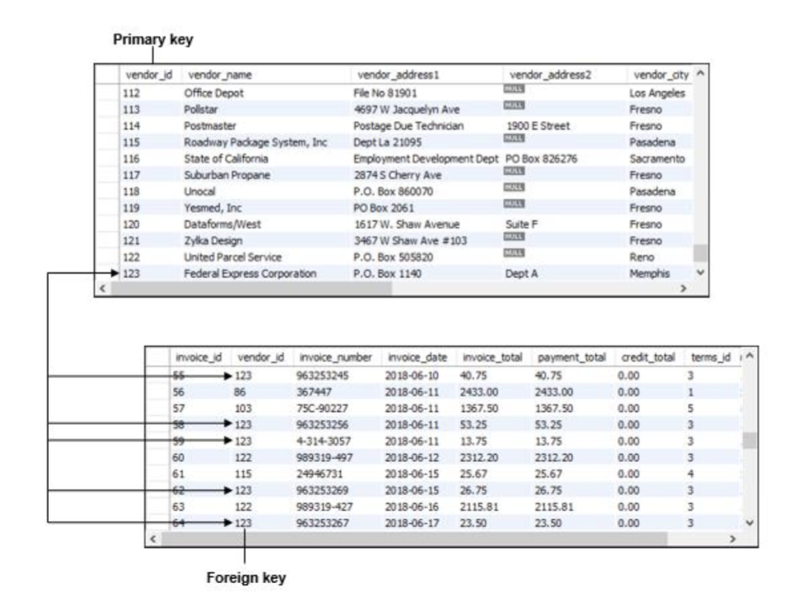
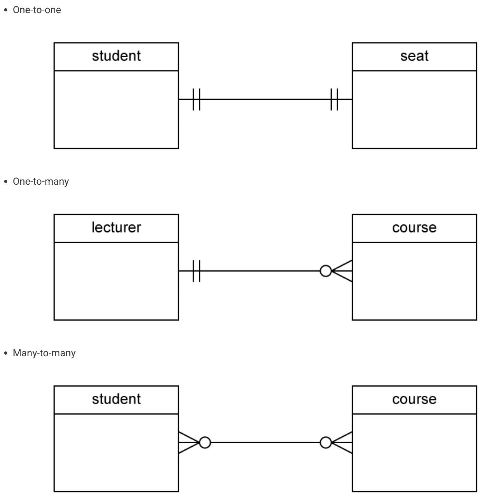
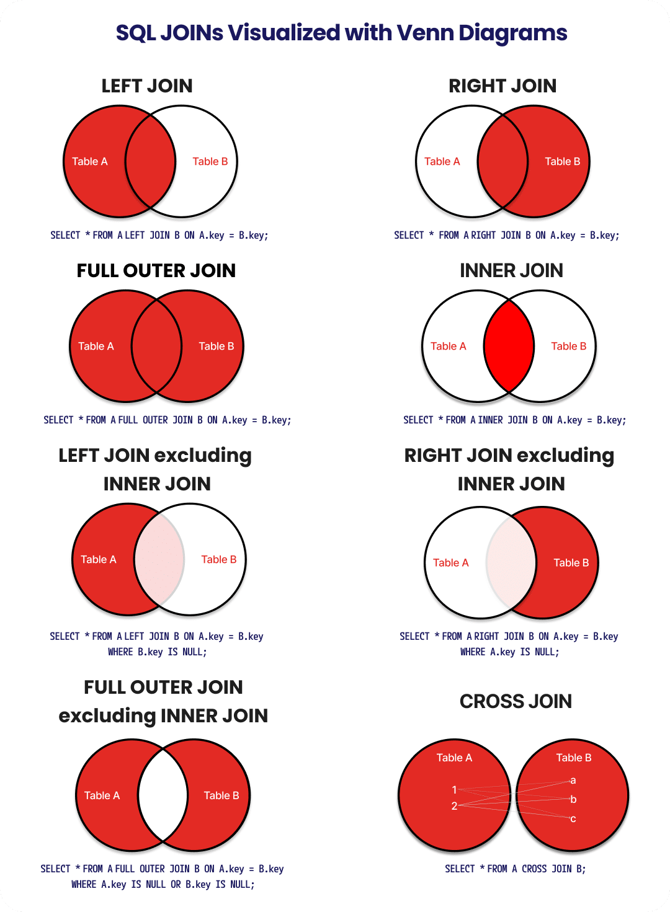

# PostgreSQL

> [!NOTE]
> Agnostic concept when dealing with information and large data...
> * `C`reate
> * `R`ead
> * `U`pdate
> * `D`elete
> 
> Postgresql also reads SQL statments as follows:
> * `WHERE` → `GROUP BY` → `HAVING` → `SELECT` → `ORDER BY`

## Relational Databases
* Relational (SQL-based, e.g., MySQL, PostgreSQL): Organized in tables with rows (records) and columns (fields). Data links via keys for efficiency and integrity.
    * Enforce structure (schema), rules like no duplicates, and ACID compliance (ensures safe transactions).
    * Best for structured data with relationships, like linking user credentials to orders.

### Terminology (Database Tables)

* `Tables` - the specific objects inside of a database that can be infinitely complex depending on the structure of the data you want to organize.
* `Row` - the unique set of information within the table that consist of unique cells
* `Columns` - the titles or header of the table they describe what is included inside the table
* `Cells` - the specific block or set of information that is contained within the table. The individual cross-section within the column or row.
* `Primary Key` - unique identifier that is used to identify the specific row (should always be **serial**); it's the left most identifier in the table (e.g., `customer_id`)
* `Foreign Key` - identifier that points to another table using that tables `Primary Key`
* Unique Key - a key agnostic to other keys (Primary and Foreign) that have been generated, used to verify than an operation has been completed...used to avoid redundancy within tables.
* `views (temporary tables)` - essentially a temporary table that is generated to demo or prototype data creation. Can be used as a `function` to avoid repeating 



* `Composite Key` - used to combine two different fields
* `Index` - catalog for faster searches on columns (like a book's index).

### Terminology (PostgreSQL Data Types)

1. https://www.postgresql.org/docs/current/datatype.html

#### Character Types
* `CHARACTER(n)`: Fixed-length character string of length (n).
* `CHARACTER VARYING(n)` (`VARCHAR(n)`): Variable-length character string with a maximum length of (n).
* `TEXT`: Variable-length character string with no specified upper limit.

#### Numeric Types
* `SMALLINT` (`int2`): Signed two-byte integer.
* `INTEGER` (`int`, `int4`): Signed four-byte integer.
* `BIGINT` (`int8`): Signed eight-byte integer.
* `NUMERIC(p,s)` (`DECIMAL(p,s)`): Exact numeric of selectable precision (p) and scale (s).
* `REAL` (`float4`): Single-precision floating-point number (4 bytes).
* `DOUBLE PRECISION` (`FLOAT`, `FLOAT8`): Double-precision floating-point number (8 bytes).
* `SERIAL` (`SERIAL4`): Autoincrementing four-byte integer (alias for `INTEGER` with a sequence).
* `BIGSERIAL` (`SERIAL8`): Autoincrementing eight-byte integer (alias for `BIGINT` with a sequence).

#### Date and Time Types
* `DATE`: Calendar date (year, month, day).
* `TIME[(p)] [WITHOUT TIME ZONE]`: Time of day (no time zone).
* `TIME[(p)] WITH TIME ZONE` (`TIMETZ`): Time of day, including time zone.
* `TIMESTAMP[(p)] [WITHOUT TIME ZONE]`: Date and time (no time zone).
* `TIMESTAMP[(p)] WITH TIME ZONE` (`TIMESTAMPTZ`): Date and time, including time zone.
* `INTERVAL [fields] [(p)]`: Time span.

#### Boolean Types
* `BOOLEAN` (`BOOL`): Logical Boolean value (true/false).

#### Binary Types
* `BYTEA`: Binary data (“byte array”).

#### Other Types
* `BIT(n)`: Fixed-length bit string of length (n).
* `BIT VARYING(n)` (`VARBIT(n)`): Variable-length bit string with a maximum length of (n).
* `MONEY`: Currency amount.
* `UUID`: Universally unique identifier.
* `XML`: XML data.
* `JSON`: Textual JSON data.
* `JSONB`: Binary JSON data, decomposed.

## Entity-Relationship Diagram (ERD)

### Terminology

1. https://www.red-gate.com/blog/crow-s-foot-notation

* Referential Integrity - a database rule ensuring relationships between tables stay valid, preventing "orphaned records" (like orders for non-existent customers)
* Alter Tables - altering tables after they've been made incorrectly.
* One to Many - one DB to many DBs
* One-to-One - one DB to one DB
* Many-to-Many - many DBs to many DBs
    * e.g., intermediate "views (temporary table)" the interface, "switch", or "core-router" within networks.  

### Visual



* A visual, structural **blueprint for a database**, illustrating how "entities" (people, objects, concepts) connect within a system
* **ESSENTIALLY** using the desired objective that you want the application to do and arranging and structuring the database in such a way that will allow the application to work...

## Normalization Format (NF)

### Mental Models for NF

* **1NF:** Are there any lists hidden in a single cell? 
  * *(Make each of them new rows).*
* **2NF:** Does this column depend on the *whole* (composite) primary key (e.g., `student_id`, `class_id`? 
  * *(Move it to its own table).*
* **3NF:** Does this column depend on a non-key column (e.g., `city`, `state`)?
  * *(Move it to its own table).*

---

* **1NF (Single Values & A Primary Key):** 
  * Data is organized into a table format, every row has a unique identifier (a Primary Key), and **every cell holds only one single value** (e.g. Excel dump).

* **2NF (No Partial Dependencies):** 
  * 1NF + you have a primary key made of **multiple columns** (a composite key); all the other columns must depend on that *entire* key, not just half of it.

* **3NF (No Transitive Dependencies):** No non-key column can depend on another non-key column. Breaking it out into its own table (e.g., a designated `address` or `location` table that can be referenced via `address_id` or `location_id`).

## SQL Basics

### Constraints

* `NOT NULL` – ensures that the values in a column cannot be NULL.
* `UNIQUE` – ensures the values in a column are unique across the rows within the same table.
* `PRIMARY KEY` – a primary key column uniquely identifies rows in a table. A table can have one and only one primary key. The primary key constraint allows you to define the primary key of a table.
* `CHECK` – ensures the data must satisfy a boolean expression. For example, the value in the price column must be zero or positive.
* `FOREIGN KEY` – ensures that the values in a column or a group of columns from a table exist in a column or group of columns in another table. Unlike the primary key, a table can have many foreign keys.

### SQL Command Structure

* Data Definition Language (DDL)
* Data Manipulation Language (DML)
* Data Control Language (or DCL)
* Transaction Control Language (TCL)

#### Data Manipulation Language (DML)
* `UPDATE`: Updates data in a database.
* `DELETE`: Deletes data from a database.
* `INSERT INTO`: Inserts new data into a database.
* `SELECT`: Extracts data from a database.

#### Data Definition Language (DDL)
* `CREATE DATABASE`: Creates a new database.
* `ALTER DATABASE`: Modifies a database.
* `CREATE TABLE`: Creates a new table.
* `ALTER TABLE`: Modifies a table.
* `DROP TABLE`: Deletes a table.
* `CREATE INDEX`: Creates an index (search key).
* `DROP INDEX`: Deletes an index.
* `COMMENT`: Commenting. 
* `TRUNCATE`: Reduce the field length.

### Basic SQL Queries

#### Database Normalization

* 1NF (First Normal Form): Each table has a primary key, each column contains unique values, each column contains values of a single type, column contains non-divisible units (atomic values), no repeating groups, or arrays.
* 2NF (Second Normal Form): Must be 1NF, each non-key column is dependent on the primary key, no partial dependencies.
  * For example, using a value inside a table that would change if 
* 3NF (Third Normal Form): Must be 2NF and no transitive dependencies.
  * Modifying one table, which forces a change in other tables. 

#### Extras from Midterm
* Crow's Foot Notation for UML: A notation used to represent database relationships visually.
* Aggregate Windows Function??
* LIMIT starting_point, return_count
* OFFSET starting_point, return_count
* JOINS - https://www.w3schools.com/sql/sql_join.asp

```sql
SELECT COUNT(DISTINCT invoice_id) AS 'count',

      ROUND(AVG(line_item_amount), 2) AS average_amount

FROM invoice_line_items
```

#### JOINs and View Creation

```sql
-- JOIN Basics --

-- 1. Selecting First, Last Name and Order Date

SELECT customer.first_name, customer.last_name, orders.date_order, location.address, location.city, location.state, location.zip_code

FROM customer

         INNER JOIN orders ON orders.customer_id=customer.customer_id

-- Inner join again linking orders by location

         INNER JOIN location ON location.customer_id=customer.customer_id;

-- 2. Orders by location

SELECT orders.order_id, location.address, location.city, location.state, location.zip_code

FROM orders

         INNER JOIN location ON location.customer_id=orders.customer_id;


-- 3. List customers by order date in descending order

SELECT customer.first_name, customer.last_name, orders.date_order

FROM orders

         INNER JOIN customer ON customer.customer_id=orders.customer_id

ORDER BY date_order DESC;

-- 4. Create a View to list customers by orders and full name storing
/*
* BASE: liq_store_sample
* The view serves as a "saved query" that acts a table that can be modified.
* To continual modify or update a view, you can use "CREATE OR REPLACE VIEW"
  */

CREATE OR REPLACE VIEW liq_store_sample AS

SELECT customer.first_name, customer.last_name, product.brand, order_items.quantity, product.prod_cost,
(product.prod_cost * order_items.quantity)

FROM customer

         INNER JOIN orders ON customer.customer_id=orders.customer_id

         INNER JOIN order_items ON orders.order_id = order_items.order_id

         INNER JOIN product ON order_items.product_id = product.product_id;

-- Testing View
SELECT * FROM liq_store_sample;
```

#### Indexing 

* [PostgreSQL Indexes](https://www.postgresql.org/docs/current/indexes-types.html)
* [Index Types](https://www.geeksforgeeks.org/postgresql/postgresql-index-types/)

B-tree: 
  * Self-balancing tree that maintains sorted data and allows searches, insertions, deletions, and sequential access in logarithmic time.
  * Most useful for the following operators:
    * `<`
    * `<=` 
    * `=`
    * `>=`
    * `>`
    * `BETWEEN` 
    * `IN` 
    * `IS NULL` 
    * `IS NOT NULL`

#### SQL Joins



```sql
CREATE VIEW liq_store_sample AS

    SELECT customer.first_name, customer.last_name, product.brand, order_items.quantity, product.prod_cost,
           (product.prod_cost * order_items.quantity)

    FROM customer

    INNER JOIN orders ON customer.customer_id=orders.customer_id

    INNER JOIN order_items ON orders.order_id = order_items.order_id

    INNER JOIN product ON order_items.product_id = product.product_id;

SELECT * FROM liq_store_sample;
```

#### Aggregations
```sql
SELECT COUNT(*), manufact
FROM product
GROUP BY manufact;

-- List of every manufact and the average price of each manufacturer in alphabetical order
SELECT manufact, AVG(prod_cost)
FROM product
GROUP BY manufact
ORDER BY manufact ASC;


SELECT  manufact, brand, MAX(prod_qty)
FROM product
GROUP BY manufact, brand
ORDER BY manufact DESC;

-- WHERE filters BEFORE Grouping
-- HAVING filters AFTER Grouping

SELECT manufact, COUNT(*)
FROM product
GROUP BY manufact
HAVING COUNT(*) > 3;

SELECT manufact, COUNT(*)
FROM product
WHERE prod_cost > 20
GROUP BY manufact
HAVING COUNT(*) > 3;
```

#### Masking Data and Creating Views (Permissions)

```sql
-- Masking Data and Creating Views (Permissions)

CREATE OR REPLACE VIEW customer_secure AS
SELECT customer.customer_id, customer.license, customer.phone_number
FROM customer;

GRANT SELECT ON customer_secure TO USER_NAME;
REVOKE SELECT ON customer FROM  USER_NAME;

-- Remove the view to update to a new view below
DROP VIEW customer_secure;


-- Masking DL with 'XXXX...'
/*
* The `right` allows for only 4 numbers to remain while masking the rest...
*/

CREATE OR REPLACE VIEW customer_secure AS
SELECT customer.customer_id, customer.first_name, customer.last_name,
'XXX-XXXX-' || RIGHT(customer.phone_number, 4) AS phone_number_secure,
'XXXX-XXXX-XXXX-' || RIGHT(customer.license, 4) AS dl_secure
FROM customer;

SELECT * FROM customer_secure;
```

#### Indexing

```sql
-- Creating an Index to Speed up Search
/*
Here we are indexing a specific cost typically the most useful when you have a large number of rows.
Defaults to B-tree
*/
CREATE INDEX index_name
ON MY_TABLE USING YOUR_HASH (indexed_column);

-- RIGHT JOIN

SELECT customer.first_name, customer.last_name, location.address, location.city, location.state, location.zip_code

FROM customer

    RIGHT JOIN location ON customer.customer_id=location.customer_id;
```

## Stored Procedures, Database Functions, and Triggers

### Primary Key Fix

* When you manually insert data with a specific ID (like `id=100`), the database's internal auto-increment counter (sequence) does not automatically skip to 101. 
* It might still try to use `1`, causing a "duplicate key value violates unique constraint" error. This script forces the counter to sync with the highest existing ID.

```sql
-- Reset the serial sequence to the max value in the table to prevent PK errors
SELECT setval(
    pg_get_serial_sequence('product', 'product_id'), 
    (SELECT MAX(product_id) FROM product)
);

```

### 1. Stored Procedures

A **Stored Procedure** is a set of SQL statements grouped together to perform a specific task.

* **Invocation:** Called using the `CALL` command.
* **Key Feature:** unlike Functions, Procedures **can manage transactions** (i.e., you can run `COMMIT` or `ROLLBACK` inside them).
* Typically used for complex business logic, batch updates, or administrative tasks (like adding a new product).

#### Procedure to Add a Product

```sql
CREATE OR REPLACE PROCEDURE add_new_product(
    p_upc VARCHAR(16),
    p_brand VARCHAR(255),
    p_mfg VARCHAR(255),
    p_distributor VARCHAR(255),
    p_quantity INTEGER,
    p_cost DOUBLE PRECISION
)
LANGUAGE plpgsql
AS $$
BEGIN
    -- Insert the data passed as parameters into the table
    INSERT INTO product (
        upc,
        brand,
        manufact,
        distributor,
        prod_qty,
        prod_cost
    )
    VALUES (
        p_upc,
        p_brand,
        p_mfg,
        p_distributor,
        p_quantity,
        p_cost
    );

    -- Optional: Notify the user/log that it worked
    RAISE NOTICE 'Product % successfully added.', p_brand;
END;
$$;

```

#### Usage

```sql
-- Execute the procedure
CALL add_new_product(
    '1234567890125',
    'Gentleman Jack',
    'Jack Daniels Distillery',
    'ABC Beverage Distributor',
    50,
    29.99
);

```

### 2. Database Functions (for Triggers)

**Concept:** A **Function** is a reusable block of code that returns a value.

* **Trigger Function:** A special type of function declared to return a `TRIGGER`. It does not accept arguments directly; instead, it accesses the row being modified via the special variable `NEW`.
* Used for calculations, data transformation, or validation logic used by a trigger.

#### Logic to Enforce Minimum Price

```sql
CREATE OR REPLACE FUNCTION ensure_min_price()
RETURNS TRIGGER AS $$
BEGIN
    -- Check if the incoming cost is less than 10.00
    IF NEW.prod_cost < 10.00 THEN
        -- Override the value to the minimum allowed
        NEW.prod_cost := 10.00;
    END IF;

    -- Return the modified row so the INSERT/UPDATE proceeds
    RETURN NEW;
END;
$$ LANGUAGE plpgsql;

```

### 3. Triggers

Basically an event listener that waits for a specific action (INSERT, UPDATE, DELETE) on a specific table and automatically fires a function.

* **`BEFORE` vs `AFTER`:**
* **BEFORE:** Best for validation or modifying data *before* it hits the disk.
* **AFTER:** Best for logging or updating *other* tables (e.g., "After a sale, update inventory").

#### Trigger Execution

* This binds the function above to the `product` table.

```sql
CREATE TRIGGER prevent_low_price
BEFORE INSERT OR UPDATE ON product
FOR EACH ROW
EXECUTE FUNCTION ensure_min_price();
```

## CTE and Subquery Practice
* [Common Table Expression (CTE)](https://www.geeksforgeeks.org/postgresql/postgresql-cte/)
  * A powerful feature that allows us to define temporary result sets that can be referenced within other SQL statements. This includes statements like `SELECT`, `INSERT`, `UPDATE`, or `DELETE`. CTEs make complex queries more readable and maintainable by breaking them into modular, reusable subqueries.

### 1. Total Spending Per Customer
```sql
-- 1. Find the total spending per customer and return only customers who have spent more than the average customer spending.
-- Inner Join customer + orders + order_items + product

WITH customer_spending AS (
    SELECT
        t1.customer_id,
        t1.first_name,
        t1.last_name,
        SUM(t3.quantity * t4.prod_cost) AS total_spent

    FROM
        customer AS t1
-- Customer to Orders
        INNER JOIN orders AS t2 ON t1.customer_id=t2.customer_id

-- Orders to Order Items

        INNER JOIN order_items AS t3 ON t2.order_id=t3.order_id

-- Product to Order Items to Product
        INNER JOIN product AS t4 ON t3.product_id=t4.product_id

    GROUP BY
        t1.customer_id,
        t1.first_name,
        t1.last_name
)

-- PostgresSQL sub-query (identified by the use of "WHERE total_spent > (SELECT...)"
SELECT *
FROM customer_spending
WHERE total_spent > (SELECT AVG(total_spent) FROM customer_spending)
ORDER BY total_spent DESC;
```

### 2. All Products Sold

```sql
-- 2. Retrieve all products that have been sold in orders with total quantities greater than 2 (need to modify to 10) items.

SELECT
    t1.product_id,
    t1.brand,
    t1.manufact,
    SUM(t2.quantity) AS total_quantity

-- Inner join to give access to product and order_items tables

FROM
    product AS t1
    INNER JOIN order_items AS t2 ON t1.product_id=t2.product_id

GROUP BY
    t1.product_id,
    t1.brand,
    t1.manufact

-- Using HAVING instead of `WHERE IN`, `HAVING` is much cleaner.

HAVING
    SUM(t2.quantity) > 3;
```

### 3. Total Age > Average Age
```sql
-- 3. Find customers whose total age is greater than the average of all customers and who purchased Anheuser-Busch.

WITH task3 AS (
    SELECT t2.order_id,
       t1.first_name,
       t1.last_name,
       AGE(t1.dob) as age,
       t3.product_id,
       t4.brand,
       t4.manufact,
       t4.distributor


-- t1 = customer
-- t2 = orders
-- t3 = order_items
-- t4 = product


FROM customer as t1
         INNER JOIN orders AS t2 ON t1.customer_id = t2.customer_id

         INNER JOIN order_items AS t3 ON t2.order_id = t3.order_id

         INNER JOIN product AS t4 ON t3.product_id = t4.product_id

GROUP BY t2.order_id,
         t1.first_name,
         t1.last_name,
         age,
         t3.product_id,
         t4.brand,
         t4.manufact,
         t4.distributor)

SELECT *
FROM task3
WHERE age > (SELECT AVG(age) FROM task3) AND
      manufact = 'Anheuser-Busch';
```

### 4. Highest Quantity and Cost Combo

```sql
-- 4. Retrieve orders that match the highest quantity and highest cost combination sold in the system.

SELECT
    t1.customer_id,
    t1.first_name,
    t1.last_name,
    t3.quantity AS max_quantity,
    t4.prod_cost AS max_cost,
    t4.brand

FROM
    customer AS t1
-- Customer to Orders
        INNER JOIN orders AS t2 ON t1.customer_id=t2.customer_id

-- Orders to Order Items

        INNER JOIN order_items AS t3 ON t2.order_id=t3.order_id

-- Order Items to Product
        INNER JOIN product AS t4 ON t3.product_id=t4.product_id

    WHERE
        t3.quantity = (SELECT MAX(t3.quantity)
    FROM
        product AS t4
            INNER JOIN order_items AS t3 ON t3.product_id=t4.product_id
    )

    OR

    t4.prod_cost = (SELECT MAX(t4.prod_cost)
    FROM
        product AS t4
            INNER JOIN order_items AS t3 ON t3.product_id=t4.product_id);
```

### 5. Frequent Shoppers
```sql
-- 5. I need a list of everyone who has shopped with us more than 3 times and spent over $100.


WITH power_users AS (SELECT t1.customer_id,
                            t1.first_name,
                            t1.last_name,
                            t1.email,
                            COUNT(t3.quantity) AS visit,
                            SUM(t3.quantity * t4.prod_cost) AS total_spent

                     -- t1 = customer
                     -- t2 = orders
                     -- t3 = order_items
                     -- t4 = product

                     FROM customer AS t1
-- Customer to Orders
                              INNER JOIN orders AS t2 ON t1.customer_id = t2.customer_id

-- Orders to Order Items

                              INNER JOIN order_items AS t3 ON t2.order_id = t3.order_id

-- Product to Order Items to Product
                              INNER JOIN product AS t4 ON t3.product_id = t4.product_id

                     GROUP BY t1.customer_id,
                              t1.first_name,
                              t1.last_name,
                              t1.email)
SELECT *
FROM power_users
WHERE (total_spent >= 100 AND visit > 2);
```

### 6. All Orders > Average Order Cost
```sql
-- 6. List all ORDERS whose total order cost is greater than the overall average order cost.

WITH cte_avg_order AS (SELECT t2.order_id,
                                   t1.first_name,
                                   t1.last_name,
                                   SUM(t3.quantity * t4.prod_cost) AS sum_of_orders
                            -- t1 = customer
                            -- t2 = orders
                            -- t3 = order_items
                            -- t4 = product

                            FROM customer as t1
                                     INNER JOIN orders AS t2 ON t1.customer_id = t2.customer_id

                                     INNER JOIN order_items AS t3 ON t2.order_id = t3.order_id

                                     INNER JOIN product AS t4 ON t3.product_id = t4.product_id

                            GROUP BY t2.order_id,
                                     t1.first_name,
                                     t1.last_name)

SELECT *
FROM cte_avg_order
WHERE sum_of_orders > (SELECT AVG(sum_of_orders) FROM cte_avg_order);
```

### 7. Most Frequently Used Distributor
```sql 
-- 7. Find customers who have purchased products supplied by the most frequently used distributor.
-- Highest quantity from order_items, tied to order_id (Basically #6)

WITH cte_freq_distributor AS (SELECT t2.order_id,
                                     t1.first_name,
                                     t1.last_name,
                                     t3.product_id,
                                     t4.distributor,
                                     t4.brand,
                                     SUM(t3.quantity) as total_quantity


                              -- t1 = customer
                              -- t2 = orders
                              -- t3 = order_items
                              -- t4 = product


                              FROM customer as t1
                                       INNER JOIN orders AS t2 ON t1.customer_id = t2.customer_id

                                       INNER JOIN order_items AS t3 ON t2.order_id = t3.order_id

                                       INNER JOIN product AS t4 ON t3.product_id = t4.product_id

                              GROUP BY t2.order_id,
                                       t1.first_name,
                                       t1.last_name,
                                       t3.quantity,
                                       t3.product_id,
                                       t4.distributor,
                                       t4.brand
                              ORDER BY total_quantity DESC

)

SELECT *
FROM cte_freq_distributor;
```

## `CASE` Statements and `CHECK` Constraints

* https://neon.com/postgresql/postgresql-tutorial/postgresql-case
* Used to define different outputs based on conditions, categorize data on the fly, and useful for creating reports or segmenting data.

### Simple `CASE` Statment Example
```sql
SELECT title,
       rating,
       CASE rating
           WHEN 'G' THEN 'General Audiences'
           WHEN 'PG' THEN 'Parental Guidance Suggested'
           WHEN 'PG-13' THEN 'Parents Strongly Cautioned'
           WHEN 'R' THEN 'Restricted'
           WHEN 'NC-17' THEN 'Adults Only'
       END rating_description
FROM film
ORDER BY title;
```

### Simple `CHECK` Constraints

* https://neon.com/postgresql/postgresql-tutorial/postgresql-check-constraint
* Basically user input validation, BUT for the database where you ensure specific values like negative numbers, special characters, etc. aren't entered into the database (e.g., when updating or inserting value into a table).

> [!NOTE]
> 
> `CASE` matches on what a field **SHOULD BE** (e.g., 'G', 'PG', 'PG-13', 'R', 'NC-17', etc.)
> `CHECK` matches on what specific values **ARE** (e.g., non-negative, > 0, etc.)

```sql
CREATE TABLE employees (
  id SERIAL PRIMARY KEY,
  first_name VARCHAR (50) NOT NULL,
  last_name VARCHAR (50) NOT NULL,
  birth_date DATE NOT NULL,
  joined_date DATE NOT NULL,
  salary numeric CHECK(salary > 0) -- Check constraint here!
);
```