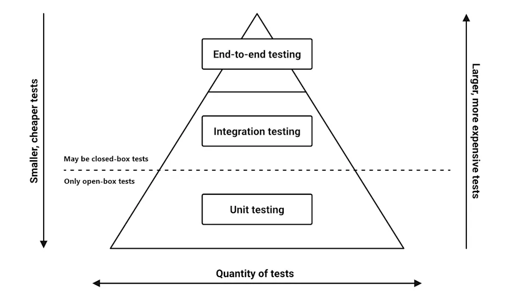
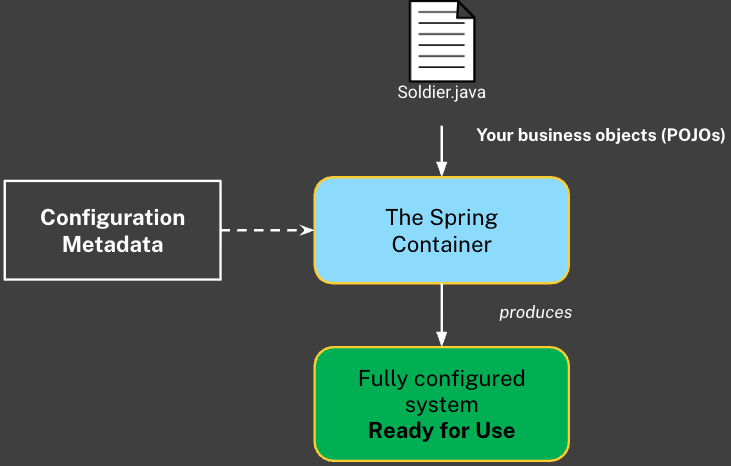
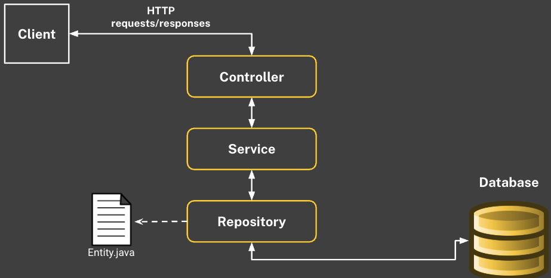
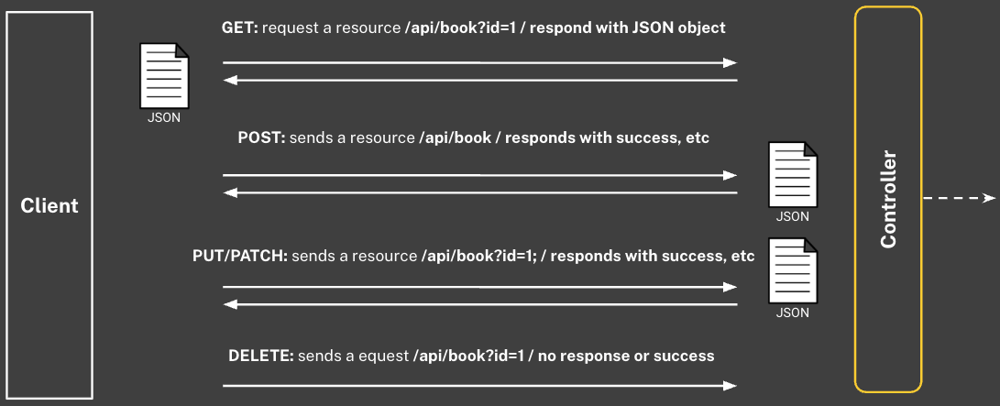
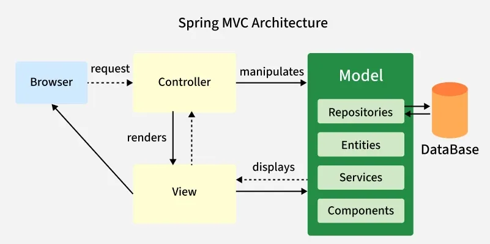
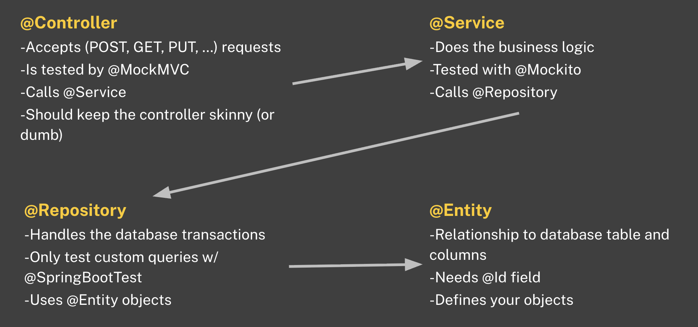

# Java Specific Fundamental Concepts

## Background About Java and IntelliJ Shortcuts

> A pure OOP language, EVERYTHING must live inside a class...
>
> Java data types: be sure to understand the data types that you are working with. Choosing the wrong data type can lead to large memory usage in large systems.
* `JVM` - Utilizes the JVM which is hardware-agnostic and uses the Java Virtual Machine (JVM) making it cross compatible.

## Java Programming Concepts and Terminology

### Terminology

* **Overloading**: The ability to have multiple functions with the same name but different parameters, not best practice!
* **Static Attributes (Variables)**: used to store data that is constant throughout the program. For example, the number of active connections to a database, the number of users logged in. Static variables are declared at the class level and are instantiated immediately upon class loading.

* **Lifetime**: How long a variable has a location in memory
* **Scope**: the visibility of a variable within a program.

* **Local Variable**: something defined within the scope of the code block and cannot be outside of it.
```java
if(x > 10) {
    String local = "Local value";
}
```
* **Instance Field or Field:** a variable that's bound to the object itself. I can use it in the object without the need to use accessors, and any method contained within the object may use it.
    * **Signature**: is the method's name and parameters that define how the method is called (e.g., `public countOfApples()` below)
    * **Header**: is the method's entire name, return type, method name, and parameters (e.g., `public void countOfApples(...)`)
```java
public class Point {
    private int numberOfApples;

    public void countOfApples() {
        System.out.println("Apples are: " + numberOfApples);
    }
}
```
* **Input Parameter, Parameter, Argument:** something that we pass into a method or constructor and is defined in the constructor.
```java
public class Point {
    private int numberOfApples;
    public countOfApples(int apples) {
        numberOfApples = apples; // Option 1
        this.numberOfApples = apples ; // Option 2
   }

    public void setApples(int apples) {
        numberOfApples = apples; // Option 1
        this.numberOfApples = apples; // Option 2
    }
}
```
* **Class (Static) Field**: similar to field, but the difference is that you don't need to have an instance of the containing object to use it.
```java
System.out.println(Integer.MAX_VALUE);
```

* **Non-Primitive / Reference Type**: A variable that holds a memory address (pointer) to an object on the heap, not the value itself. It allows for complex structures and can be `null`.
  * `String s = "hello";` — `s` is the variable that **points** to the string object ("hello") on the heap.

* **Primitive Type**: A built-in type that stores the actual value directly in the variable (no pointer or heap involved). The 8 primitives are `byte`, `short`, `int`, `long`, `float`, `double`, `char`, `boolean`. They can't be `null`.
  * `int age = 30;` — `age` contains value 30 directly.

* **Private Property**: A class field declared with the `private` keyword to hide it from direct access outside the class. It enforces encapsulation, allowing control via getters/setters.
  * `private String name;` — Only accessible within the class or through methods.

* **Constructor**: A method that is the **same name as the class**, that runs when creating an object with `new`. It initializes the object's state (fields) using passed parameters.
```java
// Constructor
public Person(String name) { this.name = name; } 

// Constructor is called with the String "Alice" as a parameter
Person p1 = new Person("Alice");
```

* **Setter**: A public method that updates a private field with **validation or checks**, controlling how values are set from outside the class.
  * `void` = #**SETTING**TheTable; any output is sent into the **`void`** never to be seen.
```java
// Validation of age before assignment
public void setAge(int age) { if (age > 0) this.age = age; } 
```

* **Getter**: A public method that returns the value of a private field, providing **read-only access** without exposing the field directly.
  * **Non-void** = "reporters' #**GETTING**TheMeal

```java
// Just retrieves the value
public String getName() { return name; }
```

* **Instance Object**: A specific, unique object created from a class using `new`. Each instance has its own state (field values), separate from others of the same class.

```java
// p1 and p2 are two "instances objects"
Person p1 = new Person("Alice"); 
Person p2 = new Person("Bob");
```

* **Composition Relationship**: A "has-a" relationship where one class owns an instance of another as a field.

### `static` vs. `void`

#### 1. `void` Answers: "What do you give back?"

Every method in Java must declare a **return type**. It has to tell the compiler what kind of data it will hand back when it finishes running.

* **Return Types (`int`, `String`, `boolean`, etc.):** The method does some work and gives you a specific piece of data back (a "receipt").
* **`void`:** The method performs an action (like printing to the console, changing a variable, or adding an item to a list) but returns **nothing**. It does its job and quietly finishes.

**Example:**

```java
// Returns an integer
public int calculateAge(int birthYear) {
    return 2024 - birthYear;
}

// Returns nothing, just performs an action
public void printWelcomeMessage() {
    System.out.println("Welcome to the company!");
}
```

#### 2. `static` Answers: "Who owns this?"

This keyword is all about Object-Oriented architecture: the difference between the **Blueprint** (the Class) and the **House** (the Object).

* **Non-Static (Instance Methods/Variables):** These belong to a specific *House*. You must build an object using the `new` keyword before you can use them. If you create three different `Company` objects, they each get their own separate `employees` list.
* **`static` (Class Methods/Variables):** These belong to the *Blueprint*. They exist independently of any objects, and there is only ever **one** copy of them shared across the entire program. You don't need to build an object to use them.

**The Golden Rule of Static:** A `static` method is "blind" to instance variables. The Blueprint doesn't know what color the walls are in a specific House. *Therefore, a static method cannot directly interact with a non-static variable.*

#### 3. The Combo: `static void`

When you put them together, you are simply stating two separate facts about the method:

1. **`static`:** This method belongs to the Class blueprint, not an instantiated object.
2. **`void`:** This method will not return any data when it finishes.

**Example:**

```java
// Belongs to the Main class itself, and returns nothing.
public static void main(String[] args) { ... }
```

### Java OOP Concepts

#### Access Modifiers (The Security Guards)
* **`public`**: **Everyone.** Any class, anywhere in the program, can access it. Normally used for methods that other classes need to use.
* **`private`**: **Only the class itself.** No one outside the class can see it. Used for sensitive data (attributes/properties). Outsiders must use a `public` Getter or Setter to interact with it.
* **`protected`**: **Children AND package neighbors.** Visible to subclasses (children) *and* any other classes sitting in the exact same folder (package). (Semi-Private).

#### Method Manipulation (Changing Behaviors)
* **Overload**: Same method name, **different signature** (parameters). Giving the exact same method multiple ways to behave depending on what data is passed in.
* **Override**: Same method name, **same signature**. The Child writes its own method to completely replace the parent's version of that method.

#### The `super` Keyword (Talking to the Parent)
* **`super()`**: Calls the **Parent's Constructor**. It must be the very first line inside the child's constructor.
* **`super.value` / `super.methodName()`**: Accesses a specific variable or method located in the parent.

#### The `final` Keyword (The Padlock)
* **`final` Class**: Used to prevent any other children from inheriting from a class. No one can ever 'extend' it.
* **`final` Method**: A child class can inherit this method, but they are **never allowed to Override it**.
* **`final` Variable**: The value is locked forever (a constant).

### Coupling and Cohesion

* **Nouns (Classes):**
  * These are the **Things** (e.g., `Car`, `School`, `SecurityLog`, `MenuOptions`).
  * They act as blueprints. They define properties (state) and can be instantiated into specific objects.

* **Verbs (Methods):**
  * These are the **Actions** (e.g., `calculateMileage`, `measureCourseProgress`).
  * They live inside the Nouns. They perform calculations, modify data, or handle Input/Output.

* **Coupling:**
  * This is the degree to which one class relies on another (we want coupling to be **LOW**).
  * Essentially the code the use should be "Plug and Play", if you change the code in `MenuOptions`, it should not break the code in `Main`. Low coupling allows for easier maintenance and reusability.

* **Cohesion**
  * This is the degree to which the elements inside a single class or method belong together (we want cohesion to be **HIGH**).
  * The thing that came to mind is a concept in Graph Theory and Network Architecture of "Eigenvector Centrality" (e.g., how reliant one node is to the entire network). Basically, lines of code within a method should be tightly dependent on one another. They should focus on solving one specific problem without "noise" or unrelated tasks.

**Method Naming**
* If you cannot describe what a function does using a **single verb**, it is likely doing too much. 
  * Break complex methods (e.g., `calculateAndPrint()`) into smaller, single-purpose methods (`calculate()`, then `print()`) for High Cohesion.

```java
// Person "has an" Address
class Person { private Address address; public Person(Address addr) { address = addr; } } 
```

> [!NOTE]
> 
> If "**X is-a Y**" sounds logical, use inheritance (e.g., a Dog is-an Animal) 
> 
> If "**X has-a** Y" sounds logical and multiple classes can use it (e.g., Person has-an Address), use composition instead.

## Java Coding Examples

### Scanner Usage, Setters, Getters, ToString (Automobile)

* Prompting the user to input multiple sections of information via `Scanner` and output the content via `System.out.println()`
* Later I want to look into using [joptionpane](https://www.geeksforgeeks.org/java/java-joptionpane/) for a GUI pop-up...

```java
public class Automobile {
    private static int numberOfObjects = 0 ;
    private double price ;
    private String make ;
    private Tire tire ;

    // Default Constructors

    public Automobile() {
        this(0.0, "none", new Tire());
    }

    // Non-default Constructors

    public Automobile (double price, String make, Tire tire) {
        this.price = price ;
        this.make = make ;
        this.tire = tire ;
        numberOfObjects++ ;
    }
     // Setters
    public void setPrice (double price) { this.price = price  ; }
    public void setMake (String make) { this.make = make ; }
    public void setTire (Tire tire) { this.tire = tire ; }

    // Getters

    public double getPrice() {
        return price;
    }

    public String getMake() {
        return make;
    }

    public Tire getTire() {
        return tire;
    }

    public static int getNumberOfObjects() {
        return numberOfObjects;
    }

    @Override
    public String toString() {
        return "Automobile {" +
                "Price (double) = " + price +
                ", Make (String) = '" + make + '\'' +
                ", Tire (String) = " + tire +
                '}';
    }
}
```

```java
public class Tire {
    private double price ;
    private String make ;
    private int mileage ;

    // Default Constructor
    public Tire () {
        price = 0.0 ;
        make = "none" ;
        mileage = 0 ;
    }

    // Non-default Constructor
    public Tire (String make, int mileage, double price) {
        this.price = price ;
        this.make = make ;
        this.mileage = mileage ;
    }

    // Setters
    public void setPrice (double price) { this.price = price ; }
    public void setMake (String make) { this.make = make ; }
    public void setMileage (int mileage) { this.mileage = mileage ; }

    // Getters
    public double getPrice () { return price ; }
    public String getMake () { return make ; }
    public int getMileage () { return mileage ; }

    @Override
    public String toString() {
        return "Tire {" +
                "Price (double) = " + price +
                ", Make (String) = '" + make + '\'' +
                ", Mileage (int) = " + mileage +
                '}';
    }
}
```

```java
public class Demo {

    public static void main(String[] args) {

        // Instance 1 Defaults Only

        Automobile auto1 = new Automobile() ;

        // Instance 2 Passing via Parameters

        Automobile auto2 = new Automobile(4250.00, "VW", new Tire("Costco Brand", 10000, 500.00)) ;

        // Instance 3 User Input with Prints In-between

        Automobile auto3 = new Automobile() ;
        Scanner scanner = new Scanner(System.in) ;
        double price ;
        String make ;

        // Breaking up the input process using Scanner()

        System.out.println("Enter automobile price (int): ") ;
        price = scanner.nextDouble() ; scanner.nextLine() ;

        System.out.println("Enter automobile make (String): ") ;
        make = scanner.nextLine() ;

        System.out.println("Enter tire make (String): ") ;
        String tireMake = scanner.nextLine() ;

        System.out.println("Tire mileage (int): ") ;
        int tireMileage = scanner.nextInt() ; scanner.nextLine() ;

        System.out.println("Tire price (double): ") ;
        double tirePrice = scanner.nextDouble() ; scanner.nextLine() ;

        auto3.setPrice(price) ;
        auto3.setMake(make) ;

        // Creating a Tire object and setting it to the Tire class that requires double, String, int from the Tire Class!
        auto3.setTire(new Tire(tireMake, tireMileage, tirePrice)) ;

        // Final Output
        System.out.println("1:" + " " + auto1.getPrice() + " " + auto1.getMake() + " " + auto1.getTire()) ;
        System.out.println("2:" + " " + auto2.getPrice() + " " + auto2.getMake() + " " + auto2.getTire()) ;
        System.out.println("3:" + " " + auto3.getPrice() + " " + auto3.getMake() + " " + auto3.getTire()) ;

        // Counter to Determine Objects Created
        System.out.println("Current Object Creation Total:" + " " + Automobile.getNumberOfObjects()) ;
    }

}
```

### For-Loop Practice

#### Retirement Calculator

```java
import java.text.DecimalFormat;
import java.util.Scanner;

public class InvestmentCalculator {

    // Creating a tool to calculate the future value of an investment.

    public static void main(String[] args) {

        Scanner obj = new Scanner(System.in);
        System.out.println("Welcome to the Investment Calculator!\n");

        System.out.print("How Much Do You Have Saved? ");
        double currentBalance = obj.nextDouble(); obj.nextLine();

        while (currentBalance < 0) {
            System.out.println("You cannot enter a negative number, try again!");
            currentBalance = obj.nextDouble(); obj.nextLine();
        }

        System.out.print("Enter the Current Interest Rate: ");
        double interestRate = obj.nextDouble(); obj.nextLine();

        while (interestRate < 0) {
            System.out.println("Please enter a valid interest rate:");
            interestRate = obj.nextDouble(); obj.nextLine();
        }

        System.out.print("Enter your age: ");
        int userAge = obj.nextInt();
        obj.nextLine();

        while (userAge < 0) {
            System.out.println("Please enter a valid age:");
            userAge = obj.nextInt(); obj.nextLine();
        }

        System.out.print("Enter your desired retirement age: ");
        int retirementAge = obj.nextInt();
        obj.nextLine();

        while (retirementAge < userAge || retirementAge == 0) {
            System.out.println("Please enter a retirement age greater than your current age:");
            retirementAge = obj.nextInt(); obj.nextLine();
        }

        int yearsToRetirement = retirementAge - userAge;
        for (int i = 0; i < yearsToRetirement; i++) {
            double newBalance;
            newBalance = currentBalance + (currentBalance *(interestRate/100));
            currentBalance = newBalance;

            // Formatted output (https://www.geeksforgeeks.org/java/formatted-output-in-java/)
            DecimalFormat account = new DecimalFormat("$###,###,###,###,###.##");
            System.out.println("Year " + (i + 1) + ": " + account.format(currentBalance));
        }
    }
}
```

### While Loop Practice

#### SavingsGoal.java

```java
public class SavingsGoal {
    public static void main(String[] args){

        Scanner scanner = new Scanner(System.in);

        System.out.println("What's Your Savings Goal?");
        int savingsGoal;
        savingsGoal = scanner.nextInt();

        while (savingsGoal <= 1) {
            System.out.println("Invalid amount, please enter a savings goal greater than 1...");

            System.out.println("\n") ;

            System.out.println("What's Your Savings Goal?");
            savingsGoal = scanner.nextInt();
        }

        int totalSaved = 0 ;
        while (totalSaved < savingsGoal){

        System.out.println("Enter Deposit Amount: ");
        int depositAmount = scanner.nextInt();

            totalSaved += depositAmount ;

            if (totalSaved >= savingsGoal) {
                break;
            }
        System.out.println("You have $" + totalSaved + " so far." + " " + "You need $" + (savingsGoal - totalSaved) + " " + "to reach your goal!");

        }
        System.out.println("Congratulations, you've saved $" + totalSaved + " " + "towards your phone!") ;

    }
}
```

#### MenuOptions.java

```java
package feb_9_13.feb_12_more_while;

import java.util.Scanner;

public class MenuOptions {

  public static void displayMenuItems(){
    System.out.println("1. Add");
    System.out.println("2. Subtract");
    System.out.println("3. Display");
    System.out.println("4. Exit");
  }

  public static void add(){

    Scanner obj = new Scanner(System.in);
    System.out.println("Enter first number: ");
    int num1 = obj.nextInt(); obj.nextLine();

    System.out.println("Enter second number: ");
    int num2 = obj.nextInt(); obj.nextLine();

    int sum = num1 + num2;
    System.out.println("The sum is: " + sum);
  }

  public static void sub(){

    Scanner obj = new Scanner(System.in);
    System.out.println("Enter first number: ");
    int num1 = obj.nextInt(); obj.nextLine();

    System.out.println("Enter second number: ");
    int num2 = obj.nextInt(); obj.nextLine();

    int diff = num1 - num2;
    System.out.println("The difference is: " + diff);

  }

  // NOTE: Passing the message from Main into this function!!
  public static void displayUserMessage(String messageForUser){

    System.out.println("Your Message Is: " + messageForUser);

  }

  public static void exit(){
    System.out.println("Exiting Program...");
  }


}
```

#### Main.java (for MenuOptions.java)
```java
package feb_9_13.feb_12_more_while;

import java.util.Scanner;
import static feb_9_13.feb_12_more_while.MenuOptions.*;

public class Main {

  // Display a menu with four options
  // add: call a function that will accept two numbers and display the output (sum)
  // sub: call a function that will accept two numbers and display the output (difference)
  // display: Accept a message from the user and pass the message as a display option
  // exit: exit the program

  public static void main(String[] args){

    Scanner obj = new Scanner(System.in);
    int userChoice;
    System.out.println("Please Select an Option..." );
    displayMenuItems();

    userChoice = obj.nextInt(); obj.nextLine();

    while (userChoice != 4){

      switch(userChoice){
        case 1: add(); break;

        case 2: sub(); break;

        case 3: System.out.println("Enter your message: ");
          String messageForUser = obj.nextLine();

          // Here we are passing the message to be displayed in the displayUserMessage method!
          displayUserMessage(messageForUser);

          break;

        case 4: exit(); break;
        default: System.out.println("Invalid Option, Please Try Again");
      }

      displayMenuItems();

      System.out.println("Please Select an Option..." );

      userChoice = obj.nextInt(); obj.nextLine();

    }

  }
}
```

#### Binary Search Example

```java
import java.util.Scanner;

public class BinarySearch {
    public static void main(String[] args){
        Scanner obj = new Scanner(System.in);

        int upper;
        int lower;
        boolean found = false;
        int attempts = 0;

        System.out.println("Enter Upper Limit: ");
        upper = obj.nextInt(); obj.nextLine();

        System.out.println("Enter Lower Limit: ");
        lower = obj.nextInt(); obj.nextLine();

        System.out.println("Enter the Correct Guess: ");

        System.out.println("As the program proceeds, enter high, low, or correct: ");

        // Implementation of the Binary Search Algorithm
        int machineGuess = lower + (upper - lower) / 2;

        while (!found){

            System.out.println("My guess is " + machineGuess);

            String myResponse = obj.nextLine();

            System.out.println("Current Upper Value: " + upper);
            System.out.println("Current Lower Value: " + lower);

            if (lower > upper) {
                System.out.println("You're either cheating OR you forgot your number, try again!");
                break;
            }

            else if (myResponse.equals("high")) {

                upper = machineGuess - 1;
                machineGuess = lower + (upper - lower) / 2;
                attempts++;
            }

            else if (myResponse.equals("low")) {

                lower = machineGuess + 1;
                machineGuess = lower + (upper - lower) / 2;
                attempts++;
            }

            else if (myResponse.equals("correct")) {
                found = true;
            }

        }

        System.out.println("Total Attempts Taken: " + attempts);
    }
}
```


### Do-While Loop Practice

#### Main.java

```java
public class Main {

    public static void main(String[] args) {
        System.out.println("Welcome to the Calculate Average Tool!\n");

        Scanner obj = new Scanner(System.in);
        int userInput;

        System.out.println("Please Select an Option: ");
        displayMenu();
        userInput = obj.nextInt(); obj.nextLine();

        do{
            switch(userInput){
                case 1: calculateAverage(); break;
                case 2: calculateMinimum(); break;
                case 3: exit(); break;
                default: System.out.println("Invalid Option Selected");
            }

            displayMenu();
            System.out.println("Please Select an Option:");
            userInput = obj.nextInt(); obj.nextLine();

        }while(userInput != 3);
    }
}
```

#### AverageCalc.java

```java
import java.util.Scanner;

public class Average {

    public static void displayMenu() {
        System.out.println("1. Calculate Average\n2. Calculate Minimum\n3. Exit");
    }

    public static void calculateMinimum() {

        Scanner obj = new Scanner(System.in);
        System.out.println("Enter the number of values to find minimum of: ");
        int numberLimit = obj.nextInt();
        obj.nextLine();
        int minimum = Integer.MAX_VALUE;

        for (int i = 0; i < numberLimit; i++) {
            System.out.println("Enter a Number for Comparison: ");
            int userInput = obj.nextInt(); obj.nextLine();

            if (userInput == -99){
                System.out.println("User Entered -99, Exiting...");
                exit();
            }

            else if (minimum > userInput){
                minimum = userInput;
            }

        }
        System.out.println("The minimum value is: " + minimum);

    }

    public static void calculateAverage() {
        Scanner obj = new Scanner(System.in);

        System.out.println("Enter the number of values you want to find the average for: ");
        int numberLimit = obj.nextInt();

        while (numberLimit <= 0){
            System.out.println("Invalid number of values, please enter a positive number");
            numberLimit = obj.nextInt();
        }

        // Placing the list of user input numbers into an ARRAY (dictionary), this was much easier for the calculation.
        double[] array = new double[numberLimit];
        double totalCost = 0.0;

        for (int i = 0; i < array.length; i++) {
            System.out.println("Enter a Number for Average Calculation: ");
            array[i] = obj.nextDouble();

            while (array[i] <= 0){
                System.out.println("Negative number's aren't allowed, please enter another number to average");
                array[i] = obj.nextDouble();
            }
        }

        for (int i = 0; i < array.length; i++) {
            totalCost = totalCost + array[i];
        }

        double average = totalCost / array.length;
        System.out.println("Average: " + average);

    }

    public static void exit() {
        System.out.println("Thank you for using the Calc, Goobye!");
        System.exit(0);
    }

}
```

### Arrays

#### Basic Arrays

##### ScoreBoard.java

```java
import java.util.Scanner;

public class score_board {

    public static void main(String[] args){

        /// NOTE 1: Java has a built-in "Arrays.toString()" function that can easily output the contents of a list
        /// NOTE 2: Use a for-loop if you want to customize the output of something, use "Arrays.toString()" when you want a quick method to output contents

      /// Specific if you want to initialize a new Class object OR a new LIST!
        int [] scores = new int[5];
        Scanner obj = new Scanner(System.in);

        for(int i=0; i < scores.length; i++){
            System.out.println("Enter your score...");
            
            /// KEY: since arrays function via indicies, we use "i" to iterate and add space inside of the array as needed.
            scores[i] = obj.nextInt();
        }
            System.out.println("--- FINAL HIGH SCORES ---");

        for(int j = 0; j < scores.length; j++){
            System.out.print(scores[j] + " ");
        }
    }
}
```


### Recursion Fundamentals

**When to Use Recursion: Sanity Check**

1. Any problem that can be defined within itself, but optimized and smaller... (called the **`Recursive Case`**).
2. If there is a trivial case... Meaning that it being stated is itself (e.g., 1! is 1). (called the **`Base Case`**).
3. When working with inherently recursive data structures, such as navigating file directories, trees, or graphs.
4. When a problem can be easily broken down into smaller, identical sub-problems (often referred to as a "Divide and Conquer" approach).

#### How to Solve Recursion

1. Identifying the terminating Case (the **Base Case**), or the logic or "equation" that describes the problem or that can be reused.
> [!WARNING]
> Without a proper terminating case, your Java program will run infinitely and crash with a `StackOverflowError`

2. **DEFINE** the problem in terms of itself (the logic of the solution within itself). You must ensure that **every time you define the problem within itself, the input gets closer to the terminating case**.
3. Determine what data needs to be returned and how the results of those smaller sub-problems will combine to give you your final answer.


> [!NOTE]
> Don't solve the problem! Just define the problem!
> If it reads right, then it is right!
> Defining the **limiting** OR **boundary conditions** that are required to solve the problem
> The computer uses a "Call Stack" to remember where it left off. Every time a recursive definition is called, it pauses the current step, adds a new step to the top of the stack, and waits for the smaller problem to finish first.

#### Factorial

```java
    public static int factorial(int n){

        ///  Define terminating case... Essentially conditions that make the solution trivial...

        if (n == 1)
            return 1;

        ///  Define the problem in terms of itself...
        return n * factorial(n-1);
}
```

#### Fibonacci Sequence

```java
    public static int fibRec(int n){

        ///  NOTE: positions 0 and 1 are hardcoded to 1 so every other case works!
        if (n == 0)
            return 1;

        if (n == 1)
            return 1;

        return fibRec(n -1) + fibRec(n -2);

  }
```

#### Palindromic Identification

```java
    /// The key here is that we first convert the Integer to String so that we can iterate through it...
    public static boolean palindromic(String n){
        if (n.length() == 0)
            return true;

        if (n.length() == 1)
            return true;

        /// Here we are using the `charAt`: which returns the value of a character at a specific length
        ///  We are also calling the palindromic() function and then calling the `substring` built-in to compare the middle values to each other and ensure that the match...
        return(n.charAt(0) == n.charAt(n.length() -1)) && palindromic(n.substring(1, n.length() - 1));
  }
```

#### Merge Sort

> Here is a snippet from the larger Merge Sort algorithm that I added [here](https://github.com/chumphrey-cmd/Java-Practice/blob/main/dsa/MergeSort.java).

**Snippet A**

```java
int left = mid - lower + 1;
int[] arr_left = new int[left];
```

The "left" variable is being assigned as the primitive type of `int`. It's being used to get the actual length of the array of the left side. To get the exact size we need to take the mid-point (or the middle-most index) subtracted from the lowest index (e.g., 0) + 1 to get the exact **capacity (how many boxes we need to build)**.

Next we're creating another array (`array_left`) with the exact size of the "left" variable that we set in the line above. This sets the correct length of the `arr_left` so that when the array is filled, it doesn't overflow.

---

**Snippet B**

```java
for (int i = 0; i < left; i++)
    arr_left[i] = arr[lower + i];
```

Here we are getting the actual values of the `arr_left` (currently it contains **default 0s**, but not the **real** values). We are iterating through the indices using a for-loop and extracting the values at each index.

* `arr_left[i]` is the array that has the correct length set by Snippet A that is going to be filled as we iterate through the index with the values of the original `array[lower + i]` (lower index + i (iteration up until it is equal to the length arr_left set in Snippet A)).

---

**Snippet C**

```java
while ((i < arr_left.length) && (j < arr_right.length))
    if(arr_left[i] < arr_right[j])
        arr_comb[k++] = arr_left[i++];
    else
        arr_comb[k++] = arr_right[j++];
```

Here we are doing the actual value comparison that serves to sort each part of the array. Earlier we initialized `i`, `j`, and `k` as primitive types of "int" set to 0.

* We are using `i` for `arr_left`, `j` for `arr_right`, and `k` for the combined array (`arr_comb`) which will contain both values from `i` and `j`.

Within the while loop, while both `i` and `j` are less than the length of their respective arrays' length, continue with the conditional statement.

`IF` the values within the arr_left are LESS THAN the values within `arr_right` (here we are describing the actual values at each index (e.g., 0 = 99, 1 = 12, etc.); place the left value into **the next available empty slot in the `arr_comb` array (tracked by `k`)**.

`ELSE` (meaning if the values in `arr_right` are LESS THAN the values of the `arr_left`); place the right value into **the next available empty slot in the `arr_comb` array (tracked by `k`)**.

We're basically **building a new array from scratch**, with each lowest value being **placed sequentially** from left to right (e.g., 1, 2, 3, 4, etc.).

# Test Driven Development (TDD)

## Laws of TDD
* You are not allowed to write any production code unless it passes failing unit tests.
* You are not allowed to write any more of a unit test than is sufficient to fail; and compilation failures are failures.
* Don't write any more production code than is enough to pass ONE failing unit test. Test in isolation, do not change, and test more than one variable at a time.

## Testing Types vs Levels

### Types

* **White Box vs Black Box**
  * White Box: Tester has full knowledge of the internal code/structure (e.g., looking at the Java classes, methods, and logic).
  * Black Box: Tester has no knowledge of the internal code — only tests inputs and outputs (e.g., using the application like a normal user).

* **Automated vs Manual**
  * Automated: Tests are written as code (e.g., JUnit 5 tests) and run automatically every time the build runs — fast, repeatable, and cheap.
  * Manual: A human tester manually clicks through the application — slower and more expensive but great for exploratory or usability testing.

* **Random vs Directed**
  * Random: Tests are chosen randomly to simulate real-world unpredictable usage.
  * Directed: A specific test that is intentionally written to test edge/corner cases (e.g., what happens when a user enters a negative number, null value, or maximum allowed input).

* **Functional vs Non-functional**
  * Functional: Does the application do what it is supposed to do? (e.g., “Does the login button actually log the user in?”)
  * Non-functional: Focuses on how well the application performs (e.g., Security requirements, performance, scalability, usability, reliability).

### Levels

* **Unit**
  * E.g., The integration of methods within Classes. Smallest level — testing one method or one class in isolation (usually with JUnit 5).

* **Integration**
  * E.g., The interaction between Units. Tests how different modules or layers work together (e.g., Controller calling Service calling Repository).

* **End-to-End (System Integration)**
  * E.g., Testing against original outcomes and expectations. Tests the entire application flow from start to finish, just like a real user would experience it.

* **User Acceptance Testing (UAT)**
  * E.g., Walking the user through using the new feature. Real business users validate that the software meets their actual business needs before it goes live.

* **Alpha Testing**
  * E.g., Letting users experiment and use the application. Internal testing done by the development or QA team in a controlled environment (pre-release).

* **Beta Testing**
  * E.g., Observing a set number of users (beta-testers) that directly supervise and work with R&D. Real external users test the application in their own environment and provide feedback.

* **Regression Testing**
  * E.g., Running a set of small tests... A bunch of small test cases that combine together and run miniature tests that will generate bugs that will need to be resolved. Re-running previous tests after changes to make sure new code didn’t break existing functionality.

* **Requirement Traceability Matrix (RTM)**
  * E.g., PM functions. A document/table that maps every requirement to its test cases — ensures nothing is missed and everything is tested (mostly used by Project Managers).

* **Line Coverage**
  * Measures what percentage of your actual code lines were executed by the tests (e.g., 85% line coverage means 85% of your Java code was run during testing).


## TDD Steps and Pyramid
* **Arrange** – Instantiate the test
* **Act** – Trigger the action
* **Assert** - Expected results

> [!NOTE]
> Think about the idea of [laboratory research](https://medium.com/checkout-com-techblog/scientific-methodology-test-driven-development-2570250dc1ae) where you **ONLY** modify single variables, annotate those changes, verify the results, and then conduct additional experiments...

### Testing Pyramid



* **Unit Tests**: run very fast, there should be lots of these. This covers at the unit (methods and class) level. Allows you to have a higher confidence that the feature implementation is successful.
* **Integration Testing (Service Tests)**: Test the compatibility with other methods, classes, or objects within your code base.
* **End-to-End Tests (UI Tests)**: Slower, simulate the user actually interacting with the application.

> [!NOTE]
> The core of this concept is to feed into CI/CD and scalability. 
> If you continually develop and approve unit tests, you'll be able to have a higher degree of confidence in what you're shipping.

## TDD and JUnit
* JUnit is just a modern Unit Testing framework that can be used across different IDEs that comes with a variety of assertions dependent on the modules that you import (e.g., `org.junit.jupiter.api.Assertions`).

### Equality and Comparison Assertions

These check if values match or meet conditions useful for validating method outputs in web apps, like comparing expected JSON data or entity fields.

* **assertEquals(expected, actual)**: Checks if two values are equal (handles primitives, objects with equals()).

```java
assertEquals(200, response.getStatusCode()); // Verifies HTTP OK status.
```

* **assertNotEquals(unexpected, actual)**: Opposite of above; ensures they're not equal.

```java
assertNotEquals(0, userList.size()); // List shouldn't be empty after query.
```

* **assertSame(expected, actual)**: Checks if two references point to the same object (identity equality).
* **assertNotSame(unexpected, actual)**: Ensures they're not the same object.

### Boolean Assertions
Great for flag checks or condition validations, like verifying authentication states.
* **assertTrue(condition)**: Checks if a boolean is true.

```java
assertTrue(user.isActive()); // User account should be active.
```

* **assertFalse(condition)**: Checks if a boolean is false.

```java
assertFalse(service.hasErrors()); // No errors after processing.
```

### Nullness Assertions
Essential for handling optional returns or ensuring no nulls where forbidden, common in data access layers.
* **assertNull(actual)**: Checks if the value is null.

```java
assertNull(repository.findById(invalidId)); // No entity for bad ID.
```

* **assertNotNull(actual)**: Checks if the value is not null.

```java
assertNotNull(controller.getResponse()); // Response should exist.
```

### Exception Assertions
Critical for testing error handling in web apps, like validating that invalid input throws an exception.
* **assertThrows(expectedType, executable)**: Expects the code block to throw a specific exception.

```java
assertThrows(IllegalArgumentException.class, () -> service.process(null)); // Null input should fail.
```

* **assertDoesNotThrow(executable)**: Ensures no exception is thrown.

```java
assertDoesNotThrow(() -> validator.validate(validObject));
```

### Collection and Array Assertions
Handy for testing lists or arrays, like API response payloads.
* **assertArrayEquals(expectedArray, actualArray)**: Checks if arrays are equal.
* **assertIterableEquals(expectedIterable, actualIterable)**: For lists/sets; checks equality in order.
* **assertAll(executables...)**: Groups multiple assertions; all must pass (useful for batch checks without early failure).

> [!NOTE]
> In modern Java web dev (e.g., Spring Boot), these cover 80-90% of unit test needs.


### TDD Example(s)
```java
class CalcTest {

    static Calc calc ;

    // Arrange

    @BeforeAll // BeforeAll allows you to automatically create a new instance (i.e., a distributed Arrange)
    static void beforeAll() {

        calc = new Calc() ;
    }

    @Test

    void shouldAddTwoIntegers() {

        // Act
        int actual = calc.add(1, 2) ;

        // Assert
        assertEquals(3, actual) ;
    }
```

# Spring Boot Application Framework

* Spring Boot is a modern Java Web Development Framework that standardizes and streamlines the Web Application process when working with Java. It builds directly on the core Spring Framework (which handles dependency injection and the container) but adds "batteries-included" features like autoconfiguration, embedded servers (e.g., Tomcat), and starter dependencies. 
  * Dependency injection annotating the specific values that are called and ran at start up (e.g., @Mockioto)

> [!NOTE]
> Essentially, it's an all-in-one backend framework with front-end(ish) capabilities (it's not a dedicated front-end framework like React or Vue). It provides all the built-in tools for database interactions (via Spring Data JPA for CRUD).
> This solves the problem of boilerplate code in plain Spring, making it faster to get a production-ready app up (e.g., no need to manually set up XML configs for everything).

* Spring Boot basically takes the bespoke business logic of your enterprise environment (e.g., the unique ways that you want to interact and display your company's proprietary data via dashboards, internal applications, public-facing applications, etc.), moves that `.java` file into the "Spring Container," and then securely configures your application. 

## Spring Overview



* Your .java files (POJOs [Plain Old Java Objects]) get "injected" into the Spring Container (also called the IoC-Inversion of Control—container), where Spring handles wiring them up securely based on metadata (annotations like `@Controller`, `@Service`, `@Repository`). 

## Spring Container - Simplified (`Controller`, `Service`, `Repository`)
* Digging a bit deeper into the Spring Container itself, there's the `Controller`, `Service`, and `Repository` sections that form its layered architecture of modern Java Web Apps.



* Overall request flow (`Client` → `Controller` → `Service` → `Repository` → `Database`, with `Entity.java` as the data model).

* At a 10,000 ft view, the `Controller` interacts with the end-user's web browser via HTTP request/response methods.
* It's the entry point for user interactions, handling HTTP requests/responses from the browser or client (e.g., via `@RestController` for REST APIs).



> [!NOTE]
> General overview of what's happening the controller at a high-level.
> Shows the Controller handling HTTP methods (e.g., `GET`, `POST`, `PUT/PATCH`, `DELETE`).

* `Service` acts as the conduit and intermediary/business logic that is needed to interact with the request/response method that the controller sends. 
* It processes the request (e.g., validations, calculations), calls the `Repository` as needed, and keeps things decoupled 
* I view the `Service` portion of the container as the "**Orchestrator**" for the application (this is basically where your bespoke enterprise rules live).

* `Service` then forwards the `Controller` requests to `Repository`, which is what directly interacts with the database (e.g., PostgreSQL) to perform CRUD operations. 

> [!NOTE]
> HTTP methods like `GET`, `PUT`, `DELETE`, `PATCH` are used at the `Controller` level, `Repository` uses JPA methods like `findAll()`, `save()`, `deleteById()` to map to SQL queries.

# Model View Controller (MVC)

* Model-View-Controller (MVC) is an architectural/design pattern that separates an application into three main logical parts: `Model`, `View`, and `Controller`. 
* It ensures that code is more modular, testable, and maintainable-solving issues. It exists to decouple data management (Model), user interface (View), and input handling/orchestration (Controller), allowing independent development and scaling [2].

> [!TIP]
> The MVC setup includes `Entities` (data objects), `Services` (business logic), and `Repositories` (DB access). This is why annotations like `@Entity`, `@Service`, and `@Repository` are used with backend development because they mark classes to fit into Spring's MVC flow.

* `@Entity` tags a specific .java file and sets the conditions for the type of data that the object is going to expect...



> Here, the `Browser` sends requests to `Controller`, which manipulates the `Model` (including Repositories ↔ Database, Entities, Services, Components), then renders the `View`, which displays data from the `Model` back to the `Browser`.

## Controller
* Is the central "connector" or "intermediary" between the client browser, rendering incoming requests, and orchestration. It coordinates the flow, processes some business logic, manipulates data using the `Model`, and interacts with the `View` to display the specific outputs.
* The controller also receives user input and interprets it.
* Updating the `Model` based on user actions.
* Selecting and displaying the appropriate View.

## View
* Generates a UI for the user.
* Views are created by the data collected by the Model component, but it's often passive and relies on the `Controller` to pass that data.
* It **ONLY** interacts with the `Controller`.
* The primary purpose is to take the rendered view of that data and display that information for the end user.

## Model
* This section seems to be the meat-and-potatoes and backend work that is required to actually interact with the database.
* Thinking out the lecture in class today, we used annotations (e.g., `@Repository` and `@Service`) to mark specific sections inside our Java application.
* Managing data: CRUD (Create, Read, Update, Delete) operations.
* Enforcing business rules.
* Notifying the `View` and `Controller` of state changes (via observer patterns in classic MVC; in web frameworks like Spring, the Controller often fetches updates from the Model and pushes them to the View).

# Spring Boot + MVC by Layers



* **Browser** sends a `request` to the **Controller**.
* The **Controller** `manipulates` the **Model**.
* The **Model** (which contains **`Repositories`**, **`Entities`**, **`Services`**, and **`Components`**) communicates back and forth with the **Database**.
* The **Model** `displays` information to the **View**.
* The **Controller** `renders` the **View**.
* The **View** sends the final response back to the **Browser**.

## Spring Annotations and Testing Strategies

**@Controller**

* Accepts (POST, GET, PUT, ...) requests
* Is tested by @MockMVC
* Calls @Service
* Should keep the controller skinny (or dumb)

*(Flows to)* **@Service**

* Does the business logic
* Tested with @Mockito
* Calls @Repository

*(Flows to)* **@Repository**

* Handles the database transactions
* Only test custom queries w/ @SpringBootTest
* Uses @Entity objects

*(Flows to)* **@Entity**

* Relationship to database table and columns
* Needs @Id field
* Defines your objects

## Sping Boot Setup and Walk-Through
* Autowire used in testing to connect to a Repository
* Primitives vs non-primitives when using IDs:
  * We want non-primitives here because we want our database to generate the value for us.
* Method Overloading: useful when UPDATING our database, rather than modifying the original method constructor, we would just add a smaller constructor...

* Integration Testing is identified by the crossing of boundaries...
* A good indicator of integration is the abscence of "Mocking" within each layer

## Spring Boot Layered Architecture & Testing Flow

* This is the standard bottom-up order used in Spring Boot (Entity → Repository → Service → Controller → Client).  
* We **setup** each layer first, then **test** it in isolation before moving to the next. This catches bugs early and keeps tests fast.

### 1. Entity Layer (The Base / Data Blueprint)
* `Entity` is a plain Java class that defines the "shape" of your data and maps to a database table.

```java
@Entity
@Table(name = "users")
public class User {
    @Id
    @GeneratedValue(strategy = GenerationType.IDENTITY)
    private Long id;
    
    @Column(nullable = false, unique = true)
    private String username;
    
    @Column(nullable = false)
    private String email;
    
    private String password;
    // getters + setters (or use Lombok)
}
```

* **Testing**: Minimal (usually just `@DataJpaTest` to check mappings/constraints).
* Used to make sure the table structure is correct before anything else touches it.
* We're basically aligning the data types we've decided to use within our database to the the `Entity.java`.

### 2. Repository Layer (Database Bridge)
* **Setup**: An interface that extends `JpaRepository` and works directly with your Entity.

```java
@Repository
public interface UserRepository extends JpaRepository<User, Long> {
    Optional<User> findByUsername(String username);
    List<User> findByEmailContaining(String keyword);
}
```

* **Testing**: `@DataJpaTest` (uses H2 database dependency).  
* Used to ensure CRUD and custom queries work with the `Entity`.
  
> [!NOTE]
> We are using the **Non-primitive Type** of `Long` to prevent the use of `null` values being generated when we interact or update the database with values.

### 3. Service Layer (Business Logic & Orchestrator)
* `@Service` class that receives the Repository via dependency injection and adds rules.

```java
@Service
public class UserService {
    private final UserRepository repository;

    public UserService(UserRepository repository) {
        this.repository = repository;
    }

    public User createUser(User user) {
        if (user.getUsername() == null) throw new IllegalArgumentException("Username required");
        return repository.save(user);
    }

    public List<User> getAllUsers() {
        return repository.findAll();
    }
}
```

* **Testing**: `@ExtendWith(MockitoExtension.class)` (pure unit test — no Spring context).  
* Here we use **@Mock** and **@InjectMocks**:
  * `@Mock` creates a fake/stub version of the Repository.
  * `@InjectMocks` injects that mock into the Service under test.

* **@MockitoBean** is also used here when we want Spring to replace a real bean with a mock/stub during integration tests. We use this to test only business rules/logic.

* **@Mock** = the **Mirror**  
  → This is the fake/stub object (e.g., a fake `UserRepository`).  
  It “reflects” exactly what you tell it to reflect.  
  You program it with `when(...).thenReturn(...)` — you control the image it shows.

* **@InjectMocks** = the **Object standing in front of the mirror** (the class under test)  
  → This is your real `UserService`.  
  Mockito automatically injects the mirror (@Mock) into it (via constructor, field, or setter).  
  The Service now “sees” the fake reflection and does its work.

* **The Test validates the reflection**  
  → You call methods on the `@InjectMocks` object and assert on the results.  
  You are checking what the Service produces when it looks into the mirror (the fake dependency).

**Simple Heuristic:**
* You create the mirror (`@Mock`)
* You place the real object in front of it (`@InjectMocks`)
* You look at what the mirror shows you (`assertEquals`, `assertThrows`, etc.)

### 4. Controller Layer (HTTP Entry Point)
* `@RestController` that receives requests from the client and calls the Service.

```java
@RestController
@RequestMapping("/api/users")
public class UserController {
    private final UserService service;

    public UserController(UserService service) {
        this.service = service;
    }

    @PostMapping
    public ResponseEntity<User> create(@RequestBody User user) {
        return ResponseEntity.ok(service.createUser(user));
    }

    @GetMapping
    public List<User> getAll() {
        return service.getAllUsers();
    }
}
```

* Use `@WebMvcTest(UserController.class)` + **@MockMvc** for testing
  * `@MockMvc` lets you simulate full HTTP requests against specific paths (e.g., `/api/users`) without starting a real server.
  * It tests the entire controller layer based on the exact path and checks status codes, JSON responses, etc.

#### API Testing of Endpoints
* Using Mockito (via `@MockitoBean` or `@Mock`) to "mock" the action of the database (or Service layer).
* It's a fake/reflected implementation of the "shape" or entity (relationship to database).
* **WHEN** an action occurs (e.g., a GET or POST hits the endpoint) **THEN** return something specific (the mocked response).

This lets you test the **entire endpoint** (request → controller → response) without touching the real database or Service (very efficient).

> [!NOTE]
> **SECURITY**:
> 
> When your controller uses `@AuthenticationPrincipal OidcUser oidcUser`, it pulls the logged-in user from the Identity Provider (e.g., Google, Okta, E-EMAS).
> In tests we mock this to simulate authenticated users making requests.

* **@MockitoBean** is commonly used here too. It replaces the real Service with a stub so you can control exactly what the controller receives.

### 5. Client Layer (Frontend – React / Angular / etc.)
* Sends HTTP requests (fetch / Axios) to your Controller endpoints.

```jsx
// Example React service
const createUser = async (userData) => {
    const response = await axios.post('/api/users', userData);
    return response.data;
};
```

* **Testing**:
  * Unit: Jest + React Testing Library (mock Axios)
  * End-to-End: Cypress / Playwright (real browser → real backend)

* Here we are confirming the full round-trip works (user clicks → backend → database → UI updates).

### Overall Testing Order (Bottom-Up)
1. Entity → `@DataJpaTest`
2. Repository → `@DataJpaTest`
3. Service → Mockito (`@Mock` + `@InjectMocks`) or `@MockitoBean`
4. Controller → `@WebMvcTest` + `@MockMvc` (with `@MockitoBean` and mocked `@AuthenticationPrincipal OidcUser`)
5. Full stack / Client → `@SpringBootTest` or Cypress E2E


## Spring Boot Back and Frontend

* [1. Basic Springboot Setup](https://docs.google.com/document/d/1unguDrrlFYuRG6n1BW2IGNdjnEkR5ZJLAt2yfLr20Ik/edit?tab=t.0)
* Open GitHub Repo
* Navigate to [Spring Initializer](https://start.spring.io/) to create zip file using basic dependencies:
  * H2, SpringWeb, JPA
* Unzip dependencies inside the root of the project.
* Run the following for a sanity check:
  * `./gralew build`
  * `./gradel test`
  * `/gradel bR`

> [!NOTE]
> Order should create @Repository + @Entity > @Service > @Controller

* @Entity: private properties > constructors > getters > setters
  * **NOTE:** you don't want to create everything all at once, you want to create the test incrementally!

* [2. Springboot Backend Setup](https://docs.google.com/document/d/1rZslXBb1X5zd4bfANwwqgNhJ5D3NapGM7gGNy2YLvrc/edit?tab=t.0#heading=h.rafcyfrj339q)

* Singleton and Beans
  * Singleton's are used as a "routing" or manager so that an application only needs to create a single java object for a specific function...

* Testing Through the Layers
  * I need to determine how and when to conduct specific parts of testing through the MVC layers...
  * I'll go ahead and copy and provide each of Java Directories and create a pathway for testing...

### RestAPI Testing

> [!NOTE]
> After your basic CRUD-based application is set up, use the following commands to test functionality.
> Generate a new HTTP Client via: `Tools > Service > Create Request in HTTP Client` and input the example content below.

```http
POST http://localhost:8080/api/v1/APP_NAME
Accept: application/json
Content-Type: application/json

# Format based on your Entity.java 
# CHANGED: Moved this comment OUTSIDE the JSON body. JSON does not support '#' comments, and leaving it inside the curly braces would cause a parsing error.
{
  "title": "Learn TDD",
  "description": "More TDD",
  "isComplete": false,
  "category": {
    "name": "learning"
  }
} 

###

GET /api/v1/APP_NAME
Host: localhost:8080
Accept: application/json

```

* This HTTP Client file acts as a fake "Browser" or front-end. The `POST` block sends a JSON payload to your Controller to create a new record in your database. The `###` acts as a delimiter so you can keep multiple requests in one file. The `GET` block will fetch the data back out to verify your `POST` worked.


### Flyway Migration, `compose.yaml`, and `application.yaml` Setup for PostgreSQL

#### Flyway Migration

* Navigate to `src/main/resources`
* Inside of resources, make the following nested directories:
* `db` > `migration`


* Create Flyway Init Migration file.
* Right-click `db/migration` > `New` > `File` > Name it `V1__init.sql` (Note the double underscore).

**Section Description:**
Flyway is a version control system for your database. By placing SQL scripts in this folder, Flyway will run them in order (V1, V2, etc.) right before your Spring app boots up. This guarantees your database tables exist *before* your Java code tries to access them.

#### `compose.yaml`

```bash

# Basic Docker Startup...

cd your-spring-boot-project

docker init

docker-compose up --build

docker-compose ps

docker-compose stop

docker-compose start

docker-compose down

docker-compose down -v

```

* Insert the following information into the `compose.yaml`:

```yaml
# compose.yaml template

services:
  postgres-db:
    container_name: CONTAINER_NAME
    image: postgres # using the latest official postgres version
    restart: always
    volumes:
      # Ensures your database data survives container restarts.
      - ./postgresql_data:/var/lib/postgresql
    environment:
      POSTGRES_USER: YOUR_NAME
      POSTGRES_PASSWORD: password
      POSTGRES_DB: APP_DB_NAME
      POSTGRES_HOST_AUTH_METHOD: password
    ports:
      - "5434:5432" # 5434 (external port) : 5432 (internal port)

# This tells Docker to create and manage a volume named 'postgresql_data' specifically for our database service above.
volumes:
  postgresql_data:
    driver: local
```

* Docker Compose reads this file to spin up an isolated, running instance of PostgreSQL on your machine. The port mapping (`5434:5432`) is crucial: it means your Java app (running on your local machine) must talk to port `5434` to reach the database hidden inside the Docker container.

#### `application.yaml`

* Update the following information into `application.yaml`:

```yaml
spring:
  application:
    name: APP_NAME

  datasource:
    url: jdbc:postgresql://localhost:5434/todo # NOTE: this MUST match the external port (5434) from compose.yaml for proper connection!
    driver-class-name: org.postgresql.Driver
    username: YOUR_NAME
    password: password

  jpa:
    hibernate:
      # Since we are using Flyway to manage our database schema, we want Hibernate to only 'validate' that our Java classes match the tables Flyway created. We don't want Hibernate trying to change the tables automatically.
      ddl-auto: validate 
    show-sql: true # Prints the SQL queries Hibernate generates to the console, highly useful for debugging.

  flyway:
    enabled: true
    # this specifies the location of where we created our flyway setup, defaults to db/migration path...
    locations: classpath:db/migration

server:
  port: 8080 # This is the port your actual Spring application runs on, completely separate from the database port.

```

## Spring JPA Overview

* References: 4,5

**Spring Framework Fundamentals:**
At its core, the Spring Framework is a lightweight, open-source framework designed to simplify enterprise Java applications. It relies heavily on **Inversion of Control (IoC)** and **Dependency Injection (DI)**. By using Spring Boot, much of the boilerplate configuration is eliminated, allowing you to run applications with embedded servers easily.

**Object Relational Mapping (ORM) and JPA:**

* **ORM:** A programming technique that allows you to map your Java objects (like your `Todo` class) directly to relational database tables (like a `todos` table).
* **Hibernate:** The default underlying ORM tool used by Spring. It is schema-agnostic, meaning it generates the necessary SQL behind the scenes regardless of whether you are using PostgreSQL, MySQL, or H2.
* **Spring Data JPA:** This module sits on top of Hibernate. It drastically reduces the amount of code you write by allowing you to create "Repositories" (simple interfaces). You don't have to write basic CRUD (Create, Read, Update, Delete) SQL queries anymore; Spring Data JPA handles it for you.

### Query Methods in Spring Data JPA

Based on the official Spring Data documentation, there are a few powerful ways to get data out of your database without writing complex Java code:

1. **Derived Query Methods:** Spring can automatically generate SQL just by looking at the *name* of the method in your Repository interface. For example, if you create a method called `findByIsCompleteTrue()`, Spring parses the method name and automatically writes the SQL to find all completed tasks.
2. **`@Query` Annotation:** If your query is too complex for a derived method name, you can write manual JPQL (Java Persistence Query Language) or native SQL directly above the method using the `@Query` annotation (e.g., `@Query("SELECT t FROM Todo t WHERE t.category.name = ?1")`).

### Annotations

* **`@Repository`:** Marks an interface as a Data Access Object. It tells Spring to implement the interface and manage it as a bean.
* **`@Entity`:** Placed on a Model class (like `Todo.java`). It tells JPA, "This class represents a table in the database."
* **`@Table`:** (Optional) Allows you to specify the exact name of the table in the database if it differs from the class name (e.g., `@Table(name = "todo_items")`).
* **`@Id`:** Marks a specific field as the Primary Key for the database table.
* **`@GeneratedValue`:** *(Clarification from previous notes)* This annotation is responsible for automatically generating the sequential ID numbers (1, 2, 3...) for new records when they are saved. **Flyway** generates the *tables*, but `@GeneratedValue` generates the *primary key values*.
* **`@Column`:** Allows you to map a Java variable to a specific column name in the database, or apply constraints (like `nullable = false`).

# References
1. https://www.geeksforgeeks.org/dsa/control-structures-in-programming-languages/
2. https://www.geeksforgeeks.org/software-engineering/mvc-framework-introduction/
3. https://geeksforgeeks.org/dsa/time-complexities-of-all-sorting-algorithms/
4. https://www.geeksforgeeks.org/advance-java/spring/
5. https://docs.spring.io/spring-data/jpa/reference/jpa/query-methods.html


Ah, excellent discovery! That is a fantastic catch.

You ran into a very specific change with the newer PostgreSQL images (version 18+). They changed how they manage the underlying data directories to better support version upgrades, which means standard local directory "bind mounts" (like the `./postgres-data` folder we tried) can cause initialization errors due to strict permission and formatting requirements.

Switching back to a **Docker-managed named volume** is the perfect and most robust solution for this. Let's update your notes and `compose.yaml`, and then I'll provide you with a beefed-up, essential list of Docker commands for your daily development workflow.

---

### Updated `compose.yaml`

Here is your revised file. We are switching the volume mapping back to a named volume (`postgresql_data`) and officially declaring it at the bottom.

```yaml
# compose.yaml template

services:
  postgres-db:
    container_name: CONTAINER_NAME
    image: postgres # using the latest official postgres version
    restart: always
    volumes:
      # CHANGED: Reverted to a Docker-managed named volume. 
      # This resolves the pg_ctlcluster initialization errors in Postgres 18+ 
      # while still ensuring your database data survives container restarts.
      - postgresql_data:/var/lib/postgresql/data
    environment:
      POSTGRES_USER: YOUR_NAME
      POSTGRES_PASSWORD: password
      POSTGRES_DB: APP_DB_NAME
      POSTGRES_HOST_AUTH_METHOD: password
    ports:
      - "5434:5432" # 5434 (external port) : 5432 (internal port)

# CHANGED: Added the volumes block back. This tells Docker to create and manage 
# a volume named 'postgresql_data' specifically for our database service above.
volumes:
  postgresql_data:

```
