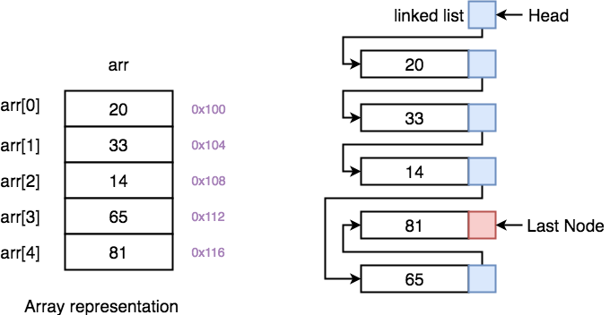

# Java Specific Fundamental Concepts

## Background About Java and IntelliJ Shortcuts

> A pure OOP language, EVERYTHING must live inside a class...
>
> Java data types: be sure to understand the data types that you are working with. Choosing the wrong data type can lead to large memory usage in large systems.
* `JVM` - Utilizes the JVM which is hardware-agnostic and uses the Java Virtual Machine (JVM) making it cross compatible.

## Java Programming Concepts and Terminology

### Terminology

* **Overloading**: The ability to have multiple functions with the same name but different parameters, not best practice!
* **Static Attributes (Variables)**: used to store data that is constant throughout the program. For example, the number of active connections to a database, the number of users logged in. Static variables are declared at the class level and are instantiated immediately upon class loading.

* **Lifetime**: How long a variable has a location in memory
* **Scope**: the visibility of a variable within a program.

* **Local Variable**: something defined within the scope of the code block and cannot be outside of it.
```java
if(x > 10) {
    String local = "Local value";
}
```
* **Instance Field or Field:** a variable that's bound to the object itself. I can use it in the object without the need to use accessors, and any method contained within the object may use it.
    * **Signature**: is the method's name and parameters that define how the method is called (e.g., `public countOfApples()` below)
    * **Header**: is the method's entire name, return type, method name, and parameters (e.g., `public void countOfApples(...)`)
```java
public class Point {
    private int numberOfApples;

    public void countOfApples() {
        System.out.println("Apples are: " + numberOfApples);
    }
}
```
* **Input Parameter, Parameter, Argument:** something that we pass into a method or constructor and is defined in the constructor.
```java
public class Point {
    private int numberOfApples;
    public countOfApples(int apples) {
        numberOfApples = apples; // Option 1
        this.numberOfApples = apples ; // Option 2
   }

    public void setApples(int apples) {
        numberOfApples = apples; // Option 1
        this.numberOfApples = apples; // Option 2
    }
}
```
* **Class (Static) Field**: similar to field, but the difference is that you don't need to have an instance of the containing object to use it.
```java
System.out.println(Integer.MAX_VALUE);
```

* **Non-Primitive / Reference Type**: A variable that holds a memory address (pointer) to an object on the heap, not the value itself. It allows for complex structures and can be `null`.
  * `String s = "hello";` — `s` is the variable that **points** to the string object ("hello") on the heap.

* **Primitive Type**: A built-in type that stores the actual value directly in the variable (no pointer or heap involved). The 8 primitives are `byte`, `short`, `int`, `long`, `float`, `double`, `char`, `boolean`. They can't be `null`.
  * `int age = 30;` — `age` contains value 30 directly.

* **Private Property**: A class field declared with the `private` keyword to hide it from direct access outside the class. It enforces encapsulation, allowing control via getters/setters.
  * `private String name;` — Only accessible within the class or through methods.

* **Constructor**: A method that is the **same name as the class**, that runs when creating an object with `new`. It initializes the object's state (fields) using passed parameters.
```java
// Constructor
public Person(String name) { this.name = name; } 

// Constructor is called with the String "Alice" as a parameter
Person p1 = new Person("Alice");
```

* **Setter**: A public method that updates a private field with **validation or checks**, controlling how values are set from outside the class.
  * `void` = #**SETTING**TheTable; any output is sent into the **`void`** never to be seen.
```java
// Validation of age before assignment
public void setAge(int age) { if (age > 0) this.age = age; } 
```

* **Getter**: A public method that returns the value of a private field, providing **read-only access** without exposing the field directly.
  * **Non-void** = "reporters' #**GETTING**TheMeal

```java
// Just retrieves the value
public String getName() { return name; }
```

* **Instance Object**: A specific, unique object created from a class using `new`. Each instance has its own state (field values), separate from others of the same class.

```java
// p1 and p2 are two "instances objects"
Person p1 = new Person("Alice"); 
Person p2 = new Person("Bob");
```

* **Composition Relationship**: A "has-a" relationship where one class owns an instance of another as a field.

### `static` vs. `void`

#### 1. `void` Answers: "What do you give back?"

Every method in Java must declare a **return type**. It has to tell the compiler what kind of data it will hand back when it finishes running.

* **Return Types (`int`, `String`, `boolean`, etc.):** The method does some work and gives you a specific piece of data back (a "receipt").
* **`void`:** The method performs an action (like printing to the console, changing a variable, or adding an item to a list) but returns **nothing**. It does its job and quietly finishes.

**Example:**

```java
// Returns an integer
public int calculateAge(int birthYear) {
    return 2024 - birthYear;
}

// Returns nothing, just performs an action
public void printWelcomeMessage() {
    System.out.println("Welcome to the company!");
}
```

#### 2. `static` Answers: "Who owns this?"

This keyword is all about Object-Oriented architecture: the difference between the **Blueprint** (the Class) and the **House** (the Object).

* **Non-Static (Instance Methods/Variables):** These belong to a specific *House*. You must build an object using the `new` keyword before you can use them. If you create three different `Company` objects, they each get their own separate `employees` list.
* **`static` (Class Methods/Variables):** These belong to the *Blueprint*. They exist independently of any objects, and there is only ever **one** copy of them shared across the entire program. You don't need to build an object to use them.

**The Golden Rule of Static:** A `static` method is "blind" to instance variables. The Blueprint doesn't know what color the walls are in a specific House. *Therefore, a static method cannot directly interact with a non-static variable.*

#### 3. The Combo: `static void`

When you put them together, you are simply stating two separate facts about the method:

1. **`static`:** This method belongs to the Class blueprint, not an instantiated object.
2. **`void`:** This method will not return any data when it finishes.

**Example:**

```java
// Belongs to the Main class itself, and returns nothing.
public static void main(String[] args) { ... }
```

### Java OOP Concepts

#### Access Modifiers (The Security Guards)
* **`public`**: **Everyone.** Any class, anywhere in the program, can access it. Normally used for methods that other classes need to use.
* **`private`**: **Only the class itself.** No one outside the class can see it. Used for sensitive data (attributes/properties). Outsiders must use a `public` Getter or Setter to interact with it.
* **`protected`**: **Children AND package neighbors.** Visible to subclasses (children) *and* any other classes sitting in the exact same folder (package). (Semi-Private).

#### Method Manipulation (Changing Behaviors)
* **Overload**: Same method name, **different signature** (parameters). Giving the exact same method multiple ways to behave depending on what data is passed in.
* **Override**: Same method name, **same signature**. The Child writes its own method to completely replace the parent's version of that method.

#### The `super` Keyword (Talking to the Parent)
* **`super()`**: Calls the **Parent's Constructor**. It must be the very first line inside the child's constructor.
* **`super.value` / `super.methodName()`**: Accesses a specific variable or method located in the parent.

#### The `final` Keyword (The Padlock)
* **`final` Class**: Used to prevent any other children from inheriting from a class. No one can ever 'extend' it.
* **`final` Method**: A child class can inherit this method, but they are **never allowed to Override it**.
* **`final` Variable**: The value is locked forever (a constant).

### Coupling and Cohesion

* **Nouns (Classes):**
  * These are the **Things** (e.g., `Car`, `School`, `SecurityLog`, `MenuOptions`).
  * They act as blueprints. They define properties (state) and can be instantiated into specific objects.

* **Verbs (Methods):**
  * These are the **Actions** (e.g., `calculateMileage`, `measureCourseProgress`).
  * They live inside the Nouns. They perform calculations, modify data, or handle Input/Output.

* **Coupling:**
  * This is the degree to which one class relies on another (we want coupling to be **LOW**).
  * Essentially the code the use should be "Plug and Play", if you change the code in `MenuOptions`, it should not break the code in `Main`. Low coupling allows for easier maintenance and reusability.

* **Cohesion**
  * This is the degree to which the elements inside a single class or method belong together (we want cohesion to be **HIGH**).
  * The thing that came to mind is a concept in Graph Theory and Network Architecture of "Eigenvector Centrality" (e.g., how reliant one node is to the entire network). Basically, lines of code within a method should be tightly dependent on one another. They should focus on solving one specific problem without "noise" or unrelated tasks.

**Method Naming**
* If you cannot describe what a function does using a **single verb**, it is likely doing too much. 
  * Break complex methods (e.g., `calculateAndPrint()`) into smaller, single-purpose methods (`calculate()`, then `print()`) for High Cohesion.

```java
// Person "has an" Address
class Person { private Address address; public Person(Address addr) { address = addr; } } 
```

> [!NOTE]
> 
> If "**X is-a Y**" sounds logical, use inheritance (e.g., a Dog is-an Animal) 
> 
> If "**X has-a** Y" sounds logical and multiple classes can use it (e.g., Person has-an Address), use composition instead.


### RAM vs Stack

* **RAM**: The hardware that is large, general-purpose memory where all running programs, their code, data, stack, and heap live.
  *  Random here means you can jump directly to any address in (almost) constant time (`O(1)`), instead of stepping through data in order.
* **Stack**: the region inside a process’s RAM space, used mainly for function call bookkeeping: return addresses, parameters, and local (automatic) variables. It grows and shrinks in a strict **last-in, first-out (LIFO)** order: each function call pushes a new “stack frame,” and returning from the function pops that frame.


### Error Handling (Java)

> [!NOTE]
> The most resilient way to validate input (for critical services) is to accept everything as a String and then just regular expressions to validate!
> Do not write normal business logic around errors. Log context, fail fast, and fix the root cause.

#### 1) Quick definitions

- **Exception** = a problem your program can often anticipate, handle, or report clearly.
- **Checked exception** = must be handled with `try/catch` or declared with `throws`.
- **Unchecked exception** = subclass of `RuntimeException`; does not need to be declared.
- **Error** = serious JVM or system problem, usually not handled in normal business code.

#### 2) Errors vs Exceptions

* Errors: thrown by the OS and is out of your control!
* Exceptions: thrown by the program and is in your control!

Common Error examples:
- `OutOfMemoryError`
- `StackOverflowError`

#### 3) Common exceptions and when to use them

| Exception | Meaning | Typical fix |
|---|---|---|
| `NullPointerException` | Code used a `null` reference | Validate inputs, initialize values early |
| `NumberFormatException` | Text could not be parsed as a number | Validate before parsing |
| `IllegalArgumentException` | Caller passed a bad argument | Throw with a clear message |
| `IllegalStateException` | Object/app state does not allow operation | Check lifecycle or call order |
| `IndexOutOfBoundsException` | Code accessed an invalid index | Validate length/index first |
| `ClassCastException` | Wrong type cast at runtime | Use proper typing, generics, `instanceof` |
| `IOException` | File or stream operation failed | Catch or declare with `throws` |

#### 4) Best practice rules

- Catch only exceptions you can actually handle.
- Validate inputs early.
- Throw the most specific exception possible.
- Do not catch broad `Exception` unless at an application boundary.
- Do not swallow exceptions silently.
- Preserve the original cause when wrapping exceptions.
- Use clear error messages.

#### 5) Common implementations

##### A) Bad input -> `IllegalArgumentException`

```java
public void setQuantity(int quantity) {
    if (quantity < 0) {
        throw new IllegalArgumentException("quantity cannot be negative");
    }
}
```

##### B) Bad state -> `IllegalStateException`

```java
public class ConnectionManager {
    private boolean connected;

    public void connect() {
        connected = true;
    }

    public void send(String message) {
        if (!connected) {
            throw new IllegalStateException("Cannot send before connecting");
        }
        System.out.println("Sent: " + message);
    }
}
```

##### C) Prevent `NullPointerException`

```java
public void sendEmail(String address) {
    if (address == null) {
        throw new IllegalArgumentException("address must not be null");
    }
    System.out.println("Sending to " + address);
}
```

##### D) Prevent `NumberFormatException`

```java
public int parseAge(String input) {
    if (input == null || !input.matches("\\d+")) {
        throw new IllegalArgumentException("age must be numeric");
    }
    return Integer.parseInt(input);
}
```

##### E) Prevent index errors

```java
public char thirdLetter(String s) {
    if (s == null || s.length() < 3) {
        throw new IllegalArgumentException("string must contain at least 3 characters");
    }
    return s.charAt(2);
}
```

##### F) Handle checked exceptions with `throws`

```java
import java.io.IOException;
import java.nio.file.Files;
import java.nio.file.Path;

public String readConfig(Path path) throws IOException {
    return Files.readString(path);
}
```

##### G) Handle checked exceptions with `try/catch`

```java
import java.io.IOException;
import java.nio.file.Files;
import java.nio.file.Path;

public String loadConfig(Path path) {
    try {
        return Files.readString(path);
    } catch (IOException e) {
        throw new RuntimeException("Failed to load config from " + path, e);
    }
}
```

##### H) Use try-with-resources for files

```java
import java.io.BufferedReader;
import java.io.IOException;
import java.nio.file.Files;
import java.nio.file.Path;

public void printFirstLine(Path path) {
    try (BufferedReader reader = Files.newBufferedReader(path)) {
        System.out.println(reader.readLine());
    } catch (IOException e) {
        System.err.println("Could not read file: " + e.getMessage());
    }
}
```

### Interfaces vs Abstract Classes

* An `abstract class` is a **partial blueprint** — it defines shared identity, state, and behavior for closely related things (e.g., all `Animal` subclasses share a `color` and a `sleep()` method)
* An `interface` is a **capability contract** — it says "anything that implements me **PROMISES** and will be **ENFORCED** to do these things," regardless of what that thing actually is (e.g., a `SUV` and a `Motorcycle` can both implement `Driveable`)

**Side-by-side differences**

| Feature | Abstract Class | Interface |
|---|---|---|
| Keyword | `extends` | `implements` |
| Instantiation | ❌ Cannot be instantiated | ❌ Cannot be instantiated |
| Methods | Can have both abstract AND concrete methods | Abstract by default; `default`/`static` allowed since Java 8 |
| Fields/Variables | Any type — instance, static, final, non-final | Only `public static final` constants |
| State | ✅ Can hold and manage state | ❌ Cannot hold state |
| Constructors | ✅ Allowed | ❌ Not allowed |
| Inheritance limit | A class can extend **only one** | A class can implement **multiple** |
| Access modifiers | Members can be `private`, `protected`, `public` | Methods are `public` by default |

**The Golden Rule**
* **Shared code + shared state among related classes** → Abstract class
* **Shared behavior contract across unrelated classes** → Interface
* **Both needed** → Abstract class + one or more interfaces (Java allows this)

#### Interfaces

**Defined**
* Highly useful when designing and making software architecture decision (CODE DESIGN)...
* Interfaces **ARE NOT** classes, they are concepts, used within classes, and the Class **`implement`** it...
* Basically, interfaces define **what a class can do**, not what it is. Any unrelated class can implement the same interface as long as it fulfills its contract.
* The interface = the contract (what must be done)
* The class = the implementation (how it gets done)
  * A class can implement multiple interfaces but extend only one class
  * The method bodies always live in the class, never in the interface itself (except for default and static methods added in Java 8)

> [!NOTE]
> **NORMALLY**, multiple forms of inheritance IS NOT allowed... BUT interfaces CAN ALLOW for multiple inheritance for example:
```java
class Numbers implements Math, Logic{...}
```

> [!TIP]
> Recently Java introduced the idea of the `default` which is used to make changes to established code (backwards compatibility) so that if people want to modify legacy code you can ensure that the code is still operational!
> * `default void new_func(){}`

##### Interface Implementation

```java
// ── Interfaces (capability contracts) ──────────────────────────────

public interface Flyable {
    void fly(); // any implementing class MUST define this
}

public interface Swimmable {
    void swim(); // any implementing class MUST define this
}

public interface Speakable {
    void speak(); // any implementing class MUST define this
}


// ── Abstract base class (shared identity + state)

public abstract class Animal {
    private String name;

    public Animal(String name) {
        this.name = name;
    }

    public String getName() { return name; }

    public abstract void makeSound(); // all animals must define this
}


// ── Concrete classes implementing multiple interfaces ───────────────

// Duck is an Animal that can ALSO fly AND swim
public class Duck extends Animal implements Flyable, Swimmable {

    public Duck(String name) {
        super(name);
    }

    @Override
    public void makeSound() {
        System.out.println(getName() + " says: Quack!");
    }

    @Override
    public void fly() {
        System.out.println(getName() + " is flying low over the pond");
    }

    @Override
    public void swim() {
        System.out.println(getName() + " is paddling through the water");
    }
}

// Parrot is an Animal that can ALSO fly AND speak
public class Parrot extends Animal implements Flyable, Speakable {

    public Parrot(String name) {
        super(name);
    }

    @Override
    public void makeSound() {
        System.out.println(getName() + " says: Squawk!");
    }

    @Override
    public void fly() {
        System.out.println(getName() + " is soaring through the trees");
    }

    @Override
    public void speak() {
        System.out.println(getName() + " says: Polly wants a cracker!");
    }
}

// Plane has NOTHING to do with Animal but is still Flyable
public class Plane implements Flyable {

    @Override
    public void fly() {
        System.out.println("Plane is cruising at 35,000 feet");
    }
}


// ── Usage ───────────────────────────────────────────────────────────

public class Main {
    public static void main(String[] args) {

        Duck duck = new Duck("Donald");
        duck.makeSound();  // Donald says: Quack!
        duck.fly();        // Donald is flying low over the pond
        duck.swim();       // Donald is paddling through the water

        System.out.println("---");

        Parrot parrot = new Parrot("Polly");
        parrot.makeSound(); // Polly says: Squawk!
        parrot.fly();       // Polly is soaring through the trees
        parrot.speak();     // Polly says: Polly wants a cracker!

        System.out.println("---");

        Plane plane = new Plane();
        plane.fly();        // Plane is cruising at 35,000 feet
    }
}
```

#### Abstract Classes

**Defined**
* It's a way to strictly enforce methods and attributes that **MUST** be present in all other children that inherit (or extend) from the abstract parent class. It's like strictly enforced guard rails that keep the design of your code clean as it grows. 
  * When we mark a method `abstract`, we're telling Java: "I don't care how each subclass does this, but every single one of them must do it." **No implementation means no compilation**.

##### Template Method Pattern 

* The abstract class defines the **fixed algorithm skeleton**, and each subclass only fills in the unique steps. `run()` is marked `final` so no subclass can break the overall flow.

```java
// Abstract class defines the skeleton of the algorithm
public abstract class DataProcessor {

    // Concrete shared step - same for all subclasses
    public void readData() {
        System.out.println("Reading data from source...");
    }

    // Abstract step - each subclass MUST implement this
    public abstract void processData();

    // Concrete shared step - same for all subclasses
    public void saveData() {
        System.out.println("Saving processed data...");
    }

    // Template method - controls the full flow, final so it cannot be overridden
    public final void run() {
        readData();
        processData();
        saveData();
    }
}

// Subclass only fills in what is unique to it
public class CSVProcessor extends DataProcessor {
    @Override
    public void processData() {
        System.out.println("Processing CSV data...");
    }
}

public class JSONProcessor extends DataProcessor {
    @Override
    public void processData() {
        System.out.println("Processing JSON data...");
    }
}

// Usage
public class Main {
    public static void main(String[] args) {
        DataProcessor csv = new CSVProcessor();
        csv.run();
        // Output:
        // Reading data from source...
        // Processing CSV data...
        // Saving processed data...

        DataProcessor json = new JSONProcessor();
        json.run();
        // Output:
        // Reading data from source...
        // Processing JSON data...
        // Saving processed data...
    }
}
```

##### Shared State + Enforce Contract

* The abstract class holds shared state (fields) that all subclasses automatically inherit, and forces each subclass to implement the `area()` method.

```java
// Abstract class holding shared state and a forced contract
public abstract class Shape {
    private String color; // shared state — all shapes have this automatically

    public Shape(String color) {
        this.color = color;
    }

    public String getColor() {
        return color;
    }

    // Each subclass MUST define how it calculates area
    public abstract double area();

    // Shared concrete method — no need to rewrite in each subclass
    public void describe() {
        System.out.println("This is a " + color + " shape with area: " + area());
    }
}

public class Circle extends Shape {
    private double radius;

    public Circle(String color, double radius) {
        super(color); // must call super() to supply shared state
        this.radius = radius;
    }

    @Override
    public double area() {
        return Math.PI * radius * radius;
    }
}

public class Rectangle extends Shape {
    private double width, height;

    public Rectangle(String color, double width, double height) {
        super(color); // must call super() to supply shared state
        this.width = width;
        this.height = height;
    }

    @Override
    public double area() {
        return width * height;
    }
}

// Usage
public class Main {
    public static void main(String[] args) {
        Shape circle = new Circle("red", 5.0);
        circle.describe();
        // Output: This is a red shape with area: 78.53981633974483

        Shape rect = new Rectangle("blue", 4.0, 6.0);
        rect.describe();
        // Output: This is a blue shape with area: 24.0
    }
}
```

### Generics

#### What are Generics?

Generics allow you to write a **single class, method, or interface that works with any data type**, rather than writing separate versions for `String`, `Integer`, etc.  Think of the type parameter `<T>` as a **placeholder** that gets replaced with a real type when you actually use the class or method.

> [!NOTE]
> If you find yourself writing the same class or method multiple times just to handle different data types, that is a strong signal that Generics is the right tool.

The `<T>` naming convention stands for **Type**, but it can technically be any letter — `T`, `E` (element), `K` (key), and `V` (value) are the most common conventions.

**Without Generics** you would need separate classes:
```java
class IntegerBox {
    private Integer value;
    public void set(Integer value) { this.value = value; }
    public Integer get() { return value; }
}

class StringBox {
    private String value;
    public void set(String value) { this.value = value; }
    public String get() { return value; }
}
```

**With Generics** you write it once:
```java
class Box<T> {
    private T value; // T is a placeholder for any type

    public void set(T value) { this.value = value; }
    public T get() { return value; }
}
```

#### Generic Class Example

```java
// <T> is the type parameter — a placeholder for any data type
class Box<T> {
    private T value;

    public Box(T value) {
        this.value = value;
    }

    public T getValue() {
        return value;
    }
}

public class Main {
    public static void main(String[] args) {

        // T becomes String
        Box<String> stringBox = new Box<>("Hello, Java!");
        System.out.println(stringBox.getValue()); // Hello, Java!

        // T becomes Integer
        Box<Integer> intBox = new Box<>(42);
        System.out.println(intBox.getValue()); // 42

        // T becomes Double
        Box<Double> doubleBox = new Box<>(3.14);
        System.out.println(doubleBox.getValue()); // 3.14
    }
}
```

- `Box<String>` → `T` becomes `String` throughout the class
- `Box<Integer>` → `T` becomes `Integer` throughout the class
- Same class, different types — zero code duplication


#### Generic Method Example

You can also make individual methods generic without making the whole class generic.

```java
public class Main {

    // <T> before the return type makes this a generic method
    public static <T> void printItem(T item) {
        System.out.println("Item: " + item);
    }

    public static void main(String[] args) {
        printItem("Hello");    // Item: Hello
        printItem(100);        // Item: 100
        printItem(3.14);       // Item: 3.14
        printItem(true);       // Item: true
    }
}
```

Java **infers the type** based on what you pass in — you don't have to specify it manually.


#### Bounded Generics (bonus)

You can restrict `<T>` to only accept certain types using `extends`.

```java
// T must be a Number or subclass of Number (Integer, Double, Float, etc.)
class Calculator<T extends Number> {
    private T value;

    public Calculator(T value) {
        this.value = value;
    }

    public double doubled() {
        return value.doubleValue() * 2;
    }
}

public class Main {
    public static void main(String[] args) {
        Calculator<Integer> intCalc = new Calculator<>(10);
        System.out.println(intCalc.doubled()); // 20.0

        Calculator<Double> dblCalc = new Calculator<>(5.5);
        System.out.println(dblCalc.doubled()); // 11.0

        // Calculator<String> strCalc = new Calculator<>("hi"); // WILL NOT COMPILE
    }
}
```

The last line **will not compile** — the bound `<T extends Number>` enforces that only numeric types are allowed.  This is another example of Java's compile-time guardrails at work.

#### Quick reference

| Syntax | Meaning |
|---|---|
| `<T>` | Any type (unbounded)  |
| `<T extends Number>` | T must be `Number` or a subclass  |
| `Box<String>` | T is replaced with `String` at usage |
| `<T, U>` | Multiple type parameters |


## Linear Data Structures

> [!NOTE] 
> Before diving into Linked Lists, Stacks, and Queues individually, it is important to understand how these three concepts **build on top of each other**. They are not separate isolated ideas — each one depends on the layer below it.
> 
> Linked Lists, Stacks, and Queues are classified as **linear data structures**, meaning each node has at most one predecessor and one successor. Data flows in a single line, one node at a time. This is what separates them from non-linear structures like trees and graphs, where a single node can branch out to multiple children.

### The Hierarchy

```
Node
 └── Linked List
      ├── Stack
      └── Queue
```

* The reason this hierarchy matters is that a `Node` by itself does nothing useful — it only becomes meaningful when nodes are connected into a `LinkedList`. Likewise, a `LinkedList` by itself has no enforced order of access — it only becomes a `Stack` or `Queue` when you apply a behavioral rule on top of it.

> [!NOTE]
> A **Node** is a single LEGO brick.
> A **Linked List** is a chain of LEGO bricks snapped together.
> A **Stack** is that same chain, but you can **only add or remove from the top**.
> A **Queue** is that same chain, but you can **only add to the back and remove from the front**.

#### Node (Foundation)

* **Node** is the most primitive building block — it is just a container that holds a piece of data and a reference pointing to the next node in the chain. Nothing more.
* This is the **smallest building block** — a single "box" or container.
* Contains exactly **two fields**:
  * `data` (the actual value — `Object` for now, later `<T>` when we add generics)
  * `next` (a reference/pointer to the next Node, or `null` if nothing follows)
* Every structure below is built *entirely* from these Nodes.


#### Linked List (General Purpose)
* **Linked List** is built from nodes chained together. It defines how to navigate, insert, and remove nodes. It is the **raw, general-purpose structure with no restrictions on where you add or remove**. 
* A **flexible chain** made by connecting multiple Nodes together. 
* You maintain a reference to the first Node (usually called `head`). 
* You can:
  * Add/remove Nodes at the head, tail, or anywhere in the middle 
  * Traverse the entire chain by following each Node’s `next` pointer until you hit `null`

> [!NOTE]
> All the other structures (Stack & Queue) are just **restricted versions** of a Linked List. They reuse the exact same Node and linking logic, but limit where you’re allowed to add/remove.

#### Stack (LIFO - Last In, First Out)

* A **specialized Linked List** that only ever touches the **head** end. 
* Operations are extremely simple because of the restriction:
  * `push(item)` → add a new Node at the head (exactly the pointer dance we practiced)
  * `pop()` → remove and return the Node at the head
  * `peek()` → look at the head without removing it
  * `isEmpty()` → check if `head == null`

> [!TIP]
> Basically a vertical stack of plates where only the top plate is accessible.
> Every new Node’s `next` points **DOWN** to the previous top, and `head` just moves up or down one link. No traversal needed.

#### Queue (FIFO - First In, First Out)

* Another **specialized Linked List**, but it touches **both ends**.
* You maintain two references:
  * `head` (front of the line — where you remove)
  * `tail` (back of the line — where you add)

* Operations:
  * `enqueue(item)` → add a new Node at the tail (update `tail.getNext` and move `tail`)
  * `dequeue()` → remove and return the Node at the head (move `head` forward)
  * `peek()` → look at the front without removing
  * `isEmpty()` → check if `head == null`

### Behavior Rules

* The data storage mechanism is the same across all three — what changes is the **rule applied to how you interact with it**.

| Structure | Rule | Real-world analogy |
|---|---|---|
| Linked List | No restriction — add or remove anywhere | A to-do list you can edit freely |
| Stack | **LIFO** — Last In, First Out | A stack of cafeteria trays |
| Queue | **FIFO** — First In, First Out | A line at a coffee shop |


### Linked Lists

* Linked lists are one of the most fundamental data structures in computer science, and understanding them in Java gives you a strong foundation for thinking about how data is stored and connected in memory.

#### Types of Linked Lists
* **Singly**: each node points to the next node only; traversal goes one direction
* **Doubly**: each node points to both the next AND previous node; traversal goes both directions
* **Circular**: the last node points back to the first node, forming a loop

#### Linked List vs Array List



> [!NOTE]
> An array list is an array, however we don't specify the size of the list, it grows...
> Don't assume that a linked list is side-by-side even though it is implemented in that way.

* An array stores elements in **contiguous (side-by-side) memory slots**, so finding an element by index is fast.

* A linked list instead **stores elements as nodes**, where each **node** holds two things: its data value and a reference (pointer) to the next node. Because of this, elements can be scattered anywhere in memory... **they are connected by references, not physical location**.

#### Benefits

* The key strength of a linked list is fast insertion and deletion, especially at the beginning or middle of the list.
* With an array, inserting in the middle means shifting every element after it, which is expensive for large lists. With a linked list, you just rewire a few references.

**Real-world use cases include:**

* Undo/Redo history in text editors — fast insertions and removals at either end
* Queues and Stacks — LinkedList implements both Queue and Deque interfaces in Java
* Browser history — navigating forward and backward through pages
* Music playlists — easily inserting or removing songs at any position

#### Manual Node-Based Implementation

##### The Node Class
Every operation below depends on this building block. Build this first.

```java
// A single node that holds data and a reference to the next node
class Node {
    private int data;
    private Node next;

    public Node(int data) {
        this.data = data;
        this.next = null;
    }
}
```

##### The LinkedList Class — Setup
The list only needs to track its `head` — the first node. All other nodes are reached by traversing from there.

```java
class LinkedList {
    private Node head; // the first node in the list

    LinkedList() {
        this.head = null;
    }
}
```

##### 1. `append()` — Add a node to the end
Creates a new node and links it after the last node in the list.

```java
public void append(int data) {
    Node newNode = new Node(data);
    if (head == null) {             // list is empty, new node becomes head
        head = newNode;
        return;
    }
    Node current = head;
    while (current.next != null) { // traverse to the last node
        current = current.next;
    }
    current.next = newNode;        // link the last node to the new node
}
```

##### 2. `prepend()` — Add a node to the beginning
Creates a new node and places it before the current head.

```java
public void prepend(int data) {
    Node newNode = new Node(data);
    newNode.next = head;           // new node points to the old head
    head = newNode;                // new node becomes the new head
}
```

##### 3. `delete()` — Remove a node by value
Traverses the list and rewires the references to skip over the target node.

```java
public void delete(int data) {
    if (head == null) return;

    if (head.data == data) {       // if head itself holds the value
        head = head.next;          // move head forward, old head is removed
        return;
    }

    Node current = head;
    while (current.next != null) {
        if (current.next.data == data) {
            current.next = current.next.next; // skip over the deleted node
            return;
        }
        current = current.next;
    }
}
```

##### 4. `search()` — Find a node by value
Traverses the list and returns `true` if the value exists, `false` if not.

```java
public boolean search(int data) {
    Node current = head;
    while (current != null) {
        if (current.data == data) {
            return true;           // value found
        }
        current = current.next;
    }
    return false;                  // value not found
}
```

##### 5. `display()` — Print all nodes
Traverses the full list and prints each node's data in order.

```java
public void display() {
    if (head == null) {
        System.out.println("List is empty.");
        return;
    }
    Node current = head;
    while (current != null) {
        System.out.print(current.data + " -> ");
        current = current.next;
    }
    System.out.println("null");
}
```

##### All Together — Full Example

```java
class Node {
    int data;
    Node next;

    Node(int data) {
        this.data = data;
        this.next = null;
    }
}

class LinkedList {
    private Node head;

    LinkedList() {
        this.head = null;
    }

    // 1. append — add a new node to the end
    public void append(int data) {
        Node newNode = new Node(data);
        if (head == null) {
            head = newNode;
            return;
        }
        Node current = head;
        while (current.next != null) {
            current = current.next;
        }
        current.next = newNode;
    }

    // 2. prepend — add a new node to the beginning
    public void prepend(int data) {
        Node newNode = new Node(data);
        newNode.next = head;
        head = newNode;
    }

    // 3. delete — remove a node by value
    public void delete(int data) {
        if (head == null) return;
        if (head.data == data) {
            head = head.next;
            return;
        }
        Node current = head;
        while (current.next != null) {
            if (current.next.data == data) {
                current.next = current.next.next;
                return;
            }
            current = current.next;
        }
    }

    // 4. search — find a node by value
    public boolean search(int data) {
        Node current = head;
        while (current != null) {
            if (current.data == data) return true;
            current = current.next;
        }
        return false;
    }

    // 5. display — print all nodes in order
    public void display() {
        if (head == null) {
            System.out.println("List is empty.");
            return;
        }
        Node current = head;
        while (current != null) {
            System.out.print(current.data + " -> ");
            current = current.next;
        }
        System.out.println("null");
    }
}

public class Main {
    public static void main(String[] args) {
        LinkedList list = new LinkedList();

        // append() — add nodes to the end
        list.append(10);
        list.append(20);
        list.append(30);
        list.display(); // 10 -> 20 -> 30 -> null

        // prepend() — add a node to the beginning
        list.prepend(5);
        list.display(); // 5 -> 10 -> 20 -> 30 -> null

        // search() — find a value
        System.out.println(list.search(20)); // true
        System.out.println(list.search(99)); // false

        // delete() — remove a node by value
        list.delete(20);
        list.display(); // 5 -> 10 -> 30 -> null

        // delete head
        list.delete(5);
        list.display(); // 10 -> 30 -> null
    }
}
```

##### Quick Reference

| Operation | What it does | Time Complexity |
|---|---|---|
| `append(data)` | Creates a new node and links it to the end | O(n) |
| `prepend(data)` | Creates a new node and places it at the head | O(1) |
| `delete(data)` | Rewires references to remove a node by value | O(n) |
| `search(data)` | Traverses list to find a value | O(n) |
| `display()` | Traverses and prints all nodes in order | O(n) |

> [!NOTE]
> `prepend()` is O(1) because no traversal is needed — the new node always goes straight to the front. `append()`, `delete()`, and `search()` are all O(n) because they must traverse the list one node at a time to find their destination.

### Stacks and Queues

#### Stacks in Java

* Stacks can be implemented into either an Array or Linked List
* The implementation is hidden and are executed inside of `Main.java` in the same way!

The key concept tying all 5 operations together is **LIFO (Last In, First Out)**: the last item added is always the first one removed, like a stack of plates.

> [!NOTE]
> Basically, a stack is basically a set of cafeteria trays — you can only interact with the **top** tray.
>
> You add to the top, remove from the top, and can **only peek at the top**.
>
> Always check `isEmpty()` before calling `pop()` or `peek()`, and always check `isFull()` before calling `push()` on a fixed-size stack — this prevents runtime exceptions and stack overflow errors.


##### The Node Class
Every operation below depends on this building block. Build this first.

```java
// A single node that holds data and a reference to the next node
class Node {
    int data;
    Node next;

    Node(int data) {
        this.data = data;
        this.next = null;
    }
}
```


##### The Stack Class — Setup
Before the 5 operations, the stack needs to track its `top`, `size`, and `capacity`.

```java
class Stack {
    private Node top;       // the node currently at the top
    private int size;       // tracks how many nodes are in the stack
    private int capacity;   // the maximum number of nodes allowed

    Stack(int capacity) {
        this.top = null;
        this.size = 0;
        this.capacity = capacity;
    }
}
```


##### 1. `push()` — Add to the top
* Creates a new node and links it on top of the current top node.

```java
public void push(int data) {
    if (isFull()) {
        System.out.println("Stack is full! Cannot push " + data);
        return;
    }
    Node newNode = new Node(data);
    newNode.next = top;     // new node points to the current top
    top = newNode;          // new node becomes the new top
    size++;
}
```


##### 2. `pop()` — Remove from the top
* Removes AND returns the top node's data. Always check `isEmpty()` before calling this.

```java
public int pop() {
    if (isEmpty()) {
        System.out.println("Stack is empty! Nothing to pop.");
        return -1;
    }
    int data = top.data;    // grab the top node's data
    top = top.next;         // move top pointer down to the next node
    size--;
    return data;
}
```


##### 3. `peek()` — Look at the top without removing
* Returns the top node's data but **leaves the stack unchanged**.

```java
public int peek() {
    if (isEmpty()) {
        System.out.println("Stack is empty! Nothing to peek.");
        return -1;
    }
    return top.data;        // return top data without removing the node
}
```

##### 4. `isEmpty()` — Is the stack empty?
* Checks whether the top node is `null`, meaning no nodes exist in the stack.

```java
public boolean isEmpty() {
    return top == null;     // true if there are no nodes
}
```


##### 5. `isFull()` — Can anything else be added?
* Checks whether `size` has reached the set `capacity`.

```java
public boolean isFull() {
    return size == capacity; // true if size has reached the limit
}
```


##### All 5 Together — Full Example

```java
class Node {
    int data;
    Node next;

    Node(int data) {
        this.data = data;
        this.next = null;
    }
}

class Stack {
    private Node top;
    private int size;
    private int capacity;

    Stack(int capacity) {
        this.top = null;
        this.size = 0;
        this.capacity = capacity;
    }

    // 4. isEmpty — check if stack has no nodes
    public boolean isEmpty() {
        return top == null;
    }

    // 5. isFull — check if stack has hit capacity
    public boolean isFull() {
        return size == capacity;
    }

    // 1. push — create a new node and place it on top
    public void push(int data) {
        if (isFull()) {
            System.out.println("Stack is full! Cannot push " + data);
            return;
        }
        Node newNode = new Node(data);
        newNode.next = top;
        top = newNode;
        size++;
    }

    // 2. pop — remove the top node and return its data
    public int pop() {
        if (isEmpty()) {
            System.out.println("Stack is empty! Nothing to pop.");
            return -1;
        }
        int data = top.data;
        top = top.next;
        size--;
        return data;
    }

    // 3. peek — return top node's data without removing it
    public int peek() {
        if (isEmpty()) {
            System.out.println("Stack is empty! Nothing to peek.");
            return -1;
        }
        return top.data;
    }

    // Helper — print all nodes from top to bottom
    public void display() {
        if (isEmpty()) {
            System.out.println("Stack is empty.");
            return;
        }
        Node current = top;
        while (current != null) {
            System.out.print(current.data + " -> ");
            current = current.next;
        }
        System.out.println("null");
    }
}

public class Main {
    public static void main(String[] args) {
        Stack stack = new Stack(5);

        // isEmpty() — check before doing anything
        System.out.println(stack.isEmpty()); // true

        // push() — add nodes to the top
        stack.push(10);
        stack.push(20);
        stack.push(30);
        stack.display(); // 30 -> 20 -> 10 -> null

        // peek() — look at top without removing
        System.out.println(stack.peek()); // 30
        stack.display();                  // 30 -> 20 -> 10 -> null (unchanged)

        // pop() — remove from the top
        System.out.println(stack.pop()); // 30
        stack.display();                 // 20 -> 10 -> null

        // isFull() — test capacity
        stack.push(40);
        stack.push(50);
        stack.push(60);
        stack.push(70); // Stack is full! Cannot push 70

        // isEmpty() — check again after operations
        System.out.println(stack.isEmpty()); // false
    }
}
```

##### Quick Reference

| Operation | What it does | Returns | Time Complexity |
|---|---|---|---|
| `push(data)` | Creates a new node and places it on top | void | O(1) |
| `pop()` | Removes top node and returns its data | int | O(1) |
| `peek()` | Returns top node's data without removing | int | O(1) |
| `isEmpty()` | Checks if top node is null | boolean | O(1) |
| `isFull()` | Checks if size has reached capacity | boolean | O(1) |


#### Queues in Java

The key concept tying all 5 operations together is **FIFO (First In, First Out)**: the first item added is always the first one removed, like a line at a coffee shop. Each element is stored as a **Node** that holds data and a reference to the next node in line. You **add to the rear** and **remove from the front**.


##### The Node Class
Every operation below depends on this building block. Build this first.

```java
// A single node that holds data and a reference to the next node
class Node {
    int data;
    Node next;

    Node(int data) {
        this.data = data;
        this.next = null;
    }
}
```


##### The Queue Class — Setup
Before the 5 operations, the queue needs to track its `front`, `rear`, and `size`.

```java
class Queue {
    private Node front; // the node at the front (next to be removed)
    private Node rear;  // the node at the rear (most recently added)
    private int size;   // tracks how many nodes are in the queue

    Queue() {
        this.front = null;
        this.rear = null;
        this.size = 0;
    }
}
```


##### 1. `enqueue()` — Add to the back
Creates a new node and links it to the rear of the queue.

```java
public void enqueue(int data) {
    Node newNode = new Node(data);

    if (rear == null) {         // queue is empty, new node is both front and rear
        front = newNode;
        rear = newNode;
    } else {
        rear.next = newNode;    // link current rear to the new node
        rear = newNode;         // new node becomes the new rear
    }
    size++;
}
```

##### 2. `dequeue()` — Remove from the front
Removes the front node and returns its data. Always check `isEmpty()` before calling this.

```java
public int dequeue() {
    if (isEmpty()) {
        System.out.println("Queue is empty! Nothing to dequeue.");
        return -1;
    }
    int data = front.data;      // grab the front node's data
    front = front.next;         // move front pointer to the next node

    if (front == null) {        // if the queue is now empty
        rear = null;            // reset rear as well
    }
    size--;
    return data;
}
```

##### 3. `peek()` — Look at the front without removing
Returns the front node's data but **leaves the queue unchanged**.

```java
public int peek() {
    if (isEmpty()) {
        System.out.println("Queue is empty! Nothing to peek.");
        return -1;
    }
    return front.data;          // return front data without removing the node
}
```

##### 4. `isEmpty()` — Is the queue empty?
Checks whether the front node is `null`, meaning no nodes exist in the queue.

```java
public boolean isEmpty() {
    return front == null;       // true if there are no nodes
}
```

##### 5. `isFull()` — Can anything else be added?
Since this is a node-based queue with no fixed array size, `isFull()` tracks against a manually set capacity.

```java
private int capacity = 5;       // set your max size here

public boolean isFull() {
    return size == capacity;    // true if size has reached the limit
}
```


#### All 5 Together — Full Node-Based Queue

```java
class Node {
    int data;
    Node next;

    Node(int data) {
        this.data = data;
        this.next = null;
    }
}

class Queue {
    private Node front;
    private Node rear;
    private int size;
    private int capacity;

    Queue(int capacity) {
        this.front = null;
        this.rear = null;
        this.size = 0;
        this.capacity = capacity;
    }

    // 4. isEmpty — check if queue has no nodes
    public boolean isEmpty() {
        return front == null;
    }

    // 5. isFull — check if queue has hit capacity
    public boolean isFull() {
        return size == capacity;
    }

    // 1. enqueue — add a new node to the rear
    public void enqueue(int data) {
        if (isFull()) {
            System.out.println("Queue is full! Cannot enqueue " + data);
            return;
        }
        Node newNode = new Node(data);
        if (rear == null) {
            front = newNode;
            rear = newNode;
        } else {
            rear.next = newNode;
            rear = newNode;
        }
        size++;
    }

    // 2. dequeue — remove the front node
    public int dequeue() {
        if (isEmpty()) {
            System.out.println("Queue is empty! Nothing to dequeue.");
            return -1;
        }
        int data = front.data;
        front = front.next;
        if (front == null) {
            rear = null;
        }
        size--;
        return data;
    }

    // 3. peek — look at front node without removing
    public int peek() {
        if (isEmpty()) {
            System.out.println("Queue is empty! Nothing to peek.");
            return -1;
        }
        return front.data;
    }

    // Helper — print all nodes in order
    public void display() {
        if (isEmpty()) {
            System.out.println("Queue is empty.");
            return;
        }
        Node current = front;
        while (current != null) {
            System.out.print(current.data + " -> ");
            current = current.next;
        }
        System.out.println("null");
    }
}

public class Main {
    public static void main(String[] args) {
        Queue queue = new Queue(5);

        // isEmpty() — check before doing anything
        System.out.println(queue.isEmpty()); // true

        // enqueue() — add nodes to the rear
        queue.enqueue(10);
        queue.enqueue(20);
        queue.enqueue(30);
        queue.display(); // 10 -> 20 -> 30 -> null

        // peek() — look at front without removing
        System.out.println(queue.peek()); // 10
        queue.display();                  // 10 -> 20 -> 30 -> null (unchanged)

        // dequeue() — remove from the front
        System.out.println(queue.dequeue()); // 10
        queue.display();                     // 20 -> 30 -> null

        // isFull() — test capacity
        queue.enqueue(40);
        queue.enqueue(50);
        queue.enqueue(60);
        queue.enqueue(70); // Queue is full! Cannot enqueue 70

        // isEmpty() — check again after operations
        System.out.println(queue.isEmpty()); // false
    }
}
```


#### Quick Reference

| Operation | What it does | Returns | Time Complexity |
|---|---|---|---|
| `enqueue(data)` | Creates a new node and links it to the rear | void | O(1) |
| `dequeue()` | Removes front node and returns its data | int | O(1) |
| `peek()` | Returns front node's data without removing | int | O(1) |
| `isEmpty()` | Checks if front node is null | boolean | O(1) |
| `isFull()` | Checks if size has reached capacity | boolean | O(1) |

#### Golden Rule
Always check `isEmpty()` before calling `dequeue()` or `peek()`, and always check `isFull()` before calling `enqueue()` — this prevents null pointer errors and overflow issues when navigating nodes manually.

### Trees
* Trees are one of the most important **non-linear** data structures in computer science — unlike Linked Lists, Stacks, and Queues where data flows in a single line, a tree **branches out in multiple directions**.
* Trees organize data **hierarchically**, meaning every piece of data has a parent-child relationship with the data around it.

> [!NOTE]
> Everything we have covered so far — Linked Lists, Stacks, and Queues — are **linear** structures. Each node has at most one successor. A tree breaks that rule: a single node can point to **multiple** children, which is what makes it non-linear and hierarchical.


#### How Trees Connect Back to Nodes

Just like Linked Lists, Stacks, and Queues, trees are still built from **Nodes**. The difference is that instead of each node holding one `next` reference, a tree node holds references to **multiple children**.

```
// The hierarchy we already know, extended:

Node
 └── Linked List  (one next reference — linear)
      ├── Stack   (LIFO rule applied)
      └── Queue   (FIFO rule applied)

Node
 └── Tree         (multiple child references — non-linear, hierarchical)
```


#### Essential Terminology

Before the operations, the vocabulary matters. Every term below maps to a specific structural concept:

| Term | Definition |
|---|---|
| **Root** | The top node of the tree — has no parent |
| **Node** | Any element in the tree holding data and child references |
| **Edge** | The link/reference connecting a parent node to a child node |
| **Parent** | A node that has one or more children |
| **Child** | A node that has a parent above it |
| **Leaf** | A node with no children — the end of a branch |
| **Subtree** | Any node and all of its descendants treated as its own tree |
| **Height** | The number of edges from the root down to the deepest leaf |
| **Depth** | The number of edges from the root to a specific node |
| **Degree** | The number of children a node has |

> [!NOTE]
> A tree with **N nodes** will always have exactly **N - 1 edges**. There is always exactly one path between any two nodes.


#### Types of Trees

* **General Tree** — no restriction on the number of children a node can have; it is the superset of all other tree types
* **Binary Tree** — each node can have **at most two children**: a left child and a right child; this is the most common and the foundation for more complex types
* **Binary Search Tree (BST)** — a Binary Tree with a rule: left child is always **less than** the parent, right child is always **greater than** the parent
* **AVL Tree** — a self-balancing BST that automatically keeps the height difference between left and right subtrees at most 1 through rotations
* **Full Binary Tree** — every node has either 0 or 2 children, never just 1
* **Complete Binary Tree** — all levels fully filled except possibly the last, which fills left to right


#### The Node Class for a Binary Tree

Since Binary Trees are the most commonly used, the Node here holds `left` and `right` child references instead of just `next`.

```java
class Node {
    int data;
    Node left;   // reference to left child
    Node right;  // reference to right child

    Node(int data) {
        this.data = data;
        this.left = null;
        this.right = null;
    }
}
```


#### The Tree Class — Setup

The tree only needs to track its `root` — everything else is reached by traversing from there.

```java
class BinaryTree {
    Node root; // the top of the tree — the entry point

    BinaryTree() {
        this.root = null;
    }
}
```


#### Basic Operations

Trees support four core operations:

* **Insert** — add a new node into the tree
* **Search** — find whether a value exists in the tree
* **Delete** — remove a node and rewire the tree
* **Traversal** — visit every node in a defined order


#### Traversal — The Most Important Concept

Traversal is how you **visit every node** in a tree. Unlike a Linked List where you always go front to back, trees have multiple valid traversal orders. The three most essential are all forms of **Depth-First Search (DFS)**:

| Traversal | Order | Visits root... |
|---|---|---|
| **In-Order** | Left → Root → Right | In the middle |
| **Pre-Order** | Root → Left → Right | First |
| **Post-Order** | Left → Right → Root | Last |

```
Example Tree:
        10
       /  \
      5    20
     / \
    3   7

In-Order   → 3, 5, 7, 10, 20  (sorted order for a BST)
Pre-Order  → 10, 5, 3, 7, 20  (root first — good for copying a tree)
Post-Order → 3, 7, 5, 20, 10  (root last — good for deleting a tree)
```


#### All Together — Full Binary Tree in Java

```java
class Node {
    int data;
    Node left;
    Node right;

    Node(int data) {
        this.data = data;
        this.left = null;
        this.right = null;
    }
}

class BinaryTree {
    Node root;

    BinaryTree() {
        this.root = null;
    }

    // In-Order Traversal: Left -> Root -> Right
    public void inOrder(Node node) {
        if (node == null) return;
        inOrder(node.left);
        System.out.print(node.data + " ");
        inOrder(node.right);
    }

    // Pre-Order Traversal: Root -> Left -> Right
    public void preOrder(Node node) {
        if (node == null) return;
        System.out.print(node.data + " ");
        preOrder(node.left);
        preOrder(node.right);
    }

    // Post-Order Traversal: Left -> Right -> Root
    public void postOrder(Node node) {
        if (node == null) return;
        postOrder(node.left);
        postOrder(node.right);
        System.out.print(node.data + " ");
    }
}

public class Main {
    public static void main(String[] args) {
        BinaryTree tree = new BinaryTree();

        // Manually building the tree
        tree.root              = new Node(10);
        tree.root.left         = new Node(5);
        tree.root.right        = new Node(20);
        tree.root.left.left    = new Node(3);
        tree.root.left.right   = new Node(7);

        /*
         Tree structure:
               10
              /  \
             5    20
            / \
           3   7
        */

        System.out.print("In-Order:   ");
        tree.inOrder(tree.root);    // 3 5 7 10 20

        System.out.print("\nPre-Order:  ");
        tree.preOrder(tree.root);   // 10 5 3 7 20

        System.out.print("\nPost-Order: ");
        tree.postOrder(tree.root);  // 3 7 5 20 10
    }
}
```

#### Quick Reference

| Concept | Key point |
|---|---|
| Structure | Non-linear, hierarchical — branches in multiple directions |
| Built from | Nodes with `left` and `right` child references |
| Entry point | Always the `root` node |
| Leaf node | A node where both `left` and `right` are `null` |
| N nodes → edges | Always exactly N - 1 edges |
| In-Order traversal | Visits nodes in sorted order for a BST |
| Pre-Order traversal | Root visited first — useful for copying a tree |
| Post-Order traversal | Root visited last — useful for deleting a tree |

> [!NOTE]
> Trees are the foundation for some of the most powerful structures in DSA — Binary Search Trees, AVL Trees, and Heaps all build directly on top of the Binary Tree pattern you just learned. The traversal logic covered here carries forward into all of them.

## Debugging Process

* [Step Into vs Step Over](https://medium.com/@manish90/step-into-vs-step-over-vs-step-out-in-debugging-process-448f87b54c12)

### Step Into

* Instructs the debugger to **enter the code of the current line** if it is a function call. The debugger pauses at the first line of the called function.
* **When to use:**
  * **Deep Investigation:** When you suspect the bug is hidden inside a specific function you wrote (e.g., `calculateTotal()`).
  * **Logic Verification:** When you need to see exactly how parameters are being handled as they enter a new scope.
  * **Fine-Grained Tracking:** When you need to watch local variables change line-by-line within a sub-process.

### Step Over

* Executes the current line of code and pauses on the next line without entering any function calls present on that line.
* **When to use:**
  * **High-Level Navigation:** When you want to see the "big picture" of the current function's flow without getting bogged down in details.
  * **Trusted Code:** When the line calls a standard library (like `Math.floor()`), a logging function (`console.log`), or a utility you’ve already verified is bug-free.
  * **Efficiency:** When you are searching for a bug in the current scope and want to skip over unrelated logic quickly.

### Step Out

* Continues execution until it exits the current function, returning to the caller’s context.
* **When to use:**
  * **Accidental Entry:** When you accidentally "Stepped Into" a massive third-party library or a complex internal function you didn't mean to explore.
  * **Completion of Scope:** When you’ve seen enough of the current function to know the bug isn't there, and you want to jump back to the parent function.
  * **Verifying Returns:** When you want to skip to the end of a function to see exactly what value is being returned to the calling line.

## Java Coding Examples

### Scanner Usage, Setters, Getters, ToString (Automobile)

* Prompting the user to input multiple sections of information via `Scanner` and output the content via `System.out.println()`
* Later I want to look into using [joptionpane](https://www.geeksforgeeks.org/java/java-joptionpane/) for a GUI pop-up...

```java
public class Automobile {
    private static int numberOfObjects = 0 ;
    private double price ;
    private String make ;
    private Tire tire ;

    // Default Constructors

    public Automobile() {
        this(0.0, "none", new Tire());
    }

    // Non-default Constructors

    public Automobile (double price, String make, Tire tire) {
        this.price = price ;
        this.make = make ;
        this.tire = tire ;
        numberOfObjects++ ;
    }
     // Setters
    public void setPrice (double price) { this.price = price  ; }
    public void setMake (String make) { this.make = make ; }
    public void setTire (Tire tire) { this.tire = tire ; }

    // Getters

    public double getPrice() {
        return price;
    }

    public String getMake() {
        return make;
    }

    public Tire getTire() {
        return tire;
    }

    public static int getNumberOfObjects() {
        return numberOfObjects;
    }

    @Override
    public String toString() {
        return "Automobile {" +
                "Price (double) = " + price +
                ", Make (String) = '" + make + '\'' +
                ", Tire (String) = " + tire +
                '}';
    }
}
```

```java
public class Tire {
    private double price ;
    private String make ;
    private int mileage ;

    // Default Constructor
    public Tire () {
        price = 0.0 ;
        make = "none" ;
        mileage = 0 ;
    }

    // Non-default Constructor
    public Tire (String make, int mileage, double price) {
        this.price = price ;
        this.make = make ;
        this.mileage = mileage ;
    }

    // Setters
    public void setPrice (double price) { this.price = price ; }
    public void setMake (String make) { this.make = make ; }
    public void setMileage (int mileage) { this.mileage = mileage ; }

    // Getters
    public double getPrice () { return price ; }
    public String getMake () { return make ; }
    public int getMileage () { return mileage ; }

    @Override
    public String toString() {
        return "Tire {" +
                "Price (double) = " + price +
                ", Make (String) = '" + make + '\'' +
                ", Mileage (int) = " + mileage +
                '}';
    }
}
```

```java
public class Demo {

    public static void main(String[] args) {

        // Instance 1 Defaults Only

        Automobile auto1 = new Automobile() ;

        // Instance 2 Passing via Parameters

        Automobile auto2 = new Automobile(4250.00, "VW", new Tire("Costco Brand", 10000, 500.00)) ;

        // Instance 3 User Input with Prints In-between

        Automobile auto3 = new Automobile() ;
        Scanner scanner = new Scanner(System.in) ;
        double price ;
        String make ;

        // Breaking up the input process using Scanner()

        System.out.println("Enter automobile price (int): ") ;
        price = scanner.nextDouble() ; scanner.nextLine() ;

        System.out.println("Enter automobile make (String): ") ;
        make = scanner.nextLine() ;

        System.out.println("Enter tire make (String): ") ;
        String tireMake = scanner.nextLine() ;

        System.out.println("Tire mileage (int): ") ;
        int tireMileage = scanner.nextInt() ; scanner.nextLine() ;

        System.out.println("Tire price (double): ") ;
        double tirePrice = scanner.nextDouble() ; scanner.nextLine() ;

        auto3.setPrice(price) ;
        auto3.setMake(make) ;

        // Creating a Tire object and setting it to the Tire class that requires double, String, int from the Tire Class!
        auto3.setTire(new Tire(tireMake, tireMileage, tirePrice)) ;

        // Final Output
        System.out.println("1:" + " " + auto1.getPrice() + " " + auto1.getMake() + " " + auto1.getTire()) ;
        System.out.println("2:" + " " + auto2.getPrice() + " " + auto2.getMake() + " " + auto2.getTire()) ;
        System.out.println("3:" + " " + auto3.getPrice() + " " + auto3.getMake() + " " + auto3.getTire()) ;

        // Counter to Determine Objects Created
        System.out.println("Current Object Creation Total:" + " " + Automobile.getNumberOfObjects()) ;
    }

}
```

### For-Loop Practice

#### Retirement Calculator

```java
import java.text.DecimalFormat;
import java.util.Scanner;

public class InvestmentCalculator {

    // Creating a tool to calculate the future value of an investment.

    public static void main(String[] args) {

        Scanner obj = new Scanner(System.in);
        System.out.println("Welcome to the Investment Calculator!\n");

        System.out.print("How Much Do You Have Saved? ");
        double currentBalance = obj.nextDouble(); obj.nextLine();

        while (currentBalance < 0) {
            System.out.println("You cannot enter a negative number, try again!");
            currentBalance = obj.nextDouble(); obj.nextLine();
        }

        System.out.print("Enter the Current Interest Rate: ");
        double interestRate = obj.nextDouble(); obj.nextLine();

        while (interestRate < 0) {
            System.out.println("Please enter a valid interest rate:");
            interestRate = obj.nextDouble(); obj.nextLine();
        }

        System.out.print("Enter your age: ");
        int userAge = obj.nextInt();
        obj.nextLine();

        while (userAge < 0) {
            System.out.println("Please enter a valid age:");
            userAge = obj.nextInt(); obj.nextLine();
        }

        System.out.print("Enter your desired retirement age: ");
        int retirementAge = obj.nextInt();
        obj.nextLine();

        while (retirementAge < userAge || retirementAge == 0) {
            System.out.println("Please enter a retirement age greater than your current age:");
            retirementAge = obj.nextInt(); obj.nextLine();
        }

        int yearsToRetirement = retirementAge - userAge;
        for (int i = 0; i < yearsToRetirement; i++) {
            double newBalance;
            newBalance = currentBalance + (currentBalance *(interestRate/100));
            currentBalance = newBalance;

            // Formatted output (https://www.geeksforgeeks.org/java/formatted-output-in-java/)
            DecimalFormat account = new DecimalFormat("$###,###,###,###,###.##");
            System.out.println("Year " + (i + 1) + ": " + account.format(currentBalance));
        }
    }
}
```

### While Loop Practice

#### SavingsGoal.java

```java
public class SavingsGoal {
    public static void main(String[] args){

        Scanner scanner = new Scanner(System.in);

        System.out.println("What's Your Savings Goal?");
        int savingsGoal;
        savingsGoal = scanner.nextInt();

        while (savingsGoal <= 1) {
            System.out.println("Invalid amount, please enter a savings goal greater than 1...");

            System.out.println("\n") ;

            System.out.println("What's Your Savings Goal?");
            savingsGoal = scanner.nextInt();
        }

        int totalSaved = 0 ;
        while (totalSaved < savingsGoal){

        System.out.println("Enter Deposit Amount: ");
        int depositAmount = scanner.nextInt();

            totalSaved += depositAmount ;

            if (totalSaved >= savingsGoal) {
                break;
            }
        System.out.println("You have $" + totalSaved + " so far." + " " + "You need $" + (savingsGoal - totalSaved) + " " + "to reach your goal!");

        }
        System.out.println("Congratulations, you've saved $" + totalSaved + " " + "towards your phone!") ;

    }
}
```

#### MenuOptions.java

```java
package feb_9_13.feb_12_more_while;

import java.util.Scanner;

public class MenuOptions {

  public static void displayMenuItems(){
    System.out.println("1. Add");
    System.out.println("2. Subtract");
    System.out.println("3. Display");
    System.out.println("4. Exit");
  }

  public static void add(){

    Scanner obj = new Scanner(System.in);
    System.out.println("Enter first number: ");
    int num1 = obj.nextInt(); obj.nextLine();

    System.out.println("Enter second number: ");
    int num2 = obj.nextInt(); obj.nextLine();

    int sum = num1 + num2;
    System.out.println("The sum is: " + sum);
  }

  public static void sub(){

    Scanner obj = new Scanner(System.in);
    System.out.println("Enter first number: ");
    int num1 = obj.nextInt(); obj.nextLine();

    System.out.println("Enter second number: ");
    int num2 = obj.nextInt(); obj.nextLine();

    int diff = num1 - num2;
    System.out.println("The difference is: " + diff);

  }

  // NOTE: Passing the message from Main into this function!!
  public static void displayUserMessage(String messageForUser){

    System.out.println("Your Message Is: " + messageForUser);

  }

  public static void exit(){
    System.out.println("Exiting Program...");
  }


}
```

#### Main.java (for MenuOptions.java)
```java
package feb_9_13.feb_12_more_while;

import java.util.Scanner;
import static feb_9_13.feb_12_more_while.MenuOptions.*;

public class Main {

  // Display a menu with four options
  // add: call a function that will accept two numbers and display the output (sum)
  // sub: call a function that will accept two numbers and display the output (difference)
  // display: Accept a message from the user and pass the message as a display option
  // exit: exit the program

  public static void main(String[] args){

    Scanner obj = new Scanner(System.in);
    int userChoice;
    System.out.println("Please Select an Option..." );
    displayMenuItems();

    userChoice = obj.nextInt(); obj.nextLine();

    while (userChoice != 4){

      switch(userChoice){
        case 1: add(); break;

        case 2: sub(); break;

        case 3: System.out.println("Enter your message: ");
          String messageForUser = obj.nextLine();

          // Here we are passing the message to be displayed in the displayUserMessage method!
          displayUserMessage(messageForUser);

          break;

        case 4: exit(); break;
        default: System.out.println("Invalid Option, Please Try Again");
      }

      displayMenuItems();

      System.out.println("Please Select an Option..." );

      userChoice = obj.nextInt(); obj.nextLine();

    }

  }
}
```

#### Binary Search Example

```java
import java.util.Scanner;

public class BinarySearch {
    public static void main(String[] args){
        Scanner obj = new Scanner(System.in);

        int upper;
        int lower;
        boolean found = false;
        int attempts = 0;

        System.out.println("Enter Upper Limit: ");
        upper = obj.nextInt(); obj.nextLine();

        System.out.println("Enter Lower Limit: ");
        lower = obj.nextInt(); obj.nextLine();

        System.out.println("Enter the Correct Guess: ");

        System.out.println("As the program proceeds, enter high, low, or correct: ");

        // Implementation of the Binary Search Algorithm
        int machineGuess = lower + (upper - lower) / 2;

        while (!found){

            System.out.println("My guess is " + machineGuess);

            String myResponse = obj.nextLine();

            System.out.println("Current Upper Value: " + upper);
            System.out.println("Current Lower Value: " + lower);

            if (lower > upper) {
                System.out.println("You're either cheating OR you forgot your number, try again!");
                break;
            }

            else if (myResponse.equals("high")) {

                upper = machineGuess - 1;
                machineGuess = lower + (upper - lower) / 2;
                attempts++;
            }

            else if (myResponse.equals("low")) {

                lower = machineGuess + 1;
                machineGuess = lower + (upper - lower) / 2;
                attempts++;
            }

            else if (myResponse.equals("correct")) {
                found = true;
            }

        }

        System.out.println("Total Attempts Taken: " + attempts);
    }
}
```


### Do-While Loop Practice

#### Main.java

```java
public class Main {

    public static void main(String[] args) {
        System.out.println("Welcome to the Calculate Average Tool!\n");

        Scanner obj = new Scanner(System.in);
        int userInput;

        System.out.println("Please Select an Option: ");
        displayMenu();
        userInput = obj.nextInt(); obj.nextLine();

        do{
            switch(userInput){
                case 1: calculateAverage(); break;
                case 2: calculateMinimum(); break;
                case 3: exit(); break;
                default: System.out.println("Invalid Option Selected");
            }

            displayMenu();
            System.out.println("Please Select an Option:");
            userInput = obj.nextInt(); obj.nextLine();

        }while(userInput != 3);
    }
}
```

#### AverageCalc.java

```java
import java.util.Scanner;

public class Average {

    public static void displayMenu() {
        System.out.println("1. Calculate Average\n2. Calculate Minimum\n3. Exit");
    }

    public static void calculateMinimum() {

        Scanner obj = new Scanner(System.in);
        System.out.println("Enter the number of values to find minimum of: ");
        int numberLimit = obj.nextInt();
        obj.nextLine();
        int minimum = Integer.MAX_VALUE;

        for (int i = 0; i < numberLimit; i++) {
            System.out.println("Enter a Number for Comparison: ");
            int userInput = obj.nextInt(); obj.nextLine();

            if (userInput == -99){
                System.out.println("User Entered -99, Exiting...");
                exit();
            }

            else if (minimum > userInput){
                minimum = userInput;
            }

        }
        System.out.println("The minimum value is: " + minimum);

    }

    public static void calculateAverage() {
        Scanner obj = new Scanner(System.in);

        System.out.println("Enter the number of values you want to find the average for: ");
        int numberLimit = obj.nextInt();

        while (numberLimit <= 0){
            System.out.println("Invalid number of values, please enter a positive number");
            numberLimit = obj.nextInt();
        }

        // Placing the list of user input numbers into an ARRAY (dictionary), this was much easier for the calculation.
        double[] array = new double[numberLimit];
        double totalCost = 0.0;

        for (int i = 0; i < array.length; i++) {
            System.out.println("Enter a Number for Average Calculation: ");
            array[i] = obj.nextDouble();

            while (array[i] <= 0){
                System.out.println("Negative number's aren't allowed, please enter another number to average");
                array[i] = obj.nextDouble();
            }
        }

        for (int i = 0; i < array.length; i++) {
            totalCost = totalCost + array[i];
        }

        double average = totalCost / array.length;
        System.out.println("Average: " + average);

    }

    public static void exit() {
        System.out.println("Thank you for using the Calc, Goobye!");
        System.exit(0);
    }

}
```

### Arrays

#### Basic Arrays

##### ScoreBoard.java

```java
import java.util.Scanner;

public class score_board {

    public static void main(String[] args){

        /// NOTE 1: Java has a built-in "Arrays.toString()" function that can easily output the contents of a list
        /// NOTE 2: Use a for-loop if you want to customize the output of something, use "Arrays.toString()" when you want a quick method to output contents

      /// Specific if you want to initialize a new Class object OR a new LIST!
        int [] scores = new int[5];
        Scanner obj = new Scanner(System.in);

        for(int i=0; i < scores.length; i++){
            System.out.println("Enter your score...");
            
            /// KEY: since arrays function via indicies, we use "i" to iterate and add space inside of the array as needed.
            scores[i] = obj.nextInt();
        }
            System.out.println("--- FINAL HIGH SCORES ---");

        for(int j = 0; j < scores.length; j++){
            System.out.print(scores[j] + " ");
        }
    }
}
```


### Recursion Fundamentals

**When to Use Recursion: Sanity Check**

1. Any problem that can be defined within itself, but optimized and smaller... (called the **`Recursive Case`**).
2. If there is a trivial case... Meaning that it being stated is itself (e.g., 1! is 1). (called the **`Base Case`**).
3. When working with inherently recursive data structures, such as navigating file directories, trees, or graphs.
4. When a problem can be easily broken down into smaller, identical sub-problems (often referred to as a "Divide and Conquer" approach).

#### How to Solve Recursion

1. Identifying the terminating Case (the **Base Case**), or the logic or "equation" that describes the problem or that can be reused.
> [!WARNING]
> Without a proper terminating case, your Java program will run infinitely and crash with a `StackOverflowError`

2. **DEFINE** the problem in terms of itself (the logic of the solution within itself). You must ensure that **every time you define the problem within itself, the input gets closer to the terminating case**.
3. Determine what data needs to be returned and how the results of those smaller sub-problems will combine to give you your final answer.


> [!NOTE]
> Don't solve the problem! Just define the problem!
> If it reads right, then it is right!
> Defining the **limiting** OR **boundary conditions** that are required to solve the problem
> The computer uses a "Call Stack" to remember where it left off. Every time a recursive definition is called, it pauses the current step, adds a new step to the top of the stack, and waits for the smaller problem to finish first.

#### Factorial

```java
    public static int factorial(int n){

        ///  Define terminating case... Essentially conditions that make the solution trivial...

        if (n == 1)
            return 1;

        ///  Define the problem in terms of itself...
        return n * factorial(n-1);
}
```

#### Fibonacci Sequence

```java
    public static int fibRec(int n){

        ///  NOTE: positions 0 and 1 are hardcoded to 1 so every other case works!
        if (n == 0)
            return 1;

        if (n == 1)
            return 1;

        return fibRec(n -1) + fibRec(n -2);

  }
```

#### Palindromic Identification

```java
    /// The key here is that we first convert the Integer to String so that we can iterate through it...
    public static boolean palindromic(String n){
        if (n.length() == 0)
            return true;

        if (n.length() == 1)
            return true;

        /// Here we are using the `charAt`: which returns the value of a character at a specific length
        ///  We are also calling the palindromic() function and then calling the `substring` built-in to compare the middle values to each other and ensure that the match...
        return(n.charAt(0) == n.charAt(n.length() -1)) && palindromic(n.substring(1, n.length() - 1));
  }
```

#### Merge Sort

> Here is a snippet from the larger Merge Sort algorithm that I added [here](https://github.com/chumphrey-cmd/Java-Practice/blob/main/dsa/MergeSort.java).

**Snippet A**

```java
int left = mid - lower + 1;
int[] arr_left = new int[left];
```

The "left" variable is being assigned as the primitive type of `int`. It's being used to get the actual length of the array of the left side. To get the exact size we need to take the mid-point (or the middle-most index) subtracted from the lowest index (e.g., 0) + 1 to get the exact **capacity (how many boxes we need to build)**.

Next we're creating another array (`array_left`) with the exact size of the "left" variable that we set in the line above. This sets the correct length of the `arr_left` so that when the array is filled, it doesn't overflow.

---

**Snippet B**

```java
for (int i = 0; i < left; i++)
    arr_left[i] = arr[lower + i];
```

Here we are getting the actual values of the `arr_left` (currently it contains **default 0s**, but not the **real** values). We are iterating through the indices using a for-loop and extracting the values at each index.

* `arr_left[i]` is the array that has the correct length set by Snippet A that is going to be filled as we iterate through the index with the values of the original `array[lower + i]` (lower index + i (iteration up until it is equal to the length arr_left set in Snippet A)).

---

**Snippet C**

```java
while ((i < arr_left.length) && (j < arr_right.length))
    if(arr_left[i] < arr_right[j])
        arr_comb[k++] = arr_left[i++];
    else
        arr_comb[k++] = arr_right[j++];
```

Here we are doing the actual value comparison that serves to sort each part of the array. Earlier we initialized `i`, `j`, and `k` as primitive types of "int" set to 0.

* We are using `i` for `arr_left`, `j` for `arr_right`, and `k` for the combined array (`arr_comb`) which will contain both values from `i` and `j`.

Within the while loop, while both `i` and `j` are less than the length of their respective arrays' length, continue with the conditional statement.

`IF` the values within the arr_left are LESS THAN the values within `arr_right` (here we are describing the actual values at each index (e.g., 0 = 99, 1 = 12, etc.); place the left value into **the next available empty slot in the `arr_comb` array (tracked by `k`)**.

`ELSE` (meaning if the values in `arr_right` are LESS THAN the values of the `arr_left`); place the right value into **the next available empty slot in the `arr_comb` array (tracked by `k`)**.

We're basically **building a new array from scratch**, with each lowest value being **placed sequentially** from left to right (e.g., 1, 2, 3, 4, etc.).

### `P`, `NP`, `NP_complete` Algorithms

* P:
  * **Coin Change Problem**
* NP:
* NP_complete:
  * **Greedy Algorithm** (Set coloring problem...)
  * **Nap Sack Problem** (Grabbing the highest weighted or most valuable item or object...)
  * **Genetic Algorithm**
  * **Hungarian Sorting Algorithm**
  * **Tower of Hanoi (ToH)**

### Data Structures and Algorithms (DSA)

* https://www.geeksforgeeks.org/dsa/graph-data-structure-and-algorithms/

# References
1. https://www.geeksforgeeks.org/dsa/control-structures-in-programming-languages/
2. https://www.geeksforgeeks.org/software-engineering/mvc-framework-introduction/
3. https://geeksforgeeks.org/dsa/time-complexities-of-all-sorting-algorithms/
4. https://www.geeksforgeeks.org/advance-java/spring/
5. https://docs.spring.io/spring-data/jpa/reference/jpa/query-methods.html
