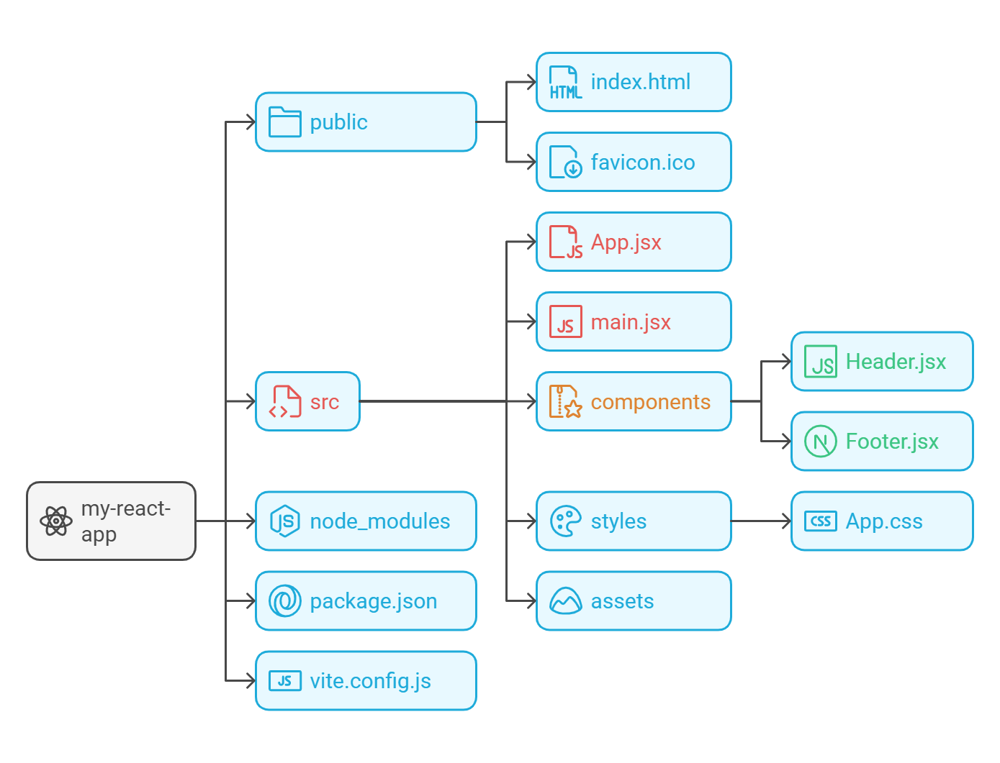

# Web Dev Basics

* Commit frequently, ensure that you're making incremental commits to gradually mark your progress and create a history of the progress you've made on a project!

* `HTML`: blueprints for the home
* `CSS`: design and explict/asthetic details that color and detail the blueprint
* `JavaScript`: what's used to make the house interactive (e.g., automated floodlights, motion sensing cameras, garage, etc.)

* **Dark Pattern**
  * Recommends, Doom scrolling, white background with white X.
  * Overall things that impact usage time of your application.

* Inline Element: only as much as much space as it needs.
* Block Element: all the space is used

## Front End Basics
* `rem (short for "root em")` is a relative unit of measurement in CSS that defines sizes based on the font size of the website's root element. It allows for entire layouts and components to scale proportionally across different sizes.
* Data Transfer Objects (DTOs): https://stackoverflow.com/questions/1051182/what-is-a-data-transfer-object-dto

### JavaScript (JS)
* **Runtime Environment:** Typically **ONLY** used to run within the browser! **Node.js** is the environment that allows JavaScript to run "server-side" (outside the browser).
* **Asynchronous (The "Non-Blocking" Nature):** JS is single-threaded, meaning it executes one command at a time. However, it is asynchronous because it uses an **Event Loop**. This allows JS to start a "slow" task (like fetching data) and move on to other code without freezing the browser, "jumping back" once the task is finished.
* **Associativity:** The order in which operators of the same precedence are evaluated.
  * Most are **Left-to-Right** (e.g., arithmetic).
  * **Assignment (`=`)** and **Exponentiation (`**`)** are **Right-to-Left**.
* **Precedence:** Determines the priority of operations (similar to **PEMDAS** in math). Use parentheses `()` to explicitly override precedence.
* **Variable Scoping:** * `const`: For values that remain constant.
  * `let`: For values that will be reassigned.
  * `var`: Legacy syntax; generally avoided in modern dev due to "hoisting" and scoping issues.

### Document Object Model (DOM)
* **The Interface:** A hierarchical, tree-like representation of your HTML. It acts as the bridge that allows JavaScript to "talk to," manipulate, and style HTML elements.
* **Nodes:** Every element, attribute, and piece of text in the HTML is a "node" in the DOM tree.
* **Interaction vs. Storage:** * **Frontend:** The DOM is used to update what the user sees on the screen (the UI).
  * **Backend:** The DOM does **NOT** interact with databases. To get data from a database, JS uses an **API** to fetch the data, then uses the **DOM** to display it.

### Bootstrap
* **Framework:** A frontend CSS framework designed to jumpstart responsive web design using pre-built components (buttons, navs, cards).
* **Mobile-First Philosophy:** Bootstrap is built to scale up. You should design for the smallest screen first (mobile), then use breakpoints to adjust spacing and layout for larger screens (tablets/desktops).
* **The Grid System:** * **Container > Row > Column:** The required hierarchy for the grid to function.
  * **12-Column Rule:** Every row is divided into 12 virtual columns. Your column classes (e.g., `col-6`, `col-md-4`) should always add up to 12 per row.
* **Utility Classes:** Use shorthand classes like `mt-3` (margin-top) or `p-2` (padding) to style elements without writing custom CSS.

### Consuming APIs
* **The Language (JSON):** Most APIs communicate using **JSON** (JavaScript Object Notation), which organizes data into key-value pairs.
* **Serving/Building:** Creating the infrastructure for data access.
  * **Endpoints:** The specific URLs used to access resources (e.g., `/api/users`).
  * **HTTP Methods:** `GET` (Read), `POST` (Create), `PUT` (Update), `DELETE` (Remove).
  * **Authentication:** Usually handled via API Keys or Bearer Tokens.
* **Consuming:** Utilizing existing resources (e.g., OpenAI, Gemini, Weather data).
  * **The Fetch API:** The standard JS method for requesting data from an endpoint.
  * **Status Codes:** `200` (OK), `404` (Not Found), `500` (Server Error).

> [!IMPORTANT]
> **Grid Logic:** When designing layouts, ensure your column spans add up to **exactly 12** to maintain alignment. Use responsive classes (e.g., `col-12 col-md-6`) to define how many columns an element occupies on different devices.

> [!WARNING]
> **Production Security:** When moving from development to production, **ALWAYS REMOVE** `console.log` statements. These can leak sensitive application logic or user data to the public browser console, creating a security vulnerability.

## What is Node.js

* [Node.js Intro](https://nodejs.org/en/learn/getting-started/introduction-to-nodejs)

* Node.js is used primarily for scaffolding projects (setting up structures, installing packages, and running build processes) rather than for mastering its entire API.

* Node.js transformed JavaScript from a client-side language into a versatile, full-stack toolset.

* Node essentially allows JavaScript to run **outside the browser**, with the ability to read and write files, run servers, access databases, and automate tasks.

**Built-in Modules** — these come packaged with Node.js and do not require any installation:
* **`fs` (File System)**: Read, write, update, delete, and watch files and directories on your machine. This is what allows tools like Vite to create project folders and write config files during scaffolding.

* **`http`**: Create and manage HTTP servers and handle incoming requests and outgoing responses. This is the foundation that web frameworks like Express are built on top of.

* **`path`**: Safely construct and resolve file paths across different operating systems (e.g. handles the difference between `/` on Mac/Linux and `\` on Windows). Commonly seen in `vite.config.js` and `tsconfig.json` for resolving project directories.

* **`events`**: Provides an `EventEmitter` class that allows different parts of your application to communicate by emitting and listening for named events — the backbone of Node's asynchronous, event-driven architecture.

* **`crypto`**: Handles cryptographic functionality like hashing, encryption, and generating secure random tokens. Commonly used for things like hashing passwords or generating secure session IDs.

* **npm (Node Package Manager)**: Bundled with Node.js, npm is the tool you use to install third-party packages (`npm install`), run scripts (`npm run dev`), and manage your project's dependencies via `package.json`.

```bash
# Check your installed Node and npm versions
node -v
npm -v
```

### Initializing Node

* `npm init -y`
  * `-y`: used to accepts the defaults for you project.
  * Serves to create a dependency `.json` file for your project.
  * Create a `package.json` file that serves as the "driver file" or the initializing file (e.g., `public static void main(String[] args)` inside of your `Main.java`)

* `touch index.js`
  * Creates "driver" or starting point for our application.

* `npm i <name_of_package>`
  * Install the package that you want to actually install.
  * `package.json` vs `package-lock.json`
    * `package-lock`: primarily provides the specifics and "pinned versions" of all the dependencies that your applications are using.
    * `package`: the base template and "blueprints" that are needed to run the application.

> [!WARNING]
> Ensure that you've validated the actual package that you want to download for you web-app, this is easy hunting ground for potential threats to exploit individuals devs via drive by downloads!

* How to properly import packages:

```js
const yourVar = require("<name_of_package>")
console.log(yourVar())
```

```bash
# Simple way to run the app...
node index.js
```

## Node + Jest Testing Setup

* Create dedicated directory and subdirectories for your project...
```java
mkdir project_name
```

* Initialize project and download the `Jest` testing framework (similar to `JUnit5`)...
```bash
npm init -y
npm install jest -D
```

* Make `src` and `tests` directory...
```bash 
mkdir src 
mkdir tests
touch tests/sanityCheckTest.test.js
```

* Complete sanity check to ensure that testing actually works!
  * Add the placeholder test in `tests/sanityCheckTest.test.js`
```javascript
test('Jest is working', () => { expect(1 + 1).toBe(2); });
```

* Run sanity check test from within your created directory!
```bash
npm test
```

## TypeScript Setup Basics

* Reference: [TS Setup](https://www.geeksforgeeks.org/typescript/how-to-setup-a-typescript-project/)

### Initial Project Initialization
1. **`npm init -y`**: Creates a `package.json` file with default settings. This is the "ID card" for your project.
2. **`npm install -D typescript`**:
  * **`-D` (Dev Dependency):** Installs tools needed only during development (like the compiler). These are **not** bundled into the final production code, which keeps your app lightweight.
3. **`npx tsc --init`**: Generates the `tsconfig.json` file. This is where you tell TypeScript how to behave (e.g., where to find files and where to put the converted JavaScript).

### Project Structure
To avoid the "No inputs found" error, always organize your code:
* **`mkdir src`**: Create a source folder.
* **`touch src/index.ts`**: Create your main entry point inside that folder.

**Simple `tsconfig.json` Setup**

* Include the following within the `tsconfig.json` default:
```json
{
  // Visit https://aka.ms/tsconfig to read more about this file
  "compilerOptions": {
    "module": "CommonJS", // Basics module that is used to compile our project!
    "target": "ES2022", // Year of JS that we want, be sure you have the correct year selected when compiling!
    // File Layout
    // "rootDir": "./src",
    "outDir": "./build",
    "removeComments": true
  },

  // the ** is a wild card to identify any level of directories that our application should look through until we hit a *.ts file.
  "include": [
    "./src/**/*.ts"
  ]
}
```

#### Common Commands & Tips
* **`npx tsc`**: Runs the compiler once to turn your `.ts` into `.js`.
  * `tsc` = transcript compiler
* **`npx tsc -w`**: Starts "Watch Mode"—it stays open and re-compiles every time you hit Save.
* **`npm i`**: Short for `npm install`. Run this immediately after downloading a project to install all required libraries listed in the `package.json`.

> [!TIP]
> **Type Definitions:** While you don't always need to "import packages" for TypeScript's core features, you often need to install "Type Definitions" for external libraries so TS understands them.
> *Example:* `npm install -D @types/node` (This helps TS understand Node.js specific commands like `process` or `__dirname`).

> [!NOTE]
> **Node Modules:** Never manually edit the `node_modules` folder. If you need to add or update a package, always use `npm install <package-name>`.

**Destructuring**
* `let {fname, lname, associates} = person`
  * Here we are assigning the common nesting options to the "person" keyword that allows you to access specific arrays much easier!

## React + Vite (Vanilla JS)

* [Vite](https://vite.dev/guide/) is a build tool that aims to provide a faster and leaner development experience for modern web projects and provides a dev server and build commands that bundle your code and allow you to push the content to production.

* Create project folder and run the command below inside of that new directory

```bash
npm create vite@latest
```

* Select framework: `React`
* Select a variant: `JavaScript` (or `JavaScript + React Router`)
* Move into your newly created project directory and install the necessary dependencies:

```bash
npm install
```

* Open the generated `.gitignore` file and add the following lines to the bottom to protect your environment variables and ignore linting caches:
```text
# Environment Variables
.env

# ESLint Cache
.eslintcache
```

* Start the development server:

```bash
npm run dev
```

> [!NOTE] Running `npm run dev` starts Vite's local dev server (default: `http://localhost:517*`) with **Hot Module Replacement (HMR)**, meaning changes you make in your code reflect in the browser instantly without a full page reload.

```bash
# Allows your application to be compressed (via gzip) and optimized into a 'dist' folder for production
npm run build
```

### File Structure and Communication

[Key Files and Directories Talk to Each Other](https://reactjs.koida.tech/react-fundamentals/lesson-8-understanding-the-main-files-app.jsx-and-main.jsx#breakdown-of-key-files-and-directories) [3]:

```
index.html  →  main.jsx  →  App.jsx  →  (your components)
                   ↑
           Vite processes everything
           via esbuild under the hood
```




#### 1. `public/`
* **`index.html`**: The main HTML file that serves as the entry point for the browser. It typically contains the root element (`<div id="root"></div>`) where React renders the application.

* **`favicon.ico`**: The favicon image that appears in the browser tab.

#### 2. `src/`
* **`App.jsx`**: The main component of your application. It often handles the overall application logic and structure, and may contain child components.

* **`index.jsx` or `main.jsx`**: The entry point of your application where you render the `App` component into the DOM.

* **`components/`**: A folder to organize reusable components (e.g., `Header.jsx`, `Footer.jsx`, `Button.jsx`). This promotes modularity and code reusability.

* **`styles/`**: A folder to store CSS or SCSS files for styling your components. This helps keep styles organized and separate from JavaScript logic.

* **`assets/`**: A folder to store images, fonts, and other static assets used in your application.

* **`services/`**: A folder to house functions that handle interactions with external APIs or data sources (e.g., `api.js` for making HTTP requests).

* **`eslint.config.js`**: Defines the linting rules applied to your code. Catches syntax issues, enforces code style, and flags potential bugs before they cause problems at runtime.

#### 3. `node_modules/`
* This folder contains all the third-party dependencies (libraries and packages) that your project relies on (e.g., React, ReactDOM, Axios). Generated when you install dependencies using `npm install` or `yarn add`.

* **`vite.config.js`**: Configures Vite's build and dev behavior. 
  * Loads the `@vitejs/plugin-react` plugin which enables JSX support, Fast Refresh (HMR), and other React-specific features. 
  * Here you can also customize the dev server port, build output directory (`dist/`), and add other plugins here.

#### 4. `package.json`
* This file contains metadata about your project, such as the project name, version, and author.
* It lists the **dependencies** required for the app to run and defines **scripts** that can be executed, such as `dev` (to start the development server) or `build` (to prepare for production).


#### 5. `vite.config.js`
* This file is used to configure **Vite**, the build tool. It allows you to customize various aspects of the build process, such as:
  * Root directory
  * Plugins
  * Server configuration
  * Build options


> [!NOTE]
> Older React setups (like Create React App) used Babel for JSX transpilation. Vite replaced this with `esbuild` for speed, so you do **not** need to configure Babel manually in a fresh Vite project.

* **`esbuild` (under the hood)**: Vite uses **esbuild** to transpile and convert `.jsx` files into plain JavaScript that the browser can understand. 
  * `esbuild` is significantly faster than Babel and handles the JSX transform automatically via the `@vitejs/plugin-react` plugin. 

## React + TypeScript + Vite

* The file structure is nearly identical to the Vanilla JS setup, with a few key differences:
  * File extensions change from `.jsx` → `.tsx` and `.js` → `.ts`

### Additional Files (TypeScript-Specific)

* **`tsconfig.json`**: The base/root TypeScript config. It doesn't contain many settings itself — it acts as the top-level reference that points to the two environment-specific configs below using `"references"`.

* **`tsconfig.app.json`**: TypeScript config specifically for your **app source code** (everything in `src/`). This targets the **browser** environment and is what Vite uses when building your React components and pages.

* **`tsconfig.node.json`**: TypeScript config for the **Node.js** environment — specifically for Vite's own config file (`vite.config.ts`) and any build scripts. Browser APIs are not available here; it targets what Node can run.

  > **In short:** your app code runs in the *browser* (uses `tsconfig.app.json`) and Vite itself runs in *Node* (uses `tsconfig.node.json`). They need separate configs because they are two completely different runtime environments.
  
### Expanding `eslint.config.js` for TypeScript

For a production app or stricter type safety, upgrade the `eslint.config.js` to **type-aware lint rules** by swapping in the templates [here](https://github.com/vitejs/vite/tree/main/packages/create-vite/template-react-ts).

* `tseslint.configs.recommendedTypeChecked` — enables lint rules that require TypeScript's type information (e.g. flags `any` types, unsafe assignments) rather than just syntax-level checks.
* `tseslint.configs.strictTypeChecked` — an optional stricter version; good for production apps
* `tseslint.configs.stylisticTypeChecked` — optional stylistic/consistency rules (naming conventions, etc.)
* `parserOptions.project` — tells ESLint which `tsconfig` files to use so it can read type info during linting.
* `tsconfigRootDir: import.meta.dirname` — ensures the path to your tsconfig files resolves correctly relative to the project root.

## Front End: React + Vite + JS/TS

### Explained

* React + Vite + JS/TS is a combination of three pieces that work together:
  * `React` = the UI library (how you build the interface)
  * `Vite` = the build tool + dev server (how you develop and ship it)
  * `TypeScript` or `JavaScript` = the language you write the code in

* Used to quickly prototype or production-scale browser-based frontends (dashboards, agent UIs, forms, SPAs, admin panels, etc.).
* It **does not** handle backend/servers/databases — that’s separate (Node, Python, Java, etc.).

#### React vs Vanilla HTML/CSS/JS

**React** [1]:
* JavaScript *library* (not a full framework) for building user interfaces, especially single‑page applications (SPAs).
* React uses routing (`React Router`), state management (`Redux/Zustand/Context`), and meta‑frameworks (`Next.js`) to complete the SPA stack.

**Vanilla HTML/CSS/JS**: 
* You manually manipulate the real Document Object Model (DOM) (e.g., `document.querySelector`, `innerHTML`) for every change; React lets you *declare* what the UI should look like for a given state and handles DOM updates automatically.
* Must often re‑render the entire page (or large manual DOM fragments) whenever the app changes, which is slower and more error‑prone.

#### Single‑Page Application (SPA)
* The entire app loads once; navigation and data updates happen without full page reloads.
* SPAs use **virtual DOM** which allows React keep an in‑memory, lightweight copy of the real DOM. When state changes:
  1. React re‑renders only the affected components into a new virtual tree.
  2. It **diffs** the new tree against the previous one.
  3. It applies *only* the minimal set of changes to the real DOM (batched).
* This gives **low coupling** between UI pieces and makes updates **declarative** and **component‑based** (similar to OOP).
* When a page is rendered, it happens in *component pieces*; each component can maintain its own state, so pieces are *not* overwritten when other parts update.

> [!NOTE]
> Here we are using declarative routing, consult the docs for when to use which specific type! 
> From the docs, "The features available in each mode are **additive**, so moving from Declarative to Data to Framework simply adds more features at the cost of architectural control. So pick your mode based on how much control or how much help you want from React Router."

## React Router & Reactstrap

```bash
npm install react-router-dom reactstrap bootstrap
```
* `npm i react-router react-router-dom`
* Install necessary router requirements from [React Router](https://reactrouter.com/start/declarative/installation)
* https://reactrouter.com/start/declarative/installation


#### 1. React Architecture and File Structure

>[!NOTE]
> **`src/assets/`**: Typically, core images like logo or other permanent pieces of your user interface go in location. For example, if you have a `SiteNavbar` that appears on every single page you can place it in `assets/`, Vite will optimize it, handle the cache-busting, and guarantee the link never breaks during the build process.
> 
> **`public/images`**: Other images that aren't as static as your logo (e.g., inventory that changes) are **content**. It's much easier to write a simple path like `image: "/images/your_image.jpg"` inside a data file rather than manually `import` 20 different images at the top of a React component. 
> 
> The `public` folder lets you reference your images dynamically without cluttering code.

#### 2. Global Setup (`main.jsx`)
To use Routing and Reactstrap styles across the entire application, you must wrap your `<App />` in a `<BrowserRouter>` and import the Bootstrap CSS file at the highest level of your project.

```jsx
import React from 'react';
import ReactDOM from 'react-dom/client';
import { BrowserRouter } from 'react-router-dom';
import App from './App.jsx';

// 1. Import Bootstrap CSS for Reactstrap
import 'bootstrap/dist/css/bootstrap.min.css'; 

ReactDOM.createRoot(document.getElementById('root')).render(
  <React.StrictMode>
    {/* 2. Wrap App in BrowserRouter */}
    <BrowserRouter>
      <App />
    </BrowserRouter>
  </React.StrictMode>,
);
```

#### 3. Creating the Shell (`App.jsx`)
Set up your global layout and define which components load at which URL paths.

```jsx
import { Routes, Route } from 'react-router-dom';
import SiteNavbar from './components/SiteNavbar';
import HomePage from './pages/HomePage';
// ... import other pages

function App() {
  return (
    <>
      {/* Components outside of <Routes> stay on the screen permanently (like Navbars) */}
      <SiteNavbar />
      
      {/* <Routes> acts as a switch, swapping out the page component based on the URL */}
      <Routes>
        <Route path="/" element={<HomePage />} />
        <Route path="/menu" element={<MenuPage />} />
        {/* ... other routes */}
      </Routes>
    </>
  );
}

export default App;
```

# References

1. [React.dev](https://react.dev/learn)
2. [Vite](https://vite.dev/guide/)
3. [reactjs.koida](https://reactjs.koida.tech/react-fundamentals/lesson-8-understanding-the-main-files-app.jsx-and-main.jsx)
2. [Vue.js](https://vuejs.org/)
3. [CSS Garden](https://csszengarden.com/)
4. [Browser Safe Colors](https://147colors.com/)
5. [Boot Strap Basics](https://getbootstrap.com/)
6. [Node.js](https://nodejs.org/en/learn/getting-started/introduction-to-nodejs)